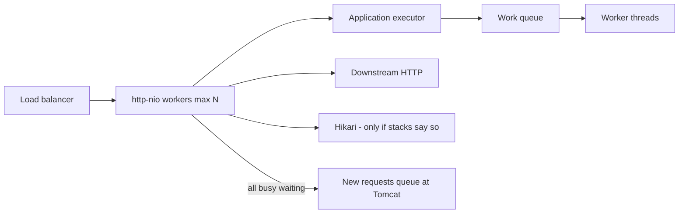

# L-8.6 — Thread starvation

**Module:** 08 — JVM Troubleshooting  
**Duration:** 30 minutes  
**Case study:** BayPay Financial Services (fictional)

---

## Why this matters

A hang on `pay-prod-east-2` is often **no free request thread**, not a deadlock and not a dead database. Tomcat’s pool is finite. So is every executor you wrap around posting, reporting, or a downstream HTTP call. When the pool is exhausted, new `POST /api/v1/payments` sit in a queue or time out at the balancer while Actuator still answers on a different thread. INCIDENT-402 taught you Hikari can look like this. **Not every hang is JDBC.** This lesson is the JVM-side method: HTTP workers waiting on an executor, a work queue, or a downstream — and how a dump plus pool gauges tell those apart.

---

## Learning objectives

- Map HTTP threads, executors, and queues on the Boot canary.
- Read “pool exhausted, work queued” from dumps and executor metrics.
- Distinguish deadlock (L-8.1), JDBC wait (INCIDENT-402), and executor/downstream wait.
- Choose stabilize (shed, timeout, drain) vs remediate (bound, isolate, fail fast).

---

## Concept explanation

Spring Boot’s embedded Tomcat has a **max worker count** (teaching defaults are small; production YAML should be explicit). Each in-flight authorize occupies one worker until the method returns. If that method blocks on:

- `executor.submit(…).get()` or a `CompletableFuture.join` without a timeout,
- a downstream HTTP client,
- a full work queue (`LinkedBlockingQueue.take` on the producer side is rare; the *HTTP* thread is the one blocked in `execute` when the queue is bounded and full),
- or a pool that has already handed out every thread,

then the next Avery Chen request has nowhere to run.

**Starvation** here means *runnable work exists but cannot get a thread* (or cannot finish because the threads it needs are themselves waiting). Contrast L-8.1: threads exist but wait on each other’s monitors. Contrast L-8.3: threads are RUNNABLE and the cores are busy. Starvation often looks like **WAITING / TIMED_WAITING** on `park`, `get`, or `socketRead`, plus a **queue depth** that only grows.

Gauges that matter:

| Gauge | Exhaustion look |
|---|---|
| Tomcat `threads.busy` / `max` | busy == max |
| Executor `active` / `pool size` / `queued` | queued ≫ 0, active == max |
| Downstream latency / error | HTTP threads in client frames |
| Hikari active / pending | *If* stacks are in `getConnection` — 402’s class, not assumed |

A bounded queue plus `AbortPolicy` fails new work (noisy, safe). An unbounded queue never rejects; it OOMs or starves later (L-8.4). A `CallerRunsPolicy` runs the task on the HTTP thread and can deadlock *progress* if that task needs another HTTP thread.

---

## Visual explanation



Alt text: Incoming payment requests occupy a finite Tomcat pool. Those workers may block on an executor queue, a downstream, or JDBC. When all are busy, new requests starve. JDBC is one possibility, not the default.

---

## Architecture

`pay-prod-east-2` should isolate *kinds* of blocking:

1. **Request thread** does validation and a short transactional write.
2. **Bounded executor** does slow or fan-out work, with a timeout and a reject policy.
3. **HTTP client** has connect/read timeouts and a connection pool *smaller than* Tomcat max, so one slow host cannot take every worker.
4. **JDBC** pool is sized in L-4.3 — and you only blame it when stacks are there.

`pay-prod-east-1` staying healthy while the canary starves is again “canary build or canary-only traffic.” Do not bounce `dmgr-east`. Do not raise Tomcat max to 1,000 to “fix” a missing timeout; you will move the hang into the database or the downstream.

Module 2’s worker deadlock was a *lock cycle*. This lesson’s hang is *capacity*. Use L-8.1 to *read* the dump, then classify.

---

## Production example

Riley sees create-payment timeouts, liveness UP, readiness flickering, CPU 15%, heap calm. That already argues against L-8.3 and against a leak. Priya’s dashboard: Tomcat 200/200 busy, executor queued 1,400, Hikari 8/50. Riley writes “not JDBC.” Next gate is `Thread.print`: `http-nio` threads in client or `Future.get` frames, not in `getConnection`.

Stabilization: drain east-2, enable a feature flag that skips the extra hop, or roll back Jordan’s canary. Remediation: timeout, bulkhead, smaller pool for the slow path, or stop calling the slow path on the request thread.

If the dump instead shows a monitor cycle, you are back in L-8.1’s lab, not this one. If it shows `getConnection`, you are in 402’s class. Write what you see.

---

## Code/configuration example

Dangerous: HTTP thread joins unbounded work (illustrative):

```java
@Autowired Executor fanout;

public PaymentResult authorize(PaymentCommand cmd) {
    return CompletableFuture
        .supplyAsync(() -> enrich(cmd), fanout)
        .join(); // no timeout; holds http-nio
}
```

Safer shape:

```yaml
# application-prod.yml — teaching numbers, not a pack RCA
server:
  tomcat:
    threads:
      max: 100
spring:
  threads:
    virtual:
      enabled: false   # if you enable, still need timeouts
```

```java
public PaymentResult authorize(PaymentCommand cmd) {
    try {
        return CompletableFuture
            .supplyAsync(() -> enrich(cmd), fanout)
            .orTimeout(200, TimeUnit.MILLISECONDS)
            .join();
    } catch (CompletionException ex) {
        throw new DownstreamUnavailable(ex);
    }
}
```

Executor bean you can defend:

```text
core=8  max=16  queue=100  reject=AbortPolicy
```

Dump frames you might quote (generic, not a lab answer):

```text
"http-nio-8080-exec-19" WAITING
  at java.util.concurrent.CompletableFuture.get
"http-nio-8080-exec-4" RUNNABLE
  at java.net.SocketInputStream.socketRead0
  at org.springframework.web.client.RestTemplate.doExecute
```

---

## Trade-offs

| Choice | Gain | Cost |
|---|---|---|
| Timeout + AbortPolicy | Fast failure, queue bound | Need idempotent retries |
| CallerRuns | No reject | HTTP threads do the work; can deadlock progress |
| Raise Tomcat max | Absorbs a short spike | Amplifies a slow downstream |
| Virtual threads | Cheap blocking | Still need timeouts; can amplify fan-out |
| Skip the extra hop on canary | Stabilizes | Feature-flag discipline |

---

## Failure modes

- Assuming Hikari because INCIDENT-402 existed.
- Assuming deadlock because INCIDENT-202 / L-8.1 exist.
- Unbounded executor queue that looks healthy until RSS explodes.
- Health check on a management thread while payment threads are all blocked — liveness lies.
- One shared executor for authorize, reporting, and outbound HTTP.

---

## Security/reliability implications

A starved canary that still says UP will keep receiving Avery Chen’s retries. Each retry is another queued item. Reliability is **bulkheads and timeouts**, not a bigger pool. Client timeouts without idempotency keys create duplicate-charge risk (Module 2); starvation plus retries is how you get both an outage *and* a race.

Downstream credentials and URLs in stacks are sensitive. Quote method names, not tokens.

---

## Interview perspective

**Engineer.** If all HTTP threads are busy waiting, new requests starve. I look at Tomcat gauges and a dump.

**Senior.** I check Hikari *and* the executor *and* the client. I add timeouts. I do not raise max threads first. I know this is not automatically JDBC.

**Staff.** I isolate pools. I drain the canary. I will not close a hang RCA from a Module 2 or Module 4 memory. I score gates.

**Principal.** Thread pools are architecture: one pool per failure domain, explicit reject policy, and readiness that uses a payment thread or a dedicated probe that detects “busy == max.”

---

## Key takeaways

- Starvation is finite threads plus blocking work (executor, downstream, or — only if stacks say so — JDBC).
- Not every hang is Hikari. Not every hang is a deadlock.
- Queue depth + WAITING HTTP frames + low CPU is the usual picture.
- Timeouts and bounds remediate; bounce and drain stabilize.
- A lucky “pool” guess does not max Diagnostic method.

---

## Knowledge check

1. Tomcat 100/100 busy, Hikari 6/50, CPU 12%. Why is “the database is down” a weak first sentence?
2. What dump state plus gauge pair supports executor starvation rather than a monitor deadlock?
3. Why can `/actuator/health` stay UP while creates time out?

<details>
<summary>Spoiler — answers</summary>

1. The JDBC pool has spare connections. Workers are busy elsewhere — executor or downstream until stacks say otherwise.
2. HTTP threads WAITING in `Future.get` / queue / client frames, executor `queued` high, and no circular `waiting to lock` cycle.
3. Liveness often runs on a separate thread and does not take the exhausted work pool.

</details>

---

## Related lab

[INCIDENT-804](../../../../labs/INCIDENT-804/README.md) — thread-pool exhaustion symptoms on the canary. Work gauges then dumps. Do not assume INCIDENT-402’s RCA. Do not open `solutions/INCIDENT-804/` until the worksheet is filled.

---

## Related PAKS

Optional: `docs/27-production-failures/failure-analysis-methodology.md`. Classify the hang before you scale a pool. Not required to finish INCIDENT-804.
