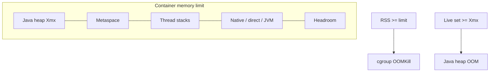

# L-8.7 — Container OOM

**Module:** 08 — JVM Troubleshooting  
**Duration:** 30 minutes  
**Case study:** BayPay Financial Services (fictional)

---

## Why this matters

`pay-prod-east-2` can disappear in two different ways that both get called “OOM.” A **Java heap** `OutOfMemoryError` is an exception inside the JVM: the collector could not free enough of `-Xmx`. A **cgroup OOMKill** is the Linux memory controller killing the *process* because RSS (or the container’s memory usage) crossed the limit. The first leaves a stack and a heap story. The second leaves a kernel line and a restart loop. If you treat them as the same, you will raise `-Xmx` into the limit and make the next kill faster. Module 7 taught container awareness. This lesson is the incident method: heap vs cgroup vs native, and **headroom**.

---

## Learning objectives

- Tell `java.lang.OutOfMemoryError: Java heap space` from a cgroup OOMKill on the canary.
- List what besides the heap counts toward the container limit (metaspace, stacks, native, direct, GC, the JVM itself).
- Refuse `-Xmx` equal to the cgroup memory limit.
- Pick the next artifact: GC log and histogram vs `dmesg` / kube OOM vs `VM.native_memory`.

---

## Concept explanation

Java 21 on a container typically sees the cgroup limit (`UseContainerSupport` is on by default). Ergonomics may set `-Xmx` as a **percentage** of that limit (`MaxRAMPercentage`). That is not a license to use 100% of the limit for the heap.

Process memory, roughly:

| Region | Who sets it | Failure mode |
|---|---|---|
| Java heap | `-Xmx` / percentage | `OutOfMemoryError: Java heap space` |
| Metaspace | class loaders | `OutOfMemoryError: Metaspace` |
| Thread stacks | `-Xss` × thread count | RSS climb as Tomcat/executors grow |
| NMT / native / zlib / DNS | JVM + OS | RSS climb, heap calm |
| Direct / mapped buffers | NIO, some drivers | `OutOfMemoryError: Direct buffer` or silent RSS |
| GC structures + JVM | G1 | Always non-zero |
| Sidecar / agent | platform | Counts in *some* cgroups |

**Java heap OOM:** you get a stack, often `gc.log` full of failed evacuations, a histogram that is the live set. The container may stay up if the error is caught (do not catch it as business logic). **cgroup OOM:** the JVM does not write a Java stack. Priya sees `OOMKilled`, exit 137, or a kernel “Killed process … payment-service.” Heap used before death may have been *below* `-Xmx`. That is the tell: RSS hit the limit while Java still thought it had heap.

**Headroom** is `cgroup_limit - Xmx - expected_native`. Teaching rule from [RUNTIME.md](../../../../datasets/baypay-jvm/RUNTIME.md): do not set `-Xmx` equal to the container memory limit. Leave room for metaspace, stacks, and native. How much depends on thread count and off-heap use; packs will state the limit when it matters.

A leak (L-8.4) can cause *either* failure: heap OOM if `-Xmx` is hit first, cgroup kill if native or RSS wins the race. The first artifact still decides which event occurred.

---

## Visual explanation



Alt text: The container limit is a box around heap, metaspace, stacks, native, and headroom. Filling the heap causes a Java OOM. Filling the box causes a cgroup kill even if the heap is not full.

---

## Architecture

The canary pod (or container) is the blast radius. `pay-prod-east-1` on a different limit or a different `-Xmx` will not die with it. `BayPayCell` JVMs are sized on traditional WAS profiles; they are not this cgroup. Do not raise the cell’s JVM max heap because a Boot canary was killed.

Platform knobs that must be written down together: container memory request/limit, `-Xmx` or `MaxRAMPercentage`, thread caps (L-8.6), and NMT if you need to prove native. Jordan’s canary spec should not copy “heap = limit” from a blog.

Stabilization: the platform already restarted the container. Drain or freeze the canary if it crash-loops. Remediation: fit the live set, cut native, or **raise the limit and the heap as a pair with headroom** — after you know which side blew.

---

## Production example

Priya: east-2 restarted three times in twelve minutes, exit 137, last Java log is a successful authorize, no `OutOfMemoryError` line. Riley writes “cgroup kill candidate; heap OOM not evidenced.” Next gate is container RSS vs limit vs last `GC.heap_info`. If used heap was 70% of `-Xmx` and RSS was at the limit, native or stacks are in play — not a larger `-Xmx`.

A different night: `java.lang.OutOfMemoryError: Java heap space` in the payment thread, container still running, GC log shows full GCs that reclaim nothing. That is L-8.4 / L-8.5’s Java path. Raising the cgroup limit without raising `-Xmx` will not help.

Avery Chen’s client sees 502s either way. The comms sentence must say *which* OOM you have evidence for, or say you do not know yet.

---

## Code/configuration example

Flags that belong in a *written* canary spec (illustrative headroom, not a pack’s numbers):

```text
# Container memory limit: 1Gi (stated by the platform)
# Heap must leave native + metaspace + stacks
-XX:MaxRAMPercentage=75.0
# or an explicit -Xmx that is < limit
-Xlog:gc*:file=gc.log:time,uptime,level,tags
-XX:NativeMemoryTracking=summary
```

What not to copy into production without a budget:

```text
# unsafe pattern — heap occupies the entire cgroup
-Xmx1g
# when the container limit is also 1Gi
```

Commands (laptop or pack excerpts):

```text
jcmd $PID GC.heap_info
jcmd $PID VM.native_memory summary
jcmd $PID VM.flags | grep -E 'MaxHeap|MaxRAM|UseContainer'
```

Kernel / platform lines you may see in a pack (synthetic):

```text
Memory cgroup out of memory: Killed process 1 (java)
Last-exit: 137  reason: OOMKilled
```

Versus Java:

```text
java.lang.OutOfMemoryError: Java heap space
	at com.baypay.payment...
```

Quote one or the other. Do not merge them.

---

## Trade-offs

| Choice | Gain | Cost |
|---|---|---|
| `MaxRAMPercentage` 70–80 | Survives limit changes somewhat | Still need a thread/native budget |
| Explicit `-Xmx` + documented limit | Reviewable | Two knobs can drift |
| Heap = cgroup limit | None in production | Native has nowhere to live |
| Raise limit only | Stops *this* kill if RSS was the issue | Wastes money if the live set is a leak |
| NMT summary | Proves native | Small overhead; enable before the fire |

---

## Failure modes

- Calling every restart an `OutOfMemoryError` when the log has none.
- Setting heap equal to the container limit “so we use the memory we paid for.”
- Growing Tomcat threads (L-8.6) until stacks consume the headroom.
- Direct buffers and a calm heap, then a Java-heap lecture.
- Debugging `Pay2`’s WAS heap for a Boot cgroup kill.
- Catching `OutOfMemoryError` and retrying the payment in-process.

---

## Security/reliability implications

Crash-loops drop in-flight authorizes. Idempotency keys must make the retry safe (Module 2). OOM dumps (`HeapDumpOnOutOfMemoryError`) are huge and secret-bearing; this course still does not require you to open one. Prefer summaries.

Reliability: readiness should fail when the last interval was an OOMKill. A liveness restart without a memory budget is a loop. Record the limit, the heap, and RSS on one dashboard so Riley does not guess.

---

## Interview perspective

**Engineer.** Heap OOM is a Java exception. cgroup OOM is the kernel killing the process. I look for `OutOfMemoryError` versus exit 137.

**Senior.** I leave headroom. I use NMT when RSS is high and the heap is calm. I will not set `-Xmx` to the limit.

**Staff.** I treat leak, live-set, native, and limit-too-small as four stories. I pair heap flags with the cgroup in the same review. I will not close RCA on the word “OOM.”

**Principal.** Container memory is an SLO. I fund a standard (`percentage` + floor headroom + thread cap) and I score on-call on which OOM they proved.

---

## Key takeaways

- Java heap OOM and cgroup OOMKill are different events with different artifacts.
- Heap + metaspace + stacks + native must fit in the limit with headroom.
- Do not set `-Xmx` equal to the container memory limit.
- Calm heap + kill = native or RSS; full heap + Java exception = L-8.4 / L-8.5.
- A lucky “OOM” label does not max Diagnostic method.

---

## Knowledge check

1. East-2 exit 137, no `OutOfMemoryError` in the Java log, last heap used 60% of `-Xmx`. Heap OOM or cgroup kill?
2. Why is “set `-Xmx` to the container limit so we do not waste RAM” unsafe on `pay-prod-east-2`?
3. Which `jcmd` helps when RSS is at the limit and `GC.heap_info` looks roomy?

<details>
<summary>Spoiler — answers</summary>

1. Cgroup kill candidate. The JVM still had heap; the kernel hit the process limit.
2. Metaspace, stacks, native, GC, and the JVM itself still need RAM. The kernel will kill the process while Java thinks the heap is fine.
3. `VM.native_memory summary` (and thread-count / direct-buffer gauges).

</details>

---

## Related lab

[INCIDENT-806](../../../../labs/INCIDENT-806/README.md) — container OOM *symptoms* on the canary. Decide which OOM the evidence shows. Do not open `solutions/INCIDENT-806/` until the worksheet names heap vs cgroup vs native from artifacts.

---

## Related PAKS

Optional: `docs/27-production-failures/failure-analysis-methodology.md`. Event-before-fix is the same discipline. Not required to finish INCIDENT-806.
