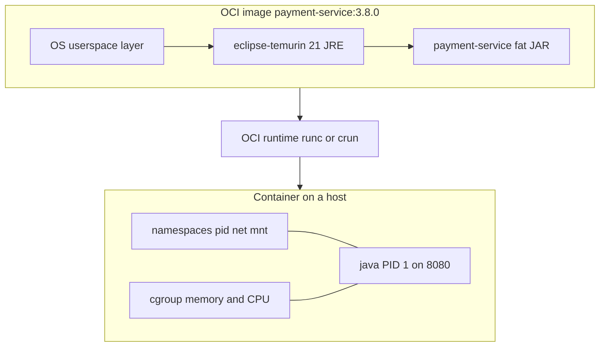

# L-9.1 — OCI and container concepts

**Module:** 09 — Containers for Java  
**Duration:** 30 minutes  
**Diagram:** AEJE-D-038  
**Case study:** BayPay Financial Services (fictional)

---

## Why this matters

Harbor Bike Co’s `$84.00` charge against Avery Chen (`11111111-1111-1111-1111-111111111111`) already runs in one Java 21 process: `payment-service`. Jordan Voss needs that process to start the same way on a laptop, a canary host, and later a pod. An **OCI image** is the unit that makes those bytes identical. A container is not a tiny VM and it is not `BayPayCell` in a box. If you cannot tell an image from a running container from a runtime, you will “modernize” by wrapping `dmgr-east` and still page Riley Okonkwo when the cell’s habits leak through.

---

## Learning objectives

- Define OCI image, container, and runtime in BayPay vocabulary.
- Contrast a containerized `payment-service` with a VM and with traditional WAS ND.
- Name namespaces and cgroups as the isolation the JVM actually feels.
- Reject “ND in Docker” as the modernization path.

---

## Concept explanation

**OCI** (Open Container Initiative) is the contract, not a vendor. An **image** is a content-addressed bundle: a manifest, a config (entrypoint, env, user, ports), and **layers** (filesystem diffs). `registry.baypay.example/baypay/payment-service:3.8.0` is a name for one such bundle. A **container** is a running (or stopped) instance of that image: a Linux process plus a merged filesystem, with **namespaces** (pid, net, mnt, user, uts, ipc) and **cgroups** (CPU and memory limits). A **runtime** (`runc`, `crun`) is what actually starts that process. Docker and Podman (L-9.2) are engines that speak OCI; they are not the image format.

**Not a VM.** A hypervisor gives `Pay1` its own kernel. A container shares the host kernel and isolates the process. That is why Java 21’s `UseContainerSupport` reads **cgroup** limits instead of “the machine” (L-7.6). It is also why a privileged container can see too much of the host — L-9.7.

**Not the cell.** `BayPayCell` is a management domain: `dmgr-east`, node agents, synchronized profiles, `payment.ear` on `Pay1`–`Pay3`. Module 5 taught you to operate that estate. Module 6 taught you to leave it. This module packages the **Boot fat JAR** (or, later, a Liberty process with `server.xml`) as one disposable image. Putting a Deployment Manager, a node agent, and three traditional profiles into one Dockerfile is **ND in Docker**. It preserves cell coupling and adds a container failure mode. Sam Okada will not take that image as a platform contract.

**Layers (AEJE-D-038).** Typical `payment-service` stack, bottom to top: a minimal OS userspace, a Java 21 **JRE** (`eclipse-temurin:21-jre`), the Spring Boot 3.5.5 fat JAR, and a thin config/entrypoint. Each layer is cached. Changing Avery Chen’s application code should rebuild the JAR layer, not the JRE. BUILD-901 is where you write that order.

**Process contract.** The container’s PID 1 should be the JVM that serves `8080`, liveness `/actuator/health/liveness`, and readiness `/actuator/health/readiness`. A wrapper that ignores signals makes shutdown drop in-flight `AUTHORIZED` payments. One process, one image, one tag.

| Unit | What BayPay stores | What runs |
|---|---|---|
| OCI image | Layers + config at `registry.baypay.example` | Nothing until a runtime starts it |
| Container | Ephemeral writable layer + process | `java -jar payment-service.jar` |
| VM / `Pay1` | A guest OS and a WAS profile | A different estate |
| `dmgr-east` | Cell master repository | Not a merchant JVM; do not image it |

---

## Visual explanation



Alt text: An OCI image is stacked layers; a runtime starts one payment-service JVM inside namespaces and a cgroup.

Diagram **AEJE-D-038** (OCI container layers) is the course asset for this picture.

---

## Architecture

Teaching path: produce a fat JAR from `reference-apps/baypay` (`./mvnw -pl payment-service -am package`), copy it into an image whose runtime stage is `eclipse-temurin:21-jre`, expose `8080`, run as UID `10001`. Locked names: [CLUSTER.md](../../../../datasets/baypay-k8s/CLUSTER.md). You do **not** need the registry to exist. Paper plus a Dockerfile on disk is the graded shape.

`pay-prod-east-1` / `pay-prod-east-2` from [RUNTIME.md](../../../../datasets/baypay-jvm/RUNTIME.md) are the same application, later scheduled as containers. Module 8’s canary pages were JVM failures **inside** a cgroup. This module is how that cgroup’s filesystem got built. Do not bounce `dmgr-east` for an image review.

Liberty remains valid if an ear must stay a war this quarter. The OCI story is the same: one process, JRE in the runtime stage, config from the environment. The cell is still the source, not the image’s guest OS.

---

## Production example

Jordan Voss opens a “containerization” pull request: a Dockerfile that installs a traditional WAS profile, federates a node, and starts `Pay1` plus a node agent. Priya Nair rejects it. Harbor Bike Co does not need a Deployment Manager to authorize Avery Chen. The PR would make every image a cell replica: sync, J2C aliases, SIBus. Sam Okada’s platform contract is `registry.baypay.example/baypay/payment-service:<tag>` listening on `8080`.

A second hour: Riley sees two hosts “running the payment container” with different JARs because someone `docker exec`’d a class file onto the writable layer. That is not an image. The OCI unit is what was **pulled**. Rebuild, retag, redeploy. Do not patch a live container and call it `3.8.0`.

---

## Code/configuration example

Paper Dockerfile shape (not a live pull; BUILD-901 writes the real file):

```dockerfile
# runtime stage only — build the JAR on the JDK or in CI, not in this snippet
FROM eclipse-temurin:21-jre
WORKDIR /opt/baypay
COPY payment-service.jar /opt/baypay/app.jar
USER 10001
EXPOSE 8080
ENTRYPOINT ["java", "-jar", "/opt/baypay/app.jar"]
```

What this is **not**:

```text
# rejected modernization
FROM some-was-nd-base
# copy a full BayPayCell profile
# start dmgr-east or nodeagent-pay-1
```

Inspect without a registry (optional local engine):

```text
# once you have a local image — not required to finish this lesson
docker image inspect payment-service:dev
# or
podman image inspect payment-service:dev
```

You are reading OCI config either way: `User`, `ExposedPorts`, `Entrypoint`.

---

## Trade-offs

| Approach | Strength | Cost |
|---|---|---|
| OCI image of Boot `payment-service` | Immutable, disposable, matches Module 3 | You must externalize `BAYPAY_DB_*` |
| Liberty process in an OCI image | Ear-compatible exit from Module 6 | Still one process; still not the cell |
| VM per `Pay1` | Familiar to Morgan Hale | Slow, not the Module 9 contract |
| ND in Docker | Looks like “we containerized” | Cell coupling plus cgroup kills |

Never choose the last row for a blank-page or Boot service.

---

## Failure modes

- Treating a container as a VM you patch with `exec` and keep.
- Imaging `dmgr-east` or a node agent “so ops feels like the cell.”
- Multiple processes as PID 1 (app + sidecar hacks) with no signal story.
- Assuming host RAM is the JVM’s machine (L-7.6) because “it is just Linux.”
- Calling any Dockerfile “cloud native” while `:latest` and root remain.

---

## Security/reliability implications

An image is a **trust artifact**. Whoever can push `registry.baypay.example/baypay/payment-service:3.8.0` can run code next to Avery Chen’s authorize. Layers that include a password (L-9.5) stay in history after you delete the `ENV` line. Reliability: replacing a container must not require cell sync. If start depends on `dmgr-east`, you did not leave ND. Idempotency still makes a retry safe when a container dies mid-`AUTHORIZED`.

---

## Interview perspective

**Engineer:** “An OCI image is layers plus config. A container is a process with namespaces and a cgroup. BayPay images `payment-service`, not the cell.”

**Senior:** “I can contrast a VM, `Pay1` on WAS ND, and a Boot container. I will not propose ND in Docker. PID 1 is the JVM on `8080`.”

**Staff:** “The platform contract is a tagged image, probes, and cgroup limits the JVM honors. I review layer order and refuse cell profiles in the filesystem.”

**Principal:** “Containers are how we exit `BayPayCell` as a unit of delivery. I will not fund a Deployment Manager image. Modernization is one disposable payment process.”

---

## Key takeaways

- OCI image ≠ container ≠ runtime; Docker/Podman consume the same image format.
- A container is a process with namespaces and cgroups, not a guest kernel.
- Package `payment-service` (Boot, or Liberty later). Do not package `BayPayCell`.
- Layers cache the JRE; the fat JAR should be the volatile top.
- Paper Dockerfiles are enough; no live registry is required.

---

## Knowledge check

1. What three OCI pieces must you name before you say “we containerized `payment-service`”?
2. Why is wrapping `dmgr-east` and `Pay1` in one image not BayPay’s modernization path?
3. Why does Java 21 care that the unit is a cgroup, not a VM?

<details>
<summary>Spoiler — answers</summary>

1. Image (layers + config), container (running instance), runtime (what starts the process).
2. That is ND in Docker: cell management and serving JVMs stay coupled. The path is one disposable `payment-service` process.
3. The JVM shares the host kernel and reads cgroup memory/CPU limits (`UseContainerSupport`). A VM’s “machine size” is the wrong metaphor.

</details>

---

## Related lab

Work [BUILD-901](../../../../labs/BUILD-901/README.md) after L-9.1–L-9.3. Write a Dockerfile for `payment-service` on disk. Docker or Podman is **optional**. Do not open `solutions/` first. No live registry. No AWS. Cost $0.

---

## Related PAKS

Optional: `docs/17-kubernetes-and-platform-engineering/overview.md`. Platforms consume OCI images; this lesson stands alone without a cluster or a PAKS login.
