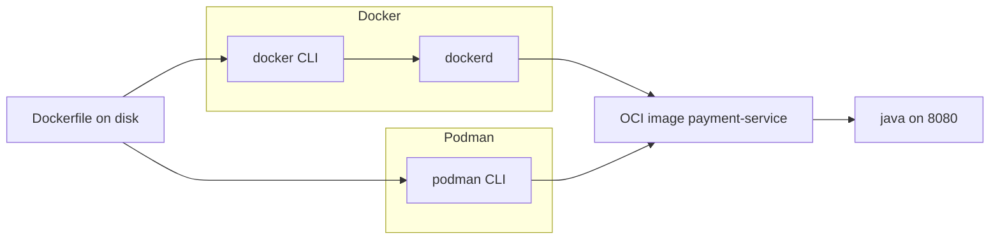

# L-9.2 — Docker and Podman

**Module:** 09 — Containers for Java  
**Duration:** 30 minutes  
**Case study:** BayPay Financial Services (fictional)

---

## Why this matters

Jordan Voss’s laptop has Docker Desktop. Sam Okada’s build agent prefers Podman. Both must produce the **same OCI image**: `registry.baypay.example/baypay/payment-service:3.8.0`. If BayPay’s runbooks say “the Docker daemon is production,” Riley Okonkwo will debug `dockerd` on a node that never had one. If the runbooks say “Podman is required to pass Module 9,” students without an engine fail a paper lab. The engine is a **build and run tool**. The contract is the image and the process on `8080`.

---

## Learning objectives

- Contrast Docker’s daemon model with Podman’s daemonless (fork/exec) model.
- State that both consume and produce OCI images and can share a Dockerfile.
- Choose commands for an optional local build without treating either engine as the cluster.
- Finish BUILD-901 on disk if no engine is installed.

---

## Concept explanation

**Docker (classic).** `docker` is a CLI. It talks to **`dockerd`**, a long-lived daemon that owns images, containers, networks, and volumes. Historically `dockerd` ran as root and spawned containers as children of the daemon. BuildKit is now the build engine behind `docker build`. Convenience is high: one daemon, a GUI on many laptops, Compose files. The cost is a privileged (or broadly capable) daemon and a second process that must be up before `payment-service` exists.

**Podman.** `podman` is **daemonless**. The CLI talks to a container runtime and starts the container as a child of the invoking user (fork/exec). Rootless mode is a first-class path: your UID maps into the container. There is no `dockerd` to crash and take every container with it. Podman understands Docker-style CLI and Dockerfiles. `podman build` / `podman run` are the usual pair in this course.

**Same OCI image.** The Dockerfile you write for BUILD-901 is not “a Docker file” in the vendor sense. It is a recipe that either engine can apply. The result is an OCI image. Tag it locally as `payment-service:dev` or as `registry.baypay.example/baypay/payment-service:3.8.0`. Pushing to the synthetic registry is **not** required. If Jordan builds with Docker and Sam rebuilds the same context with Podman, the **intent** is the same layers (reproducible builds still need a pinned base digest — L-9.3 / L-9.7). Do not maintain two Dockerfiles, one per engine.

**What neither engine is.** Neither is Kubernetes. Neither is OpenShift. Module 10 schedules the image. `docker run -p 8080:8080` on a laptop is a local rehearsal, not `baypay-prod`. Do not require Compose as the production topology.

**Rootful vs rootless.** Docker Desktop on macOS hides a Linux VM; the daemon inside that VM is not “production Linux.” Podman rootless on Linux is closer to how Sam wants developers to work. For this module, **non-root inside the image** (`USER 10001`) matters more than which engine started the container. A root process in a rootless engine is still the wrong image.

**Do you need an engine?** No. CLUSTER.md is explicit: write and review files. Optional commands in this lesson are labeled optional. FIX-902 is a broken Dockerfile on disk; you can score it without `build`.

| Engine | Long-lived daemon? | Typical local use at BayPay |
|---|---|---|
| Docker | Yes (`dockerd`) | Laptop / some CI |
| Podman | No (fork/exec) | Laptop / Linux CI / rootless preference |
| None | — | Paper Dockerfile; still a passing path |

---

## Visual explanation



Alt text: Docker uses a daemon and Podman does not; both turn the same Dockerfile into one OCI payment-service image.

---

## Architecture

BayPay’s teaching app stays `reference-apps/baypay`. The engine, if present, only **builds and runs**. CI (later modules) will call whichever builder the platform standardizes. The image name does not include `docker.io/library` as the production home; production pull is `registry.baypay.example`. You will not log into that host in this course.

Do not install Docker inside a traditional WAS VM to “meet a container mandate.” That is ND plus a daemon. Do not run `dockerd` in a container to start `payment-service` (DinD) for this service. Sam’s path is: build the image in CI, run the JVM as the container.

`pay-prod-east-2` in Module 8 was already a containerized canary in the teaching story. This lesson does not change that estate and does not need you to attach to it.

---

## Production example

Riley’s page: “Docker is down, payments are down.” The host is a developer jump box where someone started `payment-service` with `docker run` and left `dockerd` as the only supervisor. Priya’s fix shape: the **image** belongs on the platform (Module 10), not on a laptop daemon. For Module 9, treat `docker run` as a rehearsal.

Jordan’s PR adds `#!/bin/bash` scripts that only call `docker` and fail on Sam’s Podman agent. Staff review: use `podman` or a generic `buildah`/`docker build` documented as **equivalent**, or detect the engine. Better: one Dockerfile, CI uses one builder, laptops use either.

A third hour: a student claims BUILD-901 is blocked because Docker Desktop wants a paid plan. That is not this course. Paper the Dockerfile. Cost stays **$0**. No AWS.

---

## Code/configuration example

Same recipe, two optional CLIs (do not run these against a real `registry.baypay.example`):

```bash
# optional — Docker
docker build -t registry.baypay.example/baypay/payment-service:3.8.0 .
docker run --rm -p 8080:8080 --read-only \
  -e BAYPAY_DB_URL -e BAYPAY_DB_USER -e BAYPAY_DB_PASSWORD \
  registry.baypay.example/baypay/payment-service:3.8.0
```

```bash
# optional — Podman (daemonless)
podman build -t registry.baypay.example/baypay/payment-service:3.8.0 .
podman run --rm -p 8080:8080 --read-only \
  -e BAYPAY_DB_URL -e BAYPAY_DB_USER -e BAYPAY_DB_PASSWORD \
  registry.baypay.example/baypay/payment-service:3.8.0
```

Engine check, not a grade dependency:

```bash
command -v docker
command -v podman
```

If both are missing, you still write the Dockerfile and reason about `USER`, `EXPOSE`, and `ENTRYPOINT`.

---

## Trade-offs

| Choice | Strength | Cost |
|---|---|---|
| Docker daemon | Familiar CLI, Desktop, Compose | Daemon privilege and lifecycle |
| Podman daemonless | No `dockerd`; rootless-friendly | Some Desktop/Compose habits differ |
| Either engine locally | Rehearse `8080` and probes | Not the production scheduler |
| Paper only | $0, no install | You cannot `curl` liveness on a laptop |

BayPay accepts the last row for this module’s grade.

---

## Failure modes

- Requiring Docker Desktop to pass BUILD-901.
- Debugging `dockerd` as if it were `payment-service`.
- Maintaining `Dockerfile.docker` and `Dockerfile.podman` for one JAR.
- Using `sudo docker` so the image process “just works” as root (L-9.7).
- Assuming `docker compose up` is the Module 10 topology.

---

## Security/reliability implications

A rootful daemon is a **host trust** decision: whoever talks to the Docker socket can start privileged containers. Podman rootless shrinks that blast radius on a laptop; it does not make a root `USER` in the image safe. Reliability: if `dockerd` dies, every container it owned dies — Avery Chen’s in-flight `POST` included. Daemonless fork/exec dies with the invoking supervisor instead. Production still needs a **platform** restart policy (Module 10), not a developer daemon.

Do not expose the Docker socket into the `payment-service` image “for debugging.”

---

## Interview perspective

**Engineer:** “Docker has a daemon. Podman is daemonless. Both build the same Dockerfile into an OCI image.”

**Senior:** “I can rehearse with either CLI. I do not need a live registry. Non-root in the image matters more than which laptop engine I used.”

**Staff:** “CI pins one builder. The contract I hand Sam is the image name, digest, and process, not `dockerd` on a node.”

**Principal:** “I will not make Docker Desktop a hiring or lab gate. I will not run a daemon as the production supervisor for payments.”

---

## Key takeaways

- Docker: CLI + `dockerd`. Podman: daemonless fork/exec.
- Both produce the same OCI `payment-service` image from one Dockerfile.
- An engine is useful and **not required** to finish Module 9.
- `docker run` is a rehearsal, not `baypay-prod`.
- Do not treat the daemon as the modernization of `BayPayCell`.

---

## Knowledge check

1. What does Podman not need that classic Docker uses to create containers?
2. Jordan builds with Docker, Sam with Podman, same Dockerfile. What must still be the same?
3. Can you complete BUILD-901 if neither engine is installed?

<details>
<summary>Spoiler — answers</summary>

1. A long-lived `dockerd` daemon. Podman starts the container as a child of the CLI (fork/exec).
2. The OCI image contract: layers, entrypoint, user, port `8080` — not the engine brand.
3. Yes. Write and review the Dockerfile on disk. CLUSTER.md does not require a live engine.

</details>

---

## Related lab

[BUILD-901](../../../../labs/BUILD-901/README.md) — containerize `payment-service`. Use Docker or Podman if you have one; paper is enough. Do not open `solutions/` first.

---

## Related PAKS

Optional: `docs/17-kubernetes-and-platform-engineering/overview.md`. Engine choice is local; the platform still pulls OCI. This lesson stands alone.
