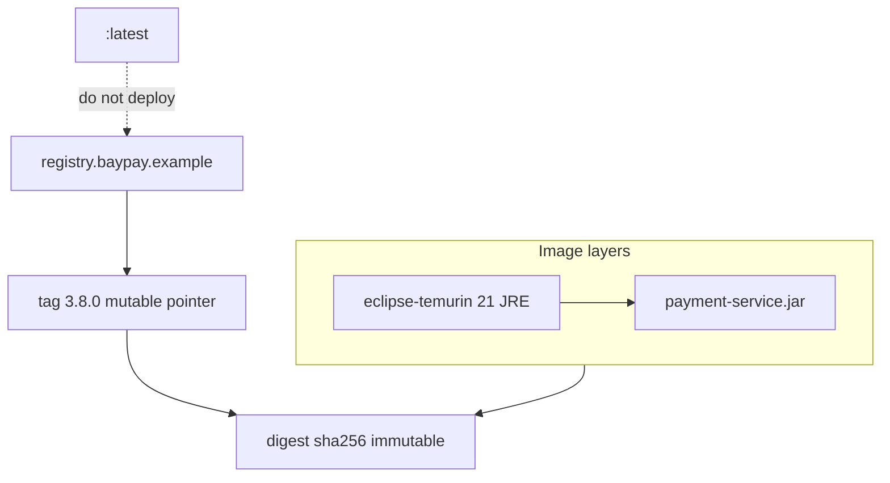

# L-9.3 — Images and registries

**Module:** 09 — Containers for Java  
**Duration:** 30 minutes  
**Case study:** BayPay Financial Services (fictional)

---

## Why this matters

When Riley Okonkwo asks “what is running on the canary?”, the only honest answer is a **digest** (and a tag that still points at it). `registry.baypay.example/baypay/payment-service:latest` is not a version. Jordan Voss can retag `latest` after Harbor Bike Co’s lunch rush and Priya Nair will never reconstruct which bytes authorized Avery Chen. Layers are how builds stay fast. Tags are how humans talk. Digests are how production rolls forward and back.

---

## Learning objectives

- Explain image layers and why Dockerfile order affects cache and leak surface.
- Tag `registry.baypay.example/baypay/payment-service:<tag>` and refuse `:latest` in production.
- Contrast a mutable tag with an immutable digest.
- Use the synthetic registry on paper; do not require a live push.

---

## Concept explanation

**Layers.** Each image is a stack of filesystem diffs. `eclipse-temurin:21-jre` already contributes OS userspace plus a Java 21 JRE. Your Dockerfile adds a `WORKDIR`, a `COPY` of `payment-service.jar`, maybe a non-root `USER`. The runtime stage must **not** be a full JDK — CLUSTER.md’s base is the JRE. A multi-stage build can compile on `eclipse-temurin:21-jdk` and copy only the JAR into the JRE stage (BUILD-901 / PERFORMANCE-904).

**Cache.** Engines reuse a layer if the instruction and its inputs are unchanged. Put rarely changing steps first (base, packages, user) and the **fat JAR last**. If you `COPY` the entire Git repo before `./mvnw package`, every comment change busts the Maven layer. If you `COPY` a `.env` with `BAYPAY_DB_PASSWORD`, that secret lives in a layer forever (L-9.5) even after you delete the file in a later layer.

**Tags.** A tag is a mutable pointer: `3.8.0`, `3.8.0-east`, `dev`. Production deploys a **specific** tag that Jordan’s release notes own. **Never deploy `:latest` in production.** `latest` means “whatever was pushed last,” not “the version finance signed off.” Local `:dev` on a laptop is fine; `pay-prod-east-2` is not a laptop.

**Digests.** `registry.baypay.example/baypay/payment-service@sha256:…` is content-addressed. Two tags can move; a digest does not. L-9.7 pins **base** images by digest so a rebuilt `eclipse-temurin:21-jre` cannot silently change under you. Application tags should be recorded **with** their digest in the release.

**Registry.** `registry.baypay.example` is the fictional BayPay registry (CLUSTER.md). It is teaching data. You will not log in, push, or pull from a real host in this module. `docker.io` / `ghcr.io` may appear as **base** pull sources on a laptop; production **application** images are named under `registry.baypay.example/baypay/…`. Do not publish Avery Chen’s service to a public registry as a lab step.

**Names.** `baypay/payment-service` is the repository. `3.8.0` is the tag. Together: `registry.baypay.example/baypay/payment-service:3.8.0`. Refund, if imaged later, is a **different** repository, not a second tag on the same bits unless the process is truly the same monolith (today it is one Boot process — do not invent a second image until a lab says so).

| Reference | Mutable? | Production use |
|---|---|---|
| `:latest` | Yes, aggressively | Never |
| `:3.8.0` | Yes (can be overwritten) | Allowed if registry **lock** / digest recorded |
| `@sha256:…` | No | Preferred pin for pull |

---

## Visual explanation



Alt text: Layers stack the JRE and JAR; the registry stores a mutable tag pointing at an immutable digest, and latest is not for production.

---

## Architecture

CI (later) builds from a Git SHA, tags `registry.baypay.example/baypay/payment-service:<semver>` plus a SHA tag, and records the digest in the release. Module 10’s Deployment will **pull** that name. This module only designs the name and the layers. Sam Okada owns who can push. Jordan owns which tag `pay-prod-east-2` may run.

Traditional WAS used cell sync to move `payment.ear` bits. That is not a registry. Do not treat `dmgr-east` as your image catalog. Do not `scp` a JAR onto `Pay1` and also call the host “containerized.”

`JAVA_TOOL_OPTIONS` baked into a **base** your team does not own can inject heap flags (L-7.6). Inspect the image config. Do not assume `eclipse-temurin` is empty of opinions until you print flags inside a rehearsal container — optional, not required.

---

## Production example

Jordan tags the lunchtime hotfix `:latest` “because Kubernetes will pick it up.” Two hours later Priya cannot say whether east-2 has the hotfix or the morning `3.8.0`. Avery Chen’s duplicate `Idempotency-Key` replay looks like a code bug; it is an **unknown binary**. Fix: tag `3.8.1`, record the digest, move the Deployment (Module 10) to that tag. Leave `:latest` for a local alias if you must, never for prod.

A second incident: the Dockerfile `COPY . /app` then `RUN ./mvnw -pl payment-service -am package`. The layer includes `solutions/` notes a student copied onto a laptop and a `.git`. The image is huge and may contain secrets. Fix: `.dockerignore`, multi-stage, copy only the JAR into the JRE stage.

---

## Code/configuration example

Naming (paper; do not push):

```text
registry.baypay.example/baypay/payment-service:3.8.0
registry.baypay.example/baypay/payment-service:3.8.0-b14
registry.baypay.example/baypay/payment-service@sha256:4f3c…   # teaching placeholder
```

Layer-friendly runtime stage:

```dockerfile
FROM eclipse-temurin:21-jre
WORKDIR /opt/baypay
COPY payment-service/target/payment-service-*.jar /opt/baypay/app.jar
USER 10001
EXPOSE 8080
ENTRYPOINT ["java", "-jar", "/opt/baypay/app.jar"]
```

`.dockerignore` (keep the build context small):

```text
.git
**/target
solutions
.env
*.md
```

Optional inspect (local image only):

```bash
docker image history registry.baypay.example/baypay/payment-service:3.8.0
# look for unexpected COPY of .env or a JDK in the final stage
```

---

## Trade-offs

| Choice | Strength | Cost |
|---|---|---|
| Semver tag + recorded digest | Human and forensic | Two identifiers to keep in sync |
| Digest-only deploy | Exact bytes | Harder hallway conversation |
| `:latest` | Convenient locally | Unreproducible prod |
| Fat context (`COPY .`) | Simple Dockerfile | Cache misses, leaked files |
| Multi-stage JDK → JRE | Small runtime | Slightly more Dockerfile |

---

## Failure modes

- Deploying `:latest` to `pay-prod-east-2`.
- Overwriting tag `3.8.0` without a new digest in the release notes.
- Final stage based on `eclipse-temurin:21-jdk` “so we can jcmd forever.”
- Secrets or `.git` in a layer.
- Requiring students to `docker push` to a host that does not exist.

---

## Security/reliability implications

A mutable tag is an **integrity** gap: the name Riley pages about may not be the bytes Priya approved. A layer that once contained `BAYPAY_DB_PASSWORD` remains fetchable from the registry’s blob store. Reliability: rollback means pointing at a **previous digest**, not “pull `:latest` again.” Public registries plus a payments JAR is a data-flow review, not a convenience. Pin bases (L-9.7) so a rebuilt JRE CVE is a **conscious** bump.

---

## Interview perspective

**Engineer:** “Layers are diffs. I put the JAR last. Prod uses `registry.baypay.example/baypay/payment-service:3.8.0`, not `:latest`.”

**Senior:** “I record the digest. I can explain cache busts and why `.dockerignore` exists. I will not push to a public registry for this service.”

**Staff:** “Release notes pair tag and digest. I treat overwritten tags as an incident. Final stage is JRE, not JDK.”

**Principal:** “The registry is the system of record for what can run. I will not accept `:latest` as an SLO input.”

---

## Key takeaways

- Layers cache; order the Dockerfile; JAR last; JRE in the runtime stage.
- Tags move; digests do not.
- Production image: `registry.baypay.example/baypay/payment-service:<tag>`.
- Never `:latest` in prod.
- No live registry is required to finish this lesson or BUILD-901.

---

## Knowledge check

1. Why is `:latest` unacceptable on `pay-prod-east-2`?
2. Where should the fat JAR `COPY` sit relative to the JRE base, and why?
3. Must you `docker push` to `registry.baypay.example` to complete this module?

<details>
<summary>Spoiler — answers</summary>

1. The tag is mutable; you cannot say which bytes authorized Avery Chen or roll back by name alone.
2. After the JRE base, as a late layer, so code changes do not rebuild the JRE and so the runtime stays a JRE image.
3. No. The registry name is synthetic. Write tags and layers on paper / disk.

</details>

---

## Related lab

[BUILD-901](../../../../labs/BUILD-901/README.md) — name and layer `payment-service`. Optional local build; no push. Do not open `solutions/` first.

---

## Related PAKS

Optional: `docs/17-kubernetes-and-platform-engineering/overview.md`. Registries feed the platform; this lesson stands alone without a live pull.
