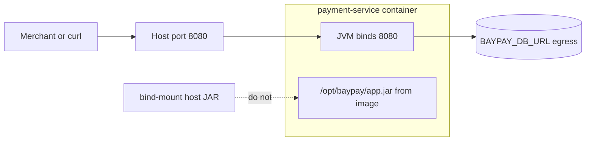

# L-9.4 — Networking and volumes

**Module:** 09 — Containers for Java  
**Duration:** 30 minutes  
**Case study:** BayPay Financial Services (fictional)

---

## Why this matters

`payment-service` already binds **8080** on a laptop (`GET /actuator/health/liveness`, `POST /api/v1/payments`). A container that cannot publish that port is a process Avery Chen’s merchant app will never reach. A container that **volume-mounts the fat JAR** over the image is not an immutable release — it is `scp` with extra steps. Jordan Voss will ship `3.8.0` and Riley Okonkwo will debug yesterday’s classes. Networking and volumes are how the OCI contract either holds or quietly dies.

---

## Learning objectives

- Publish container port `8080` and distinguish `EXPOSE` from a published host port.
- Place Actuator probes and the payment API on that process port for Module 9 rehearsals.
- Use volumes only for data the image must not own (optional logs, later Secrets).
- Refuse volume-mounting the fat JAR as an operating habit.

---

## Concept explanation

**Process port.** Spring Boot’s teaching app listens on `8080`. CLUSTER.md locks that as the image port. `EXPOSE 8080` in the Dockerfile is **documentation** for humans and some orchestrators. It does not open a hole on the host. Publishing is a **run** flag: `-p 8080:8080` maps host `8080` to container `8080`. Module 10 will replace that with a Service / Route. This module only needs you to know which number the JVM binds.

**Network modes (local).** The default bridge-like network gives the container its own namespace. `localhost` inside the container is **not** the laptop’s `localhost` except for published ports. `--network host` (Linux) fuses namespaces; it is a debug escape, not the BayPay default. Do not teach host networking as how `pay-prod-east-2` will run.

**Probes vs API.** Same port, different paths: `/api/v1/payments` for Harbor Bike Co, `/actuator/health/liveness` and `/actuator/health/readiness` for the engine or kubelet (L-3.5). Publishing `8080` once serves both. Do not invent a second published port unless a later lab says so.

**Volumes.** A volume or bind mount replaces a filesystem path in the container with something from the host (or a named volume). Legitimate Module 9 thoughts: a **tmp** mount if the root filesystem is read-only (L-9.7), or a place to drop GC logs you already chose not to keep in the image. Module 10 will mount Secret `baypay-db` and ConfigMap `payment-config` as env or files. That is **configuration**, not application code.

**Do not volume-mount the fat JAR.** ` -v $PWD/payment-service.jar:/opt/baypay/app.jar` makes the image a JRE wrapper. Tags lie. Digests lie. Two hosts with the same image name run different bytecode. FIX-902 will show this smell. Developers sometimes do it “to skip rebuild.” That is a laptop shortcut you must not promote to canary or prod. Rebuild, retag, rerun.

**Do not volume-mount H2 files as production data.** Local profile uses H2. Prod profile uses PostgreSQL via `BAYPAY_DB_*`. Persisting a container H2 file is not a database strategy.

**Outbound.** The JVM still opens JDBC to `db-east.baypay.example:5432` (or whatever `BAYPAY_DB_URL` says). That is **egress**, not a published port. Do not `-p 5432` on the payment container.

| Mechanism | What it does | BayPay habit |
|---|---|---|
| `EXPOSE 8080` | Documents the process port | Always |
| `-p 8080:8080` | Laptop rehearsal | Optional |
| Bind-mount JAR | Overlays image bytes | Do not |
| Mount for Secret/tmp | Runtime files | Yes, later / when read-only |

---

## Visual explanation



Alt text: Host port 8080 publishes the JVM; the fat JAR stays in the image and is not bind-mounted from the host.

---

## Architecture

On a laptop, `docker run -p 8080:8080` (or Podman) is enough to `curl` liveness. In `baypay-prod` (Module 10) the Service `payment-service` ClusterIP `8080` and Ingress/Route `payments.apps.baypay.example` replace host publish. Do not design Module 9 as if every container used `--network host`.

`ihs-east` in the WAS estate terminated TLS in front of `Pay1`–`Pay3`. That is a different front door. Do not publish `9080`/`9443` Liberty ports unless you are imaging Liberty; the Boot teaching image is `8080`.

Writable layers: if you skip a volume, the container can still write into its overlay (logs, `/tmp`). L-9.7 will prefer `--read-only` plus an explicit tmpfs. Either way, **application classes** stay in the image layer.

---

## Production example

Jordan bind-mounts `target/payment-service.jar` on the canary “so we can iterate.” Harbor Bike Co traffic hits a JAR that is not `3.8.0`. Priya’s rollback pulls the image and still runs the mount. Riley pages a method that is not in Git tag `3.8.0`. Fix: delete the mount; rebuild.

A second hour: someone publishes `-p 8080:80` because “HTTP is 80.” The JVM still listens on `8080`; the map is wrong; probes fail. Fix: `-p 8080:8080` or a platform Service that targets **container** `8080`.

A third: H2 file mounted at `/data` in a `prod` profile container. Postgres URL is ignored or unused; Avery Chen’s ledger is a file on one node. That is not CLUSTER.md.

---

## Code/configuration example

Optional rehearsal (engine not required):

```bash
docker run --rm -p 8080:8080 \
  -e BAYPAY_DB_URL -e BAYPAY_DB_USER -e BAYPAY_DB_PASSWORD \
  registry.baypay.example/baypay/payment-service:3.8.0
```

```bash
curl -sS http://127.0.0.1:8080/actuator/health/liveness
curl -sS http://127.0.0.1:8080/actuator/health/readiness
```

Dockerfile documentation only:

```dockerfile
EXPOSE 8080
```

Rejected habit:

```bash
# do not make this the canary contract
docker run -p 8080:8080 \
  -v "$PWD/payment-service.jar:/opt/baypay/app.jar:ro" \
  registry.baypay.example/baypay/payment-service:3.8.0
```

Acceptable later (preview, not a JAR):

```bash
# Secret file or tmp — not application bytecode
# Module 10: env from Secret baypay-db
docker run --read-only --tmpfs /tmp:rw,noexec \
  -p 8080:8080 ...
```

---

## Trade-offs

| Choice | Strength | Cost |
|---|---|---|
| Publish `8080:8080` | Laptop matches the contract | Occupies host 8080 |
| `EXPOSE` only | Honest docs | No host access until publish or a Service |
| Bind-mount JAR | Fast local iterate | Breaks immutability; FIX-902 smell |
| Host network | Fewer port maps | Shares host namespace; not the default |
| Volume for H2 | Looks persistent | Not prod; hides missing Postgres |

---

## Failure modes

- Confusing `EXPOSE` with a published port.
- Mapping the wrong container port (`80` vs `8080`).
- Volume-mounting the fat JAR on `pay-prod-east-2`.
- Publishing the database port from the payment container.
- Treating `localhost` in a `BAYPAY_DB_URL` as the host Postgres from inside the container.

---

## Security/reliability implications

An unpublished API is an availability miss; an accidentally published debug port is a **trust** miss. Do not `-p` Actuator-only extra ports that expose `env` or `heapdump` (L-3.5). A JAR mount is an integrity miss: the digest no longer describes what ran. Reliability: in-flight `AUTHORIZED` work still needs idempotent retries when you kill the published container. Volumes that hold ledger files turn one container into a pet.

---

## Interview perspective

**Engineer:** “The JVM listens on `8080`. `EXPOSE` documents it. `-p 8080:8080` is the laptop map. I do not mount the JAR over the image.”

**Senior:** “I can curl liveness on the published port. I treat JAR bind-mounts as a break/fix smell. Egress to Postgres is env, not a published port.”

**Staff:** “Module 10 Services target container `8080`. I will not approve a canary that overlays bytecode. Read-only rootfs gets a tmpfs, not a code mount.”

**Principal:** “The image is the release. Volumes are for secrets and scratch, not for shipping `payment-service`.”

---

## Key takeaways

- Process port is `8080`; `EXPOSE` ≠ publish.
- Laptop: `-p 8080:8080`. Platform: Service/Route later.
- Do not volume-mount the fat JAR as a habit.
- Volumes are for config/scratch, not the ledger and not classes.
- Engine optional; reason the ports on paper if you need to.

---

## Knowledge check

1. What does `EXPOSE 8080` do, and what actually makes `curl localhost:8080` work on a laptop?
2. Why is bind-mounting `payment-service.jar` over `/opt/baypay/app.jar` unsafe on the canary?
3. Should the payment container publish `5432` because it uses PostgreSQL?

<details>
<summary>Spoiler — answers</summary>

1. `EXPOSE` documents the process port. Publishing (`-p 8080:8080` or a later Service) makes the host or cluster path reach the JVM.
2. The image tag no longer matches the bytes. Rollback and forensics fail; it is `scp` dressed as a container.
3. No. JDBC is egress via `BAYPAY_DB_URL`. Publishing `5432` on the payment container is the wrong door.

</details>

---

## Related lab

[FIX-902](../../../../labs/FIX-902/README.md) — repair a poor Dockerfile / run story. Expect port and volume smells. Docker/Podman optional. Do not open `solutions/` first.

---

## Related PAKS

Optional: `docs/17-kubernetes-and-platform-engineering/overview.md`. Services replace laptop port publish; this lesson stands alone.
