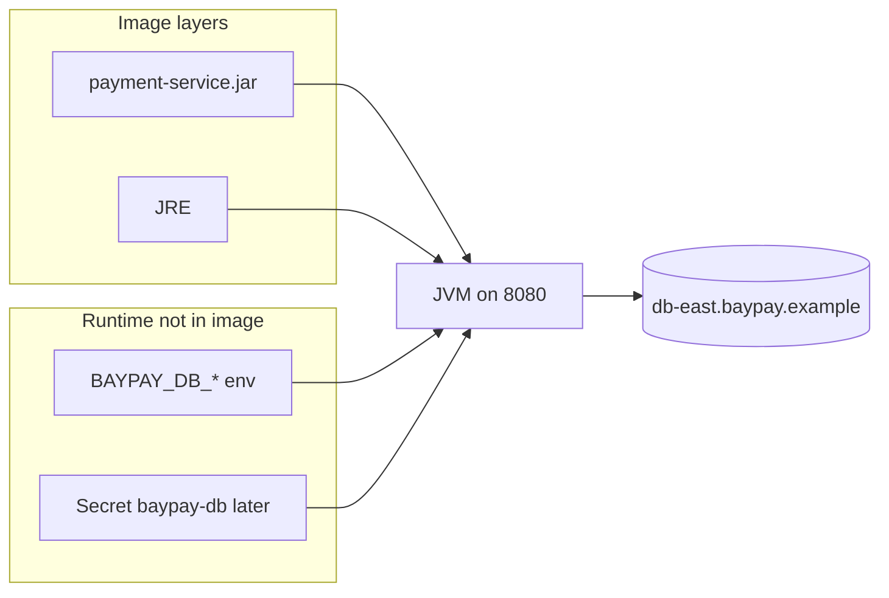

# L-9.5 — Secrets and configuration

**Module:** 09 — Containers for Java  
**Duration:** 30 minutes  
**Case study:** BayPay Financial Services (fictional)

---

## Why this matters

`application-prod.yml` already reads `BAYPAY_DB_URL`, `BAYPAY_DB_USER`, and `BAYPAY_DB_PASSWORD`. L-6.4 taught the same keys on Liberty. A Dockerfile that does `ENV BAYPAY_DB_PASSWORD=…` copies that secret into an **image layer**. Anyone who can pull `registry.baypay.example/baypay/payment-service:3.8.0` can `docker history` it. Avery Chen’s ledger credential must arrive at **run time**, the way CLUSTER.md states: `BAYPAY_DB_*` from env — never baked into the image.

---

## Learning objectives

- Inject `BAYPAY_DB_*` at container start; fail start if they are missing in prod.
- Refuse `ENV` / `ARG` passwords and committed `.env` copies in the image.
- Split image (build) from release config (run), matching Boot and Liberty.
- Preview Module 10 Secret `baypay-db` without requiring a cluster.

---

## Concept explanation

**Same names as the rest of the course.**

| Variable | Role |
|---|---|
| `BAYPAY_DB_URL` | JDBC URL (`jdbc:postgresql://db-east.baypay.example:5432/baypay`) |
| `BAYPAY_DB_USER` | Application role |
| `BAYPAY_DB_PASSWORD` | Secret |
| `BAYPAY_DB_HOST` / `PORT` / `NAME` | Liberty-style pieces; Boot may use the URL form |

The teaching `application-prod.yml` uses URL + user + password. Do not invent `BAYPAY_DB_PASS` as a second name.

**Build vs run.** The image contains the JRE, the fat JAR, and non-secret defaults (port `8080`, app name). The **release** attaches backing-service values. Twelve-factor here is the same sentence as L-6.4: shape in the artifact, values in the environment.

**`ENV` in a Dockerfile.** Every `ENV` becomes image config **and** is visible in history. Non-secrets (`JAVA_HOME` from the base) are fine. `ENV BAYPAY_DB_PASSWORD=changeme` is a fail in FIX-902 / SECURITY-903 even when the value is the fictional `changeme` — we grade the **habit**. `ENV BAYPAY_DB_PASSWORD=` with an empty default that the app treats as production is also a fail.

**`ARG`.** Build-args are not a secret store. They can appear in `docker history` and in CI logs. Never `ARG DB_PASSWORD` then `ENV BAYPAY_DB_PASSWORD=$DB_PASSWORD`.

**Runtime injection.**

```text
docker run -e BAYPAY_DB_URL -e BAYPAY_DB_USER -e BAYPAY_DB_PASSWORD ...
```

or `--env-file` that is **gitignored** and never `COPY`’d. Module 10: Secret `baypay-db` keys `BAYPAY_DB_USER`, `BAYPAY_DB_PASSWORD` (CLUSTER.md). ConfigMap `payment-config` can hold non-secrets (URL host pieces). You will write YAML later; this lesson only names the split.

**Fail start.** If prod-profile `BAYPAY_DB_PASSWORD` is missing, the process must not silently use `changeme` against a real-looking host. The reference YAML still has a local default for laptop `prod` experiments; a **production image review** should not rely on that default. Document “unset means do not start” in the portfolio notes.

**What is not a secret.** `8080`, probe paths, `spring.application.name=baypay`, image tag `3.8.0`. Those can live in the Dockerfile or a ConfigMap. TLS private keys and DB passwords cannot.

---

## Visual explanation



Alt text: The image holds JRE and JAR; BAYPAY_DB secrets enter the JVM only at runtime from env or a later Secret.

---

## Architecture

Jordan’s Dockerfile and Sam’s registry hold **one** image per version for every environment. Staging and production differ by env, not by `payment-service-prod.jar` with a password compiled in. That is how you avoid Avery Chen’s synthetic id appearing in the wrong database because someone baked `db-east` into a unique image.

WAS J2C alias `baypayDbAlias` was a cell-owned secret. Do not recreate it as `ENV` in the Boot image. Liberty `server.env` (L-6.4) is the same injection story in a file. Containers prefer process environment or a mounted file from a Secret.

Do not `docker exec` and `export` a password after start as the supported path. The first connection may already have used a default.

---

## Production example

Jordan’s BUILD-901 draft:

```dockerfile
ENV BAYPAY_DB_USER=baypay_app
ENV BAYPAY_DB_PASSWORD=BayPayApp1!
```

Priya rejects the PR. `image history` prints the password. Fix: delete both `ENV` lines; pass `-e` at run; document the keys in the README of the image, not the values.

A second hour: CI uses `--build-arg BAYPAY_DB_PASSWORD` so integration tests can start. The password is in the build log and a layer. Fix: tests use a disposable credential injected at **run** of the test container, or an in-memory profile that is not the production image.

Riley sees readiness fail: URL points at `localhost:5432` because the container inherited a laptop default. Externalization without **environment identity** is a portable mistake (L-6.4).

---

## Code/configuration example

Committed Boot shape (already in the teaching app):

```yaml
spring:
  datasource:
    url: ${BAYPAY_DB_URL}
    username: ${BAYPAY_DB_USER}
    password: ${BAYPAY_DB_PASSWORD}
```

Dockerfile — **no** password `ENV`:

```dockerfile
FROM eclipse-temurin:21-jre
WORKDIR /opt/baypay
COPY app.jar /opt/baypay/app.jar
USER 10001
EXPOSE 8080
# document required runtime keys in comments or a compose.example
ENTRYPOINT ["java", "-jar", "/opt/baypay/app.jar"]
```

Optional run (values not committed):

```bash
export BAYPAY_DB_URL='jdbc:postgresql://db-east.baypay.example:5432/baypay'
export BAYPAY_DB_USER='baypay_app'
export BAYPAY_DB_PASSWORD='injected-by-operator-not-committed'
docker run --rm -p 8080:8080 \
  -e BAYPAY_DB_URL -e BAYPAY_DB_USER -e BAYPAY_DB_PASSWORD \
  registry.baypay.example/baypay/payment-service:3.8.0
```

Rejected:

```dockerfile
ARG BAYPAY_DB_PASSWORD
ENV BAYPAY_DB_PASSWORD=$BAYPAY_DB_PASSWORD
COPY .env /opt/baypay/.env
```

Module 10 preview (paper only — not required to run):

```text
Secret baypay-db
  BAYPAY_DB_USER
  BAYPAY_DB_PASSWORD
```

---

## Trade-offs

| Choice | Strength | Cost |
|---|---|---|
| Runtime `-e` / Secret | Rotation without rebuild | Must document required keys |
| `ENV` non-secrets | Visible contract | Easy to slip a password in |
| Bake URL + password | “It just starts” | Layer leak; one image per env |
| `--env-file` on laptop | Convenient | File must stay out of git and context |
| Default `changeme` in YAML | Local boot | Dangerous if prod image relies on it |

---

## Failure modes

- `ENV BAYPAY_DB_PASSWORD` in the Dockerfile.
- `ARG` + `ENV` for the same secret.
- `COPY .env` into the image.
- Different key names than Liberty/Boot (`DB_PASS` vs `BAYPAY_DB_PASSWORD`).
- Falling back to cell `jdbc/baypay` or to `changeme` when unset.
- Logging the resolved JDBC URL with password at debug.

---

## Security/reliability implications

A pulled image is a **credential artifact** if a password was `ENV`’d — rotation means rebuild **and** treating old tags as compromised. Reliability: missing secrets should fail readiness or fail start, not authorize against the wrong host. Dual-run with `BayPayCell` still requires coordinated password rotation (L-6.4) across J2C and container env. Do not put the password on `ihs-east` or in a world-readable compose file in git.

`docker inspect` prints `Env`. Restrict who can inspect production containers the way you restrict `dmgr-east` console access.

---

## Interview perspective

**Engineer:** “`BAYPAY_DB_*` come from the runtime environment. I will not `ENV` a password in the Dockerfile.”

**Senior:** “I use the same keys as Boot and Liberty. I fail start when prod secrets are missing. `ARG` is not a vault.”

**Staff:** “One image per version; env differs by stage. I preview Secret `baypay-db` and keep URLs out of layers if they identify a locked estate.”

**Principal:** “Config is a release artifact. I will not fund an image that contains ledger credentials, even synthetic ones — the habit does not stay fictional.”

---

## Key takeaways

- Inject `BAYPAY_DB_*` at run time; never bake passwords into layers.
- `ENV` and `ARG` are visible; they are not a secret store.
- Same key names as L-6.4 and `application-prod.yml`.
- Module 10 Secret `baypay-db` is the platform form of the same rule.
- No live cluster or registry is required to write this correctly.

---

## Knowledge check

1. Why is `ENV BAYPAY_DB_PASSWORD=changeme` a production defect even in this fictional estate?
2. Where should `BAYPAY_DB_PASSWORD` live at run time in Module 9 vs Module 10?
3. Why is `ARG` plus `ENV` still wrong for the database password?

<details>
<summary>Spoiler — answers</summary>

1. The value is copied into image config and history; anyone who can pull or inspect the image has the secret. The habit is what we grade.
2. Module 9: process environment / `--env-file` not copied into the image. Module 10: Secret `baypay-db` (and ConfigMap for non-secrets).
3. Build-args appear in history and CI logs; assigning them to `ENV` still bakes the secret into the image.

</details>

---

## Related lab

[FIX-902](../../../../labs/FIX-902/README.md) — expect baked secrets among the defects. [SECURITY-903](../../../../labs/SECURITY-903/README.md) continues the harden path. Do not open `solutions/` first.

---

## Related PAKS

Optional: `docs/17-kubernetes-and-platform-engineering/overview.md`. Secret objects are the platform half of this lesson; the image rule stands alone.
