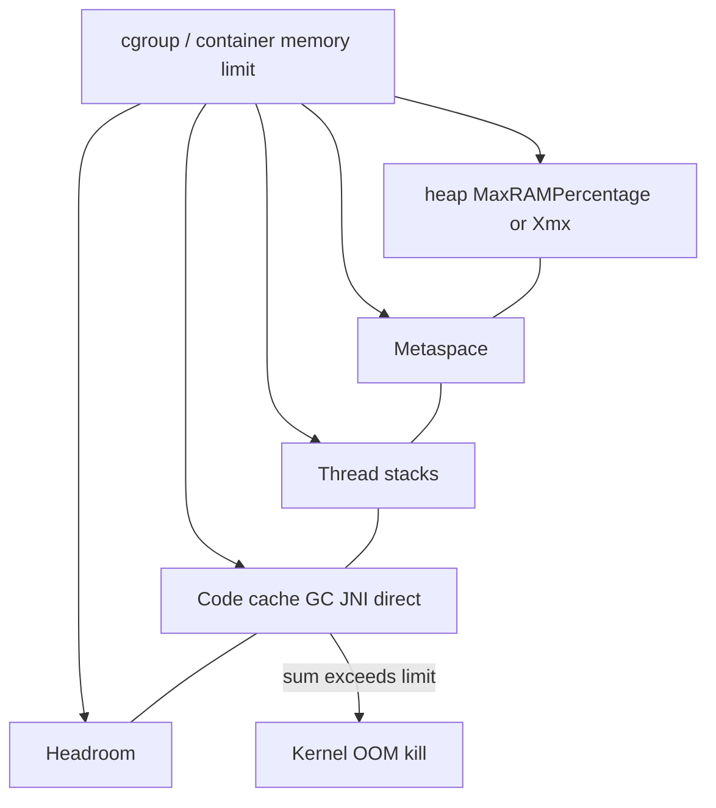

# L-9.6 — Java resource sizing

**Module:** 09 — Containers for Java  
**Duration:** 30 minutes  
**Diagram:** AEJE-D-041  
**Case study:** BayPay Financial Services (fictional)

---

## Why this matters

The image you built in BUILD-901 still fails Harbor Bike Co if the **cgroup** and the **heap** are the same number. L-7.6 stated the rule: a container memory limit is the **whole process** budget — heap, metaspace, stacks, code cache, direct buffers, the JVM. `-Xmx` is only the heap. If you set `-Xmx` equal to the limit, native headroom is zero and the kernel OOM-kills `payment-service` while eden still has space. Avery Chen’s `POST` dies with exit 137, not `Java heap space`. This lesson is that rule applied to the **image and run contract**, not a new JVM.

---

## Learning objectives

- Restate `UseContainerSupport` and default `MaxRAMPercentage` (25) on Java 21 HotSpot.
- Size heap **below** the container limit; never `-Xmx` = limit.
- Leave headroom for metaspace, stacks, and native on a Spring Boot 3.5.5 process.
- Recognize the INC-JVM-806 **class** of failure (cgroup kill after heap ate the budget) without treating Module 8 as a spoiler sheet.

---

## Concept explanation

**UseContainerSupport.** On Java 21 this is **on by default**. The VM reads cgroup v1/v2 memory and CPU. `-XX:-UseContainerSupport` makes a 512 MiB container size as if it had the **node’s** RAM. Do not turn it off on BayPay images. Do not assume a laptop `docker run` without `--memory` taught you production ergonomics — without a limit, the VM sees the VM or the host.

**MaxRAMPercentage.** If you **omit** `-Xmx`, Java 21 sets max heap to a **percentage of the memory the VM believes it has** (the cgroup limit when support is on). The default is **25**, not 100. A 2 GiB limit without `-Xmx` is about a 512 MiB heap, not 2 GiB. Operators often set an **explicit** `-Xmx` once they have measured (L-7.6). Raising `MaxRAMPercentage` to 100 is the same **class** of mistake as `-Xmx` equal to the limit.

**Headroom.** Teaching arithmetic (not a prod recipe), same picture as L-7.6: limit **1 GiB**, `-Xmx512m`. Budget ~512 MiB heap, ~80–150 MiB metaspace after Boot + Hibernate warmup, 1 MiB × (Tomcat + Hikari + compiler + GC threads), code cache, G1 native, direct buffers. That remainder is why 512m-on-1g can live and 1g-on-1g dies. PERFORMANCE-904 is where you apply the picture to the image.

**Flags in the image.** `JAVA_TOOL_OPTIONS` or `ENTRYPOINT` can inject `-Xmx` you did not pass on `docker run`. Print flags **inside** the same container you will ship (`java -XshowSettings:vm` or `jcmd 1 VM.flags`). Compare `MaxHeapSize` to the **cgroup** limit, not to host `free -h`.

**Two OOM stories (L-8.7).** Java heap OOM: exception, dump possible. Cgroup kill: SIGKILL, exit 137, no Java stack. Module 8’s INC-JVM-806 is a **canary restart** pack in that second family — heap and limit fighting for the same bytes. Work that pack from its gates; this lesson will not quote its flags. The design rule you need here is already public: **never `-Xmx` = limit**.

CPU quotas feed `ActiveProcessorCount` (GC and compiler threads). Do not chase GC thread counts in this module; do not copy a `Pay1` WAS heap onto a Boot cgroup.

---

## Visual explanation



Alt text: The container limit wraps heap, metaspace, stacks, native, and headroom; filling the heap to the limit leaves no gap and risks a kernel OOM kill.

Diagram **AEJE-D-041** (Java resource sizing) is the course asset for this picture. AEJE-D-031 in Module 7 is the same idea from the JVM side.

---

## Architecture

Image contract (CLUSTER.md): `UseContainerSupport`; do not set `-Xmx` equal to the container memory limit. Put the **safe** flags in a place reviewers can see: `ENTRYPOINT` / `JAVA_TOOL_OPTIONS` **without** a heap that matches a 1g/1g story. Prefer documenting the pair “limit L, heap H, H < L” in PF-container.md. The platform (Module 10) sets the limit; the image must not assume host RAM.

`pay-prod-east-1` / `pay-prod-east-2` remain the teaching canary names. A healthy pairing leaves native room (L-7.6’s 1g/512m picture). An unhealthy pairing is any deploy where heap max **equals** the cgroup. Do not copy Module 5 cell `-Xmx` into the Dockerfile.

Local `spring-boot:run` has no cgroup unless you add one. Paper arithmetic is enough for this lesson. PERFORMANCE-904 may use Docker `--memory` optionally, like LAB-704.

---

## Production example

Jordan “uses the memory we paid for” and sets `-Xmx` to the full container limit on the canary image. After Avery Chen / Harbor Bike Co traffic, NMT shows heap plus threads plus metaspace. RSS crosses the limit. The kubelet/cgroup killer sends SIGKILL. Riley sees a restart loop. No heap dump: there was no Java heap OOM. Priya’s fix shape is L-7.6’s: **lower the heap** or **raise the limit** and still keep heap below it. Confirm `UseContainerSupport` stayed true. She does not set heap equal to the limit again.

If instead the log shows `OutOfMemoryError: Java heap space` and the container is still running, that is a live-set / leak story (L-8.4), not “add `-Xmx` until it matches the cgroup.”

Students who only remember “OOM” from INCIDENT-806 should still **open that pack’s gates** for the canary night. This lesson only names the class: container kill when native had nowhere to live.

---

## Code/configuration example

Teaching pair (not a recipe for every pod):

```text
# container memory limit: 1g   (Docker --memory=1g or a later pod spec)
# heap must be smaller — do not use -Xmx1g here
-XX:+UseContainerSupport
-Xmx512m
```

If `-Xmx` is unset, know the default:

```text
-XX:MaxRAMPercentage=25.0
# 1g cgroup → max heap about 256m, not 1g
```

Teams may raise `MaxRAMPercentage` (50 or 75) **and still** stay under the cgroup. Do not raise it to 100.

```dockerfile
# illustrative ENTRYPOINT — heap stays below a 1g limit you will set at run
ENTRYPOINT ["java", "-XX:+UseContainerSupport", "-Xmx512m", "-jar", "/opt/baypay/app.jar"]
```

Optional PERFORMANCE-904 / LAB-704-style check:

```bash
docker run --memory=1g --cpus=1 ...
jcmd 1 VM.flags | egrep "MaxHeapSize|MaxRAMPercentage|UseContainerSupport"
```

`jcmd 1` when the JVM is PID 1. On a laptop without Docker, reuse L-7.1 NMT arithmetic.

---

## Trade-offs

| Approach | Strength | Cost |
|---|---|---|
| Explicit `-Xmx` < limit | Reviewable pair | Two knobs can drift |
| Default `MaxRAMPercentage=25` | Safe-ish unset default | Heap may look small on a large limit |
| High `MaxRAMPercentage` (< 100) | More heap as limits change | Eats native headroom |
| `-Xmx` = cgroup limit | “Uses all the memory” | Kernel OOM; no dump; lost payments |

Never choose the last row.

---

## Failure modes

- `-Xmx` equal to `--memory` / pod limit (INC-JVM-806 **class**).
- `-XX:-UseContainerSupport` so ergonomics use node RAM.
- Inherited `JAVA_TOOL_OPTIONS=-Xmx…` from a base image (L-1.1 / L-7.6).
- `MaxRAMPercentage=100`.
- Copying `Pay1` WAS heap into the Boot Dockerfile.
- Blaming G1 for a zero-headroom cgroup.

---

## Security/reliability implications

SIGKILL during `AUTHORIZED` looks like a client timeout; `Idempotency-Key` must still debit Avery Chen once. Probes that only check “process up” miss a cgroup about to kill you — watch RSS vs limit (L-8.7). A tenant who can shrink your limit without changing `-Xmx` can induce kills. Do not run `--privileged` so the JVM can ignore cgroups (L-9.7). Heap dumps on Java OOM are huge and secret-bearing; this course still does not require a binary `hprof`.

---

## Interview perspective

**Engineer:** “`UseContainerSupport` is on in Java 21. I will not set `-Xmx` equal to the container limit.”

**Senior:** “Default `MaxRAMPercentage` is 25 if `-Xmx` is unset. RSS includes native. A cgroup kill is not `Java heap space`.”

**Staff:** “I print VM flags inside the image’s container, pair limit and heap in the same review, and treat `JAVA_TOOL_OPTIONS` as part of the contract.”

**Principal:** “We pay for the limit and spend heap plus native. I will not approve heap = request/limit. Container OOM stays a gated diagnosis (INC-JVM-806), not a slogan.”

---

## Key takeaways

- Java 21 reads cgroups by default; do not disable `UseContainerSupport`.
- Unset `-Xmx` → max heap is `MaxRAMPercentage` (default 25%) of container memory.
- Never set `-Xmx` equal to the container limit; leave native headroom.
- Kernel OOM and heap OOM are different; INC-JVM-806 is the canary **class** of the first.
- PERFORMANCE-904 applies this to the image; paper arithmetic is enough.

---

## Knowledge check

1. A run spec sets memory `1g` and `-Xmx1g`. Why can `payment-service` still be OOM-killed?
2. Java 21, 2 GiB cgroup, no `-Xmx`. About how large is the max heap, and which flag?
3. Does this lesson ask you to quote INC-JVM-806’s exact heap flags?

<details>
<summary>Spoiler — answers</summary>

1. Metaspace, stacks, code cache, GC native, and direct buffers sit outside `-Xmx`. Their RSS plus the heap can exceed 1 GiB; the cgroup kills the process.
2. About 25% of 2 GiB, roughly 512 MiB, via default `-XX:MaxRAMPercentage=25`.
3. No. Work INCIDENT-806 from its gates. This lesson only names the class: heap must stay below the limit.

</details>

---

## Related lab

[PERFORMANCE-904](../../../../labs/PERFORMANCE-904/README.md) — optimize the Java container (layers, JRE, heap vs limit). Docker optional. Re-read [L-7.6](../../07-jvm-internals-performance/lessons/L-7.6.md) if needed. Do not open `solutions/` first.

---

## Related PAKS

Optional: `docs/17-kubernetes-and-platform-engineering/overview.md`. Requests/limits are the platform half; L-7.6 remains the JVM half. This lesson stands alone.
