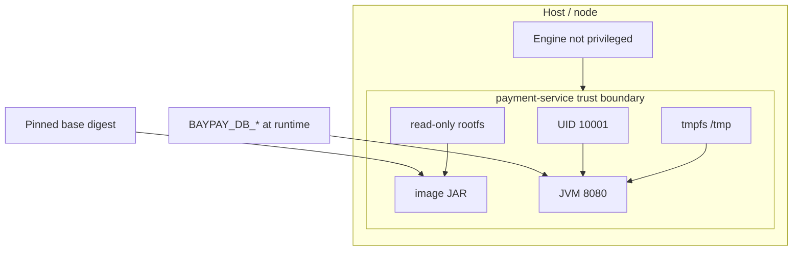

# L-9.7 — Container security

**Module:** 09 — Containers for Java  
**Duration:** 30 minutes  
**Diagram:** AEJE-D-040  
**Case study:** BayPay Financial Services (fictional)

---

## Why this matters

A `payment-service` image that runs as root, with a writable root filesystem, a floating `eclipse-temurin:21-jre` tag, and `--privileged` is a **host-adjacent** process holding Avery Chen’s authorize path. Sam Okada’s platform will not treat that as an implementation detail. SECURITY-903 is the lab that hardens the file you wrote in BUILD-901. This lesson is the trust boundary: who the JVM runs as, what it can write, what it can do to the kernel, and which **bytes** you actually pulled.

---

## Learning objectives

- Run the runtime stage as a non-root numeric UID (example `10001`).
- Prefer a read-only root filesystem plus explicit tmp; refuse `--privileged`.
- Pin base images by **digest**, not a floating tag.
- Map those controls onto SECURITY-903 and diagram AEJE-D-040.

---

## Concept explanation

**Non-root.** CLUSTER.md: user is a numeric UID, example `10001`. `USER 10001` (or `USER 10001:10001`) in the **runtime** stage. Do not `USER root` so `jcmd` feels easier. Do not login as `appuser` with UID 0. The JVM does not need to bind ports below 1024; it already uses `8080`. Root in the container is root on the host **if** the engine is rootful and you also get a breakout. Even without breakout, a writable root plus root UID means a compromised Spring endpoint can rewrite `/opt/baypay/app.jar`.

**Read-only root filesystem.** `--read-only` (or the later pod `readOnlyRootFilesystem: true`) makes the overlay immutable at run. The fat JAR cannot be replaced in place (L-9.4). Boot and the JVM still need scratch: `/tmp` (tmpfs), sometimes a volume for GC logs you chose to keep. Failures that look like “container cannot start” are often a write to a path you did not exempt — fix the path, do not drop back to a writable root as the default.

**No privileged.** `--privileged` (and `privileged: true` later) gives the container host-like capabilities: devices, cgroup writes, often the ability to **escape** the memory controller story you just sized in L-9.6. BayPay does not need it to serve `POST /api/v1/payments`. Do not enable it so a student can run Docker-in-Docker next to the ledger.

**Pin digests.** `FROM eclipse-temurin:21-jre` moves when the publisher retags. `FROM eclipse-temurin@sha256:…` is the same rule as application tags (L-9.3) applied to the **base**. SECURITY-903 expects you to pin, or to document the digest you would pin on paper if you cannot pull. You do **not** need a live registry to write the `FROM` line with a **teaching** digest placeholder and explain why prod replaces it with a recorded one.

**Drop capabilities / no extra.** If an engine lets you drop `NET_RAW`, `SYS_ADMIN`, and friends, do. Do not add `SYS_PTRACE` “for jcmd” on the canary as a standing exception; rehearse with a non-prod debug image if you must. No host PID/network namespace as the default.

**Scan and content.** A JRE stage is smaller than a JDK stage: fewer packages, fewer CVEs. Do not `apt-get install` a compiler in the runtime stage. Do not copy the Maven repo or `.git` (L-9.3). Secrets stay out (L-9.5).

**Not ND.** A traditional WAS profile image that runs as `root` and mounts the cell repository is two trust failures: cell plus container. Do not “harden” that and call Module 9 done.

| Control | Default you want | Reject |
|---|---|---|
| User | UID `10001` | root / UID 0 |
| Rootfs | read-only + `/tmp` | writable overlay as habit |
| Privilege | unprivileged | `--privileged` |
| Base | digest-pinned JRE | floating `:latest` or unpinned `:21-jre` in prod |
| Secrets | runtime env | `ENV` password |

---

## Visual explanation



Alt text: The payment-service trust boundary is a non-root JVM on a read-only rootfs with a pinned base and secrets injected at runtime.

Diagram **AEJE-D-040** (container trust boundary) is the course asset for this picture.

---

## Architecture

Hardening belongs in the **runtime** stage and in the **run** spec you document for Sam. Build stages may use a JDK and a more capable user to run `./mvnw`; they are discarded. The image that lands in `registry.baypay.example/baypay/payment-service:3.8.0` is JRE, non-root, no secrets, `EXPOSE 8080`.

Module 10 will add Kubernetes securityContext (non-root, read-only, drop caps) and will still pull this image. Do not wait for OpenShift SCCs to invent these controls — write them in the Dockerfile and in PF-container.md now. A live cluster is **not** required.

`pay-prod-east-2` as a privileged canary would invalidate L-9.6: the process can fight the cgroup. Priya will treat that as a platform incident, not a JVM incident.

---

## Production example

Jordan’s image starts as root because “Tomcat needed it on WAS.” Priya rejects: Boot binds `8080`. SECURITY-903 fails `USER`. Fix: `useradd`/numeric UID in the Dockerfile (or the UID the base already documents) and `USER 10001`.

A second PR adds `--privileged` so a sidecar can load a kernel module. That sidecar is not `payment-service`. Split it; do not widen the payment trust boundary.

A third: `FROM eclipse-temurin:21-jre` without a digest. A silent retag ships a different JRE under tag `3.8.0` of **our** image when CI rebuilds. Avery Chen’s authorize now runs a JRE nobody recorded. Pin, rebuild consciously, retag **our** image.

Riley finds `BAYPAY_DB_PASSWORD` in `docker history` (L-9.5). Security review is not only UID; it is layers plus user plus privilege plus pin.

---

## Code/configuration example

Runtime stage shape for SECURITY-903 (paper-valid without a pull):

```dockerfile
FROM eclipse-temurin:21-jre@sha256:0123456789abcdef0123456789abcdef0123456789abcdef0123456789abcdef
# replace the teaching digest with the one you record when you actually pull
WORKDIR /opt/baypay
COPY --chown=10001:10001 app.jar /opt/baypay/app.jar
USER 10001
EXPOSE 8080
ENTRYPOINT ["java", "-XX:+UseContainerSupport", "-jar", "/opt/baypay/app.jar"]
```

Optional run flags (engine not required to finish the lesson):

```bash
docker run --rm \
  --read-only --tmpfs /tmp:rw,noexec,nosuid \
  --user 10001 \
  --security-opt no-new-privileges \
  -p 8080:8080 \
  -e BAYPAY_DB_URL -e BAYPAY_DB_USER -e BAYPAY_DB_PASSWORD \
  registry.baypay.example/baypay/payment-service:3.8.0
```

Rejected:

```bash
docker run --privileged --user root \
  -v /var/run/docker.sock:/var/run/docker.sock \
  ...
```

Do not mount the Docker socket into the payment container.

---

## Trade-offs

| Control | Strength | Cost |
|---|---|---|
| Non-root UID | Shrinks breakout and self-write | Debug as root in a **debug** image only |
| Read-only rootfs | Integrity of the JAR | Must provide `/tmp` (and log paths) |
| Digest-pinned base | Reproducible JRE | Conscious rebuilds on CVE |
| Unprivileged | cgroups and devices stay honest | No kernel-module sidecar in-process |
| JDK in runtime | Easy `jcmd` tools | Larger CVE surface |

---

## Failure modes

- `USER root` or omitted `USER` (base default may be root).
- `--privileged` “so probes work.”
- Writable root plus a remote code execution in Spring.
- Floating base tag; `:latest` on the **application** image (L-9.3).
- Docker socket mount for “production debugging.”
- Hardening the cell profile image instead of Boot `payment-service`.

---

## Security/reliability implications

Compromise of a root, privileged payment container is a **node** incident, not a 422 from the domain. Read-only rootfs plus non-root makes a write-based persistence fail closed. Pinning means a JRE CVE is a scheduled rebuild, not a surprise. Reliability: `--read-only` without `/tmp` crash-loops liveness — that is a mis-harden, not a reason to drop the control. Secrets remain runtime-only (L-9.5). Idempotency still covers a kill during `AUTHORIZED`.

---

## Interview perspective

**Engineer:** “Runtime USER is `10001`. I do not run `--privileged`. I do not `ENV` the DB password. I pin tags; prod should pin digests.”

**Senior:** “Read-only rootfs plus tmpfs. JRE not JDK. I can explain AEJE-D-040: the trust boundary is the unprivileged JVM, not the host.”

**Staff:** “Build stage may be fat; runtime stage is the contract I hand Sam. I drop caps and refuse the Docker socket. SECURITY-903 is the evidence.”

**Principal:** “I will not accept root or privileged as the payments default. Digest pins are an SLO for ‘what ran.’ ND-in-Docker is out of scope for this control set.”

---

## Key takeaways

- Non-root numeric UID (`10001`) in the runtime stage.
- Read-only rootfs with explicit `/tmp`; no `--privileged`.
- Pin base (and record application) digests; never `:latest` in prod.
- JRE, no baked secrets, no Docker socket.
- SECURITY-903 is the harden lab; no live OpenShift is required.

---

## Knowledge check

1. Why does `payment-service` not need to run as root to serve merchants on `8080`?
2. What two run-time flags (or their kube equivalents) close “rewrite the JAR after start” and “ignore cgroups”?
3. Why pin `eclipse-temurin` by digest instead of only writing `21-jre`?

<details>
<summary>Spoiler — answers</summary>

1. It binds a high port (`8080`) and does not need host devices. Root does not authorize Avery Chen; the domain does.
2. Read-only root filesystem (plus tmp) and **not** `--privileged`. Non-root UID is the third control that stops easy in-place writes.
3. The `21-jre` tag can move. A digest makes the JRE bytes part of the release, same idea as not deploying `:latest`.

</details>

---

## Related lab

[SECURITY-903](../../../../labs/SECURITY-903/README.md) — harden the BayPay image. Apply this lesson’s controls on disk. Docker/Podman optional. No live registry. Do not open `solutions/` first.

---

## Related PAKS

Optional: `docs/17-kubernetes-and-platform-engineering/overview.md`. Platform securityContext will repeat these boundaries. This lesson stands alone.
