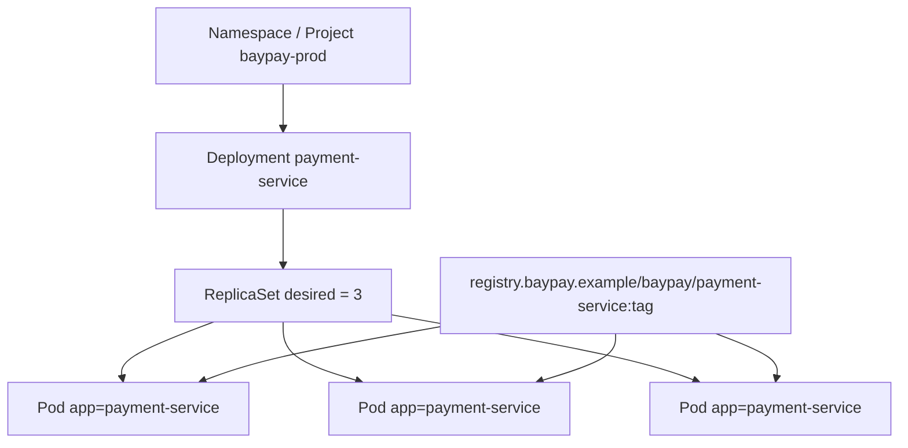

# L-10.1 — Pods, Deployments, and ReplicaSets

**Module:** 10 — Kubernetes and OpenShift  
**Duration:** 30 minutes  
**Diagram:** AEJE-D-042  
**Case study:** BayPay Financial Services (fictional)

---

## Why this matters

Avery Chen’s `POST /api/v1/payments` now lands on a **Pod**, not on `pay-prod-east-2` as a named VM. The image from Module 9 (`registry.baypay.example/baypay/payment-service:<tag>`) is scheduled in namespace `baypay-prod`. Riley Okonkwo’s first kube question is not “where is the jar.” It is “which controller is supposed to keep three copies of `payment-service` running, and which object died.” A Pod is the unit that runs. A ReplicaSet is the unit that *counts*. A Deployment is the unit Jordan Voss *releases*. Mix those three and you will bounce the wrong thing — or worse, ask Morgan Hale to recycle `dmgr-east` for a container page.

---

## Learning objectives

- Name Pod, ReplicaSet, and Deployment for `payment-service` and say who owns whom.
- Read labels `app=payment-service` as the selection contract, not decoration.
- Contrast a desired replica count of 3 with a single CrashLoopBackOff Pod without writing a lab RCA.
- Refuse to treat a Pod as a VM and refuse to schedule traditional WAS ND inside one.

---

## Concept explanation

A **Pod** is the smallest Kubernetes object that runs containers. For BayPay teaching, one Pod holds one `payment-service` container on port `8080`, running as non-root UID `10001`. The Pod has an IP that comes and goes. You do not give Avery Chen that IP. You give Avery a Service (L-10.2).

A **ReplicaSet** watches Pods that match a label selector and creates or deletes until the replica count matches. In `baypay-prod` the healthy count is **3**. If one Pod is deleted, the ReplicaSet starts another. If you create a fourth Pod with the same labels by hand, the ReplicaSet may delete one — the controller, not your SSH session, owns the count.

A **Deployment** owns ReplicaSets. You change the Deployment’s pod template (image tag, env, probes). The Deployment creates a *new* ReplicaSet and winds the old one down. That is a rollout (L-10.6). You almost never create a ReplicaSet by hand in this course. You write a Deployment named `payment-service`.

Ownership, short:

| Object | Name | Job |
|---|---|---|
| Namespace / Project | `baypay-prod` | Scope and quota |
| Deployment | `payment-service` | Desired template + rollout |
| ReplicaSet | generated name | Keep N matching Pods |
| Pod | generated name | Run the container |

**Labels** are the join key. Intended selector: `app=payment-service`. If a Pod loses that label, the Service stops seeing it and the ReplicaSet stops counting it. If you reuse the label on a debug Pod, production traffic can hit your laptop image.

**CrashLoopBackOff** is a *symptom class*: kube started the container, the process exited, kube waited longer each time, and tried again. Causes include a bad command, a missing Secret (L-10.3), a probe that kills a slow JVM (L-10.5), or an image that cannot run as the assigned UID. This lesson teaches you to *name the objects and read `kubectl describe`*. It does not close INCIDENT-1001.

The Module 8 canary is the same app scheduled as a Pod. `pay-prod-east-1` / `pay-prod-east-2` were host names. Here the blast radius is a Pod, then a ReplicaSet, then the Deployment. `BayPayCell` is a different estate. Do not put `Pay1` in a sidecar. Do not recommend ND-in-a-pod.

---

## Visual explanation



Alt text: AEJE-D-042. Namespace baypay-prod holds Deployment payment-service, which owns a ReplicaSet that keeps three Pods labeled app=payment-service running the BayPay image.

---

## Architecture

Sam Okada’s cluster (synthetic) schedules Pods onto nodes you will not SSH. The control plane stores desired state. The kubelet on a node starts the container runtime. You reason from objects, not from `systemctl`.

OpenShift **Project** `baypay-prod` is the same Namespace plus project metadata and, often, default SCC and quota. You still name the Deployment `payment-service`. You still want three replicas. `oc` and `kubectl` both show `deploy/payment-service`. The overlay does not invent a fourth controller.

Stabilization uses the Deployment: pause a bad rollout, scale *this* Deployment if you need capacity, delete *one* crash-looping Pod if you need a fresh start *after* you captured logs. Remediation is a template change (image, env, probe), not a cell recycle. Priya Nair will ask which ReplicaSet is current. Have that name before you talk about “the cluster is down.”

---

## Production example

Priya pages Riley at 10:40 Pacific: authorize p99 is fine on two Pods; one Pod in `baypay-prod` is `CrashLoopBackOff`; Service still has two Ready addresses. Riley’s first note is “Deployment `payment-service`; not the cell.” Riley lists Pods, reads the failing container’s last exit, and writes a hypothesis *before* the next evidence gate. Jordan Voss’s last image tag is a *candidate*, not a verdict.

That is the habit the labs score. Naming CrashLoopBackOff from the pager title is not diagnosis. Quoting Deployment, ReplicaSet, Pod, exit code, and whether replicas of 3 are still desired — then saying what you would describe next — is.

If all three Pods are Pending and unschedulable, you do not have a Java hang. You have a cluster placement story (quota, nodes, SCC). Write that contradiction. Do not dump a thread print into a Pending Pod.

---

## Code/configuration example

Illustrative desired state — not a lab answer, not a live apply requirement:

```yaml
apiVersion: apps/v1
kind: Deployment
metadata:
  name: payment-service
  namespace: baypay-prod
spec:
  replicas: 3
  selector:
    matchLabels:
      app: payment-service
  template:
    metadata:
      labels:
        app: payment-service
    spec:
      securityContext:
        runAsNonRoot: true
        runAsUser: 10001
      containers:
        - name: payment-service
          image: registry.baypay.example/baypay/payment-service:3.8.0
          ports:
            - containerPort: 8080
```

Paper commands you may *read* in a pack (optional `kind` if you choose):

```text
kubectl -n baypay-prod get deploy,rs,pods -l app=payment-service
kubectl -n baypay-prod describe pod <pod>
# OpenShift overlay: oc -n baypay-prod get deploy payment-service
```

Write three sentences from a describe: owner Deployment, current ReplicaSet, container last state. Do not promote that to “the Module 10 CrashLoop RCA.”

---

## Trade-offs

| Choice | Gain | Cost |
|---|---|---|
| Deployment (not bare Pods) | Rollout, rollback, replica count | Extra objects to read |
| Bare Pod for a one-off debug | Fast | No controller; easy to leak traffic if labels match |
| 3 replicas | Survive one node / one crash | Three heaps, three pools (L-4.3) |
| 1 replica “to save RAM” | Cheap laptop | Every restart is an outage |
| ND-in-a-pod | None in this course | Cell semantics inside a scheduler that already replaces processes |

---

## Failure modes

- Editing a live Pod spec and wondering why the ReplicaSet overwrote it.
- Deleting the Deployment to “restart the app” and losing the Service selector target history.
- Matching labels so loosely that a canary debug Pod receives merchant POST.
- Treating CrashLoopBackOff as a closed Java RCA with no exit code or log.
- Bouncing `dmgr-east` or recycling `Pay2` because the pager said payment-service.
- Scheduling `payment.ear` plus a node agent in one Pod and calling it modernization.

---

## Security/reliability implications

A Pod spec is desired state: image digest, UID, mounts. Anyone who can patch the Deployment in `baypay-prod` can run a different binary as `payment-service`. Treat apply rights as release rights (L-10.4).

Reliability: three replicas are capacity, not correctness. Idempotency still matters when kube replaces a Pod mid-authorize (Module 2). Communication must say how many Pods are Ready, which ReplicaSet is current, and what you have not proven about Avery Chen’s payment.

---

## Interview perspective

**Engineer.** I read `deploy/payment-service` in `baypay-prod`, then the ReplicaSet, then the Pod. Labels `app=payment-service` are the selector. CrashLoopBackOff means the container exited and kube is retrying.

**Senior.** I do not SSH nodes first. I do not bounce the WAS cell. I quote owner references and the desired replica count of 3 before I talk about Java.

**Staff.** I use the Deployment as the release unit and the Pod as the evidence unit. I refuse a root-cause sentence until describe, logs, and events agree. I will not max a diagnostic score on the word CrashLoopBackOff.

**Principal.** Controllers are the operating model. I fund desired-state reviews and I score on-call on naming Deployment versus Pod — and I forbid ND-in-a-pod as a migration strategy.

---

## Key takeaways

- Deployment owns ReplicaSets; ReplicaSets keep Pods; Pods run `payment-service`.
- Healthy `baypay-prod` wants **3** replicas labeled `app=payment-service`.
- CrashLoopBackOff is a retry loop, not an RCA.
- Do not treat a Pod as a VM and do not put `BayPayCell` in one.
- A lucky controller label does not max Diagnostic method.

---

## Knowledge check

1. Avery Chen’s create fails and `kubectl -n baypay-prod get deploy payment-service` shows `3/3`. Which object do you inspect next, and which process do you refuse to bounce?
2. You delete one Pod by name. What creates its replacement, the Deployment or the ReplicaSet?
3. Why is “run `Pay1` and a node agent in one Pod” the wrong modernization move?

<details>
<summary>Spoiler — answers</summary>

1. Inspect Pods / ReplicaSet / events for `payment-service`. Do not bounce `dmgr-east` or a WAS `Pay*` member for this page.
2. The ReplicaSet creates the replacement to restore the desired count. The Deployment owns that ReplicaSet.
3. Kubernetes already replaces processes. ND-in-a-pod copies cell control-plane semantics you are leaving (Modules 5–6) into a scheduler that does not need them.

</details>

---

## Related lab

[INCIDENT-1001](../../../../labs/INCIDENT-1001/README.md) — CrashLoopBackOff *symptoms* on `payment-service` in `baypay-prod`. Use this lesson’s object names. Work the pack gates. Do not open `solutions/INCIDENT-1001/` until the worksheet is filled. This lesson does not name that pack’s cause.

---

## Related PAKS

Optional: `docs/17-kubernetes-and-platform-engineering/kubernetes-architecture.md` (workload controllers). The Deployment / ReplicaSet / Pod picture stands alone without a PAKS login.
