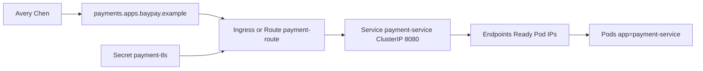

# L-10.2 — Services, Ingress, and OpenShift Routes

**Module:** 10 — Kubernetes and OpenShift  
**Duration:** 30 minutes  
**Diagram:** AEJE-D-043  
**Case study:** BayPay Financial Services (fictional)

---

## Why this matters

Avery Chen never types a Pod IP. Harbor Bike Co calls host `payments.apps.baypay.example`. Something in front of `baypay-prod` must terminate TLS, pick Service `payment-service`, and land on a **Ready** Pod on port `8080`. On Kubernetes that front door is an **Ingress**. On OpenShift it is a **Route** named `payment-route`. Those are different **API kinds** and product names. They do the **same job**: layer-7 front door. If Riley Okonkwo treats Route as “Ingress, but the OpenShift spelling of the word Ingress,” Sam Okada will spend the bridge renaming objects while Avery’s POST still 503s.

---

## Learning objectives

- Explain ClusterIP Service `payment-service` as a stable virtual IP plus Endpoints, not as a load balancer you SSH.
- Trace host `payments.apps.baypay.example` through Ingress *or* Route `payment-route` to Ready Pods.
- Say out loud: Route ≠ Ingress product name; same L7 front-door job.
- Treat empty Endpoints and a TLS mismatch as *symptom classes* (INCIDENT-1006 / 1005), not as closed RCAs.

---

## Concept explanation

A **Service** of type ClusterIP named `payment-service` in `baypay-prod` owns a cluster-internal IP and port `8080`. Kube-proxy (or an equivalent data path) forwards to **Endpoints** / EndpointSlices: Pod IPs that match selector `app=payment-service` *and* pass readiness (L-10.5). If the selector is wrong, Endpoints are empty and the Service is a black hole. If Pods exist but are not Ready, Endpoints are also empty. “Service is up” is not “Avery can pay.”

**Ingress** is the Kubernetes L7 object. It binds host `payments.apps.baypay.example` (and usually path `/`) to Service `payment-service:8080`. An Ingress *controller* you will not install for a grade implements it. TLS Secret `payment-tls` is what the controller presents to merchants.

An OpenShift **Route** named `payment-route` is the OpenShift L7 object for the **same host**. It targets the same Service. It is **not** “Ingress renamed.” Ingress remains a Kubernetes kind some OpenShift clusters also enable. Route is the native OpenShift front door. Interview sentence: *same job, different API.* Do not write “OpenShift Ingress called Route” on a staff whiteboard.

**NodePort / LoadBalancer** exist. This course’s locked estate is ClusterIP plus Ingress or Route. Do not invent an AWS NLB here (Module 11). Do not put IBM HTTP Server `ihs-east` in the Pod. The cell’s plugin is the estate you leave.

DNS: `payments.apps.baypay.example` is synthetic. On paper you write the host on the Ingress/Route. On optional `kind` you may use `/etc/hosts`. You do not need a public zone.

---

## Visual explanation



Alt text: AEJE-D-043. Merchant TLS hits host payments.apps.baypay.example on Ingress or OpenShift Route payment-route, then ClusterIP Service payment-service:8080, then Endpoints of ready Pods.

---

## Architecture

Traffic path for money: client → L7 front door → Service → Ready Pod → `PaymentApplicationService`. Control path for Sam Okada: API server → Ingress/Route object → controller reconcile. Those paths are as separate as `ihs-east` versus `dmgr-east` were in Module 5. A down Ingress controller can drop merchants while `deploy/payment-service` still shows `3/3`. A down Deployment can empty Endpoints while the Route still looks `Admitted`.

OpenShift: Project `baypay-prod` plus Route `payment-route`. Edge TLS can be terminate, passthrough, or re-encrypt — teaching default is terminate at the Route using `payment-tls`, then HTTP to ClusterIP `8080`. Do not require a live router pod to pass this lesson.

Stabilization: remove a bad Pod from Endpoints by failing readiness, or point the Route/Ingress at the last good Service if you mistakenly created a second one. Remediation: fix selector, TLS secret, or host. Do not bounce `dmgr-east`. Do not add sticky sessions on `/api/v1/payments` (L-5.5).

---

## Production example

Priya: merchants see 503 on `payments.apps.baypay.example`; Riley sees three Running Pods. First note: “front door or Endpoints, not JVM yet.” Riley gets the Service, counts Endpoints, then reads Ingress *or* Route `payment-route` — whichever the estate actually uses. If Endpoints are empty, the L7 object is doing its job by refusing to guess a Pod. If Endpoints are full and TLS handshake fails, INCIDENT-1005’s *class* is in play: certificate, host, or Secret `payment-tls`. Neither sentence is an RCA until the pack’s evidence says so.

Jordan Voss shipping a second Service named `payment-service-canary` without changing the Route target is a common paper mistake. The host still points at the old selector. Write the target explicitly.

---

## Code/configuration example

Service (illustrative):

```yaml
apiVersion: v1
kind: Service
metadata:
  name: payment-service
  namespace: baypay-prod
spec:
  type: ClusterIP
  selector:
    app: payment-service
  ports:
    - name: http
      port: 8080
      targetPort: 8080
```

Ingress (Kubernetes front door) and Route (OpenShift front door) — pick one estate; do not require both live:

```yaml
apiVersion: networking.k8s.io/v1
kind: Ingress
metadata:
  name: payment-ingress
  namespace: baypay-prod
spec:
  tls:
    - hosts: [payments.apps.baypay.example]
      secretName: payment-tls
  rules:
    - host: payments.apps.baypay.example
      http:
        paths:
          - path: /
            pathType: Prefix
            backend:
              service:
                name: payment-service
                port:
                  number: 8080
---
apiVersion: route.openshift.io/v1
kind: Route
metadata:
  name: payment-route
  namespace: baypay-prod
spec:
  host: payments.apps.baypay.example
  to:
    kind: Service
    name: payment-service
  port:
    targetPort: http
  tls:
    termination: edge
    # certificate material referenced as payment-tls in the teaching estate
```

Paper reads:

```text
kubectl -n baypay-prod get svc,endpoints,ingress
oc -n baypay-prod get route payment-route
```

---

## Trade-offs

| Choice | Gain | Cost |
|---|---|---|
| ClusterIP + Ingress | Portable kube story | Needs an Ingress controller |
| ClusterIP + Route | Native OpenShift L7 | Different API than Ingress |
| Both objects, same host | Confusing interviews | Two controllers can fight |
| LoadBalancer Service here | Familiar cloud shape | Not this estate; costs money later |
| Sticky sessions on payments | Hides sessionful bugs | Wrong for a sessionless API |

---

## Failure modes

- Calling Route “the OpenShift Ingress resource” and failing a staff whiteboard.
- Service selector `app=payment` while Pods are `app=payment-service` → empty Endpoints.
- TLS Secret `payment-tls` for the wrong host or an expired leaf (symptom class, not this lesson’s RCA).
- Hitting a Pod IP from a laptop and declaring the Service healthy.
- Putting `ihs-east` or `plugin-cfg.xml` in the container and skipping the Route.
- Bouncing `dmgr-east` because the host name contains `payment`.

---

## Security/reliability implications

`payment-tls` is a private key. It is a Secret, not a ConfigMap (L-10.3). Anyone who can get the Secret can impersonate `payments.apps.baypay.example`. Limit get/list (L-10.4).

Reliability: the front door must target *readiness*, not merely Running. A live container that cannot open Hikari should not receive Avery’s POST. Communication names the host, the Service, the Endpoint count, and whether TLS failed *before* HTTP.

---

## Interview perspective

**Engineer.** Service `payment-service` is ClusterIP 8080. Ingress or Route `payment-route` is the host `payments.apps.baypay.example`. I check Endpoints before I dump the JVM.

**Senior.** Route and Ingress are different kinds with the same L7 job. I will not say “OpenShift Ingress.” I will not add payment stickiness.

**Staff.** I split front-door failure from empty Endpoints from a Java hang. I refuse to debug `BayPayCell` for a kube 503. I will not close routing as RCA on a title.

**Principal.** I fund one front-door API per estate and a standard host. I score on-call on Endpoint counts. I do not buy a second cell plugin for containers.

---

## Key takeaways

- ClusterIP + selector + Ready Endpoints is how kube load-balances `payment-service`.
- Host `payments.apps.baypay.example` is Ingress **or** Route `payment-route`.
- Route ≠ Ingress product name; same L7 front-door job.
- Empty Endpoints and TLS errors are symptom classes, not finished RCAs.
- Do not bounce `dmgr-east` for a Route page.

---

## Knowledge check

1. Three Pods are Running in `baypay-prod` but Service `payment-service` has zero Endpoints. Is the Route broken, or is something else more likely?
2. What job do Ingress and Route `payment-route` share, and why must you not call Route “Ingress”?
3. Where does Secret `payment-tls` sit on AEJE-D-043 — on the Pod or on the front door?

<details>
<summary>Spoiler — answers</summary>

1. More likely selector or readiness: the Service has no backends. The Route may be fine and still 503.
2. Both are the L7 front door (host, TLS, pick a Service). They are different API kinds / product names, not aliases.
3. On the Ingress or Route (edge), not inside the `payment-service` container.

</details>

---

## Related lab

[INCIDENT-1005](../../../../labs/INCIDENT-1005/README.md) — TLS/certificate *symptoms* on the BayPay front door. Also see [INCIDENT-1006](../../../../labs/INCIDENT-1006/README.md) for Service routing symptoms. Work gates; do not open `solutions/` until the worksheet names host, Service, Endpoints, and TLS evidence. This lesson does not name either pack’s cause.

---

## Related PAKS

Optional: `docs/17-kubernetes-and-platform-engineering/kubernetes-architecture.md` (Service and ingress models). The Route-versus-Ingress sentence stands alone without a PAKS login.
