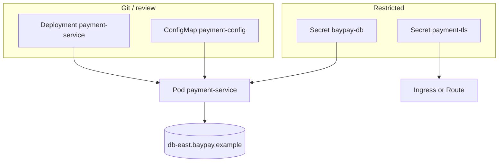

# L-10.3 — ConfigMaps and Secrets

**Module:** 10 — Kubernetes and OpenShift  
**Duration:** 30 minutes  
**Case study:** BayPay Financial Services (fictional)

---

## Why this matters

Module 6 taught `BAYPAY_DB_*` as environment, not XML literals. Module 9 forbade baking those values into `registry.baypay.example/baypay/payment-service:<tag>`. On Kubernetes the same contract becomes two objects in `baypay-prod`: ConfigMap **`payment-config`** for non-secret shape, Secret **`baypay-db`** for `BAYPAY_DB_USER` and `BAYPAY_DB_PASSWORD`. If Jordan Voss commits the password in a Deployment env block, or if Riley Okonkwo puts it in `payment-config` “because it is easier to edit,” Avery Chen’s ledger credentials live in git and in every `kubectl get cm -o yaml`. That is not a platform feature. That is a leak.

---

## Learning objectives

- Split non-secret settings into ConfigMap `payment-config` and credentials into Secret `baypay-db`.
- Inject `BAYPAY_DB_USER` and `BAYPAY_DB_PASSWORD` as env (or a mounted file), never as image `ENV`.
- Explain why a missing or wrong Secret is a *startup / CrashLoop / login* symptom class, not a finished INCIDENT-1004 RCA.
- Refuse to store the merchant TLS private key anywhere but Secret `payment-tls`.

---

## Concept explanation

A **ConfigMap** holds UTF-8 keys or files you are willing to treat as non-secret: JDBC URL *shape*, feature flags, logging levels, `BAYPAY_DB_HOST`, `BAYPAY_DB_PORT`, `BAYPAY_DB_NAME`. Object name in this estate: `payment-config`. Changing a ConfigMap does **not** always restart Pods. If you inject as env, running processes keep old values until the Pod is recreated. If you mount as a file, kube updates the file; the JVM still must re-read it (Boot typically reads datasource env at start).

A **Secret** holds credentials and key material. Object `baypay-db` has keys `BAYPAY_DB_USER` and `BAYPAY_DB_PASSWORD`. Object `payment-tls` holds the front-door certificate pair (L-10.2). Secrets are base64 in etcd, not encryption-at-rest unless the cluster is configured for it. `kubectl get secret baypay-db -o yaml` is still a copy of the password. Treat get/list as sensitive (L-10.4).

Injection patterns:

| Pattern | Use on BayPay | Watch-out |
|---|---|---|
| `env` / `valueFrom` | Preferred for `BAYPAY_DB_*` | Restart to pick up changes |
| `envFrom` whole Secret | Fast | Every key becomes env; easy to over-expose |
| Volume mount | Files, TLS material for some consumers | App must read the path |
| Image `ENV` / Dockerfile | **Forbidden** | Every tag leaks; cannot rotate |

The Boot prod profile already reads `${BAYPAY_DB_URL}`, `${BAYPAY_DB_USER}`, `${BAYPAY_DB_PASSWORD}`. Kubernetes does not replace that contract. It *supplies* it. Liberty `server.env` was the same idea on a VM (L-6.4). WAS `baypayDbAlias` was a cell-owned secret — do not recreate the alias as a checked-in YAML password.

**Immutable** ConfigMaps/Secrets (when the API allows) prevent silent edits. Teaching habit: change the object, then roll the Deployment so all three replicas agree.

A **bad Secret** — missing object, wrong key name (`password` instead of `BAYPAY_DB_PASSWORD`), wrong value, or a Secret in namespace `default` while the Pod is in `baypay-prod` — shows up as a Pod that will not start, a container that exits, or a JVM that fails Hikari. That is INCIDENT-1004’s *class*. This lesson does not name that pack’s cause.

---

## Visual explanation



Alt text: Deployment and ConfigMap payment-config are reviewable; Secret baypay-db injects BAYPAY_DB credentials into the Pod; payment-tls stays on the front door.

---

## Architecture

Build vs release vs run: the image is the build (Module 9). ConfigMap + Secret + Deployment template are the release. The Pod is the run. Sam Okada’s platform may inject `baypay-db` from an external store; you still *name* the Kubernetes Secret the same way. Do not invent a second env vocabulary (`PAY_DB_PASS` vs `BAYPAY_DB_PASSWORD`) unless a later module says so.

OpenShift: Secrets and ConfigMaps are the same kinds. An SCC may block mounting certain volume types; it does not excuse putting the password in `payment-config`. Project `baypay-prod` is the scope — a Secret in another project is invisible.

Stabilization: freeze the rollout, restore the last known good Secret from the platform’s source of truth (not from Slack), recreate Pods. Remediation: rotate the database role, patch the Secret, roll `payment-service`. Do not bounce `dmgr-east`. Do not paste the password into the incident channel.

---

## Production example

Priya: all three Pods in `baypay-prod` restarted after Jordan’s apply; Hikari logs “password authentication failed” or the container never reaches listening on `8080`. Riley writes “Secret `baypay-db` or key names; image contract still `BAYPAY_DB_*`.” Next evidence is the Deployment’s `env` / `envFrom` versus `kubectl describe secret` *key list* (not values in the ticket). If `payment-config` grew a `BAYPAY_DB_PASSWORD` key, that is a policy failure even when the value happens to work.

A different night: ConfigMap-only change to a log level, Pods not recreated, Riley confused that “the ConfigMap updated.” Env injection is start-of-process. Write that.

---

## Code/configuration example

Illustrative objects — values are synthetic placeholders, not production:

```yaml
apiVersion: v1
kind: ConfigMap
metadata:
  name: payment-config
  namespace: baypay-prod
data:
  BAYPAY_DB_HOST: db-east.baypay.example
  BAYPAY_DB_PORT: "5432"
  BAYPAY_DB_NAME: baypay
---
apiVersion: v1
kind: Secret
metadata:
  name: baypay-db
  namespace: baypay-prod
type: Opaque
stringData:
  BAYPAY_DB_USER: baypay
  BAYPAY_DB_PASSWORD: "set-by-platform-not-git"
```

Wire them on the container (excerpt):

```yaml
envFrom:
  - configMapRef:
      name: payment-config
  - secretRef:
      name: baypay-db
```

What you must not commit:

```yaml
# unsafe — password in a ConfigMap and in git
data:
  BAYPAY_DB_PASSWORD: s3cret
```

Paper checks:

```text
kubectl -n baypay-prod get cm payment-config,secret baypay-db
kubectl -n baypay-prod describe deploy payment-service
# confirm env keys, not values, in the ticket
```

---

## Trade-offs

| Choice | Gain | Cost |
|---|---|---|
| Secret + env | Matches Boot `${BAYPAY_DB_*}` | Restart to rotate |
| Mounted file | Rotation without new env | App must watch or restart anyway |
| Sealed / external store | Git holds ciphertext | Extra controller; still a Secret at run |
| Password in ConfigMap | None | World-readable habit, wrong object |
| Password in image | None | Rotate means rebuild; leaks in layers |

---

## Failure modes

- Key `PASSWORD` in the Secret while Boot reads `BAYPAY_DB_PASSWORD`.
- Secret created in `default`; Deployment in `baypay-prod`.
- `kubectl apply` of a Secret from a gist “just this once.”
- Assuming a ConfigMap edit restarts all three replicas.
- Putting `payment-tls` private key in `payment-config`.
- Copying `baypayDbAlias` into YAML and calling it modernization.

---

## Security/reliability implications

RBAC: `get`/`list`/`watch` on Secrets in `baypay-prod` is credential access. Developers who only need to *use* the Secret via a ServiceAccount do not need to *read* it (L-10.4). Enable encryption at rest on a real cluster; this course still treats etcd as a place you do not dump to Slack.

Reliability: rotating `BAYPAY_DB_PASSWORD` without rolling Pods splits the replica set — one Pod old password, two new — and Hikari failures look like “flaky kube.” Roll all three. Communication says which object you changed and that values were *not* pasted.

---

## Interview perspective

**Engineer.** ConfigMap `payment-config` is non-secret. Secret `baypay-db` holds `BAYPAY_DB_USER` and `BAYPAY_DB_PASSWORD`. The image does not contain them.

**Senior.** I inject env, then roll the Deployment to pick up rotation. I never put passwords in ConfigMaps or Dockerfiles.

**Staff.** I treat a bad Secret as a release defect. I quote key names and namespaces, not values. I will not close INCIDENT-1004 on the title “Bad Secret.”

**Principal.** Config versus secret is a standard. I fund a store that materializes `baypay-db` and I score reviews that keep `BAYPAY_DB_*` out of git.

---

## Key takeaways

- `payment-config` is shape; `baypay-db` is credentials; `payment-tls` is the front-door key.
- Supply `BAYPAY_DB_*` at run. Never bake them into the image.
- Env injection needs a Pod recreate to change.
- A missing key is a symptom class, not an RCA.
- Do not bounce `dmgr-east` to fix a Secret.

---

## Knowledge check

1. Which object in `baypay-prod` should hold `BAYPAY_DB_PASSWORD`, and which object must not?
2. Jordan updates `payment-config` and Avery’s Pods keep old `BAYPAY_DB_HOST`. Why might that happen?
3. Why is base64 in `kubectl get secret -o yaml` not a security control?

<details>
<summary>Spoiler — answers</summary>

1. Secret `baypay-db`. Not ConfigMap `payment-config`, not the image, not git.
2. Env is copied at container start. Until the Deployment rolls, running Pods keep the old values.
3. Base64 is encoding. Anyone with get on the Secret can decode the password.

</details>

---

## Related lab

[INCIDENT-1004](../../../../labs/INCIDENT-1004/README.md) — Bad Secret *symptoms* on `payment-service`. Use the key names from this lesson. Do not open `solutions/INCIDENT-1004/` until the worksheet quotes object, namespace, and key *names* (never a real password). This lesson does not name that pack’s cause.

---

## Related PAKS

Optional: `docs/17-kubernetes-and-platform-engineering/kubernetes-architecture.md` (desired-state objects). The ConfigMap versus Secret split stands alone without a PAKS login.
