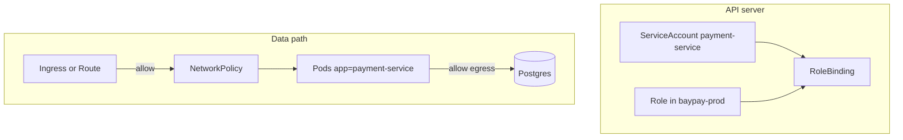

# L-10.4 — RBAC and networking

**Module:** 10 — Kubernetes and OpenShift  
**Duration:** 30 minutes  
**Case study:** BayPay Financial Services (fictional)

---

## Why this matters

`payment-service` in `baypay-prod` should accept Avery Chen’s POST on port `8080` and talk to Postgres. It should **not** list every Secret in the cluster, patch the Ingress, or receive traffic from a random namespace that Sam Okada never approved. Kubernetes will happily do all of those things if you leave the defaults wide open. This lesson is **literacy**: ServiceAccount, Role, RoleBinding, and NetworkPolicy. It is not a license to invent a real employer service mesh, a fictional Istio trust domain, or a named sidecar product “that BayPay runs in prod.” BayPay is fictional. Your whiteboard is not a vendor architecture review.

---

## Learning objectives

- Bind Deployment `payment-service` to a dedicated ServiceAccount in `baypay-prod`.
- Contrast Role (namespace) with ClusterRole (cluster) and say why payment pods do not need `cluster-admin`.
- Read a default-deny NetworkPolicy plus explicit allows as blast-radius control, not as a mesh.
- Treat OpenShift SCC and Project isolation as overlays you can *explain on paper* without installing them.

---

## Concept explanation

Every Pod runs as a **ServiceAccount**. The default account in a namespace is often more powerful than a payments JVM needs. Teaching habit: ServiceAccount `payment-service` in `baypay-prod`, referenced from the Deployment. Tokens mounted into the container are credentials for the **API server**, not for Avery. If the app never calls the API, it still should not inherit `default` forever — a compromised container inherits that identity.

**RBAC** answers “who may speak to the API.” A **Role** lists verbs and resources *inside one namespace*. A **RoleBinding** attaches that Role to a user, group, or ServiceAccount. A **ClusterRole** / **ClusterRoleBinding** spans the cluster. Riley Okonkwo on-call may have `get`/`list`/`watch` on Pods, logs, and events in `baypay-prod`. Jordan Voss may have `patch` on the Deployment. The *container* ServiceAccount should have **near-zero** API rights unless you have a concrete client (you do not, in this course).

| Identity | Typical teaching grant | Refuse |
|---|---|---|
| SA `payment-service` | none, or get own ConfigMap | `get secrets`, `*` |
| Riley (app on-call) | get/list pods, logs, events | delete namespace |
| Jordan (release) | deploy/patch in `baypay-prod` | cluster-admin |
| Sam (platform) | NetworkPolicy, quota, Route | app-level SQL |

**NetworkPolicy** answers “which packets may reach which Pods.” It is **not** a service mesh. There is no required sidecar, no mTLS product name, and no BayPay-specific mesh control plane in this course. Literacy is enough: default deny ingress to Pods labeled `app=payment-service`; allow from the namespace’s Ingress/Route data path (often a controller namespace you will *not* invent as a real employer); allow egress to the database endpoint the pack names. Empty Endpoints (L-10.2) can be a selector bug. They can also be a policy that dropped the probe or the merchant path. INCIDENT-1006 is a *routing symptom class*. Policy is one hypothesis, not a verdict.

**OpenShift overlays** (paper):

- **Project** ≈ Namespace plus quota, admin, and often isolation defaults.
- **SCC** (Security Context Constraints) ≈ what a Pod may do: run as root, bind host ports, use hostPath. BayPay’s image already uses UID `10001` and `runAsNonRoot`. A `restricted` / `restricted-v2` SCC is why “just run as root to fix the volume” is the wrong patch.
- `oc policy` / SCC review is optional literacy. You do not install OpenShift to pass.

Do not recommend NetworkPolicy *and* a mesh *and* a WAS plugin in the same drawing. Pick kube primitives.

---

## Visual explanation



Alt text: RBAC binds ServiceAccount payment-service to a Role in baypay-prod. Separately, NetworkPolicy allows the front door and database paths and denies everything else. No mesh is required.

---

## Architecture

Two planes stay distinct. RBAC is the **control plane** (who may change objects). NetworkPolicy is the **data plane** (who may send packets). A RoleBinding never opens port `8080`. A NetworkPolicy never grants `kubectl exec`. Mixing them on a slide is how interviews go wrong.

Blast radius: a stolen SA token is an API incident. A missing NetworkPolicy is an east-west incident. A stolen `baypay-db` Secret is a data incident (L-10.3). Write the plane you are on.

`BayPayCell` LTPA and cell admin are not RBAC. Do not map `cluster-admin` to “Morgan Hale’s console” and then bounce `dmgr-east`. Do not run a node agent next to `payment-service` to “keep cell security.”

Stabilization: isolate (tighten policy or remove a bad binding) *after* you have evidence you are not about to drop all merchant traffic. Remediation: least privilege Role, dedicated SA, reviewed NetworkPolicy YAML in git. No live mesh required.

---

## Production example

Priya: `payments.apps.baypay.example` 503s; Pods are Ready; Endpoints look full from one client and empty from another. Riley writes two hypotheses: Service selector (L-10.2) and NetworkPolicy dropping the ingress controller or probes. Riley does **not** add “Istio authorization policy” to the ticket. Sam Okada’s next artifact is the NetworkPolicy list in `baypay-prod` and the source labels, not a vendor dashboard you invented.

A different page: a contractor’s kubeconfig can `get secret baypay-db`. That is RBAC, not routing. Remove the RoleBinding. Rotate the Secret (L-10.3). Still no mesh.

---

## Code/configuration example

Illustrative, namespace-scoped, no cluster-admin:

```yaml
apiVersion: v1
kind: ServiceAccount
metadata:
  name: payment-service
  namespace: baypay-prod
---
apiVersion: rbac.authorization.k8s.io/v1
kind: Role
metadata:
  name: payment-service-read
  namespace: baypay-prod
rules:
  - apiGroups: [""]
    resources: ["configmaps"]
    resourceNames: ["payment-config"]
    verbs: ["get"]
---
apiVersion: rbac.authorization.k8s.io/v1
kind: RoleBinding
metadata:
  name: payment-service-read
  namespace: baypay-prod
subjects:
  - kind: ServiceAccount
    name: payment-service
    namespace: baypay-prod
roleRef:
  kind: Role
  name: payment-service-read
  apiGroup: rbac.authorization.k8s.io
```

NetworkPolicy literacy (shape, not a real employer CIDR):

```yaml
apiVersion: networking.k8s.io/v1
kind: NetworkPolicy
metadata:
  name: payment-service
  namespace: baypay-prod
spec:
  podSelector:
    matchLabels:
      app: payment-service
  policyTypes: [Ingress, Egress]
  ingress:
    - from:
        - namespaceSelector:
            matchLabels:
              purpose: ingress-controller
      ports:
        - port: 8080
  egress:
    - ports:
        - port: 5432
        - port: 53
          protocol: UDP
```

Do not copy that `purpose` label into a resume as “BayPay production mesh.”

---

## Trade-offs

| Choice | Gain | Cost |
|---|---|---|
| Dedicated SA, empty rules | Stolen container ≠ API admin | Must add grants when you add a client |
| Role in `baypay-prod` | Blast radius is one Project | Cross-namespace jobs need more paper |
| ClusterRole for on-call | Convenient | One binding reads every Secret |
| Default-deny NetworkPolicy | Explicit allows | Breaks DNS/probes if you omit them |
| Invented service mesh | Interview flavor | Out of scope; not this estate |

---

## Failure modes

- Pod uses `default` ServiceAccount with a leftover RoleBinding that can get Secrets.
- Granting `cluster-admin` so a demo apply “just works.”
- NetworkPolicy that allows the world on `8080` and calling it zero-trust.
- Forgetting kube-dns egress and diagnosing “the app cannot resolve Postgres” as a Java bug.
- Drawing Istio, Linkerd, or a named employer mesh as if CLUSTER.md specified it.
- Mapping SCC failure to “bounce `dmgr-east`.”

---

## Security/reliability implications

Least privilege is reliability: a compromised payment container should not patch the Route to a malicious Service. NetworkPolicy is reliability: a noisy neighbor namespace should not scrape `/actuator` (L-3.5) unless you allowed it.

OpenShift SCC that blocks root is a *feature* when the image already runs as `10001`. Fighting SCC by setting `privileged: true` is a security incident, not a platform fix.

Communication: name the RoleBinding or the NetworkPolicy object. Do not say “the mesh rejected it” unless a pack actually introduced a mesh — this course does not.

---

## Interview perspective

**Engineer.** The Deployment uses ServiceAccount `payment-service`. A Role in `baypay-prod` lists verbs. NetworkPolicy selects `app=payment-service`.

**Senior.** I separate API RBAC from packet policy. I do not give the app `get secrets`. I do not invent a mesh for BayPay.

**Staff.** I treat empty Endpoints plus a deny policy as one routing hypothesis among several. I will not close INCIDENT-1006 on a title or a vendor name.

**Principal.** I fund namespace-scoped Roles, default-deny with reviewed allows, and SCC/restricted UIDs. I score designs that stay mesh-optional.

---

## Key takeaways

- ServiceAccount + Role + RoleBinding is API access, scoped to `baypay-prod` when you can.
- NetworkPolicy is packet literacy, not a service mesh.
- OpenShift Project and SCC overlay the same ideas; live OCP is not required.
- Do not invent a real employer mesh on this estate.
- Do not bounce `dmgr-east` for an RBAC or policy page.

---

## Knowledge check

1. Should the `payment-service` container’s ServiceAccount be able to `get` Secret `baypay-db`? Why or why not?
2. A NetworkPolicy default-deny omits DNS egress. What symptom class might Riley see, and is that a mesh failure?
3. What OpenShift object constrains running as root, and must you install a cluster to explain it?

<details>
<summary>Spoiler — answers</summary>

1. No. The JVM receives the password as env from kubelet injection. The SA token is for the API. `get secrets` would let a stolen container read other credentials.
2. DNS or database connect failures; empty or failing readiness. That is NetworkPolicy, not a mesh.
3. SCC (Security Context Constraints). Paper literacy is enough; live OpenShift is not required.

</details>

---

## Related lab

[INCIDENT-1006](../../../../labs/INCIDENT-1006/README.md) — Service routing *symptoms*. Selector, Endpoints, front door, and NetworkPolicy are all legal hypotheses. Do not invent a mesh. Do not open `solutions/INCIDENT-1006/` until the worksheet quotes objects from the pack. This lesson does not name that pack’s cause.

---

## Related PAKS

Optional: `docs/17-kubernetes-and-platform-engineering/kubernetes-architecture.md` (isolation and identity). Optional: `docs/17-kubernetes-and-platform-engineering/platform-engineering-and-gitops.md` (who may apply). Literacy stands alone without a PAKS login.
