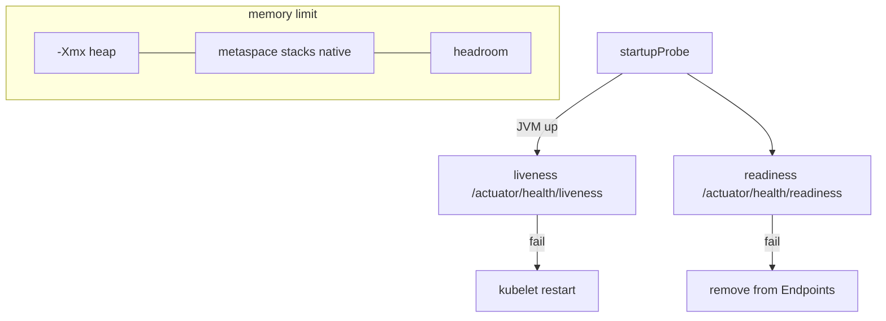

# L-10.5 — Probes and resources

**Module:** 10 — Kubernetes and OpenShift  
**Duration:** 30 minutes  
**Case study:** BayPay Financial Services (fictional)

---

## Why this matters

Kubernetes will kill a container that fails **liveness** and will hide a container that fails **readiness**. Spring Boot already exposes those questions as `/actuator/health/liveness` and `/actuator/health/readiness` (L-3.5). If Riley Okonkwo points liveness at Postgres, a brief `db-east.baypay.example` blip becomes a restart storm: three replicas in `baypay-prod` CrashLoop while Avery Chen’s in-flight authorize dies. If Priya Nair sets the memory **limit** equal to `-Xmx`, the kernel OOMKills the process while the heap still looks fine (L-7.6, L-8.7). Probes and cgroup numbers are the same contract as Module 9’s image, now enforced by the kubelet.

---

## Learning objectives

- Map liveness, readiness, and startup probes to Actuator paths and to kube actions.
- Keep liveness cheap and lock-free; let readiness reflect “safe to receive POST.”
- Size `resources.limits.memory` with headroom; never set `-Xmx` equal to that limit.
- Treat OOMKilled and a readiness 503 as *symptom classes* (INCIDENT-1002 / 1003), not as closed RCAs.

---

## Concept explanation

Three probes, three jobs:

| Probe | Question | BayPay path | Kube action if it fails |
|---|---|---|---|
| **Startup** | Has the JVM finished coming up? | Optional; same as liveness or a dedicated gate | Disables the other probes until it succeeds or hits `failureThreshold` |
| **Liveness** | Is the process so sick that a *restart* helps? | `/actuator/health/liveness` | kubelet restarts the container |
| **Readiness** | May the Service send Avery here? | `/actuator/health/readiness` | Pod removed from Endpoints |

Liveness should fail for deadlocks, stuck event loops, or a process that will never recover without a new JVM. It should **not** fail because Hikari cannot check out a connection for two seconds. That is readiness (or a 503 from the app). Restarting a healthy JVM during a database blip *removes* capacity when you need it.

Readiness may include a cheap dependency check *if* it is bounded and does not take payment locks. Teaching default from Module 3: readiness can see the database; liveness is process state. Do not use `/actuator/health` (the aggregate) for liveness — it often includes components you do not want to restart on.

**Startup** exists because Java 21 + Spring Boot 3.5.5 + Hibernate can exceed a short liveness `timeoutSeconds` on a cold Pod. Without startup, kube kills the container during first class-load. With startup, you give `initialDelay`/`failureThreshold` room *once*, then the stricter liveness applies.

**Resources:** `requests` are what the scheduler uses to place the Pod. `limits` (especially memory) are the cgroup. CPU limit throttles. Memory limit **kills** (OOMKilled, exit 137). Java 21 `UseContainerSupport` sees that limit. `-Xmx` or `MaxRAMPercentage` must leave metaspace, stacks, and native headroom. **Do not set `-Xmx` equal to the container memory limit.** CLUSTER.md repeats this. A 1Gi limit with `-Xmx1g` is the forbidden pattern from L-8.7.

OOMKilled is a *kernel* event. `OutOfMemoryError: Java heap space` is a *Java* event. Same word “OOM,” different artifacts. INCIDENT-1002 will page one of those stories. This lesson does not say which.

---

## Visual explanation



Alt text: Startup gates the JVM; liveness restarts a doomed process; readiness removes the Pod from the Service. The memory limit wraps heap plus native plus headroom — heap must not fill the box.

---

## Architecture

The kubelet on the node runs HTTP probes against the container IP, port `8080` (or a management port if you split later — BayPay teaching starts on one port). The Service (L-10.2) uses **readiness** only. A live-but-unready Pod still counts toward the Deployment replica number; it does not receive ClusterIP traffic.

OpenShift uses the same probe fields. An SCC does not replace a readiness check. A Route that points at a Service with zero Ready backends returns 503 even if `oc get pods` shows Running.

Stabilization: fail readiness (or drop the Pod from the Service) to drain; do not flip liveness to “hit the database” as a panic change. If OOMKilled loops, freeze the rollout and capture last `describe` *before* you raise `-Xmx` into the limit. Remediation: correct probe path, or pair limit + heap with headroom. Do not bounce `dmgr-east`.

---

## Production example

Priya: `payment-service` restarts every 40 seconds; last Java log is “Started BayPayApplication.” Riley writes “liveness too tight or no startupProbe; not necessarily a leak.” Next gate is probe timings versus Boot startup, not a heap histogram.

A different night: Pods stay Running, Endpoints empty, `/actuator/health/readiness` DOWN. That is INCIDENT-1003’s *class*. Avery sees 503 at `payments.apps.baypay.example`. Liveness UP is expected and *not* a contradiction.

A third night: exit 137, no `OutOfMemoryError` line, heap used 60% of `-Xmx`. Cgroup kill candidate (L-8.7). Raising `-Xmx` to the limit makes the next kill faster.

---

## Code/configuration example

Illustrative probe and resource block — timings are teaching defaults, not a pack’s numbers:

```yaml
containers:
  - name: payment-service
    image: registry.baypay.example/baypay/payment-service:3.8.0
    ports:
      - containerPort: 8080
    startupProbe:
      httpGet:
        path: /actuator/health/liveness
        port: 8080
      failureThreshold: 30
      periodSeconds: 4
    livenessProbe:
      httpGet:
        path: /actuator/health/liveness
        port: 8080
      periodSeconds: 15
      timeoutSeconds: 2
    readinessProbe:
      httpGet:
        path: /actuator/health/readiness
        port: 8080
      periodSeconds: 10
      timeoutSeconds: 2
    resources:
      requests:
        memory: 768Mi
        cpu: "250m"
      limits:
        memory: 1Gi
    env:
      - name: JAVA_TOOL_OPTIONS
        value: "-XX:MaxRAMPercentage=75.0 -XX:+UseContainerSupport"
```

Unsafe pairing (do not copy):

```text
# limit 1Gi and -Xmx1g — native has nowhere to live
```

Unsafe probe (do not copy):

```yaml
livenessProbe:
  httpGet:
    path: /actuator/health   # aggregate; may include db
```

---

## Trade-offs

| Choice | Gain | Cost |
|---|---|---|
| Split liveness / readiness | Restarts vs drain | Two URLs to keep honest |
| Startup probe | Cold Boot survives | Longer until first Ready |
| Readiness includes DB | Empty Endpoints when SQL is dead | Probe load on Postgres |
| Liveness includes DB | None in production | Restart storm |
| `MaxRAMPercentage` 70–80 | Headroom under the limit | Still need a thread budget |
| Heap = limit | None | OOMKilled with a calm heap |

---

## Failure modes

- One `/health` for both probes.
- Liveness `initialDelaySeconds: 5` and no startup probe on a cold 3.5.5 JVM.
- Exec probe that runs `jcmd` every ten seconds.
- Memory limit without a request (noisy-neighbor scheduling).
- Setting `-Xmx` to the limit “so we use the RAM we requested.”
- Debugging `Pay2` heap for a kube OOMKilled.

---

## Security/reliability implications

Probes are unauthenticated HTTP on the container port unless you split and lock down Actuator (L-3.5). Do not expose `heapdump` or `env` on that port. NetworkPolicy (L-10.4) should not block the kubelet probe source or you will get false restarts.

Reliability: three replicas with broken readiness is an outage with healthy-looking `Running` Pods. Comms must say Ready versus Running, and which OOM you have evidence for. Idempotency still covers the restart (Module 2).

---

## Interview perspective

**Engineer.** Liveness is `/actuator/health/liveness` and may restart. Readiness is `/actuator/health/readiness` and controls Endpoints. I leave heap headroom under the memory limit.

**Senior.** I add a startup probe for Boot. I will not point liveness at the database. I will not set `-Xmx` equal to the limit.

**Staff.** I treat OOMKilled, heap OOM, and readiness-down as three stories. I pair JAVA_TOOL_OPTIONS with `resources` in the same review. I will not close INCIDENT-1002 or 1003 on a title.

**Principal.** Probe and cgroup policy is an SLO. I fund standard YAML and I score on-call on Ready counts, not on “the Pods are up.”

---

## Key takeaways

- Liveness restarts; readiness removes from Service `payment-service`; startup protects cold Boot.
- Paths: `/actuator/health/liveness` versus `/actuator/health/readiness`.
- Memory limit is the cgroup; `-Xmx` must be smaller.
- Running is not Ready; Ready is not COMPLETED.
- A lucky “OOM” or “readiness” label does not max Diagnostic method.

---

## Knowledge check

1. Postgres in the fictional estate blips for ten seconds. Which probe should fail, and which probe must stay up?
2. Why is `-Xmx` equal to `limits.memory: 1Gi` unsafe on `payment-service`?
3. Pods are Running, Service Endpoints are empty, liveness is UP. What should Riley check next?

<details>
<summary>Spoiler — answers</summary>

1. Readiness may fail (drop traffic). Liveness should stay up so kube does not restart the JVMs.
2. Metaspace, stacks, native, and the JVM still count toward the cgroup. The kernel will OOMKill while Java thinks the heap is fine.
3. Readiness probe path, timings, and the Actuator readiness document — not a thread dump first, and not `dmgr-east`.

</details>

---

## Related lab

[INCIDENT-1003](../../../../labs/INCIDENT-1003/README.md) — Readiness failure *symptoms*. Also see [INCIDENT-1002](../../../../labs/INCIDENT-1002/README.md) for OOMKilled *symptoms*. Decide which probe or which OOM the evidence shows. Do not open `solutions/` until the worksheet separates liveness, readiness, heap, and cgroup. This lesson does not name either pack’s cause.

---

## Related PAKS

Optional: `docs/17-kubernetes-and-platform-engineering/kubernetes-architecture.md` (scheduling and health). Probe method stands alone without a PAKS login.
