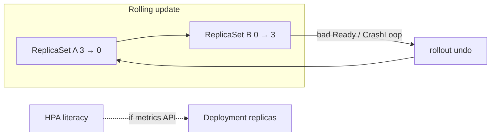

# L-10.6 — Autoscaling and rollout/rollback

**Module:** 10 — Kubernetes and OpenShift  
**Duration:** 30 minutes  
**Case study:** BayPay Financial Services (fictional)

---

## Why this matters

Jordan Voss does not “copy a new jar onto `Pay2`.” Jordan changes Deployment `payment-service` in `baypay-prod` and Kubernetes creates a **new ReplicaSet**. If the new image CrashLoopBackOffs, Riley Okonkwo must **roll back** to the previous ReplicaSet — not recycle `dmgr-east`, not scale a cell cluster, not SSH a node. Autoscaling is the same controller idea on another axis: a HorizontalPodAutoscaler *may* change `spec.replicas` when metrics exist. This course teaches HPA **literacy**. You do **not** need a live metrics-server, Prometheus adapter, or OpenShift user-workload monitoring to pass. Paper plus YAML is enough. Cost stays **$0**.

---

## Learning objectives

- Describe a rolling update on `payment-service` (maxUnavailable / maxSurge) and how two ReplicaSets coexist.
- Name rollback as “return the Deployment to the last good ReplicaSet,” not as a cell bounce.
- Explain HPA as a replica-count controller that *reads metrics if present* — without requiring those metrics in the lab.
- Refuse ND-in-a-pod and refuse to treat `kubectl scale` as a substitute for a broken probe (L-10.5).

---

## Concept explanation

**Rolling update** (Deployment default strategy): kube raises a new ReplicaSet (new template: image tag, env, probes) and lowers the old one so that availability stays inside `maxUnavailable` and extra Pods stay inside `maxSurge`. Teaching estate wants **3** Ready replicas when healthy. A surge of 1 means you may briefly see 4 Pods. `maxUnavailable: 1` means you may briefly have 2 Ready. Payment pools (Hikari × replicas) grow during surge — budget connections (L-4.3).

**Recreate** strategy kills all Pods first. That is an outage. Do not pick it for `payment-service` unless a pack forces a contract you cannot run twice (this course does not).

**Rollback:** `kubectl rollout undo deploy/payment-service -n baypay-prod` (or the OpenShift equivalent) points the Deployment at the previous ReplicaSet. Revision history lives on the Deployment. If you deleted the Deployment, you have no undo. If you `apply` a broken YAML and then undo, you are moving desired state, not “healing nodes.”

**HPA literacy:** a HorizontalPodAutoscaler targets the Deployment and sets `replicas` between `minReplicas` and `maxReplicas` from a metric — often CPU utilization versus `resources.requests.cpu`, sometimes a custom request-rate metric. Without a metrics API, the HPA object still *exists* on paper and still *does nothing useful*. That is fine here. Do not install metrics-server to finish a knowledge check. Do not invent a BayPay SLO-based autoscaler product.

| Knob | Who moves `replicas` | When to use |
|---|---|---|
| Deployment `spec.replicas: 3` | Human / Git | Default estate |
| `kubectl scale` | Human, now | Emergency capacity; record it |
| HPA | Controller + metrics | Literacy; optional later |
| Cluster autoscaler | Node count | Out of scope (nodes are paper) |

Autoscaling a JVM is not free: each Pod is a heap, a JIT warmup, a Hikari pool. Scaling from 3 to 12 because CPU is 80% during a GC storm (L-8.5) multiplies the storm. Readiness must be honest or HPA scales *unready* capacity.

The Module 8 canary was one process. A rollout *is* a canary if you use a second Deployment or a preview ReplicaSet — this lesson’s locked object is still one Deployment named `payment-service`. Do not require a progressive-delivery vendor. Do not schedule `PaymentCluster` members as a StatefulSet of DMs.

---

## Visual explanation



Alt text: A rollout winds ReplicaSet A down and B up. Undo returns to A. An HPA may change Deployment replicas when a metrics API exists; this course does not require that API.

---

## Architecture

Desired state is git (or a paper manifest) applied to `baypay-prod`. Sam Okada’s platform may reconcile via GitOps (optional PAKS). The cluster’s job is to make ReplicaSets match the Deployment, and to make Pods match the ReplicaSet. Your job is to watch **Ready** replicas and Endpoints (L-10.2), not CPU on `was-pay-2`.

OpenShift: `oc rollout undo deploy/payment-service` is the same controller. A DeploymentConfig is *legacy* OpenShift; this course uses Deployment. Routes keep pointing at Service `payment-service`; you do not rewrite `payment-route` on every image tag.

Stabilization: undo the Deployment, or pin `replicas` and pause the rollout (`rollout pause`) while you read logs. Remediation: fix the image or the Secret, then roll forward. Do not bounce `dmgr-east`. Do not “fail over the cell.” Do not recommend running `nodeagent` in the new ReplicaSet.

---

## Production example

Priya: Jordan applied tag `3.8.1`; Ready dropped from 3 to 1; new Pods CrashLoopBackOff. Riley writes “rollout; undo candidate; not a WAS sync.” First stabilize is `rollout undo` (or pause + scale the old ReplicaSet by restoring the Deployment). Then read the new Pod’s describe — INCIDENT-1001’s *class* often *arrives* as a rollout. This lesson still does not name that pack’s cause.

A different afternoon: someone enabled an HPA on paper with `targetCPUUtilizationPercentage: 50` and no memory headroom. CPU sat at 70% during G1 (L-8.5). Replica count climbed. Postgres saw 3× pools. The fix is not “install metrics-server so we can tune.” The fix is honest readiness, heap headroom, and a human replica floor of 3.

---

## Code/configuration example

Rolling strategy on the locked Deployment (excerpt):

```yaml
apiVersion: apps/v1
kind: Deployment
metadata:
  name: payment-service
  namespace: baypay-prod
spec:
  replicas: 3
  strategy:
    type: RollingUpdate
    rollingUpdate:
      maxUnavailable: 1
      maxSurge: 1
  selector:
    matchLabels:
      app: payment-service
  template:
    metadata:
      labels:
        app: payment-service
    spec:
      containers:
        - name: payment-service
          image: registry.baypay.example/baypay/payment-service:3.8.0
```

HPA *literacy* object — you may read it; you need not apply it; no metrics-server required:

```yaml
apiVersion: autoscaling/v2
kind: HorizontalPodAutoscaler
metadata:
  name: payment-service
  namespace: baypay-prod
spec:
  scaleTargetRef:
    apiVersion: apps/v1
    kind: Deployment
    name: payment-service
  minReplicas: 3
  maxReplicas: 6
  metrics:
    - type: Resource
      resource:
        name: cpu
        target:
          type: Utilization
          averageUtilization: 70
```

Paper operate commands:

```text
kubectl -n baypay-prod rollout status deploy/payment-service
kubectl -n baypay-prod rollout history deploy/payment-service
kubectl -n baypay-prod rollout undo deploy/payment-service
# oc -n baypay-prod rollout undo deploy/payment-service
```

---

## Trade-offs

| Choice | Gain | Cost |
|---|---|---|
| RollingUpdate 1/1 | Stay near 3 Ready | Need capacity for surge heap |
| Recreate | Simple | Full outage |
| Undo | Fast return to last RS | Does not fix a bad Secret still referenced |
| HPA on CPU | Absorb load *if* metrics exist | Scales GC pain; needs requests |
| Manual `replicas: 3` only | Predictable pools | Human must scale for events |
| ND-in-a-pod “canary” | None | Cell semantics you are leaving |

---

## Failure modes

- Watching `kubectl get pods` without `rollout status` and missing a hung rollout.
- Deleting Pods by hand to “force the new image” while the old ReplicaSet still wants 3.
- HPA `minReplicas: 1` on a payments API.
- Installing metrics-server on a laptop as a grade requirement.
- Scaling to 20 replicas to hide a readiness bug.
- Rolling back by bouncing `dmgr-east` or recycling `PaymentCluster`.

---

## Security/reliability implications

Who may `patch` the Deployment or `create` an HPA is release power (L-10.4). A stolen CI token that applies `:latest` is a supply-chain incident; CLUSTER.md already forbids `:latest` as a production default. Pin tags (and later digests).

Reliability: surge multiplies DB connections and in-flight authorizes. Idempotency keys must survive the old Pod dying mid-POST (Module 2). Communication during a bad rollout: current revision, Ready count, whether undo already ran, and that merchants may retry.

---

## Interview perspective

**Engineer.** A Deployment rolling update creates a new ReplicaSet. `rollout undo` goes back. We want 3 replicas in `baypay-prod`.

**Senior.** I set maxUnavailable and maxSurge so payments stay up. I do not need metrics-server to *explain* HPA. I will not put ND in a Pod.

**Staff.** I stabilize with undo or pause, then I treat CrashLoop on the new RS as a release defect. I will not max a diagnostic score on “bad rollout” without evidence.

**Principal.** Rollout policy and a replica floor are standards. I fund GitOps apply paths (optional PAKS) and I score on-call on revision numbers, not on cell bounces.

---

## Key takeaways

- Rollout = new ReplicaSet; rollback = previous ReplicaSet; both are Deployment operations.
- Healthy count stays **3** unless a human or an HPA changes it on purpose.
- HPA is literacy; a live metrics-server is not required in this module.
- Do not recommend ND-in-a-pod or bounce `dmgr-east` to undo a kube release.
- A lucky “bad deploy” label does not max Diagnostic method.

---

## Knowledge check

1. Jordan’s new tag CrashLoopBackOffs. Which object do you undo, and which process do you refuse to bounce?
2. Why can this course teach HPA without a running metrics-server?
3. During a rolling update with `maxSurge: 1`, how many `payment-service` Pods might exist, and why does Hikari care?

<details>
<summary>Spoiler — answers</summary>

1. Undo Deployment `payment-service` in `baypay-prod`. Do not bounce `dmgr-east` or a WAS cluster member.
2. HPA is a controller that *would* read a metrics API. Literacy is the object and the replica-floor idea. Labs stay paper / optional `kind` at $0.
3. Up to 4 (3 + 1 surge). Each Pod opens a pool; surge is extra connections against Postgres.

</details>

---

## Related lab

[INCIDENT-1001](../../../../labs/INCIDENT-1001/README.md) — CrashLoopBackOff *symptoms* that often arrive as a new ReplicaSet. Use rollout/undo language from this lesson. Do not open `solutions/INCIDENT-1001/` until the worksheet separates stabilize (undo/pause) from remediate. This lesson does not name that pack’s cause.

---

## Related PAKS

Optional: `docs/17-kubernetes-and-platform-engineering/platform-engineering-and-gitops.md` (desired-state apply and rollback). Optional: `docs/17-kubernetes-and-platform-engineering/kubernetes-architecture.md`. Rollout method stands alone without a PAKS login.
