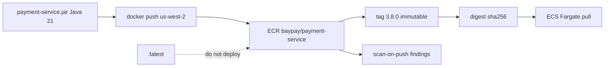

# L-11.1 — Amazon ECR

**Module:** 11 — AWS Container Platforms  
**Duration:** 30 minutes  
**Diagram:** AEJE-D-048  
**Case study:** BayPay Financial Services (fictional)  
**Region:** `us-west-2`

---

## Why this matters

Module 9 taught `registry.baypay.example/baypay/payment-service:3.8.0`. On AWS that catalog is **Amazon ECR** in **`us-west-2`**. When Riley Okonkwo asks “what authorized Avery Chen?”, the only honest answer is a **digest** that still matches the tag Jordan Voss released. `baypay/payment-service:latest` is not a version. Scan-on-push is how Priya Nair sees a Critical CVE before Harbor Bike Co’s lunch rush, not two days after. Mutable tags turn a payments rollback into guesswork.

---

## Learning objectives

- Name the ECR repository `baypay/payment-service` in `us-west-2` and write a URI that is not `:latest`.
- Contrast a mutable tag with tag immutability and an image digest.
- Enable scan-on-push as the teaching default and say what a finding is *not* (not an RCA, not a deploy blocker by itself).
- Push on paper or in a sandbox; refuse a live push if you cannot spend. Empty ECR still has storage cost — delete images you created.

---

## Concept explanation

**ECR** is a private OCI registry in your AWS account. For this course the repository name is `baypay/payment-service`. The region is **`us-west-2`**. A teaching URI looks like:

```text
123456789012.dkr.ecr.us-west-2.amazonaws.com/baypay/payment-service:3.8.0
```

`123456789012` is a synthetic account id. On a real apply you substitute your sandbox. The **image contract** from CLUSTER.md still holds: `eclipse-temurin:21-jre` runtime, port `8080`, non-root UID `10001`, `BAYPAY_DB_*` not in layers. ECR does not relax Module 9. It stores what you already built.

**Tags.** A tag is a pointer. `:3.8.0` can be overwritten unless you turn on **tag immutability** for the repository. Production teaching default: **immutable tags**. Jordan releases `3.8.1`; nobody force-pushes over `3.8.0`. **Never deploy `:latest`.** `latest` means “whatever was pushed last,” not “the bytes finance signed.” Local `:dev` on a laptop is fine; an ECS service in `us-west-2` is not a laptop.

**Digests.** `…/baypay/payment-service@sha256:…` is content-addressed. Two tags can move (if mutable); a digest does not. Record tag **and** digest in the release notes. ECS should pull a pin you can reconstruct after Avery Chen disputes a charge.

**Scan-on-push.** ECR can scan the image when it lands. Findings are **inventory**: CVEs in the JRE layer, in the fat JAR’s dependencies, in OS packages. A High finding is a ticket, not an automatic “the authorize path is compromised.” Do not treat a clean scan as “safe to skip Secrets Manager” (L-11.5). Do not treat a finding as the INCIDENT-1104 cause — this lesson does not close that pack.

**Lifecycle.** Untagged images and old `:dev` tags accumulate **storage cost**. Empty repositories still bill for leftover images. A lifecycle policy that expires untagged images after N days is hygiene. It is not a substitute for **destroy-after-lab** on student sandboxes.

**Auth.** `docker login` to ECR uses a short-lived token from `get-login-password`, not a long-lived access key in git. The ECS **execution role** (L-11.5) pulls at task start. You do not bake a registry password into the task definition.

Module 10’s `registry.baypay.example` is still a valid name for a kube or OpenShift estate. ECR is the AWS spelling of the same job. Do not tell Sam Okada that OpenShift ImageStreams became wrong because this module uses ECR.

---

## Visual explanation



Alt text: AEJE-D-048 (ECR slice). The BayPay JAR is pushed to ECR repository baypay/payment-service in us-west-2; an immutable tag 3.8.0 points at a digest; scan-on-push records findings; ECS on Fargate pulls the digest; latest is not deployed.

---

## Architecture

Sam Okada owns who can `ecr:PutImage` in `us-west-2`. Jordan owns which tag the ECS service may run. Riley reads the **digest** on the running task, not the hallway name “the new payment build.” Priya watches scan findings and lifecycle cost.

CI (Module 12) will build from a Git SHA, tag `baypay/payment-service:<semver>`, and record the digest. This lesson only designs the repository: region, immutability, scan, no `:latest`. BUILD-1101 may push if you apply; paper plus a written URI is enough if you cannot spend.

Student apply stays in **`us-west-2`**. Do not create a second repository in `us-east-1` “for DR” in a 90-minute lab. Cross-region replication is literacy, not a lab step. Do not enable a pull-through cache to Docker Hub as a required apply — that is extra cost and another moving tag.

---

## Production example

Jordan tags the lunchtime hotfix `:latest` “because ECS will pick it up.” Two hours later Priya cannot say whether the Fargate task has the hotfix or morning `3.8.0`. Avery Chen’s duplicate `Idempotency-Key` replay looks like a code bug; it is an **unknown binary**. Fix: tag `3.8.1` with immutability on, record the digest, move the ECS task definition to that tag. Leave `:latest` off the service.

A second story: scan-on-push is off. A week later the JRE layer has a published CVE. Riley pages “are we exposed?” and nobody has a finding timestamp. Turn scan on. Triage. Do not halt every authorize because a scanner said High in a transitive test library — and do not ignore Critical in the runtime JRE.

A third: the student left twenty untagged images after retrying BUILD-1101. The repository looks “empty” in the console list of tags. The bill is not empty. Delete images. Destroy after the lab.

---

## Code/configuration example

Illustrative — not a lab answer, not a live apply requirement. Region is `us-west-2`.

```hcl
resource "aws_ecr_repository" "payment" {
  name                 = "baypay/payment-service"
  image_tag_mutability = "IMMUTABLE"

  image_scanning_configuration {
    scan_on_push = true
  }

  tags = {
    Course      = "AEJE"
    Module      = "11"
    Lab         = "BUILD-1101"
    Environment = "student"
    Expiration  = "2026-09-04"
  }
}
```

Paper commands (sandbox only if you apply):

```text
aws ecr get-login-password --region us-west-2 \
  | docker login --username AWS --password-stdin \
    123456789012.dkr.ecr.us-west-2.amazonaws.com

docker tag baypay/payment-service:3.8.0 \
  123456789012.dkr.ecr.us-west-2.amazonaws.com/baypay/payment-service:3.8.0

# do not: .../baypay/payment-service:latest
```

`terraform validate` on a module that declares this repository is enough to pass if you cannot spend. Do not `apply` to prove you read this lesson.

---

## Trade-offs

| Choice | Gain | Cost |
|---|---|---|
| Immutable tags | Rollback by name is honest | Hotfix needs a new tag (`3.8.1`), not a overwrite |
| Mutable `:3.8.0` | Convenient “same version, new bytes” | Forensics die; Riley cannot answer Avery |
| `:latest` | Fast local alias | Unreproducible prod; forbidden here |
| Scan-on-push | Findings at publish time | Noise; still not a runtime RCA |
| Lifecycle expire untagged | Limits storage bill | Do not expire the digest you might roll back to this week |
| Second region replica | DR literacy | Extra storage; out of scope for student apply |

---

## Failure modes

- Deploying `:latest` to the ECS service in `us-west-2`.
- Overwriting tag `3.8.0` because immutability was left off.
- Treating a clean scan as “secrets in the task JSON are fine.”
- Leaving images after the lab; empty-looking ECR still bills.
- Pushing Avery Chen’s service to a public repository “so the TA can pull.”
- Requiring `us-east-1` because a blog used it.
- Telling the cohort that Module 10’s registry name is obsolete.

---

## Security/reliability implications

A mutable tag is an **integrity** gap: the name on the pager may not be the bytes Priya approved. Scan-on-push is **inventory**, not authorization. IAM (L-11.5) decides who can push and who can pull; a public ECR repo on a payments JAR is a data-flow review, not a convenience. Reliability: rollback means pointing the task definition at a **previous digest**, not “pull `:latest` again.” Destroy student images so the next cohort does not inherit your CVEs and your bill.

---

## Interview perspective

**Engineer.** I name `baypay/payment-service` in `us-west-2`. Production uses `:3.8.0` or a digest, never `:latest`. Scan-on-push is on.

**Senior.** I turn on immutable tags and record the digest in the release. I can explain why an overwritten tag makes Avery Chen’s dispute unanswerable. I delete images after a lab.

**Staff.** I treat ECR as the system of record for what ECS may run. Findings are triaged; they are not a substitute for task-role design or for traces. I will not apply a second region to look senior.

**Principal.** The registry policy is a control: immutability, scan, least-privilege push. I will not accept `:latest` as an SLO input, and I will not fund EKS “so we have a real registry” — ECR already is one. OpenShift and kube registries remain valid outside this account.

---

## Key takeaways

- ECR repository `baypay/payment-service` lives in **`us-west-2`**.
- Immutable tags + recorded digest; **never** `:latest` in production.
- Scan-on-push is inventory, not an RCA and not a secret store.
- Paper + `terraform validate` is enough; live push is optional.
- Delete images after the lab. Empty ECR can still cost money.

---

## Knowledge check

1. Why is `:latest` unacceptable on the ECS service that takes Avery Chen’s `POST /api/v1/payments`?
2. What does scan-on-push prove, and what does it *not* prove about `BAYPAY_DB_PASSWORD`?
3. If you cannot spend, what is enough to pass the ECR portion of BUILD-1101?

<details>
<summary>Spoiler — answers</summary>

1. The tag is mutable by default and means “last push,” so you cannot say which bytes authorized Avery or roll back by name alone.
2. It inventories CVEs in layers. It does not prove secrets are absent from the image or the task definition; those stay out by design (L-9.5, L-11.5).
3. A written URI in `us-west-2` with immutable tags and scan-on-push, plus `terraform validate` if you have HCL. Live push is optional.

</details>

---

## Related lab

[BUILD-1101](../../../../labs/BUILD-1101/README.md) — deploy BayPay on ECS/Fargate, including the ECR name. Paper + `terraform validate` is enough if you cannot spend. If you apply, destroy images and the repository leftovers after the lab. Do not open `solutions/` first.

---

## Related PAKS

Optional: `docs/16-cloud-architecture/aws-fundamentals.md` (regions, shared responsibility). The ECR pin in `us-west-2` stands alone without a PAKS login.
