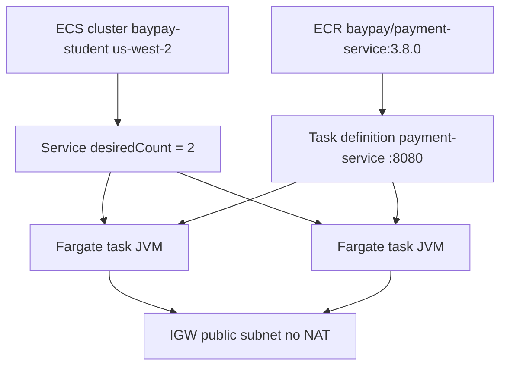

# L-11.2 — ECS and Fargate

**Module:** 11 — AWS Container Platforms  
**Duration:** 30 minutes  
**Diagram:** AEJE-D-048  
**Case study:** BayPay Financial Services (fictional)  
**Region:** `us-west-2`

---

## Why this matters

ECR holds `baypay/payment-service:3.8.0`. Something must **run** it. On AWS the student default is **Amazon ECS on Fargate** in **`us-west-2`**. A **task definition** is the pod template. A **service** is the replica controller. Port **`8080`** is still the process. If Riley Okonkwo treats a task like `Pay1` and SSHes for a thread dump, or asks Morgan Hale to bounce `dmgr-east`, the page will last through Harbor Bike Co’s entire lunch rush. Fargate is not “Kubernetes with extra steps.” It is a scheduler that does not require you to own EC2.

---

## Learning objectives

- Name cluster, task definition, and service for `payment-service` and say who owns desired count.
- Contrast the **Fargate** launch type with the **EC2** launch type without recommending always-on instances for a student lab.
- Publish container port `8080` and keep Actuator paths as the health contract (L-11.4 wires the ALB).
- Size CPU/memory with heap headroom; never set `-Xmx` equal to the task memory limit.

---

## Concept explanation

**ECS cluster** is a namespace for tasks. Teaching name: `baypay-student` in `us-west-2`. It is not `baypay-prod` the Kubernetes namespace. Do not merge those words in an interview.

**Task definition** is the immutable-ish template: image URI, CPU, memory, port mappings, env, log driver, **execution role** and **task role** (L-11.5). You register a new revision when Jordan changes the tag from `3.8.0` to `3.8.1`. Revision 12 is not “the same task, edited.” It is a new desired state, like a new Deployment pod template.

**Task** is one running copy: one `payment-service` JVM on Fargate, port `8080`, UID from the image. Avery Chen never gets the task ENI as a public product name. An ALB target group (L-11.4) does.

**Service** keeps `desiredCount` tasks healthy. Teaching default: **2** on a student apply (cheaper than Module 10’s paper 3; disclose it). The service replaces a stopped task. It does not fix a bad health check path. It does not authorize payments.

**Launch types.**

| Launch type | Who owns the machines | Student lab |
|---|---|---|
| **Fargate** | AWS runs the compute; you pick CPU/memory | **Default.** No always-on EC2. No NAT required if tasks sit in public subnets with a public IP and an IGW (document that trade-off). |
| **EC2** | You run ECS container instances | Out of default scope. Always-on EC2 plus (often) NAT is a bill. Do not choose it “for realism.” |

**Network.** Fargate uses `awsvpc`: each task gets an ENI. Student apply: **public subnets only**, outbound through an **Internet Gateway**, not a NAT Gateway. ACCOUNT.md is explicit. Private subnets + NAT look more “prod” and cost **dollars/day** for the NAT. Do not add NAT unless a lab discloses that cost and you still want to spend.

**Port `8080`.** The container listens where Module 9 said. Map host/container `8080` in the task definition. Do not remap to `80` inside the JVM “because ALB is 443.” The ALB target is `8080`. Health is Actuator, not Tomcat’s default `/`.

**CPU and memory.** Fargate charges for the task size you reserve. A 0.25 vCPU / 512 MiB task is often too small for Spring Boot 3.5.5 + Hibernate warmup. Teaching starting point: **0.5 vCPU / 1024 MiB** (or the lab’s disclosed pair). Java 21 `UseContainerSupport` sees the task memory. **Do not set `-Xmx` equal to that limit** (L-7.6, L-9.6, L-10.5). Leave metaspace, stacks, and native headroom.

**Not Kubernetes.** There is no Deployment, no ReplicaSet, no Service ClusterIP in this control plane. Mapping for interviews: task definition ≈ pod template; task ≈ pod; service desired count ≈ replicas; ALB ≈ Ingress/Route. The APIs are different. Module 10 remains valid on a different estate.

---

## Visual explanation



Alt text: AEJE-D-048. ECS cluster baypay-student in us-west-2 holds a Fargate service that keeps two tasks from the payment-service task definition; tasks pull ECR tag 3.8.0, listen on 8080, and egress via an Internet Gateway on public subnets without a NAT Gateway.

---

## Architecture

Sam Okada’s platform account owns the cluster and the IAM roles. Jordan registers task-definition revisions. Riley’s first question on a 5xx is “which **task** failed health, which **revision** is the service pinned to,” not “which EC2 did we lose.” Priya watches desired versus running count.

Stabilization: stop a bad task (the service starts another), or pin the service to the last good revision. Remediation: new revision with a new image tag — same habit as a Deployment rollout, different API. Do not recycle `BayPayCell`. Do not add an EC2 launch type mid-incident to “get a shell.”

If you apply: estimate Fargate hours **before** `terraform apply`. Paper + `terraform validate` is enough to pass. **Destroy the service and cluster after the lab.** A service with `desiredCount=2` left over a weekend is a quiet bill.

---

## Production example

Priya pages Riley at 10:40 Pacific: authorize p99 is fine on one task; the other is restarting. Riley’s first note is “ECS service `payment-service`, Fargate, `us-west-2` — not the cell, not EKS.” Riley lists tasks, reads the stopped reason, and writes a hypothesis **before** blaming Java. A stopped reason of “essential container exited” is a *symptom class*, not an RCA. The image tag is a *candidate*.

A second story: a teammate switches the service to EC2 launch type so they can SSH and run `jcmd`. They leave two `m5.large` instances up. The NAT they added for “private subnets” is now the largest line item. ACCOUNT.md forbids that path for student apply. Use CloudWatch logs (L-11.6) and a new revision. If you need a shell, that is a different estate (Module 10 `kind`, or a disclosed break-glass), not a launch-type surprise.

---

## Code/configuration example

Illustrative task definition slice — not a lab answer. Secrets stay in Secrets Manager (L-11.5), not here.

```json
{
  "family": "payment-service",
  "networkMode": "awsvpc",
  "requiresCompatibilities": ["FARGATE"],
  "cpu": "512",
  "memory": "1024",
  "executionRoleArn": "arn:aws:iam::123456789012:role/baypay-ecs-execution",
  "taskRoleArn": "arn:aws:iam::123456789012:role/baypay-ecs-task",
  "containerDefinitions": [
    {
      "name": "payment-service",
      "image": "123456789012.dkr.ecr.us-west-2.amazonaws.com/baypay/payment-service:3.8.0",
      "portMappings": [{ "containerPort": 8080, "protocol": "tcp" }],
      "essential": true
    }
  ]
}
```

Service sketch (HCL, validate-only is enough):

```hcl
resource "aws_ecs_service" "payment" {
  name            = "payment-service"
  cluster         = aws_ecs_cluster.student.id
  task_definition = aws_ecs_task_definition.payment.arn
  desired_count   = 2
  launch_type     = "FARGATE"
  # load balancer and subnets: BUILD-1101 / L-11.4
}
```

Do not set `JAVA_TOOL_OPTIONS=-Xmx1024m` to “use the whole task.” That is the L-8.7 class of failure.

---

## Trade-offs

| Choice | Gain | Cost |
|---|---|---|
| Fargate | No instance fleet; billed while tasks run | Less “SSH the box”; you debug via logs and new revisions |
| EC2 launch type | SSH, daemonsets-like agents | Always-on instances; often NAT; not the student default |
| Public subnet + IGW | No NAT bill | Tasks can have public IPs; document the exposure |
| Private + NAT | Classic prod shape | NAT Gateway **dollars/day** — forbidden unless disclosed |
| `desiredCount` 2 | Survive one task death | Two heaps, two Hikari pools (L-4.3) |
| `desiredCount` 1 “to save” | Cheap hour | Every deploy and every crash is an outage |

---

## Failure modes

- Choosing EC2 launch type or NAT Gateway to look production-ready in a 90-minute lab.
- Mapping container port `80` while Boot still binds `8080`.
- Setting `-Xmx` equal to Fargate memory.
- Treating “service is ACTIVE” as “Avery can pay.”
- Bouncing `dmgr-east` because the pager said payment-service.
- Requiring EKS because “real companies use Kubernetes” — ARCHITECT-1102 is the place for that sentence, and it is paper.
- Leaving the service running after the lab.

---

## Security/reliability implications

Anyone who can register a task definition and update the service can run a different binary as `payment-service`. Treat that as release rights. Public-subnet Fargate is a **documented** student trade-off, not a silent prod pattern: security groups must still restrict `8080` to the ALB (L-11.4). Reliability: two tasks are capacity, not idempotency. A replaced task mid-authorize still needs Module 2’s `Idempotency-Key`. Communication must say running count, revision, and what you have not proven about Avery Chen.

---

## Interview perspective

**Engineer.** ECS on Fargate in `us-west-2`. Task definition names the image and port `8080`. The service keeps `desiredCount` tasks. I do not use `:latest`.

**Senior.** I pick Fargate over EC2 so I do not own instances or a NAT bill. I size 512 CPU / 1024 memory with heap headroom. I debug with revisions and logs, not SSH.

**Staff.** I map task/service/ALB to Pod/Deployment/Ingress without claiming they are the same API. I refuse EKS or NAT as the default student apply. I destroy after the lab.

**Principal.** Fargate is the funded default for this estate until a platform decision (ARCHITECT-1102) says kube or OpenShift wins. I will not pay for idle EC2 to recreate `Pay1`.

---

## Key takeaways

- Default compute: **ECS on Fargate** in `us-west-2`, port **`8080`**.
- Task definition = template; service = desired count; task = one JVM.
- Fargate vs EC2: students pick Fargate; EC2 + NAT is a cost trap.
- Do not set `-Xmx` equal to task memory.
- Live apply is optional; destroy the service after the lab.

---

## Knowledge check

1. Avery Chen’s create fails and the ECS service shows `2/2` running. Which object do you inspect next, and which process do you refuse to bounce?
2. Why is the EC2 launch type the wrong default for BUILD-1101?
3. A teammate wants private subnets plus a NAT Gateway “like real prod.” What does ACCOUNT.md say, and what is the cost concern?

<details>
<summary>Spoiler — answers</summary>

1. Inspect the tasks / stopped reasons / target health for `payment-service`. Do not bounce `dmgr-east` or a WAS `Pay*` member.
2. It implies always-on instances (and often NAT). The locked default is Fargate; paper + validate is enough without machines.
3. Student apply uses public subnets and an IGW, no NAT. NAT Gateway is dollars/day and is out of scope unless a lab discloses that cost.

</details>

---

## Related lab

[BUILD-1101](../../../../labs/BUILD-1101/README.md) — deploy BayPay on ECS/Fargate. Paper + `terraform validate` is enough if you cannot spend. If you apply, destroy the service, cluster, and leftover tasks after the lab. Do not open `solutions/` first.

---

## Related PAKS

Optional: `docs/16-cloud-architecture/aws-fundamentals.md`. The Fargate default in `us-west-2` stands alone without a PAKS login.
