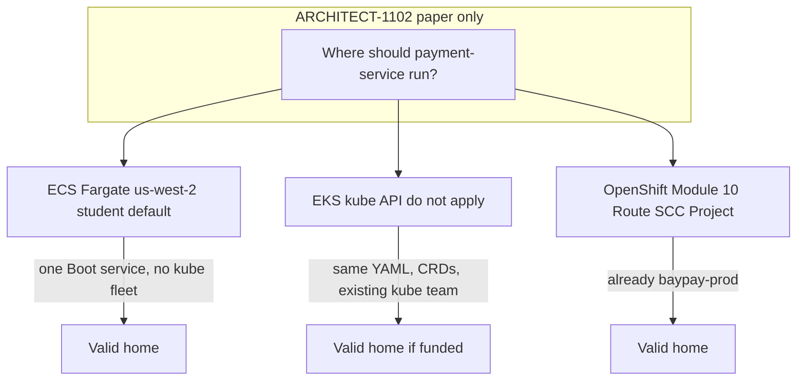

# L-11.3 — Amazon EKS

**Module:** 11 — AWS Container Platforms  
**Duration:** 30 minutes  
**Diagram:** AEJE-D-049  
**Case study:** BayPay Financial Services (fictional)  
**Region:** `us-west-2`

---

## Why this matters

Amazon EKS is **Kubernetes on AWS**. Module 10 already taught Deployments, Services, and OpenShift Routes for `payment-service` in `baypay-prod`. EKS would schedule the **same image** with the **same probes**. It is **not** the student apply default. ACCOUNT.md forbids standing up EKS in a 90-minute lab: control-plane hours, node groups, and the NAT people add “because private nodes” become the bill before Avery Chen posts a single payment. This lesson is **literacy**. [ARCHITECT-1102](../../../../labs/ARCHITECT-1102/README.md) is the decision you write on paper. You do **not** need a cluster to pass.

---

## Learning objectives

- Explain EKS as a managed Kubernetes API, not as “ECS with YAML.”
- Say when EKS wins versus ECS/Fargate for BayPay — and when Module 10 OpenShift or self-managed kube remains the better home.
- Name the cost shape (control plane, nodes or Fargate-for-EKS, often NAT) without applying it.
- Refuse “we must use EKS because we are on AWS” as an architecture sentence.

---

## Concept explanation

**EKS** gives you a Kubernetes control plane in a region — teaching region still **`us-west-2`**. You `kubectl` against it. You still have Deployments, ReplicaSets, Pods, Services, Ingress. You can still run OpenShift **elsewhere** (ROSA, self-managed, or the paper `baypay-prod` from Module 10). EKS is one kube vendor. It is not the OpenShift overlay (Projects, Routes, SCCs). Do not write “EKS Route” on a whiteboard.

**What you already know transfers.** Image `baypay/payment-service:3.8.0`, port `8080`, liveness `/actuator/health/liveness`, readiness `/actuator/health/readiness`, Secret keys `BAYPAY_DB_*`, three replicas when healthy on the *kube* estate. Those objects do not become ECS task keys because you said “AWS.”

**What does not transfer.** ECS task definitions, ECS services, and ALB target groups attached to an ECS service are **not** kube objects. An EKS cluster that also uses an ALB Ingress controller is a **different** wiring (Ingress → target group → Pod). ARCHITECT-1102 asks you to pick a home, not to mash both control planes into one diagram and call it hybrid.

**When EKS wins (examples, not commandments).**

- The team already operates Kubernetes (Module 10 skills are the daily job) and needs the same API on AWS.
- You need kube-only extensions: CRDs, operators, a service mesh the org already standardized — and you accept the bill.
- Portability: the same manifests should run on EKS *and* on OpenShift or `kind` with overlays, not a rewrite into task JSON.

**When ECS/Fargate wins (the course default).**

- One Spring Boot composition root, one service, no kube ecosystem yet.
- Student or sandbox budget: no control-plane fee, no node group, no NAT-by-default.
- The on-call should reason about task revisions, not etcd and CNI.

**When OpenShift or non-AWS kube wins.**

- The estate is already `baypay-prod` with Route `payment-route` and SCCs. Moving to EKS to “be cloud native” is a platform migration, not a free upgrade.
- Regulators or the firm standardized on OpenShift. AWS being available does not override that.

**Cost you must say out loud.** EKS bills a **control plane** every hour the cluster exists, even at zero Pods. Nodes (managed node groups) are EC2. **EKS on Fargate** still has the control plane plus per-pod Fargate. Private nodes usually pull a **NAT Gateway** (dollars/day). That combination is why student apply does **not** create EKS. Paper + a decision table is the grade.

---

## Visual explanation



Alt text: AEJE-D-049. A paper decision places BayPay payment-service on ECS Fargate as the student default, on EKS when a funded kube API is the requirement, or on OpenShift when Module 10’s Project and Route estate already exists; none of the three is the only correct home.

---

## Architecture

Sam Okada may run **all three** in a real firm over years. This course’s **student account** runs **none of EKS**. Riley’s kube pages stay on the Module 10 paper cluster or optional `kind`. Riley’s AWS pages stay on ECS. Do not diagnose an ALB-unhealthy ECS target by proposing `kubectl -n baypay-prod`.

If BayPay later chooses EKS in `us-west-2`, the architecture is: ECR still holds the image; an Ingress (or a service mesh you will not invent here) fronts Pods; IRSA or equivalent replaces the ECS task role. That paragraph is literacy. It is not a BUILD-1101 step.

Do not add ROSA, OpenSearch, or a second EKS cluster “for DR” to a lab estimate. Control-plane × 2 plus NAT is how a 90-minute exercise becomes a finance conversation.

---

## Production example

A staff engineer tells Jordan “Fargate is not real Kubernetes; we should move `payment-service` to EKS this sprint so we can use the same YAML as `baypay-prod`.” Priya asks for the bill: EKS control plane, two node groups, NAT, ALB, and a week of CNI debugging. Harbor Bike Co’s volume does not change. ARCHITECT-1102’s honest answer might be: **stay on ECS for the AWS sandbox**, **keep OpenShift/kube as the strategic API** if that is already the firm standard, and **do not apply EKS** to prove literacy.

A second story: the firm *is* a kube shop. Every other service is a Deployment. Operators manage certificates. Then EKS (or OpenShift on AWS) wins and ECS is the odd API. That is a valid Principal sentence. It is still not a reason for *you* to `eksctl create cluster` tonight.

---

## Code/configuration example

Paper comparison — **do not apply** the EKS block. The ECS side is the student shape.

```text
# ECS / Fargate (student default, us-west-2)
cluster:        baypay-student
task definition: payment-service  (image :3.8.0, port 8080)
service:        desiredCount 2
front door:     ALB target group → tasks

# EKS (literacy only — do not create)
cluster:        would be a kube API in us-west-2
object:         Deployment payment-service in some namespace
front door:     Ingress → Pods
cost:           control plane + nodes/Fargate-for-EKS + often NAT

# OpenShift (Module 10 — still valid, not AWS-required)
project:        baypay-prod
route:          payment-route  host payments.apps.baypay.example
```

A decision row you might write for ARCHITECT-1102 (not a hidden answer key):

```text
Criterion          ECS/Fargate     EKS              OpenShift
API the team knows task JSON       kube             kube + Route/SCC
Student apply      yes             no               no (paper)
Idle cost          tasks + ALB     control plane…   cluster you already have
Portable manifests no              yes              yes (with overlays)
```

`terraform validate` of an **ECS** module is on-path. An EKS module in your tree is extra; do not apply it.

---

## Trade-offs

| Home | Gain | Cost |
|---|---|---|
| ECS/Fargate | Simple, cheap-to-pause, course default | Another API if the firm is kube-native |
| EKS | Same objects as Module 10 | Control plane, nodes, often NAT; **do not apply here** |
| OpenShift | Route, SCC, Project you already learned | Not an AWS lab; do not rent ROSA for a grade |
| “All three at once” | Slideware | Three ways to page Riley for one JVM |

---

## Failure modes

- Applying EKS (or ROSA) for BUILD-1101 or to “try Module 11 for real.”
- Adding NAT + private node groups because a reference architecture had them.
- Calling EKS “the only correct AWS container platform.”
- Treating OpenShift as obsolete because this module is AWS-themed.
- Diagnosing ECS with `kubectl` or diagnosing `baypay-prod` with `aws ecs`.
- Using this lesson to close INCIDENT-1104.

---

## Security/reliability implications

EKS expands the attack surface to the kube API, RBAC, and node IAM. That is not automatically more secure than ECS task roles; it is **different** controls (L-10.4 vs L-11.5). Reliability: a second control plane is a second page. Shared-responsibility still applies: AWS runs the EKS control plane; you run the workload, RBAC, and (usually) the data path. Cost is a reliability issue too: an unpaid cluster that someone “left up” gets terminated or surprises finance.

---

## Interview perspective

**Engineer.** EKS is managed Kubernetes. I can map Deployment `payment-service` to it. I do not need a live cluster for this course. Student default is ECS Fargate.

**Senior.** I can list when EKS wins (kube team, CRDs, portable YAML) versus ECS (one service, no fleet). I will mention control-plane and NAT cost before I propose EKS.

**Staff.** I will not migrate Module 10’s OpenShift Route estate to EKS as a style choice. I write ARCHITECT-1102 as a decision with cost, skills, and portability — not a vendor slogan.

**Principal.** I fund one operating model per estate. AWS is not a mandate to abandon OpenShift. I refuse student EKS applies and I refuse “Kubernetes or it is not production.”

---

## Key takeaways

- EKS is kube on AWS. It is **literacy**, not the apply default.
- Do **not** create a cluster for this module.
- ECS/Fargate, EKS, and OpenShift can each be a **valid** home.
- Control plane + nodes + NAT is why EKS is expensive for a 90-minute lab.
- ARCHITECT-1102 is paper. Destroy nothing kube-shaped because you should not have created it.

---

## Knowledge check

1. Why does ACCOUNT.md forbid applying EKS in a 90-minute lab?
2. Name one situation where EKS (or OpenShift) should win over ECS for `payment-service`.
3. Is a live EKS cluster required to complete L-11.3 or ARCHITECT-1102?

<details>
<summary>Spoiler — answers</summary>

1. Control-plane hours, node or Fargate-for-EKS compute, and the NAT people add for private nodes blow the cost envelope; the learning goal is a decision, not a cluster.
2. The team already runs Kubernetes/OpenShift and needs the same API, CRDs, or portable manifests — and has funded that platform. (ECS still wins for the student AWS sandbox.)
3. No. Paper architecture is enough. Do not create a cluster.

</details>

---

## Related lab

[ARCHITECT-1102](../../../../labs/ARCHITECT-1102/README.md) — ECS vs EKS vs OpenShift on paper. Do not apply EKS. Do not treat AWS as the only correct home. Do not open `solutions/` first.

---

## Related PAKS

Optional: `docs/16-cloud-architecture/aws-fundamentals.md` and `docs/26-cost-and-finops/overview.md`. The “do not apply EKS” rule stands alone without a PAKS login.
