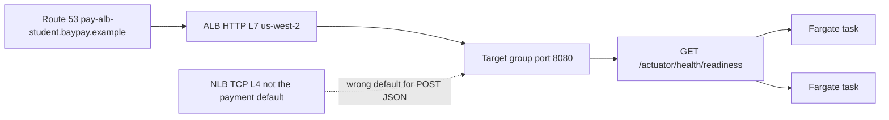

# L-11.4 — ALB, NLB, and Route 53

**Module:** 11 — AWS Container Platforms  
**Duration:** 30 minutes  
**Diagram:** AEJE-D-053  
**Case study:** BayPay Financial Services (fictional)  
**Region:** `us-west-2`

---

## Why this matters

Avery Chen never types a Fargate ENI. Harbor Bike Co calls a **name**. On the AWS student path that name is the ALB’s DNS — teaching hostname `pay-alb-student.baypay.example` maps to it on paper; a live apply uses the AWS-generated `*.us-west-2.elb.amazonaws.com` name. The load balancer must send `POST /api/v1/payments` to a task that is **safe to receive traffic**. That question is already answered by Spring Boot: `/actuator/health/readiness` on port **`8080`**. If the target group probes `/` or `/health`, Riley Okonkwo will get a page that looks like “AWS is down” while the JVM is fine — or the inverse. This lesson teaches the front door. It does **not** name the cause of INCIDENT-1104.

---

## Learning objectives

- Choose an **ALB** (L7 HTTP) for `payment-service` and say when an **NLB** (L4) would apply instead.
- Place **Route 53** as DNS for the teaching host, not as a substitute for a healthy target group.
- Write a target-group health check that matches **Actuator** (`/actuator/health/readiness` or liveness — and know which job each does).
- Treat “unhealthy target” as a *symptom class*, not as a closed RCA.

---

## Concept explanation

**ALB** (Application Load Balancer) is layer 7. It understands HTTP. It terminates TLS (when you attach a certificate), routes by path or host, and marks targets healthy from an HTTP check. Teaching estate: one ALB in **`us-west-2`**, listener 80 or 443, forward to a target group of Fargate tasks on **`8080`**. This is the ECS analogue of Module 10’s Ingress / Route — **same job, different API**. Do not call the ALB “the OpenShift Route on AWS.”

**NLB** (Network Load Balancer) is layer 4. It forwards TCP (or TLS passthrough) without reading the HTTP path. Use it for non-HTTP protocols, for extreme connection counts, or when you must preserve source IP in ways ALB does not. Avery’s JSON payment is HTTP. **Prefer ALB.** Do not add an NLB in front of the ALB “for extra HA” in a student lab — that is another hourly bill.

**Target group.** ECS registers task IPs (awsvpc) into the group. Health check fields that must not be invented:

| Field | Teaching value | Why |
|---|---|---|
| Protocol / port | HTTP / `8080` | Boot binds `8080` |
| Path | `/actuator/health/readiness` | May this target receive POST? |
| Success codes | `200` | Actuator readiness returns 200 when ready |
| Matcher on `/` or `/health` | **Wrong** | Boot may 404 `/`; aggregate `/actuator/health` can include components you do not want to drain on |

**Liveness vs readiness at the ALB.** The ALB should generally probe **readiness**: an unready JVM (warming, DB flap you chose to surface) should leave the group without a restart. ECS/Fargate does not kubelet-kill on ALB fail — it just stops sending traffic (and the service may replace the task if you also fail the container health check). A **container** health check, if you set one, should match **liveness** (`/actuator/health/liveness`): restart only if a new JVM helps. Do not point both at the aggregate `/actuator/health`. L-10.5 taught the same split.

**Route 53.** DNS. An alias (or CNAME) from `pay-alb-student.baypay.example` to the ALB is how humans talk. Student apply often **skips** a hosted zone and uses the ALB DNS name directly — cheaper, fewer objects. Route 53 does not make an unhealthy target healthy. Do not create a hosted zone “for realism” if you cannot spend.

**Security groups.** Tasks accept `8080` from the ALB security group, not from `0.0.0.0/0`. The ALB accepts 443/80 from the internet (student) or from a tighter CIDR. Public-subnet Fargate is already a disclosed trade-off (L-11.2); wide-open task SGs make it worse.

**Idle cost.** An ALB bills **per hour plus LCU**, even with almost no traffic. Dollars/day. **Destroy after the lab.** Do not leave the balancer overnight. That sentence is also L-11.8.

---

## Visual explanation



Alt text: AEJE-D-053. Route 53 name pay-alb-student.baypay.example points at an ALB in us-west-2; the ALB forwards HTTP to a target group on port 8080 whose health check is GET /actuator/health/readiness against two Fargate tasks; an NLB is shown as the non-default L4 alternative for this JSON payment API.

---

## Architecture

Jordan’s release is a new task revision **and** the same target group. Priya’s dashboard is healthy-host count, not “Route 53 is green.” Riley traces: DNS → ALB listener → target group → task `:8080` → Actuator. If any hop’s check does not match Boot, the diagram lies.

Module 10’s host `payments.apps.baypay.example` is still valid on OpenShift. Do not rename that Route to an ALB in the kube estate. Two homes, two front doors.

Student apply: public subnets for the ALB (required) and for Fargate (course default). Do not insert a NAT so the ALB can “reach private tasks” unless a lab discloses NAT cost. Paper + `terraform validate` is enough if you cannot spend.

---

## Production example

Priya pages: ALB unhealthy host count is 2 of 2. Merchants see 502. Riley does **not** write the INCIDENT-1104 root cause in this lesson. Riley’s method: confirm listener and target port `8080`, quote the **configured health path**, curl Actuator from a place that is allowed, compare to what Boot actually serves (L-3.5). A 404 on `/health` while `/actuator/health/readiness` returns 200 is a *mismatch class*. A 503 from readiness is a *readiness class*. A connection timeout is a *network or process class*. Name the class. Collect the next evidence. Do not close the pack from this paragraph.

A second story: someone fronts the ALB with an NLB because a checklist said “NLB for anything important.” Now there are two balancer invoices and no extra correctness for HTTP payments. Remove the NLB. Keep the ALB.

---

## Code/configuration example

Illustrative target-group health — not the incident answer, not required to apply:

```hcl
resource "aws_lb_target_group" "payment" {
  name     = "baypay-payment-tg"
  port     = 8080
  protocol = "HTTP"
  vpc_id   = var.vpc_id
  target_type = "ip"

  health_check {
    enabled             = true
    path                = "/actuator/health/readiness"
    port                = "8080"
    protocol            = "HTTP"
    matcher             = "200"
    healthy_threshold   = 2
    unhealthy_threshold = 3
    interval            = 15
  }

  tags = {
    Course      = "AEJE"
    Module      = "11"
    Environment = "student"
    Expiration  = "2026-09-04"
  }
}
```

Wrong paths you should be able to recognize on a whiteboard:

```text
/                  # often 404 from Boot; not readiness
/health            # not the BayPay Actuator contract
/actuator/health   # aggregate; can flap liveness-class restarts if misused
```

Right paths (locked):

```text
/actuator/health/liveness
/actuator/health/readiness
```

---

## Trade-offs

| Choice | Gain | Cost |
|---|---|---|
| ALB | HTTP routing, HTTP health, TLS at the edge | Hourly + LCU; **destroy after lab** |
| NLB | L4, source-IP stories | No HTTP health path; extra bill if stacked |
| Route 53 alias | Human name `pay-alb-student.baypay.example` | Hosted zone cost; optional for apply |
| ALB DNS only | Zero DNS objects | Ugly URL; fine for a sandbox |
| Readiness as TG path | Drain warming tasks | Must not be a heavy lock-taking check |
| Probe `/` | “Simple” | Lies about Boot |

---

## Failure modes

- Health check on `/` or `/health` while Actuator lives under `/actuator/health/*`.
- Target port `80` while the container listens on `8080`.
- Adding NLB + ALB + NAT to look senior.
- Creating a Route 53 zone you forget to delete.
- Leaving the ALB up overnight (idle dollars).
- Treating Route 53 as proof the application is healthy.
- Writing INCIDENT-1104’s root cause from this lesson — you do not have that evidence here.

---

## Security/reliability implications

An ALB on the internet is a **public** front door. TLS, security groups, and WAF (out of scope) are how you stop treating `8080` as public. Health checks that hit an expensive or authenticated path can become a self-DoS. Reliability: unhealthy does not mean “AWS failed.” It means the check you configured failed. Say that on the bridge. Destroy the ALB so the next page is not your forgotten sandbox.

---

## Interview perspective

**Engineer.** ALB in `us-west-2` forwards HTTP to Fargate on `8080`. Health check is `/actuator/health/readiness`. I do not use `/health`.

**Senior.** I pick ALB over NLB for this JSON API. I can explain liveness versus readiness at the container versus the target group. Route 53 is DNS only.

**Staff.** I map ALB to Ingress/Route without renaming the APIs. I price idle ALB hours. I treat unhealthy targets as a symptom class and I do not close an incident from a lesson title.

**Principal.** I will not fund stacked balancers or NAT so a lab looks like a reference architecture. I will not accept a health check that does not match Actuator as a production standard.

---

## Key takeaways

- Prefer **ALB** for `POST /api/v1/payments`; NLB is L4, not the default.
- Teaching host: `pay-alb-student.baypay.example`; apply may use ALB DNS.
- Health checks **must** match Actuator on **`8080`**.
- Unhealthy target is a symptom class — not INCIDENT-1104’s RCA.
- Destroy the ALB after the lab.

---

## Knowledge check

1. Why is `/health` the wrong ALB health-check path for BayPay `payment-service`?
2. When would you choose an NLB instead of an ALB for this estate?
3. Does a green Route 53 record prove Avery Chen can authorize?

<details>
<summary>Spoiler — answers</summary>

1. Boot’s contract is `/actuator/health/liveness` and `/actuator/health/readiness`. `/health` is not that contract and often 404s, marking healthy tasks unhealthy (or the reverse if something else answers).
2. When you need L4/TCP (or TLS passthrough) rather than HTTP routing — not the default for this JSON payment API. Do not stack NLB in front of ALB for a student lab.
3. No. DNS only names the balancer. Target health and the application decide whether POST succeeds.

</details>

---

## Related lab

[INCIDENT-1104](../../../../labs/INCIDENT-1104/README.md) — unhealthy ALB target **symptoms**. Use this lesson’s object names and Actuator paths. Work the pack gates. Do not open `solutions/INCIDENT-1104/` until the worksheet is filled. This lesson does **not** name that pack’s cause.

Also [BUILD-1101](../../../../labs/BUILD-1101/README.md) wires the ALB on the happy path. Paper + `terraform validate` is enough if you cannot spend. Destroy the ALB after any apply.

---

## Related PAKS

Optional: `docs/16-cloud-architecture/aws-fundamentals.md`. AEJE-D-053 and the Actuator health contract stand alone without a PAKS login.
