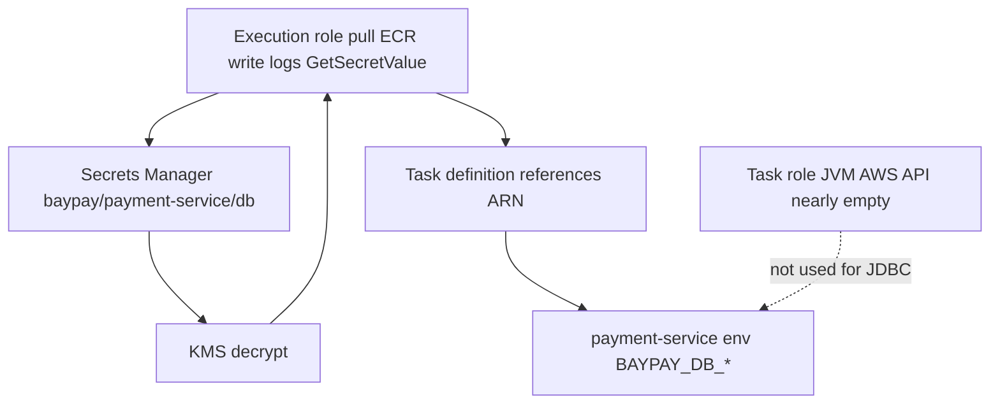

# L-11.5 — IAM, Secrets Manager, and KMS

**Module:** 11 — AWS Container Platforms  
**Duration:** 30 minutes  
**Diagram:** AEJE-D-050  
**Case study:** BayPay Financial Services (fictional)  
**Region:** `us-west-2`

---

## Why this matters

`application-prod.yml` still reads `BAYPAY_DB_URL`, `BAYPAY_DB_USER`, and `BAYPAY_DB_PASSWORD`. Module 9 forbade those values in image layers. Module 10 put them in Secret `baypay-db`. On ECS the store is **Secrets Manager** in **`us-west-2`**, usually encrypted with **KMS**. Two IAM roles sit on the task definition: the **execution role** (agent pulls the image, writes logs, fetches secrets at start) and the **task role** (the JVM’s AWS API identity). If Jordan Voss pastes `changeme` into task-def JSON in git, or if Riley Okonkwo attaches AdministratorAccess “so the lab works,” Avery Chen’s ledger credential is already gone.

---

## Learning objectives

- Separate the ECS **execution role** from the **task role** and name what each may do for `payment-service`.
- Inject `BAYPAY_DB_*` from Secrets Manager at task start; never commit them in task-def JSON.
- Explain KMS as the encryption key for those secrets, not as a second password file.
- Apply least privilege on paper; live IAM apply is optional and must be destroyed after the lab.

---

## Concept explanation

**Execution role** (`taskExecutionRole`). The ECS agent assumes this role **before** your JVM is a process. It needs:

- `ecr:GetAuthorizationToken` and pull permissions on `baypay/payment-service` in `us-west-2`
- `logs:CreateLogStream` / `PutLogEvents` on the log group (L-11.6)
- `secretsmanager:GetSecretValue` on the BayPay secret **if** you use the `secrets` / `valueFrom` injection at start
- `kms:Decrypt` on the key that encrypts that secret

It does **not** need to call STS as the application, write to S3 on Avery’s behalf, or describe every secret in the account.

**Task role** (`taskRole`). The **container** assumes this role via the AWS SDK default chain. Teaching `payment-service` talks to a JDBC URL, not to AWS APIs, so the task role may be **empty or near-empty**. That is a feature. Do not copy the execution role onto the task role “to be safe.” If a later module uploads a receipt to S3, you add `s3:PutObject` on **one** prefix — not `s3:*`.

**Secrets Manager.** One secret (or one JSON blob) holds the `BAYPAY_DB_*` keys. Teaching name: `baypay/payment-service/db` in `us-west-2`. The task definition **references the ARN**; it does not contain the password string. Map:

| Secret key | Env var |
|---|---|
| `BAYPAY_DB_URL` or `url` | `BAYPAY_DB_URL` |
| `BAYPAY_DB_USER` or `username` | `BAYPAY_DB_USER` |
| `BAYPAY_DB_PASSWORD` or `password` | `BAYPAY_DB_PASSWORD` |

Use the **same names** as L-6.4 / L-9.5 / Module 10. Do not invent `BAYPAY_DB_PASS`.

**KMS.** Secrets Manager encrypts payloads with a KMS key (AWS-managed or a CMK you name). The execution role’s `kms:Decrypt` is how fetch works. A CMK lets you separate “who may decrypt BayPay DB” from “who may decrypt something else.” Student apply may use the AWS-managed key to avoid extra key objects — disclose that. Do not create three CMKs “for realism.”

**Not Parameter Store as a dump.** SSM Parameter Store can hold config. This course’s locked secret store for `BAYPAY_DB_PASSWORD` is Secrets Manager. Do not put the password in a Terraform `default` or in `terraform.tfvars` committed to git.

**Access keys.** There are **no** long-lived access keys in the container. No `AWS_ACCESS_KEY_ID` in the task definition. The roles are enough.

---

## Visual explanation



Alt text: AEJE-D-050. The ECS execution role pulls ECR, writes logs, and calls Secrets Manager; KMS decrypts secret baypay/payment-service/db; the task definition references the secret ARN so payment-service receives BAYPAY_DB_* at start; the task role is the JVM’s AWS identity and stays nearly empty for JDBC-only work.

---

## Architecture

Sam Okada owns role boundaries. Jordan owns which secret ARN a revision may reference. Riley should be able to say “the password is not in the task JSON” on the first minute of a leak page. Priya alerts on `GetSecretValue` from unexpected roles.

Injection happens at **task start**. Rotating the secret does not rewrite a running JVM’s env until a **new task** starts. Plan a service bounce (new deployment) after rotation. That is the same “restart to pick up Secret” story as Module 10, different API.

Student apply: public subnet, Fargate, Secrets Manager, execution role. No EKS IRSA unless you are writing ARCHITECT-1102 on paper. Paper + `terraform validate` is enough if you cannot spend. **Destroy roles, secrets, and key aliases you created** after the lab — leftover secrets still exist and still look like credentials.

---

## Production example

A teammate commits `task-definition.json` with `"value": "changeme"` on `BAYPAY_DB_PASSWORD` “because the secret wasn’t ready.” The fictional password is still a **habit fail**. Git history now has a production-shaped leak. Fix: `valueFrom` ARN only; purge the file from the default branch; rotate the real secret if this were not synthetic.

A second story: execution role and task role are the same AdministratorAccess role. A CVE in a dependency (L-11.1 scan) now means the JVM can delete the cluster. Split the roles. Shrink both.

A third: KMS is “too hard,” so the secret is created as plaintext in an unencrypted SSM parameter named `password`. That is not this course’s pattern. Use Secrets Manager + KMS.

---

## Code/configuration example

Illustrative — password never appears. Not a lab dump.

```json
"secrets": [
  {
    "name": "BAYPAY_DB_URL",
    "valueFrom": "arn:aws:secretsmanager:us-west-2:123456789012:secret:baypay/payment-service/db:BAYPAY_DB_URL::"
  },
  {
    "name": "BAYPAY_DB_USER",
    "valueFrom": "arn:aws:secretsmanager:us-west-2:123456789012:secret:baypay/payment-service/db:BAYPAY_DB_USER::"
  },
  {
    "name": "BAYPAY_DB_PASSWORD",
    "valueFrom": "arn:aws:secretsmanager:us-west-2:123456789012:secret:baypay/payment-service/db:BAYPAY_DB_PASSWORD::"
  }
]
```

Execution-role sketch (least privilege, paper):

```hcl
# execution: ecr pull, logs, this secret, this kms key
# task: no secretsmanager:GetSecretValue unless the JVM calls the API itself
```

Forbidden in git:

```text
AWS_ACCESS_KEY_ID=AKIA...
BAYPAY_DB_PASSWORD=changeme
"environment": [{ "name": "BAYPAY_DB_PASSWORD", "value": "changeme" }]
```

---

## Trade-offs

| Choice | Gain | Cost |
|---|---|---|
| Split execution vs task role | Blast radius | Two roles to review |
| One fat role | Fast lab | Any RCE is account admin |
| Secrets Manager JSON | One ARN, rotation API | Must map keys to env names correctly |
| Env literals in task JSON | Works offline | Secret in git, in console, in every revision |
| Customer-managed KMS key | Separate decrypt policy | Extra object; student may use AWS-managed |
| IRSA on EKS | Kube-shaped identity | Not the apply default; paper only (L-11.3) |

---

## Failure modes

- Putting `BAYPAY_DB_*` values in the task definition or in Terraform committed files.
- Granting the task role the same policy as the execution role.
- Attaching `AdministratorAccess` or `AmazonECS-FullAccess` to get past an error.
- Forgetting `kms:Decrypt` and calling it “Secrets Manager is down.”
- Committing access keys for `docker login` or for the JVM.
- Creating secrets in `us-east-1` while the task runs in `us-west-2`.
- Leaving secrets behind after the lab.

---

## Security/reliability implications

The execution role is **release infrastructure**. The task role is **application identity**. Confusing them is how a log driver becomes a data exfil path. KMS key policy plus IAM is the encrypt/decrypt contract — disabling the key breaks **every** new task start, which is an availability lever as well as a security one. Reliability: rotation without a deploy leaves old env in memory. Communication after a suspected leak must say what was in git, what was rotated, and what tasks still run the old revision.

---

## Interview perspective

**Engineer.** Execution role pulls ECR, writes CloudWatch logs, and gets `BAYPAY_DB_*` from Secrets Manager. Task role is what the JVM is in AWS. Password is not in the JSON.

**Senior.** I can write the `valueFrom` ARN form and the KMS decrypt need. I refuse access keys in the container. I rotate then bounce the service.

**Staff.** I treat role split as a control, not a style. I will not copy OpenShift Secret YAML into an ECS task as plaintext to “make it familiar.”

**Principal.** I fund least-privilege review of execution versus task the same way I fund kube RBAC. I will not accept `changeme` in git as a teaching shortcut that graduates.

---

## Key takeaways

- **Execution role** ≠ **task role**. Pull/logs/secrets-at-start vs JVM AWS API.
- `BAYPAY_DB_*` from Secrets Manager in `us-west-2`; KMS encrypts.
- Never put secret **values** in task-def JSON or git.
- Task role stays narrow; JDBC does not need `s3:*`.
- Destroy secrets and roles after the lab. Paper + validate is enough if you cannot spend.

---

## Knowledge check

1. Which role needs `ecr:BatchGetImage`, and which role should **not** get `secretsmanager:GetSecretValue` if the JVM never calls that API?
2. Why is `"environment": [{ "name": "BAYPAY_DB_PASSWORD", "value": "changeme" }]` a fail even though BayPay is fictional?
3. After someone rotates the Secrets Manager payload, why might a running task still use the old password?

<details>
<summary>Spoiler — answers</summary>

1. Execution role pulls from ECR. Task role should not get `GetSecretValue` unless the application itself reads Secrets Manager; injection is done by the agent via the execution role.
2. It teaches committing credentials and putting them in every task revision. The habit is what we grade; `changeme` is still a secret-shaped value in git.
3. Env is injected at task start. Rotation needs new tasks (a service deployment) to pick up the new value.

</details>

---

## Related lab

[SECURITY-1103](../../../../labs/SECURITY-1103/README.md) — IAM, secrets, and KMS for `payment-service`. Paper + `terraform validate` is enough if you cannot spend. If you apply, destroy secrets, roles, and keys after the lab. Do not open `solutions/` first.

---

## Related PAKS

Optional: `docs/16-cloud-architecture/aws-fundamentals.md` (shared responsibility, IAM). The role split and `BAYPAY_DB_*` contract stand alone without a PAKS login.
