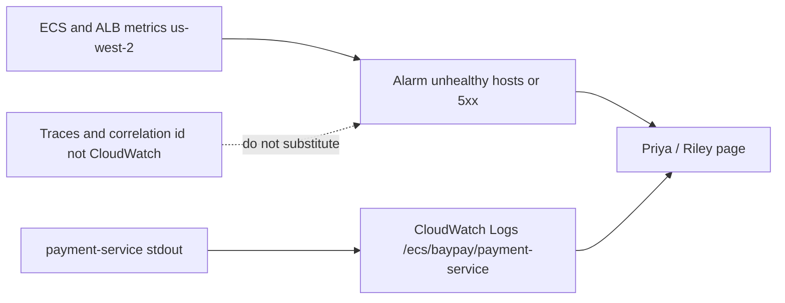

# L-11.6 — Amazon CloudWatch

**Module:** 11 — AWS Container Platforms  
**Duration:** 30 minutes  
**Case study:** BayPay Financial Services (fictional)  
**Region:** `us-west-2`

---

## Why this matters

When a Fargate task in `us-west-2` fails an ALB check, Riley Okonkwo needs **stdout** and **service metrics**, not a guess. **CloudWatch Logs** is where the `awslogs` driver puts `payment-service` lines. **CloudWatch Metrics** is where ECS and the ALB publish healthy-host count, CPU, and 5xx. **Alarms** page Priya Nair. None of that is a **trace**. Module 1’s correlation id on Avery Chen’s `POST /api/v1/payments` is still how you stitch authorize → ledger. CloudWatch is the AWS signal layer. It is not Jaeger, not X-Ray-by-mandate, and not “we have observability because the log group exists.”

---

## Learning objectives

- Name the log group for `payment-service` and the `awslogs` driver on the task definition.
- Read ECS and ALB metrics that matter (CPU, running count, healthy hosts, 5xx) without treating them as proof of a Java root cause.
- Write an alarm that pages a *symptom* (unhealthy hosts, 5xx), not a closed RCA.
- Refuse CloudWatch as a substitute for traces or for Module 10’s kube events on a different estate.

---

## Concept explanation

**Logs.** The task definition sets `logConfiguration` to `awslogs`, region **`us-west-2`**, group teaching name `/ecs/baypay/payment-service`. Each task gets a stream (often the task id). The **execution role** (L-11.5) must allow `CreateLogStream` and `PutLogEvents`. If that permission is missing, the task can fail to start or silently drop logs — a *permissions class*, not “the JVM hung.”

**What to log.** Structured JSON with `correlationId`, payment id (not PAN), outcome. The reference app already leans this way. Do not log `BAYPAY_DB_PASSWORD`. Do not log full card numbers. `INFO` on every authorize is a bill and a PII review; `WARN`/`ERROR` plus sampled info is the adult setting.

**Retention.** Infinite retention is a storage bill and a compliance pile. Student apply: short retention (e.g. 3–7 days) plus **destroy the group after the lab**. Production BayPay would pick a policy with legal; that is not a 90-minute apply.

**Metrics.** Useful teaching series:

| Metric | Source | Use |
|---|---|---|
| `CPUUtilization` / `MemoryUtilization` | ECS service | Capacity, not “G1 is broken” |
| `RunningTaskCount` vs desired | ECS | Placement / crash loop class |
| `HealthyHostCount` / `UnHealthyHostCount` | ALB target group | Front-door symptom (L-11.4) |
| `HTTPCode_Target_5XX_Count` | ALB | Merchant-visible fail |
| `TargetResponseTime` | ALB | Latency; still not a trace |

**Alarms.** Alarm on `UnHealthyHostCount >= 1` for N minutes, or on 5xx burst, or on `RunningTaskCount < desired`. The alarm **starts** an investigation. It does not name INCIDENT-1104’s cause. It does not replace a readiness path that is wrong.

**Not traces.** A trace is a directed graph of spans across authorize, worker, and notification. CloudWatch Logs Insights can `filter @message like correlationId` if you printed it. That is a **search**, not a distributed trace. X-Ray or an OTel collector is optional literacy; this course does **not** require you to apply X-Ray (extra cost, extra daemon story). Do not claim “we have traces” because you have an alarm.

**Not kube.** `kubectl logs` and Events live on the Module 10 estate. Do not tell Sam Okada to open CloudWatch for a Pod in `baypay-prod`, and do not `kubectl` an ECS task.

**Container Insights** adds more ECS metrics and another price. Student default: **off** unless a lab discloses cost. Basic ECS + ALB metrics are enough for literacy.

---

## Visual explanation



Alt text: Fargate payment-service stdout goes to CloudWatch Logs group /ecs/baypay/payment-service; ECS and ALB metrics in us-west-2 feed alarms that page on-call; traces and correlation ids remain a separate concern and are not replaced by CloudWatch.

---

## Architecture

Jordan’s revision should not change the log group name casually — Insights saved queries break. Priya owns alarms and dashboards. Riley’s first five minutes: task stopped reason, last log lines, healthy-host metric, **correlation id** from the merchant if they have one. Sam owns the execution-role log permissions.

Student apply: one log group, `us-west-2`, short retention, `awslogs` on the container. No OpenSearch (ACCOUNT.md forbids it for the lab). No subscription filters to Lambda “for a real pipeline.” Paper + `terraform validate` is enough. **Destroy log groups** after the lab; leftover logs still store.

---

## Production example

Priya’s alarm: `HealthyHostCount` is 0 for four minutes. Riley opens the log group, not the WAS cell. One task streams a Boot readiness failure; the other streams nothing because it never registered a stream (execution role). Those are **two different evidence lines**. This lesson does not say which, if either, is INCIDENT-1104. Write both. Collect the next gate.

A second story: CPU is 90% and someone “scales to 10 tasks” from a CloudWatch graph (L-11.8). The graph cannot see a GC storm (L-8.5) or a Hikari pool wait. Metrics are **capacity clues**. jcmd and logs still exist as ideas; on Fargate you get logs and a new revision, not SSH.

A third: a dashboard has fifty widgets and no correlation id. Avery Chen’s `$84.00` is unfindable. Add the id to the log line. Do not add OpenSearch to look senior.

---

## Code/configuration example

Task definition log driver (illustrative):

```json
"logConfiguration": {
  "logDriver": "awslogs",
  "options": {
    "awslogs-group": "/ecs/baypay/payment-service",
    "awslogs-region": "us-west-2",
    "awslogs-stream-prefix": "payment"
  }
}
```

Alarm sketch — symptom, not diagnosis:

```hcl
resource "aws_cloudwatch_metric_alarm" "unhealthy" {
  alarm_name          = "baypay-payment-unhealthy-hosts"
  comparison_operator = "GreaterThanOrEqualToThreshold"
  evaluation_periods  = 3
  metric_name         = "UnHealthyHostCount"
  namespace           = "AWS/ApplicationELB"
  period              = 60
  statistic           = "Maximum"
  threshold           = 1
  alarm_description   = "Symptom: target group has unhealthy hosts. Not an RCA."
  # dimensions: LoadBalancer, TargetGroup — lab fills ARNs
  tags = {
    Course      = "AEJE"
    Module      = "11"
    Environment = "student"
    Expiration  = "2026-09-04"
  }
}
```

Logs Insights (paper):

```text
fields @timestamp, @message
| filter @message like /11111111-1111-1111-1111-111111111111/
| sort @timestamp desc
```

That query finds Avery Chen **if** you logged the customer id. It is not a trace viewer.

---

## Trade-offs

| Choice | Gain | Cost |
|---|---|---|
| `awslogs` | No sidecar | Another AWS API; execution-role dependency |
| FireLens / Fluent Bit | Routing, redaction | Extra container; not required here |
| Short retention | Cheap student | Less archaeology |
| Infinite retention | Comfort | Storage + PII pile |
| Alarm on unhealthy hosts | Fast page | Noisy if health path is wrong (L-11.4) |
| Container Insights / X-Ray / OpenSearch | Deeper product | Cost; **out of student default** |

---

## Failure modes

- Claiming traces because CloudWatch exists.
- Alarming on CPU only and missing 5xx.
- Missing execution-role log permissions and concluding “the app prints nothing.”
- Logging secrets or PAN.
- Installing OpenSearch or X-Ray for a 90-minute lab.
- Reading kube Events for an ECS page (or CloudWatch for `baypay-prod`).
- Leaving log groups forever after the lab.
- Using this lesson to name INCIDENT-1104’s root cause.

---

## Security/reliability implications

Log groups are **data stores**. Anyone with `GetLogEvents` can read authorize decisions and, if you were sloppy, secrets. Treat Insights access as production-data access. Reliability: an alarm that pages on a misconfigured health check trains people to ignore pages. Fix the check (L-11.4); do not disable the alarm to “stop the noise” without a written exception. Destroy student groups so the next cohort does not inherit Avery Chen’s synthetic history as if it were theirs.

---

## Interview perspective

**Engineer.** Logs go to `/ecs/baypay/payment-service` in `us-west-2` via `awslogs`. I can name ALB `UnHealthyHostCount` and 5xx. That is not a trace.

**Senior.** I alarm on symptoms. I correlate with the request id from Module 1. I check the execution role before I say the JVM is silent.

**Staff.** I will not apply OpenSearch or X-Ray to look complete. I keep kube and ECS observability stories on their own estates.

**Principal.** I fund logs + metrics + **explicit** tracing later, not a single AWS console tab as the strategy. I score on-call on evidence classes, not on widget count.

---

## Key takeaways

- CloudWatch Logs + metrics + alarms in `us-west-2` are the AWS signal layer.
- They are **not** a substitute for traces or correlation ids.
- Alarm on unhealthy hosts / 5xx as **symptoms**.
- No OpenSearch/X-Ray/Container Insights required for student apply.
- Destroy log groups after the lab. Paper + validate is enough.

---

## Knowledge check

1. A task is running but the log group is empty. Which role do you inspect first, and why is that not automatically a Java hang?
2. Why is a CloudWatch alarm on `UnHealthyHostCount` not an RCA for INCIDENT-1104?
3. Does enabling CloudWatch mean BayPay has distributed traces?

<details>
<summary>Spoiler — answers</summary>

1. The execution role (and `awslogs` options / region). Missing `PutLogEvents` or a wrong region/group is an IAM/config class; the JVM may be fine.
2. The alarm states a symptom: the target group’s check failed. It does not name why (wrong path, bad SG, process down, readiness 503, …). Work the pack gates.
3. No. Logs and metrics are not a span graph. Correlation ids help you search; traces are a separate design.

</details>

---

## Related lab

[INCIDENT-1104](../../../../labs/INCIDENT-1104/README.md) — unhealthy ALB target **symptoms**. Use logs and metrics as evidence gates. Do not open `solutions/INCIDENT-1104/` until the worksheet is filled. This lesson does **not** name that pack’s cause.

[BUILD-1101](../../../../labs/BUILD-1101/README.md) attaches `awslogs`. Paper + `terraform validate` is enough if you cannot spend. Destroy the log group after any apply.

---

## Related PAKS

Optional: `docs/16-cloud-architecture/aws-fundamentals.md`. The “logs ≠ traces” rule stands alone without a PAKS login.
