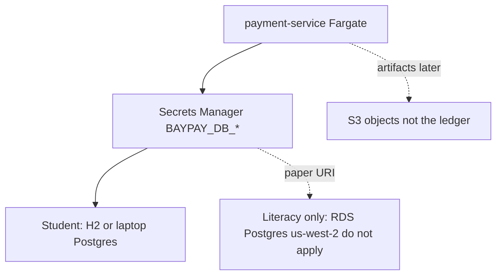

# L-11.7 — Amazon RDS and S3

**Module:** 11 — AWS Container Platforms  
**Duration:** 30 minutes  
**Case study:** BayPay Financial Services (fictional)  
**Region:** `us-west-2`

---

## Why this matters

`payment-service` still persists a payment lifecycle to a database. In production-shaped AWS that database is often **Amazon RDS** (PostgreSQL) in **`us-west-2`**. Objects that are not rows — receipts, export files, Terraform state in Module 12 — often land on **S3**. This lesson is **literacy**. **Student apply does not create RDS.** ACCOUNT.md is explicit: multi-AZ RDS is out of scope for a 90-minute lab; use the local H2 / Postgres story or a disclosed estimate. If you `apply` an `aws_db_instance` to “feel real,” you will pay for compute and storage until someone remembers to destroy it — and you will have violated the cost standard.

---

## Learning objectives

- Place RDS as the managed Postgres for `BAYPAY_DB_URL` *in a real estate*, not as a BUILD-1101 resource.
- Place S3 as object storage (artifacts, reports), not as the payment ledger.
- Estimate why RDS and NAT-to-RDS stories blow a student budget.
- Keep using local H2/Postgres and Secrets Manager *names* so the JVM contract does not change.

---

## Concept explanation

**RDS.** A managed relational database: engine, instance class, storage, backup window, optional Multi-AZ. For BayPay the engine story is **PostgreSQL**, matching `jdbc:postgresql://…` from earlier modules. The app still wants:

```text
BAYPAY_DB_URL=jdbc:postgresql://<host>:5432/baypay
BAYPAY_DB_USER=…
BAYPAY_DB_PASSWORD=…   # Secrets Manager, not git (L-11.5)
```

The **hostname** in a real apply would be an RDS endpoint. In this course the student process keeps the **local** database (H2 or a laptop Postgres) or a **paper** endpoint `db-east.baypay.example`. You may **write** an RDS URI on a worksheet. You may **not** create the instance unless a later, cost-disclosed lab says so (none of Module 11’s student applies do).

**Why RDS is expensive here.** Even `db.t4g.micro` is **hours of instance** plus storage plus backup. Multi-AZ doubles compute “for realism.” A private RDS subnet almost always drags in a **NAT Gateway** so Fargate in public subnets can… wait, that design is already confused. Private tasks + NAT + private RDS is a common reference architecture and a **dollars/day** NAT bill plus RDS. ACCOUNT.md forbids that combo for student apply.

**S3.** Object store. Buckets in `us-west-2`. Good uses: CI artifacts, CSV exports, static assets, **Terraform state** (Module 12 literacy). Bad uses: storing each `Payment` entity as a JSON object and calling it a ledger. S3 is not ACID for `RECEIVED → AUTHORIZED → COMPLETED`. Do not “modernize” the modular monolith by writing Avery Chen’s row to S3.

**S3 cost.** Storage is cheap at student scale; **forgotten buckets** and **cross-region copies** are how bills surprise you. Public `BLOCK` must stay on. Do not upload `solutions/` or a dump of Secrets Manager. Tag `Expiration` and delete after the lab if you created a bucket at all. Many Module 11 paths need **zero** buckets.

**IAM.** The **task role** (L-11.5) gets `s3:PutObject` on one prefix only if the app uploads. RDS does not use a task role for JDBC; it uses the database user in Secrets Manager. Do not attach `AmazonRDSFullAccess` to the execution role.

**Backups vs DR.** RDS automated backups and S3 versioning are literacy. Multi-region RDS and S3 replication are **not** a student apply. Module 15-style DR is a later conversation.

---

## Visual explanation



Alt text: payment-service reads BAYPAY_DB_* from Secrets Manager; student runtimes keep using H2 or laptop Postgres; RDS PostgreSQL in us-west-2 is shown as literacy only and is not created on apply; S3 holds objects later, not payment ledger rows.

---

## Architecture

Riley’s on-call for “DB down” on a **student Fargate** service is almost certainly **not** RDS — there isn’t one. Check the local/paper URL, the secret injection, and readiness (L-11.4). Priya’s cost review flags any `db.t*` instance a student launched by following a blog.

Sam Okada’s **future** production picture (paper): Fargate in private subnets, RDS in private subnets, NAT or VPC endpoints as a **funded** choice, KMS on RDS storage, security group from task SG to `5432` only. That picture is ARCHITECT-1102-adjacent. It is not BUILD-1101.

OpenShift and kube estates still use Secret `baypay-db` and a Postgres you already had. RDS is not required to make Module 10 valid.

---

## Production example

A well-meaning student adds this to BUILD-1101 because “payments need a real database”:

```hcl
resource "aws_db_instance" "baypay" {
  engine            = "postgres"
  instance_class    = "db.t3.medium"
  multi_az          = true
  allocated_storage = 100
}
```

That is a **fail** against ACCOUNT.md: Multi-AZ RDS, larger than necessary, and a weekend of charges if destroy is skipped. The learning objective was ECS + ECR + ALB. Use H2 or a disclosed local Postgres. Write the RDS *shape* on PF-aws-platform.md as literacy.

A second story: Jordan dumps `payment-service` heap-ish JSON to `s3://baypay-public/payments/` with the bucket public so a partner can “integrate.” That is a data leak pattern. Block public access. Use a task-role prefix. Do not store the ledger there.

---

## Code/configuration example

Paper JDBC — **do not apply RDS**:

```text
# Student / local (allowed)
BAYPAY_DB_URL=jdbc:h2:mem:baypay;MODE=PostgreSQL

# Paper production shape (do not terraform apply in Module 11)
BAYPAY_DB_URL=jdbc:postgresql://baypay.xxxxx.us-west-2.rds.amazonaws.com:5432/baypay
```

S3 bucket sketch **only if** a lab you are allowed to spend on needs artifacts — still tag and destroy:

```hcl
resource "aws_s3_bucket" "artifacts" {
  bucket = "aeje-student-baypay-artifacts-123456789012"
  tags = {
    Course      = "AEJE"
    Module      = "11"
    Environment = "student"
    Expiration  = "2026-09-04"
  }
}

resource "aws_s3_bucket_public_access_block" "artifacts" {
  bucket                  = aws_s3_bucket.artifacts.id
  block_public_acls       = true
  block_public_policy     = true
  ignore_public_acls      = true
  restrict_public_buckets = true
}
```

`terraform validate` of a module that **does not** contain `aws_db_instance` is the happy path. If your tree has RDS for Module 12 experiments, do not apply it here.

---

## Trade-offs

| Choice | Gain | Cost |
|---|---|---|
| Local H2 / laptop Postgres | $0, matches earlier modules | Not Multi-AZ; not the prod endpoint |
| RDS single-AZ tiny | Real endpoint | Hours + storage; **out of Module 11 apply** |
| RDS Multi-AZ | Failover literacy | 2× instance; forbidden for 90-minute realism |
| S3 for artifacts | Cheap objects | Lifecycle and public-access hygiene |
| S3 as ledger | None | No payment state machine integrity |
| NAT so Fargate reaches private RDS | Classic diagram | NAT **dollars/day** — do not add |

---

## Failure modes

- Creating RDS (especially Multi-AZ) in BUILD-1101 or SECURITY-1103.
- Adding NAT Gateway so a blog’s private-subnet RDS diagram works.
- Putting the ledger on S3.
- Public buckets or `BAYPAY_DB_*` in object metadata.
- Attaching `AmazonRDSFullAccess` / `AmazonS3FullAccess` to either ECS role.
- Treating “no RDS in the account” as an INCIDENT-1104 RCA — this lesson does not close that pack.
- Forgetting that OpenShift can already talk to Postgres without AWS.

---

## Security/reliability implications

RDS security groups and IAM auth (literacy) are how you stop `5432` on the internet. Student public-subnet Fargate plus a **public** RDS would be a disaster if anyone applied it — another reason you do not apply RDS. S3 public access is a leak class. Reliability: a payments ledger needs transactions and the state machine (Module 1), not eventual-object writes. Backups are meaningless if nobody owns a restore test; you will not run that test in this module.

---

## Interview perspective

**Engineer.** Student apply does not create RDS. The app still uses `BAYPAY_DB_*`. S3 is for objects, not payment rows.

**Senior.** I can draw private RDS + Fargate on paper and price Multi-AZ and NAT. I refuse to apply that for a 90-minute lab.

**Staff.** I keep the JVM contract stable across H2, laptop Postgres, and a future RDS endpoint. I will not move the ledger to S3 to look cloud-native.

**Principal.** I fund RDS when the estate is in AWS *and* the data tier is in scope. I will not pay for student Multi-AZ or NAT to imitate a reference architecture. OpenShift-plus-Postgres remains a valid home.

---

## Key takeaways

- RDS Postgres is the **literacy** data tier in `us-west-2`. **Do not apply it** in Module 11.
- Keep local H2/Postgres and Secrets Manager names.
- S3 is objects, not the `Payment` ledger.
- NAT + Multi-AZ RDS is a cost trap.
- Destroy any bucket you did create. Paper + validate is enough.

---

## Knowledge check

1. Why must BUILD-1101 not include `aws_db_instance` even though `payment-service` needs a database?
2. Why is S3 the wrong store for Avery Chen’s payment state machine?
3. A blog adds NAT so Fargate can reach private RDS. What does this course say?

<details>
<summary>Spoiler — answers</summary>

1. ACCOUNT.md puts RDS out of student apply (cost, duration). Use local H2/Postgres or a paper URI; Secrets Manager still names `BAYPAY_DB_*`.
2. S3 objects are not a transactional ledger for `RECEIVED → … → COMPLETED` and idempotent authorize.
3. Do not add NAT for a 90-minute lab. Student Fargate uses public subnets + IGW; RDS is not created. NAT is dollars/day.

</details>

---

## Related lab

[BUILD-1101](../../../../labs/BUILD-1101/README.md) — deploy ECS/Fargate **without** RDS. [ARCHITECT-1102](../../../../labs/ARCHITECT-1102/README.md) may discuss a future data tier on paper. Do not apply RDS. Do not open `solutions/` first.

---

## Related PAKS

Optional: `docs/16-cloud-architecture/aws-fundamentals.md` and `docs/26-cost-and-finops/overview.md`. The “no student RDS” rule stands alone without a PAKS login.
