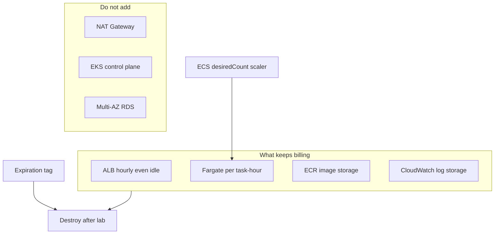

# L-11.8 — Autoscaling and cost

**Module:** 11 — AWS Container Platforms  
**Duration:** 30 minutes  
**Diagram:** AEJE-D-052  
**Case study:** BayPay Financial Services (fictional)  
**Region:** `us-west-2`

---

## Why this matters

Fargate bills **while tasks run**. An ALB bills **while it exists**, including overnight with zero Harbor Bike Co traffic. A NAT Gateway or an EKS control plane — if anyone ignored ACCOUNT.md — bills **whether Avery Chen pays or not**. Autoscaling on ECS changes `desiredCount`. That can save money at 03:00 Pacific and can multiply two broken heaps at noon if you scale on CPU during a GC storm (L-8.5). Tags `Course=AEJE`, `Module`, `Lab`, `Environment=student`, and **`Expiration`** are how Priya Nair finds leftover labs before finance does. **Destroy after the lab.** Paper + `terraform validate` is enough if you cannot spend.

---

## Learning objectives

- Scale an ECS service on Fargate (min/max/desired) and say what a new task actually costs (another JVM, another Hikari pool).
- Price the **idle ALB** as a first-class line item, not a rounding error.
- Use `Expiration` and the locked tag set; refuse NAT/EKS as silent add-ons.
- Write a destroy checklist that includes ALB, service, cluster, ECR images, secrets, and log groups.

---

## Concept explanation

**Fargate scale.** The ECS service `desiredCount` is the knob. Application Auto Scaling can raise or lower it from CPU, memory, or ALB request count. Teaching student apply often **fixes** count at **2** and scales only on paper. If you enable tracking, set a **max** (e.g. 4) so a bad metric cannot create twenty Spring Boot JVMs.

Each extra task is:

- Fargate vCPU-hours and GB-hours in `us-west-2`
- Another heap and JIT warmup (L-9.6)
- Another pool of DB connections — even if RDS was not applied, the *shape* still matters in prod (L-4.3, L-11.7)
- Another ALB target that must pass `/actuator/health/readiness`

Scaling from 2 to 8 because `CPUUtilization` is 80% during full GC **multiplies** the storm. Read the logs (L-11.6) before you trust the scaler.

**ALB idle cost.** Application Load Balancers charge an hourly rate plus LCU. A forgotten ALB is **about dollars per day**, every day, including Saturday. That often **beats** two tiny Fargate tasks left running. Destroy the listener, the balancer, and the target group. COST-1105 will make you find idle balancers on purpose.

**ECR storage.** Images and untagged layers persist after the service is gone (L-11.1). Empty-looking repos still bill.

**CloudWatch.** Log ingestion and stored bytes. Short retention on student groups.

**The expensive things you must not add.**

| Resource | Why it hurts | Course rule |
|---|---|---|
| NAT Gateway | Dollars/day, idle or not | Do not apply |
| EKS control plane | Hourly with zero Pods | Literacy / ARCHITECT-1102 only |
| Always-on EC2 launch type | Instance hours | Fargate default |
| Multi-AZ RDS | Instance × 2 + storage | Do not apply (L-11.7) |
| OpenSearch | Cluster hours | Forbidden in ACCOUNT.md |

**Tags.** Every apply resource:

```text
Course=AEJE
Module=11
Lab=BUILD-1101   # or SECURITY-1103 / COST-1105
Environment=student
Expiration=2026-09-04   # ISO date you will not miss
```

`Expiration` is a **date you honor**, not decoration. A cost lab query is “show `Environment=student` where `Expiration` is today or earlier.” Untagged ALBs are how leftovers survive.

**Scale to zero.** Setting `desiredCount = 0` stops Fargate burn. It does **not** stop the ALB. You must delete or disable the balancer separately. That is the exam trick.

**FinOps habit.** Estimate **before** apply: ALB hourly × hours + Fargate (CPU/memory × tasks × hours) + ECR GB. If the estimate exceeds what you may spend, **stop** and validate only.

---

## Visual explanation



Alt text: AEJE-D-052. Cost levers for BayPay on ECS in us-west-2: ALB hourly idle charge, Fargate per-task hours, ECR and log storage; ECS desiredCount scaling drives Fargate only; NAT Gateway, EKS control plane, and Multi-AZ RDS are refused; Expiration tags feed a destroy-after-lab checklist.

---

## Architecture

Jordan’s deploy should not raise `max` capacity as a substitute for a broken release. Priya owns budgets and alarms on estimated charges (literacy; student accounts vary). Riley’s incident scale-up is a **written** `desiredCount` change with a revert time, not an unbounded tracking policy left on overnight.

Sam Okada’s platform account uses the same tags so COST-1105 is a query, not archaeology. Module 10’s kube estate has **$0** cloud cost; do not “save money” by applying EKS. OpenShift remaining valid is also a cost sentence: you do not pay AWS to abandon a cluster you already run well.

---

## Production example

Friday 16:00: BUILD-1101 apply succeeded. The student scales `desiredCount` to 0 “to save Fargate” and goes home. Monday: the ALB is still there. Finance asks about `$20` of ELB. Fix: destroy the ALB. Teach the pair: **tasks ≠ balancer**.

Second story: someone enables target-tracking on ALBRequestCountPerTarget with max 20 before a load-test script. The script is a busy loop. Twenty tasks start. Secrets Manager still points at H2-shaped config; the bill is real. Cap max at 4. Stop the script. Destroy.

Third: a teammate adds NAT “because we might put RDS in later this weekend.” The RDS never appears. The NAT does. Delete it. Do not add it.

---

## Code/configuration example

Service autoscaling sketch — paper / validate; keep `max_capacity` tiny:

```hcl
resource "aws_appautoscaling_target" "payment" {
  max_capacity       = 4
  min_capacity       = 1
  resource_id        = "service/baypay-student/payment-service"
  scalable_dimension = "ecs:service:DesiredCount"
  service_namespace  = "ecs"
}

# Do not scale on CPU during a suspected GC storm without logs.
```

Destroy checklist (run after every apply; order illustrative):

```text
1. aws ecs update-service --desired-count 0   # stops Fargate; ALB still bills
2. Delete ECS service, then cluster
3. Delete ALB, listeners, target groups
4. Delete unused ENIs if the VPC left orphans
5. Delete ECR images (and repo if you created it)
6. Delete Secrets Manager secret (recovery window 0 in a sandbox if allowed)
7. Delete log group /ecs/baypay/payment-service
8. Confirm Cost Explorer or the billing console: no ALB, no NAT, no RDS, no EKS
```

`terraform destroy` is the preferred path if apply was Terraform. Confirm the ALB is actually gone.

---

## Trade-offs

| Choice | Gain | Cost |
|---|---|---|
| Fixed `desiredCount` 2 | Predictable lab bill | No auto reaction to load |
| Auto scale 1–4 on ALB requests | Tracks merchants | Can amplify bad deploys / GC |
| Scale to 0 at night | No Fargate | ALB still idle-bills |
| No ALB (curl task IP) | Cheaper | Not the front-door lesson |
| NAT / EKS / RDS “just in case” | Familiar diagrams | The actual bill |
| Paper + validate only | **$0** | No live muscle memory |

---

## Failure modes

- Leaving the ALB overnight after scaling tasks to zero.
- Unbounded max capacity.
- Scaling on CPU as a substitute for a readiness or GC diagnosis.
- Untagged resources that COST-1105 cannot find.
- Applying NAT, EKS, or RDS to “finish” cost optimization.
- Treating ECS as cheaper than OpenShift without counting people and the clusters you already have.
- Skipping destroy because `terraform validate` was the grade — apply implies destroy.

---

## Security/reliability implications

Autoscaling is an availability lever and an **abuse** lever: a flood of requests (or a health-check loop) can spend the account. Caps and alarms are security. Tags do not secure data; they secure **operations**. Reliability: scale-out does not fix a wrong Actuator path (L-11.4) or a missing secret (L-11.5). Communication after COST-1105 must say what still exists and the `Expiration` date you missed, if any.

---

## Interview perspective

**Engineer.** Fargate cost is task-hours. ALB cost is hourly even when idle. I tag `Expiration`. I destroy after the lab.

**Senior.** I cap autoscaling. I know scale-to-zero does not stop the ALB. I estimate before apply and I will validate-only if I cannot spend.

**Staff.** I will not add NAT or EKS to a cost lab. I can explain when OpenShift is cheaper *because it already exists*. I query tags, not memory.

**Principal.** I fund destroy discipline and idle-ALB reviews the same way I fund SLO reviews. I refuse reference architectures that imply NAT+EKS+RDS for a teaching sandbox.

---

## Key takeaways

- Scale **Fargate tasks**; **ALB idle** is a separate, larger student-bill risk.
- Tag `Course`, `Module`, `Lab`, `Environment=student`, **`Expiration`**.
- No NAT, no EKS apply, no RDS apply.
- `desiredCount=0` ≠ destroyed balancer.
- Live apply is optional; **destroy-after-lab** is not optional if you applied.

---

## Knowledge check

1. You set `desiredCount` to 0 on Friday. Why might the bill still grow over the weekend?
2. Why is NAT Gateway the wrong way to “optimize” a student Fargate lab?
3. What five tag keys does ACCOUNT.md require, and which one tells Priya it is safe to delete your ALB?

<details>
<summary>Spoiler — answers</summary>

1. The ALB (and leftover ECR/logs/secrets) still exist. Fargate stopped; hourly ALB did not.
2. NAT is dollars/day whether traffic flows or not. Student apply uses public subnets + IGW and never needed NAT. Adding it increases cost; it does not optimize.
3. `Course`, `Module`, `Lab`, `Environment`, `Expiration`. `Expiration` (ISO date) is the delete-by signal.

</details>

---

## Related lab

[COST-1105](../../../../labs/COST-1105/README.md) — cost optimization for the ECS/Fargate estate. Estimate first. Paper + `terraform validate` is enough if you cannot spend. If you applied anything in this module, **destroy it** (ALB especially). Do not open `solutions/` first.

---

## Related PAKS

Optional: `docs/26-cost-and-finops/overview.md` and `docs/16-cloud-architecture/aws-fundamentals.md`. Idle ALB, `Expiration` tags, and the no-NAT/no-EKS rules stand alone without a PAKS login.
