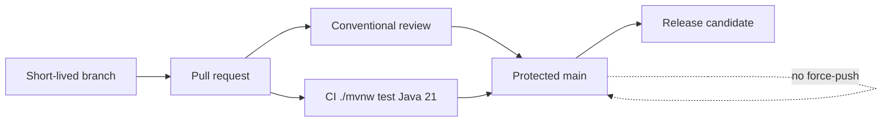

# L-12.1 — Git workflow

**Module:** 12 — Terraform, Ansible and CI/CD  
**Duration:** 30 minutes  
**Diagram:** AEJE-D-054  
**Case study:** BayPay Financial Services (fictional)

---

## Why this matters

Avery Chen’s `POST /api/v1/payments` is authorized by whatever binary `main` last published. If Jordan Voss force-pushes `main` to hide a bad Terraform change, Priya Nair cannot reconstruct which commit minted ECR tag `3.8.1` or which state file still describes the ALB in `us-west-2`. If Riley Okonkwo merges from a laptop with “LGTM” and no review of HCL, CI YAML, or a secrets diff, Harbor Bike Co inherits that habit. Git is not a backup disk. It is the **release control plane**. This lesson is trunk-based flow, protected `main`, and **conventional reviews** — the left edge of AEJE-D-054.

---

## Learning objectives

- Describe BayPay’s trunk / PR model: short-lived branches, merge to `main`, no long-lived `release/east` as the default.
- State why `main` is protected: required CI, required review, **no force-push**, no unsigned “hotfix” on the default branch.
- Run a conventional review that names tests, secrets, cost, and image tags — not a one-word approve.
- Refuse to treat a force-push as incident cleanup, and refuse to commit `BAYPAY_DB_*` or AWS keys.

---

## Concept explanation

**Trunk-based development** means `main` is always the integration branch. Jordan cuts `jvo/pay-3.8.1` (hours, not weeks), opens a pull request, waits for CI and a human, and merges. The next pipeline on `main` is the candidate release. Long-lived `develop` plus `release/2026-09` plus `hotfix/jordan` is GitFlow. This course does not forbid a tagged release; it forbids a second trunk that nobody can delete.

A **pull request** is the review unit. It is not optional ceremony. Payments changes that touch money, Terraform, IAM, or pipeline credentials need two sets of eyes. A docs-only typo can be lighter. The contract is: **CI green + review recorded + merge commit on `main`**. Squash or merge commit is a team choice; rewrite of already-merged `main` is not.

**Protected `main`.** Branch protection (or the equivalent on GitLab / Forgejo) must deny force-push, deny deletion, require a passing `./mvnw test` job (L-12.2), and require at least one approving review from someone who is not the author. Administrators are not exempt in production. A student sandbox may loosen that to learn the *shape*; do not take the loose setting into an interview as “how BayPay works.”

**No force-push to `main`.** `git push --force` on a feature branch you own and have not shared is sometimes acceptable. Force-push to `main` after a bad apply “so the history looks clean” destroys the audit. If `3.8.1` is wrong, you **revert** with a new commit that points Terraform and the task definition at `3.8.0`. History stays linear enough that Priya can answer “what changed at 10:40 Pacific.”

**Conventional reviews** are a checklist, not a conventional-commit religion. Subject lines like `feat(payment): reject frozen account` or `fix(tf): pin ecr tag` help scanners and humans. The review itself must say, in writing:

| Check | Pass looks like |
|---|---|
| Tests | `./mvnw test` is in CI and still required |
| Secrets | No keys, `.tfvars` passwords, or `changeme` |
| Image | Tag is immutable; no `:latest` (L-12.3) |
| Cost | ACCOUNT.md estimate if the PR can `apply` |
| Scope | One purpose; leftover Liberty Ansible is not hidden in an ECS module |
| Rollback | How you undo if health fails (L-12.6) |

“LGTM” without those lines is not a conventional review. Neither is approving your own Terraform on Friday at 17:50.

**What Git is not.** Git is not the secret store. Git is not Terraform state. Git is not a substitute for ECR immutability. A submodule that points at a private gist of `server.env` is still a secret in version control.

Locked names from [ACCOUNT.md](../../../../datasets/baypay-aws/ACCOUNT.md): region `us-west-2`, app `payment-service`, image `baypay/payment-service:<tag>`. Reuse them in every PR description. Do not invent a second product repo for the same monolith unless a lab says so.

---

## Visual explanation



Alt text: AEJE-D-054. A short-lived branch becomes a pull request. Conventional review and Java 21 CI must pass before merge to protected main. Main is never force-pushed. Main produces the release candidate that later stages publish.

---

## Architecture

Sam Okada’s platform treats **git as desired state for the pipeline**, not as the AWS API. The application repo holds `reference-apps/baypay`, Docker/OCI build context, GitHub Actions (or equivalent) under `.github/workflows/`, and pointers to Terraform roots. Environment Terraform may live in the same repo (`infrastructure/terraform/`) or a second repo with a versioned module source. Either way, **`main` is the only branch that may publish** an ECR tag or plan against the student/prod backends.

Riley’s on-call clone is read-mostly. Emergency change is still a PR, even if the reviewer is Priya on a bridge. A “break-glass” push that skips CI is an incident, not a workflow. Jordan’s release notes cite the merge SHA and the image tag that SHA produced (L-12.3).

Leftover Liberty playbooks (L-12.5) review the same way. A playbook that writes `password=` into `server.xml` fails the secrets check here, before Ansible ever runs.

Stabilization after a bad merge is **revert on `main`**, not `reset --hard` on the remote. Remediation is a follow-up PR that fixes the defect and keeps the revert in history.

---

## Production example

Jordan opens PR `#841`: bump `payment-service` image tag in the ECS module from `3.8.0` to `3.8.1`, plus a one-line Actuator readiness change. CI is green. Sam’s review comments: “tag is pinned; no `:latest`; no Secrets Manager value in git; ACCOUNT.md cost note present; rollback is previous tag `3.8.0`.” Jordan squashes and merges. `main` moves forward one commit. The publish job (L-12.3) may now run.

A different afternoon: an intern force-pushes `main` to drop a commit that accidentally added `AWS_SECRET_ACCESS_KEY`. The key is **still in the old objects** on the remote and in every clone that fetched. Priya rotates the key in IAM, treats the force-push as a second defect, and restores `main` by revert/re-apply — not by another force-push. The conventional review that should have blocked the key never happened. That is the habit this lesson grades.

If someone says “just push to `main`, the pipeline is slow,” write the contradiction: a slow pipeline is a platform ticket; an unprotected trunk is a payments incident waiting for Avery Chen’s retry.

---

## Code/configuration example

Illustrative branch protection and PR body — not a lab answer, not a live org requirement:

```yaml
# Paper / GitHub branch protection shape (names vary by host)
protection:
  branch: main
  allow_force_pushes: false
  allow_deletions: false
  required_status_checks:
    - ci-java21-test
  required_reviews: 1
  dismiss_stale_reviews: true
  enforce_admins: true
```

```text
# Conventional review notes (paste into the PR)
# Review
- [ ] ./mvnw test required in CI (Java 21)
- [ ] No secrets, keys, or BAYPAY_DB_PASSWORD
- [ ] Image tag immutable; not :latest
- [ ] us-west-2; cost note if apply is possible
- [ ] Rollback named (prior tag / terraform revision)
```

```bash
# Honest local flow
git switch -c jvo/pay-3.8.1
# ... edit, commit with a useful subject ...
git push -u origin HEAD
# open PR; wait for ci-java21-test and a review
# after merge:
git switch main && git pull --ff-only
# never:
# git push --force origin main
```

Write three sentences on a paper PR: what changed, how you undo, what you did **not** put in git. Do not promote that to “the Module 12 pipeline RCA.”

---

## Trade-offs

| Choice | Gain | Cost |
|---|---|---|
| Trunk + short PR | Fast integration; one history | Requires green CI and review capacity |
| GitFlow long `release/*` | Familiar to some WAS shops | Two trunks; stale hotfixes |
| Squash merge | Linear `main` | Loses per-commit discussion unless PR kept |
| Merge commit | Explicit integration node | Noisier `git log` |
| Force-push `main` | “Clean” history | Audit hole; secret resurrection |
| Admin bypass | Friday fire | Unreviewed Terraform / IAM |

---

## Failure modes

- Force-pushing `main` to hide a leaked key instead of rotating and reverting.
- Approving Terraform you did not read because CI was green.
- Long-lived `jordan-wip` that diverges for three sprints and then “merges the cell.”
- Committing `.tfstate`, `.tfvars` with passwords, or `server.env` “just this once.”
- Treating a personal fork’s `main` as production without protection.
- Bouncing `dmgr-east` because a Git merge conflict looked like an outage.

---

## Security/reliability implications

Who may push `main` may publish a payments binary and change AWS desired state. Treat write access as release power (same idea as L-10.4 apply rights). A stolen laptop with an unprotected trunk is a supply-chain incident.

Reliability: revert is the documented undo. Force-push makes “last good SHA” a rumor. Communication must cite **merge SHA**, **image tag**, and **what has not been applied**. Do not tell merchants “we rolled git” when Terraform still points at the bad tag.

---

## Interview perspective

**Engineer.** I open a short-lived PR into `main`. CI must run `./mvnw test` on Java 21. I do not force-push `main`. I never commit `BAYPAY_DB_PASSWORD`.

**Senior.** My review names secrets, image tags, cost, and rollback. Green CI is necessary and not sufficient. I will reject `:latest` and unsigned Friday hotfixes on the default branch.

**Staff.** Git is the release control plane. I fund protected `main` and I score on-call on revert, not rewrite. I will not max a diagnostic score on “bad git” without the SHA and the review gap.

**Principal.** Trunk-based flow plus conventional reviews is the operating model. I forbid force-push to `main` as policy, and I will not accept GitFlow theater as modernization.

---

## Key takeaways

- Trunk + short PR into protected `main` is the BayPay teaching workflow.
- **No force-push to `main`.** Revert with a new commit.
- Conventional reviews write tests, secrets, tags, cost, and rollback — not “LGTM.”
- Secrets never live in git. Region for later AWS steps is `us-west-2`.
- A lucky “process issue” label does not max Diagnostic method.

---

## Knowledge check

1. Jordan’s merge to `main` is wrong. Which Git operation do you use, and which one do you refuse on `main`?
2. CI is green. Sam left a one-word “LGTM.” What is missing for a conventional review?
3. Why is committing `AWS_SECRET_ACCESS_KEY` and then force-pushing `main` two defects, not one cleanup?

<details>
<summary>Spoiler — answers</summary>

1. Revert (new commit on `main`). Refuse `git push --force` to `main`.
2. Written checks for tests, secrets, immutable tag / no `:latest`, cost if apply is in play, and a named rollback.
3. The key is already in history and clones; force-push does not erase it and destroys the audit. Rotate the key, revert honestly, and treat the missing review as a second finding.

</details>

---

## Related lab

[BUILD-1204](../../../../labs/BUILD-1204/README.md) — CI/CD pipeline. Use this lesson’s trunk / PR / protection language when you design the pipeline. Do not open `solutions/BUILD-1204/` until your worksheet names protected `main` and a conventional review. This lesson does not complete that lab for you.

---

## Related PAKS

Optional: `docs/17-kubernetes-and-platform-engineering/platform-engineering-and-gitops.md` (desired state in git). Trunk-based review stands alone without a PAKS login.
