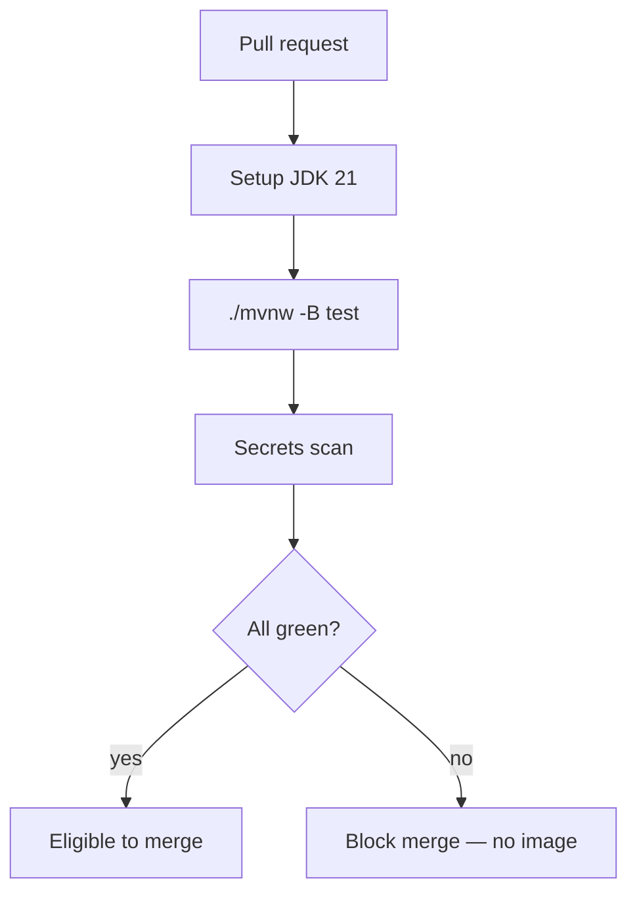

# L-12.2 — CI build and test

**Module:** 12 — Terraform, Ansible and CI/CD  
**Duration:** 30 minutes  
**Case study:** BayPay Financial Services (fictional)

---

## Why this matters

A pull request that “looks fine” can still decline Avery Chen or double-post Harbor Bike Co. The only cheap proof before ECR and Terraform is **`./mvnw test` on Java 21**. If Jordan Voss publishes an image from a red build, or Riley Okonkwo runs tests on a laptop JDK 17 “because it was already installed,” Priya Nair will spend the incident arguing about bytes that never should have left CI. This lesson is the second box on the pipeline: **CI test, then stop.** Image publish is L-12.3. Apply is L-12.4 and optional.

---

## Learning objectives

- Pin the CI toolchain to **JDK 21** (Temurin or the cohort’s equivalent) and the repo’s `./mvnw`, not a random global Maven.
- Gate merge on `./mvnw test` (and `-B` in CI) so `main` cannot move on a failing module.
- Separate **verify** (compile + test) from **publish** (image) and **apply** (Terraform).
- Refuse to skip tests “because Terraform is the real lab” and refuse to store secrets in workflow files.

---

## Concept explanation

**Continuous integration** means every PR compiles and tests the same way Sam Okada’s runner will. For BayPay that command is already in [GETTING_STARTED.md](../../../../GETTING_STARTED.md):

```text
export JAVA_HOME="${JAVA_HOME:-/opt/homebrew/opt/openjdk@21}"
cd reference-apps/baypay
./mvnw test
```

CI repeats that with a non-interactive flag (`-B`) and a pinned JDK. You do **not** need a global `mvn` on the runner. The wrapper (`mvnw` + `.mvn/wrapper`) is the contract. If CI uses `mvn` from the image and a developer uses `./mvnw`, you will debug “works on my machine” for a week.

**Java 21** is the course runtime (Spring Boot 3.5.5, Modules 1–11). A runner on JDK 17 or 22 is a different product. Setup steps must say `21` and Temurin (or a named distribution). `java -version` in the log is evidence, not decoration.

**What `./mvnw test` is.** It compiles the reactor (`shared`, `payment-service`, and siblings) and runs unit / slice tests. It is **not** a live ALB call in `us-west-2`. It is **not** `terraform apply`. It does not prove Actuator readiness on Fargate. It *does* prove the state machine, idempotency, and validation you have been writing since Module 1 still hold on this SHA.

**What CI must not do on a PR.**

| Job | On pull request | On `main` after review |
|---|---|---|
| `./mvnw test` | Required | Required again (or reuse a signed artifact) |
| Image push to ECR | No | Yes, immutable tag (L-12.3) |
| `terraform apply` | No | Optional / later environment; never from a fork PR |
| Ansible against leftover Liberty | No | Separate, explicit (L-12.5) |

A fork PR with apply rights is a classic steal-the-account path. Student pipelines stay **test on PR, publish on `main`**.

**Fail the build on warnings you have agreed to treat as defects** (Checkstyle, SpotBugs) only when the repo already does. Do not invent a twenty-tool gate in a 30-minute lesson. Do add a **secrets scan** that fails on `AKIA` prefixes and `BAYPAY_DB_PASSWORD=` literals. That is cheaper than rotating after merge (L-12.1).

**Caching.** Restore `~/.m2` between runs so `./mvnw test` is minutes, not a full download. Cache keys should include the wrapper properties, not “latest Maven.” A cold cache is not a reason to skip tests.

**Local vs CI.** You run `./mvnw test` before you open the PR. CI is the **recorded** run, not the first run. If you cannot run tests locally, say so on the PR; do not merge on hope.

The vendor (GitHub Actions, GitLab CI, Jenkins) is not the contract. The contract is: **Java 21 + `./mvnw test` + no publish on red.** This course’s examples use Actions YAML because the student repo shape is familiar. Recite the command in an interview, not the marketplace action name.

---

## Visual explanation



Alt text: CI on a pull request sets up Java 21, runs ./mvnw -B test and a secrets scan. Green builds may merge. Red builds cannot publish an image or apply Terraform.

---

## Architecture

The runner is ephemeral. It checks out the PR SHA, sets `JAVA_HOME` to 21, and executes the wrapper from `reference-apps/baypay`. Artifacts (surefire reports, maybe the fat JAR) stay on the job unless you explicitly upload them. They are **not** the production image. L-12.3 will rebuild or reuse a signed JAR under a controlled tag.

Sam Okada owns runner images, org secrets, and OIDC to AWS (later). Jordan owns the workflow file in git — so a workflow change is itself a conventional review (L-12.1). Riley reads the failed job log the way Module 8 taught dumps: quote the test name and the assertion, then hypothesize. Do not bounce `dmgr-east` because `PaymentStateMachineTest` failed.

Stabilization on a red `main` (a broken merge that slipped) is **revert** (L-12.1), then a follow-up PR. Remediation is fix the test or the code; it is not `continue-on-error: true` on the test job.

Paper environments that cannot run Actions still satisfy this lesson by showing the YAML and a local `./mvnw test` transcript. Cost remains **$0** until someone applies AWS.

---

## Production example

Priya pages at 09:10 Pacific: authorize errors after a morning merge. Riley’s first question is “was `ci-java21-test` green on that SHA?” The Actions log shows JDK `21.0.x` and `BUILD SUCCESS`. That **rules out** “CI never ran.” It does **not** prove the Fargate task is healthy (L-12.6). Riley writes that distinction before touching Terraform.

A different PR: the author set `java-version: '17'` because a blog said so. Tests passed. The Dockerfile still uses `eclipse-temurin:21-jre`. You now have two compilers. Sam rejects the PR. The conventional review line is “CI JDK must be 21.”

A third: `./mvnw test` is commented out “to save minutes” so the Terraform fmt job can be the only gate. That pipeline can publish a binary that does not compile the domain model. BUILD-1204 will fail you if verify is missing.

---

## Code/configuration example

Illustrative GitHub Actions — not a lab answer, not a required vendor:

```yaml
name: ci-java21-test
on:
  pull_request:
  push:
    branches: [main]
jobs:
  test:
    runs-on: ubuntu-latest
    defaults:
      run:
        working-directory: reference-apps/baypay
    steps:
      - uses: actions/checkout@v4
      - uses: actions/setup-java@v4
        with:
          distribution: temurin
          java-version: "21"
          cache: maven
      - name: Show runtime
        run: java -version
      - name: Test
        run: ./mvnw -B test
```

Local equivalent you may run any time:

```bash
export JAVA_HOME="${JAVA_HOME:-/opt/homebrew/opt/openjdk@21}"
cd reference-apps/baypay
./mvnw -B test
```

Do **not** put this in the workflow:

```yaml
env:
  AWS_SECRET_ACCESS_KEY: "changeme"
  BAYPAY_DB_PASSWORD: "changeme"
```

OIDC and Secrets Manager come later, as **references**, not literals. `continue-on-error: true` on the test step is a fail for this course.

Write three sentences from a paper log: JDK version, test command, pass/fail. Do not promote a failed test name to “the INCIDENT-1205 cause.”

---

## Trade-offs

| Choice | Gain | Cost |
|---|---|---|
| `./mvnw` in CI | Same Maven as developers | Must commit wrapper |
| Global `mvn` on runner | Slightly shorter YAML | Version drift |
| Test on every PR | Broken `main` is rare | Runner minutes |
| Skip tests on docs-only | Faster | Easy to hide a Java change in “docs” |
| Publish on PR | Early image | Forks can push; tag spam |
| `continue-on-error` | Green badge | Lies |

---

## Failure modes

- CI on JDK 17 or 22 while production is 21.
- Calling `mvn` instead of `./mvnw` and using a different plugin set.
- Publishing ECR from a workflow that does not require `test`.
- `continue-on-error: true` on the test job so Terraform can “still run.”
- Storing AWS keys or `BAYPAY_DB_PASSWORD` in `env:` in YAML.
- Applying Terraform from a `pull_request` on a fork.
- Declaring CI red a WebSphere problem and recycling `Pay2`.

---

## Security/reliability implications

A skipped test job is an integrity gap: `main` no longer means “this SHA was verified.” A workflow with long-lived cloud keys is a credential leak waiting for a fork PR. Prefer OIDC later; never commit keys.

Reliability: flaky tests that you `@Disabled` without a ticket become production flakes. Communication on a red pipeline: SHA, JDK version, failing test class, and that **no image was published**. Do not tell merchants CI is “a Java thing” when the next step would have been their ALB.

---

## Interview perspective

**Engineer.** Every PR runs `./mvnw -B test` on Java 21. I use the Maven wrapper. I do not publish if tests fail.

**Senior.** I split verify from publish and apply. I reject JDK drift and `continue-on-error` on tests. Secrets do not belong in workflow `env`.

**Staff.** CI is the recorded proof for a SHA. I will not max a diagnostic score on “bad deploy” until I know whether `ci-java21-test` was green.

**Principal.** Java 21 + wrapper + required checks are the standard. I fund runner cache so people stop skipping tests, and I forbid apply-from-fork.

---

## Key takeaways

- CI verify is `./mvnw -B test` on **Java 21**, using the repo wrapper.
- Red builds do not merge, do not publish, and do not apply.
- Local test is courtesy; CI is the audit.
- No secrets in workflow files. Region later is `us-west-2`, not a reason to skip tests.
- A lucky “CI was red” label does not max Diagnostic method.

---

## Knowledge check

1. What exact command and JDK version must the required CI job record?
2. A PR is green on tests. Why do you still refuse to `terraform apply` from that pull_request?
3. Why is `continue-on-error: true` on `./mvnw test` a reliability defect?

<details>
<summary>Spoiler — answers</summary>

1. `./mvnw -B test` (from `reference-apps/baypay`) on **Java 21**.
2. Forks and unreviewed heads must not change AWS. Apply is a `main`/environment decision and is optional for students; validate is the bar (L-12.4).
3. It paints the badge green while the domain tests failed, so `main` can publish a binary that does not meet Module 1 invariants.

</details>

---

## Related lab

[BUILD-1204](../../../../labs/BUILD-1204/README.md) — CI/CD pipeline. Put `./mvnw -B test` and Java 21 in the verify stage. Do not open `solutions/BUILD-1204/` until the pipeline diagram separates test from publish. This lesson does not write that lab’s YAML for you.

---

## Related PAKS

Optional: `docs/17-kubernetes-and-platform-engineering/platform-engineering-and-gitops.md` (pipeline as a product). The Java 21 test gate stands alone without a PAKS login.
