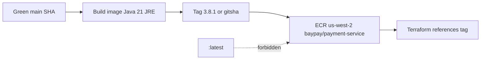

# L-12.3 — Container publishing

**Module:** 12 — Terraform, Ansible and CI/CD  
**Duration:** 30 minutes  
**Case study:** BayPay Financial Services (fictional)

---

## Why this matters

L-9.3 taught that `:latest` is not a version. Module 11’s registry is no longer `registry.baypay.example` on paper — it is **Amazon ECR** in **`us-west-2`**, repository `baypay/payment-service`. If Jordan Voss pushes `:latest` after a green `./mvnw test`, Riley Okonkwo cannot say which bytes authorized Avery Chen when Harbor Bike Co retries. If the tag is mutable, Sam Okada can overwrite `3.8.1` on Friday and Priya’s rollback pulls different layers than Monday’s incident. This lesson is **publish after verify**: immutable tags, no `:latest`, secrets never in the build.

---

## Learning objectives

- Name the teaching image `baypay/payment-service:<immutable-tag>` in ECR, region `us-west-2`.
- Publish only from **green `main`** (L-12.1, L-12.2), never from a red PR or a laptop `:latest`.
- Contrast a mutable tag with an immutable tag and a digest; refuse production `:latest`.
- Keep `BAYPAY_DB_*` and AWS keys out of Docker build args, labels, and git.

---

## Concept explanation

**Publish** means: take the SHA that passed `./mvnw -B test` on Java 21, build the OCI image from the Module 9 contract (`eclipse-temurin:21-jre`, port `8080`, non-root, no password `ENV`), and push it to ECR. Terraform (L-12.4) will *reference* that tag. Ansible (L-12.5) will not rebuild it on a leftover VM.

**ECR** is a private registry per AWS account. ACCOUNT.md’s image line is `registry` / ECR `baypay/payment-service:<tag>`. The fully qualified name looks like:

```text
<account>.dkr.ecr.us-west-2.amazonaws.com/baypay/payment-service:3.8.1
```

Do not put a real account id in git examples. In student paper, write `<account>` or `123456789012` as a **synthetic** placeholder. Region is **`us-west-2`**, not `us-east-1` because a tutorial used it.

**Immutable tags.** ECR can reject retagging. Turn that on for production repositories. Then `3.8.1` means one manifest forever. If you need a fix, you publish `3.8.2` or `3.8.1-<sha>`. You do **not** `docker push` the same tag again. Mutable tags are how “we rolled back to 3.8.1” becomes “we rolled back to whatever 3.8.1 is this afternoon.”

**Digests.** Even with immutability, record `sha256:…` in the release notes and, when the platform allows, pin the task definition to the digest. Tags are for humans. Digests are for rollback evidence (L-12.6).

**Tag grammar (teaching).** Prefer one of:

| Tag | Meaning | Production |
|---|---|---|
| `3.8.1` | Semver Jordan’s notes own | Yes, if immutable |
| `3.8.1-<gitsha>` | Semver plus provenance | Yes |
| `<gitsha>` | Unique per merge | Yes |
| `latest` | Last push | **Never** |
| `dev` | Laptop alias | Local only |

**When to push.** After merge to protected `main`, on the same SHA CI already tested — or rebuild in the publish job from that SHA. Do not push from a `pull_request` event (forks, tag spam, leaked OIDC). Do not push from a developer laptop to the **prod** repo; a student sandbox repo is a lab choice you disclose.

**Authentication.** Production CI uses **OIDC** to assume an IAM role that may `ecr:GetAuthorizationToken` and `PutImage` on `baypay/payment-service` only. Long-lived `AWS_ACCESS_KEY_ID` in GitHub secrets is a last resort you still **never commit**. `docker login` passwords do not belong in workflow YAML (L-12.2).

**Build hygiene.** `--build-arg BAYPAY_DB_PASSWORD` bakes a secret into a layer (L-9.5). So does `COPY server.env`. The publish job copies the fat JAR (or lets a multi-stage build run `./mvnw` *after* tests already passed). It does not need the database.

Empty ECR still has storage cost (ACCOUNT.md). Untagged and leftover student images should be deleted when the lab says so. Do not apply a second registry “for HA” in a 90-minute lab.

---

## Visual explanation



Alt text: A green main SHA builds the payment-service image, tags it with an immutable semver or git SHA, and pushes to ECR in us-west-2. Terraform later references that tag. The latest tag is not pushed.

---

## Architecture

ECR sits in the student AWS account, region `us-west-2`. ECS on Fargate pulls from it (Module 11). The image is the same contract Module 10 scheduled in `baypay-prod`; only the registry hostname changed. Sam Okada’s scan (Inspector or a paper policy) may fail a push with a critical CVE; that is a **publish** gate, not a reason to retag `:latest` after a patch.

Jordan’s release artifact is **tag + digest + git SHA**. Riley’s first production question is “which of those three is on the task definition?” If the task says `:latest`, the answer is “unknown” and you have a process incident before you have a Java incident.

Leftover Liberty VMs do **not** `docker pull :latest` and call it modernization. If a VM still runs `server.xml`, L-12.5 templates config; it does not become the image publisher.

Stabilization: stop the publish job; do not delete the last good tag. Remediation: publish a new immutable tag. Do not overwrite.

---

## Production example

Jordan’s merge `#841` is green. The publish job builds `eclipse-temurin:21-jre`, copies `payment-service.jar`, tags `3.8.1` and `3.8.1-a1b2c3d`, pushes both to `baypay/payment-service` in `us-west-2`, and writes the digest on the release page. Terraform still points at `3.8.0` until a second, reviewed change (L-12.4). Harbor Bike Co is unaffected. That separation is the point.

A bad morning: someone enabled tag mutability “so the pipeline can reuse 3.8.1.” Priya’s rollback to `3.8.1` pulls a manifest that includes tonight’s broken readiness probe. Avery Chen’s create starts 503-ing. The circuit breaker (L-12.6) may save the running tasks; it cannot recover an overwritten tag. Fix the policy: **immutable**. Fix the habit: new tag.

If a student cannot push to ECR, **paper the tag and run `terraform validate`**. Pushing is not the Module 12 grade bar. Lying that you pushed `:latest` “because ECR was empty” is a fail.

---

## Code/configuration example

Illustrative names — synthetic account, no secrets:

```text
# Repository (once, tagged in Terraform later)
# name: baypay/payment-service
# region: us-west-2
# imageTagMutability: IMMUTABLE

# Fully qualified (account is a placeholder)
123456789012.dkr.ecr.us-west-2.amazonaws.com/baypay/payment-service:3.8.1
```

```yaml
# Publish job sketch — only on main, after test
# (not a lab answer; OIDC role name is teaching)
on:
  push:
    branches: [main]
jobs:
  publish:
    needs: test
    steps:
      - uses: actions/checkout@v4
      - uses: actions/setup-java@v4
        with:
          distribution: temurin
          java-version: "21"
      # login via OIDC — no access keys in git
      - run: ./mvnw -B -pl payment-service -am package -DskipTests
        working-directory: reference-apps/baypay
      - run: |
          docker build -t "$ECR/baypay/payment-service:${GIT_SHA}" .
          docker push "$ECR/baypay/payment-service:${GIT_SHA}"
          # do not: docker tag ... :latest && docker push ... :latest
```

Paper operate lines you may *read*:

```text
aws ecr describe-images --repository-name baypay/payment-service --region us-west-2
# Look for imageTags and imageDigest. Refuse a sole tag of latest.
```

Do not paste `aws ecr get-login-password` output into a lesson screenshot, a PR, or chat.

---

## Trade-offs

| Choice | Gain | Cost |
|---|---|---|
| Immutable tags | Honest rollback | Must increment tags |
| Mutable `3.8.1` | Convenient overwrite | Rollback lies |
| `:latest` | Familiar locally | Unreproducible prod |
| SHA tags only | Unique | Harder human notes |
| Semver + SHA | Both | Two names to record |
| Push on PR | Early feedback | Fork risk, cost |
| Digest pin in task def | Strongest pull | Verbose Terraform |

---

## Failure modes

- Pushing `:latest` as the production default (L-9.3, ACCOUNT.md).
- Leaving ECR tag mutability on and overwriting `3.8.1`.
- Publishing from a red test job or a `pull_request` fork.
- `--build-arg` for `BAYPAY_DB_PASSWORD` or copying `server.env`.
- Committing `docker login` passwords or `AKIA…` keys.
- Pushing to `us-east-1` because the CLI default profile said so.
- Treating a leftover Liberty host as the image registry.
- Leaving student images and an empty repo’s storage running after the lab.

---

## Security/reliability implications

Who may `ecr:PutImage` may change what Fargate will run. Scope the CI role to one repository. Scan images; do not “fix” a CVE by retagging `latest`.

Reliability: rollback is **point at a previous immutable tag or digest**, not `docker pull :latest`. Communication: repository, region `us-west-2`, tag, digest, and that Terraform has **not** necessarily moved yet. Merchants care about the running task, not the push.

---

## Interview perspective

**Engineer.** I push `baypay/payment-service:<tag>` to ECR in `us-west-2` after tests pass. I do not use `:latest` in production.

**Senior.** I turn on immutable tags and record the digest. I publish from `main`, not from a PR. Build args never carry `BAYPAY_DB_*`.

**Staff.** The image is the release artifact; Terraform only references it. I will not max a diagnostic score on “bad image” without tag, digest, and mutability settings.

**Principal.** ECR immutability and OIDC publish are standards. I fund cleanup of student images and I forbid `:latest` as an SLO input.

---

## Key takeaways

- Publish **after** Java 21 tests, from protected `main`, to ECR `baypay/payment-service` in `us-west-2`.
- Immutable tags (and digests) are the rollback contract. **No `:latest`.**
- Secrets never enter the build or git.
- Pushing is optional for the grade; lying about `:latest` is not.
- A lucky “registry issue” label does not max Diagnostic method.

---

## Knowledge check

1. Why is `:latest` forbidden on the ECR repository that Fargate will pull?
2. Tests passed on a pull request from a fork. Why do you still refuse to push to ECR?
3. Tag `3.8.1` was overwritten this afternoon. What did immutability fail to do, and what do you publish next?

<details>
<summary>Spoiler — answers</summary>

1. `latest` moves. Riley cannot reconstruct which bytes authorized Avery Chen, and rollback is undefined.
2. Forks must not receive publish credentials. Publish is a `main` job after review (L-12.1, L-12.2).
3. The repository allowed mutable tags, so `3.8.1` is no longer Monday’s manifest. Publish a **new** tag (and digest); do not overwrite again.

</details>

---

## Related lab

[BUILD-1204](../../../../labs/BUILD-1204/README.md) — CI/CD pipeline. The publish stage must name ECR, `us-west-2`, and an immutable tag. Do not open `solutions/BUILD-1204/` until `:latest` is absent. This lesson does not push for you.

---

## Related PAKS

Optional: `docs/17-kubernetes-and-platform-engineering/platform-engineering-and-gitops.md` (artifact promotion). ECR tag policy stands alone without a PAKS login.
