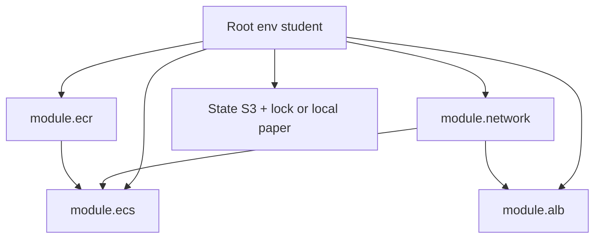

# L-12.4 — Terraform foundations and modules

**Module:** 12 — Terraform, Ansible and CI/CD  
**Duration:** 30 minutes  
**Diagram:** AEJE-D-055  
**Case study:** BayPay Financial Services (fictional)

---

## Why this matters

The image is in ECR (L-12.3). Avery Chen still needs an ALB, a Fargate service, and IAM that can read Secrets Manager — in **`us-west-2`**, tagged, destroyable. If Jordan Voss clicks those in the console, Priya Nair cannot review them and Riley cannot revert them. Terraform is how Sam Okada writes **desired AWS state in git**. This lesson is state, providers, and **modules** (AEJE-D-055). The student bar is **`terraform validate`**. `apply` is optional and costs real money.

---

## Learning objectives

- Explain Terraform state as the mapping from addresses to real resources — and why you never commit it.
- Pin the `aws` provider to region `us-west-2` with default tags from ACCOUNT.md.
- Split a stack into reusable modules (network, ecr, ecs, alb) instead of one 800-line `main.tf`.
- Run `terraform validate` as the grade bar; estimate before any `plan`/`apply`; refuse EKS, NAT, and RDS “for realism.”

---

## Concept explanation

**Terraform** reads HCL, refreshes state, and proposes to create/update/destroy. For BayPay teaching, the root module is the **student environment**: public subnets + IGW (ACCOUNT.md trade-off), ECR repository `baypay/payment-service`, ECS/Fargate service, public ALB, task role that reads `BAYPAY_DB_*` from Secrets Manager. RDS is **out of scope for student apply**. EKS and NAT Gateway are forbidden in a 90-minute lab.

**State.** `terraform.tfstate` records resource ids. Production keeps it in an **S3 backend** with a **DynamoDB lock** so two pipelines do not apply at once. Students may use a **local** backend on paper. Either way: **state is not git**. It can contain secret attributes. Add `*.tfstate` to `.gitignore`. If you already committed it, rotate what leaked and treat it as a L-12.1 incident — do not force-push `main` to hide it.

**Providers.** The `aws` provider is a plugin. Pin `required_version` and `required_providers`. Set `region = "us-west-2"`. Use `default_tags` for `Course=AEJE`, `Module`, `Lab`, `Environment=student`, `Expiration` (ISO date). A missing `Expiration` is how leftover ALBs survive the weekend (ACCOUNT.md).

**Modules** (AEJE-D-055) are reusable packages with `variables` and `outputs`. A good split:

| Module | Owns | Does not own |
|---|---|---|
| `network` | VPC, public subnets, IGW, routes | NAT, private subnets “for realism” |
| `ecr` | `baypay/payment-service`, immutability | Image bytes (CI pushes those) |
| `ecs` | Cluster, service, task definition | Ansible `server.xml` |
| `alb` | Listener, target group, health check | Route 53 production zone |

The **root** module wires them: network outputs feed alb and ecs; ecs takes `image_tag` as a variable, not a hardcoded `:latest`. BUILD-1201 is “stand up the environment in HCL.” BUILD-1202 is “extract modules so staging and student share code.”

**Validate vs plan vs apply.**

| Command | Needs AWS creds? | Cost | Course bar |
|---|---|---|---|
| `terraform fmt` / `validate` | No | $0 | **Required** |
| `terraform plan` | Usually yes | $0 | Useful |
| `terraform apply` | Yes | ALB ~ $/day; Fargate ~ ¢–$/h | **Optional** |
| `terraform destroy` | Yes | Stops spend | Required if you applied |

If you cannot spend, you still pass by validating. If you apply, you **destroy** ALB, services, clusters, and images you created. Empty ECR still bills storage.

**What Terraform is not.** It is not Ansible (L-12.5). It does not template leftover Liberty `server.xml`. It is not a substitute for `./mvnw test`. It must not embed `BAYPAY_DB_PASSWORD` in `task-def` JSON or committed `.tfvars` — the task definition **references** Secrets Manager. Remote state in production is GitOps-adjacent (optional PAKS): `plan` on PR, `apply` on `main`. Student forks never get that role (L-12.2).

---

## Visual explanation



Alt text: AEJE-D-055. A student root module calls reusable Terraform modules for network, ECR, ECS, and ALB. Network feeds ECS and ALB. ECR feeds the ECS task image. State lives in a remote backend or local paper — not in git.

---

## Architecture

Sam Okada owns module interfaces: variable names, required tags, region `us-west-2`. Jordan’s repo may pin a **module version** (`ref=v1.4.0`) so an ecs change is a reviewed bump. Riley does not SSH a security group; Riley opens a PR.

Public-subnet Fargate is the **disclosed** student trade-off: no NAT bill, tasks have public IPs or ALB-only paths as the lab states. Do not “fix” that with NAT in BUILD-1201. ARCHITECT-1102 is where EKS or OpenShift may win on paper.

Stabilization after a bad apply: `terraform apply` a revert commit or the previous `image_tag` (L-12.6). Do not click-delete half the stack and leave state drifting. Remediation: fix HCL, validate, review, then apply if you are in a sandbox. Do not bounce `dmgr-east` because a security group failed validate. Do not put `PaymentCluster` in a `aws_instance` module “to keep WAS.”

---

## Production example

Jordan’s PR changes `image_tag = "3.8.0"` to `"3.8.1"` in the student root. `terraform validate` is green. `plan` (if creds exist) shows one task-definition replacement and an ECS service update. Sam’s conventional review (L-12.1) checks: no `:latest`, no secret literals, tags include `Expiration`, no new NAT. Merge. Apply is a human or a `main` job — **optional** for students.

A bad apply: someone added `aws_eks_cluster` and `aws_nat_gateway` “so it looks like prod.” The lab clock and the bill explode. ACCOUNT.md already forbade this. Tear down if you created it; do not leave it overnight. The review that should have blocked it is the finding.

A state accident: two laptops apply local state to the same account. One destroys the other’s ALB. That is why production uses a lock, and why students prefer **validate-only** unless the lab is explicit.

---

## Code/configuration example

Illustrative root — not a lab answer, not an apply requirement:

```hcl
terraform {
  required_version = ">= 1.6.0"
  required_providers {
    aws = {
      source  = "hashicorp/aws"
      version = "~> 5.0"
    }
  }
  # Production: backend "s3" { ... dynamodb_table lock ... }
  # Student paper: local. Never commit *.tfstate
}

provider "aws" {
  region = "us-west-2"
  default_tags {
    tags = {
      Course      = "AEJE"
      Module      = "12"
      Lab         = "BUILD-1201"
      Environment = "student"
      Expiration  = "2026-09-10"
    }
  }
}

module "ecr" {
  source = "./modules/ecr"
  name   = "baypay/payment-service"
}

module "ecs" {
  source     = "./modules/ecs"
  image      = "${module.ecr.repository_url}:${var.image_tag}"
  # image_tag comes from tfvars or CI — never "latest"
  # BAYPAY_DB_* from Secrets Manager ARN, not a string password
}

variable "image_tag" {
  type = string
  validation {
    condition     = var.image_tag != "latest"
    error_message = "Do not deploy :latest."
  }
}
```

```bash
terraform fmt -check
terraform validate
# optional, costs nothing but needs creds:
# terraform plan
# optional, costs money — estimate first, destroy after:
# terraform apply
```

Do not check in `terraform.tfvars` with account keys or passwords. A `terraform.tfvars.example` with `image_tag = "3.8.0"` is fine.

---

## Trade-offs

| Choice | Gain | Cost |
|---|---|---|
| Modules | Reuse student/staging; reviewable surfaces | Extra indirection |
| One root file | Fast demo | Copy-paste drift |
| Remote state + lock | Safe apply | Extra AWS objects |
| Local state | $0 paper | Clash if two applies |
| `validate` only | Pass without spend | No live ALB |
| `apply` student ALB | Real DNS | Dollars/day if forgotten |
| NAT + EKS | Looks like some prod | Lab cost bomb |

---

## Failure modes

- Committing `terraform.tfstate` or secret `.tfvars`.
- `image = "...:latest"` in the task definition.
- Hardcoding `BAYPAY_DB_PASSWORD` in `container_definitions`.
- Applying EKS, NAT, OpenSearch, or multi-AZ RDS in BUILD-1201.
- Using `us-east-1` because the default profile said so.
- Clicking in the console so state no longer matches.
- Two local applies without a lock.
- Leaving the ALB up overnight.
- Recreating `BayPayCell` as `aws_instance` + userdata.

---

## Security/reliability implications

Who may `apply` may create IAM and public ALBs. Treat the apply role as release power. State files are sensitive. Secrets Manager ARNs belong in HCL; secret **values** do not.

Reliability: modules versioned in git make rollback a SHA + `image_tag` change (L-12.6). Drift from console clicks makes rollback fiction. Communication: which module, which tag, whether you **validated or applied**, and the destroy plan.

---

## Interview perspective

**Engineer.** I write HCL, pin the AWS provider to `us-west-2`, and run `terraform validate`. I do not commit state or passwords.

**Senior.** I split network, ECR, ECS, and ALB modules. I reject `:latest`, NAT, and RDS apply in a student lab. I estimate before apply.

**Staff.** State plus a lock is the control plane. I will not max a diagnostic score on “bad Terraform” without the plan and the module address.

**Principal.** Modules and validate-first are the standard. I fund remote state and I score teams on destroy discipline, not on weekend ALBs.

---

## Key takeaways

- Terraform maps desired HCL to AWS; **state is not git**.
- Provider region is **`us-west-2`**; tags include `Expiration`.
- Modules (AEJE-D-055) keep ECR, ECS, ALB, and network reusable.
- **`terraform validate` is the bar.** Apply is optional; destroy if you apply.
- A lucky “state issue” label does not max Diagnostic method.

---

## Knowledge check

1. You have no AWS credentials. Which Terraform command still proves the student stack is syntactically honest?
2. Why is `image_tag = "latest"` a fail even if `validate` passes?
3. Where does `BAYPAY_DB_PASSWORD` live, and where must it not live?

<details>
<summary>Spoiler — answers</summary>

1. `terraform validate` (and `fmt`). No creds, $0, course bar.
2. Validate does not enforce your operational contract unless you add a validation block — and `:latest` is forbidden by ACCOUNT.md / L-12.3 even when HCL is valid.
3. Secrets Manager (task definition *reference*). Never in git, `.tfvars`, state you commit, or container JSON literals.

</details>

---

## Related lab

[BUILD-1201](../../../../labs/BUILD-1201/README.md) — Terraform AWS environment. [BUILD-1202](../../../../labs/BUILD-1202/README.md) — reusable modules. Validate first. Apply only in a sandbox you may spend in. Do not open `solutions/` until you have a module map and a cost note. This lesson is not those labs’ HCL.

---

## Related PAKS

Optional: `docs/17-kubernetes-and-platform-engineering/platform-engineering-and-gitops.md` (desired-state apply). Module boundaries stand alone without a PAKS login.
