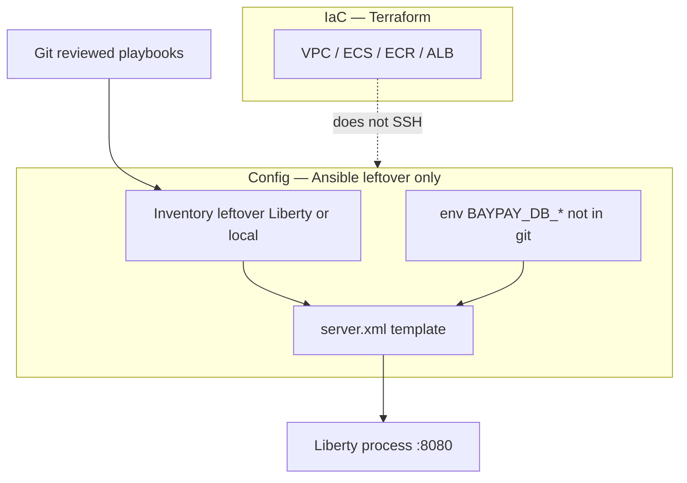

# L-12.5 — Configuration automation

**Module:** 12 — Terraform, Ansible and CI/CD  
**Duration:** 30 minutes  
**Diagram:** AEJE-D-058  
**Case study:** BayPay Financial Services (fictional)

---

## Why this matters

Terraform created (or, on paper, described) ECS in `us-west-2`. Harbor Bike Co’s traffic should already be on Fargate. Some estates still have a **leftover Liberty VM** — a host that is not `dmgr-east`, not `Pay2` in a cell, just a server that still starts `payment` from `server.xml`. If Jordan Voss SSH-edits XML on that box, Priya cannot review it and Riley cannot replay it. **Ansible** is how you template leftover config. It is **not** how you release Fargate. AEJE-D-058 is that split: **IaC vs configuration**.

---

## Learning objectives

- Separate Terraform (create AWS / VMs) from Ansible (configure leftover Liberty or a local server).
- Template `server.xml` **shape** and inject `BAYPAY_DB_*` from env / vault / Secrets Manager — never from a committed password.
- Run Ansible against inventory you own (leftover VM or local), not against the ECS task.
- Refuse to recreate `BayPayCell` with playbooks, and refuse Ansible as the primary image publisher.

---

## Concept explanation

**Infrastructure as code (IaC)** answers “which objects exist?” VPC, ECR, ECS service, ALB, maybe an `aws_instance` you have not retired. Terraform owns that (L-12.4).

**Configuration automation** answers “what is on a machine that still has a filesystem we manage?” Feature list, `httpEndpoint` port `8080`, DataSource **names**, `server.env` keys. Ansible owns that **only while the machine exists**. The Boot-on-Fargate path should need **zero** Ansible: env comes from the task definition / Secrets Manager.

L-6.4 already split Liberty: committed `server.xml` is structure; `${BAYPAY_DB_PASSWORD}` is not a literal; `server.env` or process env supplies values. Ansible’s job is to **install that contract** onto a leftover host: copy a Jinja template, set file mode, restart the Liberty process **once**, leave secrets out of the playbook repo.

**Inventory** is the list of leftover hosts (or `localhost` for a laptop lab). BUILD-1203 is **not** an AWS apply lab. You can satisfy it with `ansible-playbook` against local files, or paper YAML. You do **not** need a licensed Liberty install. You do **not** need to SSH to Fargate — there is no SSH.

**Playbooks vs roles.** A short playbook may template `server.xml.j2` and `server.env.j2`. A role is reuse across hosts. Either is fine. A 400-task role that federates a node agent is **ND-as-Ansible**. Stop.

**Idempotence.** Running the playbook twice should converge. `template` plus `systemd`/`server start` when the file changed — not `shell: echo password >> server.xml` every run.

**Secrets.**

| Place | Allowed? |
|---|---|
| `server.xml.j2` with `${BAYPAY_DB_PASSWORD}` | Yes |
| Playbook `vars:` with a real password | **No** |
| Committed `group_vars/all.yml` password | **No** |
| `ansible-vault` encrypted file not in git, or CI-injected env | Yes, if the lab says |
| Host env / Secrets Manager agent | Yes |
| `server.env` committed to git | **No** |

`ansible-vault` is a tool, not a reason to store production ledger passwords in the app repo. Prefer the same `BAYPAY_DB_*` names as Boot (L-6.4) so you do not run two secrets systems.

**When Ansible is the wrong tool.** Changing the Fargate image tag. Creating the ALB. Publishing ECR. Those are Terraform + CI. If you “Ansible the task definition,” you have two control planes and INCIDENT-1205 will be harder — this lesson still does not name that pack’s cause.

**Local teaching path.** Template files onto `./out/liberty/` on the laptop. Validate XML well-formedness. That is enough for BUILD-1203 if the lab agrees. Cost **$0**.

---

## Visual explanation



Alt text: AEJE-D-058. Terraform owns AWS objects. Ansible, driven from reviewed git, templates leftover Liberty server.xml and injects BAYPAY_DB environment values that are not stored in git. Fargate is not an Ansible target.

---

## Architecture

Sam Okada’s platform goal is **fewer leftover VMs**, not a better SSH estate. Ansible is a **bridge off `BayPayCell`**, not a new cell. Morgan Hale’s console and `dmgr-east` stay in Modules 5–6 as the source you leave. A playbook that calls `wsadmin` to sync a cluster is a fail.

Riley’s on-call for Fargate still reads ECS and ALB (L-12.6). If the page is the leftover VM, Riley runs (or reviews) the playbook against **that** inventory — after capturing `messages.log`. Do not “ansible all” including prod Fargate-adjacent bastions you do not understand.

Jordan reviews playbooks like Terraform: secrets check, port `8080`, no `:latest` docker pull on the VM as a side effect, rollback = previous git tag of the templates.

Stabilization: stop a bad playbook; restore the last known `server.xml` from git. Remediation: fix the template, PR, re-run. Do not bounce the WAS cell to undo a Liberty template.

---

## Production example

Priya: leftover host `liberty-east-holdover.baypay.example` (synthetic) still serves an internal test merchant. Jordan’s playbook templates `server.xml` with `jdbc/baypay-payment` and `${BAYPAY_DB_USER}`. Vault or the runner injects the password into the process environment. Riley curls `/actuator/health/readiness` or Liberty’s equivalent health feature **before** anyone updates a test DNS name. Avery Chen’s production path stays on ECS.

A bad PR: `vars: db_password: BayPayApp1!` in `group_vars/prod.yml`. Sam rejects it the same way L-6.4 rejected XML literals. The *habit* is the grade, even though the estate is fictional.

A worse idea: a playbook that SSHes to twenty “pets,” pulls `baypay/payment-service:latest`, and writes a systemd unit. That bypasses ECR immutability (L-12.3) and Terraform (L-12.4). It is not Module 12 modernization.

---

## Code/configuration example

Illustrative playbook — not a lab answer, not a live SSH requirement:

```yaml
- name: Leftover Liberty payment server
  hosts: liberty_leftover
  become: true
  vars:
    http_port: 8080
    # No password here. Runner or vault supplies BAYPAY_DB_PASSWORD.
  tasks:
    - name: Render server.xml structure
      ansible.builtin.template:
        src: server.xml.j2
        dest: /opt/ibm/wlp/usr/servers/payment/server.xml
        owner: liberty
        group: liberty
        mode: "0644"
    - name: Render server.env from runtime environment
      ansible.builtin.template:
        src: server.env.j2
        dest: /opt/ibm/wlp/usr/servers/payment/server.env
        mode: "0600"
      no_log: true
```

`server.xml.j2` excerpt (shape only):

```xml
<server>
  <featureManager>
    <feature>servlet-6.0</feature>
    <feature>jdbc-4.3</feature>
  </featureManager>
  <httpEndpoint id="defaultHttpEndpoint" httpPort="{{ http_port }}"/>
  <dataSource id="baypayPayment" jndiName="jdbc/baypay-payment">
    <jdbcDriver libraryRef="pg"/>
    <properties
        serverName="${BAYPAY_DB_HOST}"
        portNumber="${BAYPAY_DB_PORT}"
        user="${BAYPAY_DB_USER}"
        password="${BAYPAY_DB_PASSWORD}"/>
  </dataSource>
</server>
```

Local paper equivalent:

```bash
# BUILD-1203 may accept rendering to a workspace directory
ansible-playbook -i inventory/local.ini playbooks/liberty-leftover.yml --check
```

`--check` is to apply what `terraform validate` is to AWS: prove the automation without spending or breaking a host.

---

## Trade-offs

| Choice | Gain | Cost |
|---|---|---|
| Ansible on leftover Liberty | Repeatable XML / env | Another tool while VMs live |
| Terraform `user_data` only | One tool | Painful XML iteration |
| SSH snowflake edits | Fast once | Unreviewable, unreplayable |
| Ansible against ECS | Feels unified | Two control planes |
| Vault file in app repo | Convenient | Still a git-adjacent secret |
| Retire the VM | One Fargate path | Migration work (Modules 6, 11) |

---

## Failure modes

- Putting `password=` literals in playbooks or templates.
- Using Ansible to push `:latest` or to edit ECS task JSON.
- Recreating `dmgr-east` / node agents with roles.
- Running the playbook against the wrong inventory (prod leftover vs laptop).
- Restarting Liberty in a loop on every CI push of an unrelated Java file.
- Committing `server.env` with values.
- Assuming Fargate has SSH because “Ansible needs a host.”
- Skipping health after a template change (L-12.6).

---

## Security/reliability implications

Playbook write access is release power on leftover hosts. `no_log: true` on secret tasks reduces CI leakage; it does not replace vault hygiene. File mode `0600` on `server.env` is mandatory.

Reliability: leftover VMs are pets. Idempotency of payments (Module 2) still matters if you restart mid-authorize. Communication: **which inventory**, which git SHA of the templates, and that production ECS was **not** the target.

---

## Interview perspective

**Engineer.** Terraform creates AWS. Ansible templates leftover `server.xml` and env. I never put `BAYPAY_DB_PASSWORD` in git.

**Senior.** I will not Ansible a Fargate task definition. I use the same `BAYPAY_DB_*` names as Boot. `--check` is a valid lab outcome.

**Staff.** IaC vs config is an operating-model split. I will not max a diagnostic score on “bad Ansible” without inventory, template SHA, and whether ECS was in scope.

**Principal.** I fund retiring leftover VMs. Ansible is a bridge, not a second platform. I forbid ND-as-playbooks.

---

## Key takeaways

- **IaC** = Terraform (objects). **Config** = Ansible (leftover Liberty / local files).
- `server.xml` is shape; `BAYPAY_DB_*` is injected — L-6.4 still applies.
- Fargate is not an SSH inventory. Do not publish images with Ansible.
- BUILD-1203 can be local / `--check` at **$0**.
- A lucky “config drift” label does not max Diagnostic method.

---

## Knowledge check

1. Jordan needs to change the ECS image tag to `3.8.1`. Which tool, and why not Ansible?
2. Where may `${BAYPAY_DB_PASSWORD}` appear, and where must the value not appear?
3. Why is a playbook that federates a node agent the wrong modernization move?

<details>
<summary>Spoiler — answers</summary>

1. Terraform (variable / task definition). Ansible does not own ECS desired state; two control planes hide rollback (L-12.4, L-12.6).
2. Appear as a **placeholder** in `server.xml` / `server.env` templates. The value stays in env, vault, or Secrets Manager — never in git or playbook `vars`.
3. It recreates `BayPayCell` semantics you are leaving (Modules 5–6). Ansible should template a disposable Liberty process, not a cell.

</details>

---

## Related lab

[BUILD-1203](../../../../labs/BUILD-1203/README.md) — Configuration automation. Template leftover Liberty (or local files). No AWS apply required. Do not open `solutions/BUILD-1203/` until passwords are absent from git. This lesson does not write that playbook for you.

---

## Related PAKS

Optional: `docs/17-kubernetes-and-platform-engineering/platform-engineering-and-gitops.md` (desired state vs snowflakes). IaC-vs-config stands alone without a PAKS login.
