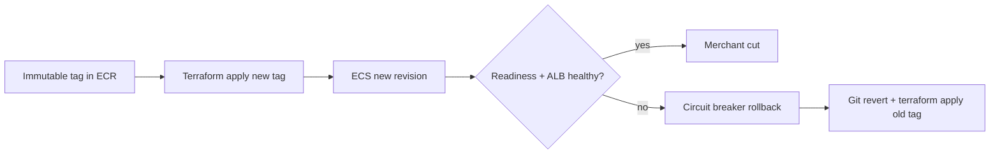

# L-12.6 — Deployment validation and rollback

**Module:** 12 — Terraform, Ansible and CI/CD  
**Duration:** 30 minutes  
**Case study:** BayPay Financial Services (fictional)

---

## Why this matters

A green `./mvnw test`, an immutable ECR tag, and a valid Terraform plan can still take Harbor Bike Co offline. Jordan Voss’s `3.8.1` may start, fail readiness, and sit behind the ALB while Avery Chen’s `POST /api/v1/payments` times out. Riley Okonkwo’s job is **health before cut**, then **rollback** — ECS deployment circuit breaker, previous task definition, or a Terraform revert — not a cell bounce and not a force-push to `main`. This lesson is method. It relates to INCIDENT-1205 as a *symptom class*. It does **not** name that pack’s cause.

---

## Learning objectives

- Name the health contracts `/actuator/health/liveness` and `/actuator/health/readiness` on port `8080` as the cut gate.
- Explain ECS deployment circuit breaker as automatic rollback of a *bad new revision*, not as a Java RCA.
- Roll back with a prior task definition and/or `terraform apply` of the previous `image_tag`.
- Refuse to cut merchants on a green pipeline alone, and refuse to diagnose INCIDENT-1205 from this lesson.

---

## Concept explanation

**Validate** means: the new revision is **Ready** the way production traffic will see it. For the teaching estate that is:

1. ECS tasks running the immutable tag (L-12.3) in `us-west-2`.
2. Container health / ALB target health using ACCOUNT.md paths: `/actuator/health/liveness`, `/actuator/health/readiness`.
3. A synthetic `POST /api/v1/payments` (Avery Chen, active USD account) **idempotent** on a **non-prod** or canary listener — not a hope from unit tests.
4. Only then: shift the student ALB / DNS you actually own. Teaching host `pay-alb-student.baypay.example` is a name; apply labs use the AWS-generated DNS.

A green CI job (L-12.2) proves the SHA compiled. It does **not** prove Secrets Manager injection, security groups, or that `-Xmx` vs task memory still has headroom (L-9.6). Write that distinction on the worksheet.

**Cut** is the moment merchants (or the student test client) hit the new revision. If you have one ALB target group, a rolling ECS deployment *is* the cut. Circuit breaker and bake time exist because that cut is dangerous.

**ECS deployment circuit breaker** (Fargate default path): when a new deployment produces tasks that fail to become healthy, ECS **stops** the deployment and, if rollback is enabled, returns to the last stable service revision. That is stabilize. It is not a root cause. Causes include a bad image, a bad env/secret reference, a probe path typo, a slow JVM vs health interval — INCIDENT-1205 will give *its* evidence. This lesson teaches you to **read the deployment event** and **keep the old revision**.

**Terraform rollback.** Desired state in git still says `image_tag = "3.8.1"` even if ECS rolled back in the control plane. If you leave it, the next apply **re-breaks** production. Stabilize in AWS, then **revert the HCL** (new git commit — no force-push) and apply the previous tag, or `terraform apply -var='image_tag=3.8.0'`. State must match the revision you intend to keep.

**Ansible leftover.** If the cut was a Liberty VM (L-12.5), rollback is the previous template SHA plus health on `8080`. Do not circuit-break a VM you SSHed; do not Ansible-rollback ECS.

| Mechanism | What it undoes | What it does not undo |
|---|---|---|
| ECS circuit breaker + rollback | Bad new service revision | Terraform `image_tag` still pointing forward |
| `update-service --task-definition …:prev` | Service pointer | Git / module version |
| Terraform apply previous tag | Desired AWS state | A mutated ECR tag (L-12.3) |
| Git revert on `main` | The reviewed desired state | AWS if nobody applies |
| Force-push `main` | The audit | Nothing you should want |
| Bounce `dmgr-east` | Nothing useful | The ECS incident |

**Health before cut** is a time box: watch target health and Ready count. If they are not healthy, **do not** flip a second listener, raise desired count to “force it,” or tell merchants “deploy finished.” Finished is a pipeline word. **Healthy** is an Actuator word.

This course does not require you to enable CodeDeploy blue/green. Circuit breaker plus honest probes is the teaching bar. Progressive delivery vendors are optional PAKS color, not a grade gate.

---

## Visual explanation



Alt text: After Terraform applies a new immutable tag, ECS starts a revision. Readiness and ALB health must pass before merchant cut. On failure, the circuit breaker rolls back the service and a git revert plus Terraform apply realigns desired state to the previous tag.

---

## Architecture

Sam Okada enables **circuit breaker with rollback** on the `payment-service` ECS service. Jordan’s pipeline may wait on `aws ecs wait services-stable` (or equivalent) **before** it marks the job green. A pipeline that turns green on `apply` exit code 0 without health is a liar — same class as `continue-on-error` on tests (L-12.2).

Priya’s dashboard (Module 13 will deepen this) needs: service deployment status, target health, and the **task definition revision**. Riley’s first stabilize question is “is the old revision still registered?” If circuit breaker already flipped, write that as evidence, not as victory.

OpenShift / kube undo (L-10.6) is the same *idea* on another control plane. This module’s locked compute is **ECS on Fargate**. Do not recommend `kubectl rollout undo` for an ALB in `us-west-2`. Do not recommend recycling `PaymentCluster`.

Stabilization: circuit breaker, previous task def, or previous Terraform tag. Capture task stopped reason and ALB health **before** you apply again. Remediation: fix image, probe, or secret **reference**, publish a **new** immutable tag, review, apply. Do not overwrite `3.8.1`.

---

## Production example

Jordan applies `image_tag = "3.8.1"`. Targets go unhealthy. Circuit breaker returns the service to the `3.8.0` revision. Avery Chen’s path recovers. Riley writes: “stabilize = ECS rollback; Terraform still says 3.8.1; next = revert HCL.” That last sentence is what keeps the next pipeline from redeploying the failure. Priya pages INCIDENT-1205-shaped symptoms on another afternoon — **same method, different evidence**. Do not import a cause from this paragraph into that pack.

A different failure: circuit breaker is **off**. New tasks fail. Old tasks are drained. There is nothing to roll back to. Stabilize becomes “redeploy `3.8.0` from git as fast as permissions allow.” Enable the breaker in the ecs module (BUILD-1202) before you need it.

A third: someone force-pushes `main` to hide the bad tag (L-12.1). Health is still red; history is gone. That is two incidents.

If you never applied (validate-only student), **paper** the health gate and the revert commit. You still pass. Pretending apply succeeded is a fail.

---

## Code/configuration example

Illustrative — not INCIDENT-1205’s answer, not an apply requirement:

```hcl
# ecs module excerpt — circuit breaker on
resource "aws_ecs_service" "payment" {
  name            = "payment-service"
  cluster         = aws_ecs_cluster.this.id
  task_definition = aws_ecs_task_definition.payment.arn
  desired_count   = 2
  launch_type     = "FARGATE"

  deployment_circuit_breaker {
    enable   = true
    rollback = true
  }

  load_balancer {
    target_group_arn = var.target_group_arn
    container_name   = "payment-service"
    container_port   = 8080
  }
  # healthCheck: /actuator/health/readiness — ACCOUNT.md
}
```

```bash
# Paper operate — region us-west-2
# terraform apply -var='image_tag=3.8.0'   # after revert
# aws ecs describe-services --cluster <name> --services payment-service --region us-west-2
# Look for rollbacks, failed tasks — quote them; do not invent a cause
```

```text
Validate before cut
1. Task running + last status RUNNING
2. Target healthy on /actuator/health/readiness
3. Synthetic payment (Avery Chen) on a non-prod listener if you have one
4. Then cut / declare the student URL live
Rollback
1. Let circuit breaker finish or pin previous task definition
2. Revert image_tag in git (no force-push)
3. terraform validate; apply only if you already spend
```

Do not paste secret values from a failed task’s environment into the worksheet.

---

## Trade-offs

| Choice | Gain | Cost |
|---|---|---|
| Circuit breaker + rollback | Auto stabilize | Must still revert Terraform |
| Breaker off | Slightly simpler API | No automatic last-good |
| Health wait in CI | Honest green | Longer pipeline |
| Green on apply exit | Fast badge | Lies to merchants |
| Blue/green (CodeDeploy) | Explicit cut | Extra objects; not required |
| Force-push to undo | “Clean” git | Audit hole (L-12.1) |

---

## Failure modes

- Declaring done when `terraform apply` exits 0 and targets are unused or unhealthy.
- Leaving `image_tag = "3.8.1"` in git after ECS rolled back.
- Overwriting the bad tag in ECR instead of publishing a new one.
- Force-pushing `main` to hide the release.
- Bouncing `dmgr-east` or recycling `Pay2` for an ECS page.
- Ansible-restarting a leftover VM and calling it the Fargate rollback.
- Writing INCIDENT-1205’s root cause from this lesson or from the lab title.
- Skipping destroy so the unhealthy ALB keeps billing overnight.

---

## Security/reliability implications

Who may `ecs:UpdateService` or `terraform apply` may cut or uncut merchants. Circuit breaker is a safety control; it is not a substitute for review (L-12.1). Failed-task logs may contain residual config — treat them as sensitive.

Reliability: payments in flight need idempotency (Module 2) when tasks stop mid-POST. Communication: current revision, prior revision, health counts, whether Terraform matches, and **what you have not proven**. No invented cause on the merchant note.

---

## Interview perspective

**Engineer.** I check readiness and ALB health before I call a deploy done. If it fails, I roll back to the last tag. I do not force-push `main`.

**Senior.** I enable ECS circuit breaker with rollback and I revert Terraform so the next apply does not redeploy the break. I will not bounce the WAS cell.

**Staff.** Stabilize and remediate are different commits. I will not max a diagnostic score on “failed deploy” without events, health, and tag/digest. I will not write INCIDENT-1205’s RCA from memory.

**Principal.** Health-before-cut and breaker-on are standards. I fund pipelines that wait for stable services, and I score on-call on revision numbers, not on console panic.

---

## Key takeaways

- **Health before cut.** Green CI is not merchant-ready.
- ECS circuit breaker rolls back a bad revision; you must still align Terraform / git.
- Rollback uses a **previous immutable tag**, not `:latest` and not a force-push.
- INCIDENT-1205 is a related symptom pack — this lesson does not close it.
- A lucky “bad deploy” label does not max Diagnostic method.

---

## Knowledge check

1. ECS rolled back via circuit breaker. Terraform still has `image_tag = "3.8.1"`. What happens on the next apply, and what do you commit?
2. Which two HTTP paths must be healthy on port `8080` before you cut student traffic?
3. Why does this lesson refuse to state the root cause of INCIDENT-1205?

<details>
<summary>Spoiler — answers</summary>

1. The next apply redeploys `3.8.1`. Commit a **revert** (or set `3.8.0`) on `main` — no force-push — and validate/apply that.
2. `/actuator/health/liveness` and `/actuator/health/readiness` (ACCOUNT.md).
3. Lessons teach method. The pack’s cause is gated evidence in the lab; naming it here would skip diagnosis and fail Diagnostic method.

</details>

---

## Related lab

[INCIDENT-1205](../../../../labs/INCIDENT-1205/README.md) — Failed deployment and rollback. Student guide shows **symptoms only**. Use this lesson’s health, breaker, and Terraform-align language. Work the gates. Do not open `solutions/INCIDENT-1205/` until the worksheet separates stabilize from remediate. This lesson does **not** name that pack’s cause.

---

## Related PAKS

Optional: `docs/17-kubernetes-and-platform-engineering/platform-engineering-and-gitops.md` (apply and rollback as desired state). Validation method stands alone without a PAKS login.
