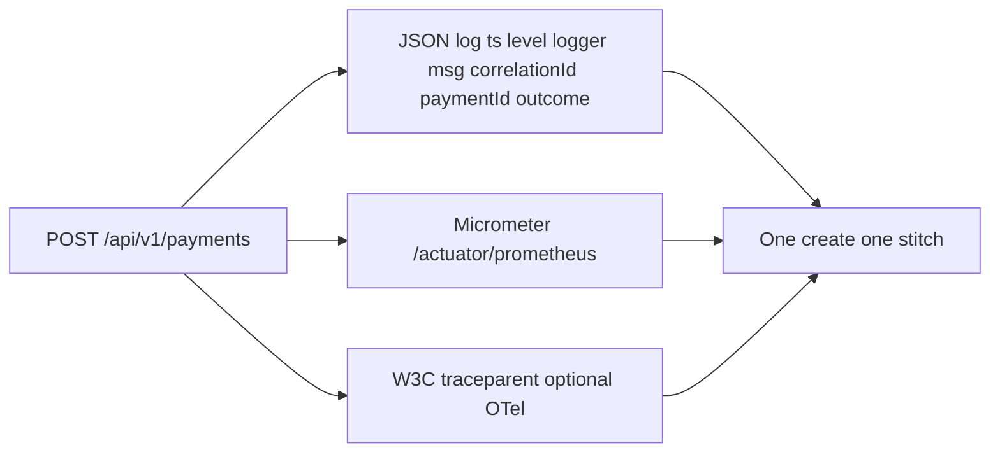

# L-13.1 — Logs, metrics and traces

**Module:** 13 — Production Engineering and Observability  
**Duration:** 30 minutes  
**Diagram:** AEJE-D-059  
**Case study:** BayPay Financial Services (fictional)

---

## Why this matters

When Harbor Bike Co charges Avery Chen `$84.00`, Riley Okonkwo has three different questions. *What happened to this create?* needs a JSON line with `correlationId` and `paymentId`. *Is the fleet failing the SLO?* needs Micrometer on `/actuator/prometheus`. *Where did VALIDATING spend 300 ms?* needs a W3C `traceparent`, not a CloudWatch search that happens to find a string. If Jordan Voss ships only INFO stack traces, Priya Nair cannot spend an error budget. If Sam Okada scrapes nothing, the page is a rumor. This lesson is the three signals on AEJE-D-059 — logs, metrics, traces — for `payment-service` on port `8080`.

---

## Learning objectives

- Name the locked JSON log fields: `ts`, `level`, `logger`, `msg`, `correlationId`, `paymentId`, `outcome`.
- Expose Micrometer via `/actuator/prometheus` and treat scrape as the metrics contract, not a screenshot.
- Carry W3C `traceparent` on inbound `POST /api/v1/payments`; treat OpenTelemetry export as optional.
- Refuse PAN, passwords, and high-cardinality identifiers on **metric labels**; keep those on logs or traces instead.

---

## Concept explanation

**Logs** answer “what happened to *this* payment.” BayPay’s teaching shape is **JSON lines**, one object per event, fields locked in [OBSERVABILITY.md](../../../../datasets/baypay-ops/OBSERVABILITY.md):

| Field | Role |
|---|---|
| `ts` | Event time (UTC). Clock skew is a later fight; still write ISO-8601. |
| `level` | `INFO` / `WARN` / `ERROR`. Do not INFO every authorize in production volume. |
| `logger` | Class or category. Keep it stable so Riley can filter. |
| `msg` | Human sentence. No PAN, no CVV, no `BAYPAY_DB_PASSWORD`. |
| `correlationId` | Request stitch from `CorrelationIdFilter` / `X-Correlation-Id`. |
| `paymentId` | Domain id, e.g. `c1300a11-0000-4000-8000-111111111300`. |
| `outcome` | Coarse result aligned with the state machine (`AUTHORIZED`, `COMPLETED`, declined). |

Avery’s customer id `11111111-1111-1111-1111-111111111111` and the active USD account `…221` may appear in **application logs** when support needs them. They must **not** become Prometheus label keys. Full account numbers and PAN never appear anywhere.

**Metrics** answer “how is the *service* behaving over a window.” Spring Boot 3.5.5 already speaks Micrometer. The scrape URL is `/actuator/prometheus` on the same process that serves `/api/v1/payments` (management port split is allowed later; this course’s default is one listener on `8080`). The golden counter you will reuse in L-13.2 is `http_server_requests_seconds_count{uri="/api/v1/payments",method="POST"}`. Histograms feed P99. Custom business timers are fine if labels stay **low-cardinality**: `uri`, `method`, `outcome`, `status`, `exception` (coarse). That is literacy for every meter you register. It is not an incident RCA.

**Traces** answer “which span burned the budget on *this* request.” The inbound contract is W3C `traceparent`. If the merchant or ALB sends it, `payment-service` must propagate it through authorize, Hikari checkout, and the worker that moves `AUTHORIZED → PROCESSING → COMPLETED`. An optional OpenTelemetry exporter may send spans to a collector. **You do not need a live collector to pass this course.** CloudWatch Logs Insights that `filter @message like correlationId` is a **search**, not a trace (L-11.6).

**How they join.** One create has one `correlationId`, one `paymentId`, and optionally one trace id. Priya’s dashboard never plots a single Avery Chen. Riley’s incident ticket always quotes at least one of those three ids plus the `outcome`.

**What each signal is not.** A metric is not a log you sampled. A log is not an SLO. A trace is not “we turned on Container Insights.” Do not bounce `dmgr-east` because stdout is quiet on Fargate.

---

## Visual explanation



Alt text: AEJE-D-059. A payment create emits a JSON log line, Micrometer series on the Prometheus scrape, and an optional W3C trace; the three signals join on correlation and payment identity, not on card data.

---

## Architecture

Sam Okada’s platform scrapes ECS tasks in `us-west-2` (or your laptop) at `/actuator/prometheus`. Priya owns recording rules and the paper Grafana home (BUILD-1300). Riley owns log field discipline in `payment-service`. Jordan’s release notes cite the image tag **and** whether scrape still answers 200. Morgan Hale’s PMI on `PaymentCluster` is a different estate; do not dual-write Cell metrics into the Boot dashboard as if they were the same process.

Stabilization when scrape dies: ticket, not page, unless the **SLI** is already dark (L-13.4). Remediation is restore scrape or fix exposure — not a cell recycle.

Local reference app today exposes `health,info,metrics`. Teaching production **adds** `prometheus` on a locked list. Do not expose `heapdump` or `threaddump` on the public ALB.

---

## Production example

Avery Chen pays Harbor Bike Co. The JSON line shows `outcome=AUTHORIZED` then a later line `outcome=COMPLETED` for `paymentId=c1300a11-0000-4000-8000-111111111300`. Priya’s scrape shows `http_server_requests_seconds_count` incrementing for `uri="/api/v1/payments",method="POST"`. Riley pastes `correlationId` into the ticket. If the merchant sent `traceparent`, the authorize span and the Hikari span share a trace id.

A different afternoon: someone logs the raw authorization header “for PCI debugging.” That is a **security incident**, not observability. Rotate, purge, and treat the log line as evidence of a process failure. Metrics were never the place for that header.

If Jordan says “we have traces because CloudWatch exists,” write the contradiction: search ≠ directed spans.

---

## Code/configuration example

Illustrative scrape, JSON line, and a low-cardinality timer — not a lab answer, not a live password:

```yaml
# application.yml fragment (teaching production profile)
management:
  endpoints:
    web:
      exposure:
        include: health,info,metrics,prometheus
  endpoint:
    health:
      probes:
        enabled: true
  prometheus:
    metrics:
      export:
        enabled: true
  tracing:
    sampling:
      probability: 0.1
```

```json
{"ts":"2026-09-03T20:11:04.221Z","level":"INFO","logger":"c.b.payment.api.PaymentController","msg":"create accepted","correlationId":"7f2c9a10-b3e1-4c55-9d01-aa11bb22cc33","paymentId":"c1300a11-0000-4000-8000-111111111300","outcome":"AUTHORIZED"}
```

```java
// Literacy: labels are uri, method, outcome, status — never PAN or secrets
Timer.Sample sample = Timer.start(registry);
sample.stop(Timer.builder("http.server.requests")
    .description("Payment HTTP server requests")
    .tag("uri", "/api/v1/payments")
    .tag("method", "POST")
    .tag("outcome", "COMPLETED")
    .tag("status", "200")
    .register(registry));
```

Do not put `BAYPAY_DB_PASSWORD` in this YAML. Do not log the card number Harbor Bike Co never sent you.

---

## Trade-offs

| Choice | Gain | Cost |
|---|---|---|
| JSON logs | Filterable fields; stitch ids | Larger lines than a printf |
| Text console pattern only | Cheap local read | Weak for incident search |
| Prometheus scrape | Standard RED/USE | You must keep labels bounded |
| Push-every-event APM | Rich traces | Cost; still not an SLO |
| 100% trace sample | Complete graphs | Noise and bill |
| 10% sample + logs | Affordable | Rare bugs need ids in logs |

---

## Failure modes

- Logging PAN or `BAYPAY_DB_PASSWORD` “just in staging.”
- Exposing `heapdump` on the same ALB that merchants hit.
- Claiming traces because a log group exists in `us-west-2`.
- Scraping `/actuator/metrics` JSON by hand and calling it Prometheus.
- Bouncing `dmgr-east` because Fargate stdout is in CloudWatch, not FFDC.
- Treating a missing `correlationId` as “the JVM hung.”

---

## Security/reliability implications

Logs are a data store. Who can `grep` `paymentId` can reconstruct Avery Chen’s session. Restrict access, retain on purpose, and never persist PAN. Metrics are safer **when labels stay coarse**; they become a side channel if you encode identity into series names.

Reliability: if scrape is down you are flying blind on the SLO, but Avery may still be paying. Communicate **signal health** separately from **payment health**. Do not tell merchants “we rolled observability” when `POST /api/v1/payments` is 500.

---

## Interview perspective

**Engineer.** I emit JSON with `correlationId`, `paymentId`, and `outcome`. I scrape `/actuator/prometheus`. I do not log PAN or passwords.

**Senior.** I keep meter labels low-cardinality (`uri`, `method`, `outcome`, `status`). I will not call CloudWatch search a trace. I propagate `traceparent` when it is present.

**Staff.** I fund three signals with different jobs: casework, fleet SLO, causal graph. I score on-call on ids quoted, not on tool logos.

**Principal.** Observability is a production contract, not a vendor. I will not accept ND-in-Docker or a cell bounce as the Boot signal plan.

---

## Key takeaways

- Logs, metrics, and traces answer different questions about the same create.
- Locked log fields: `ts`, `level`, `logger`, `msg`, `correlationId`, `paymentId`, `outcome`.
- Scrape `/actuator/prometheus`. Golden URI is `POST /api/v1/payments`.
- W3C `traceparent` is the trace contract; OTel export is optional.
- Low-cardinality labels are literacy. A lucky “observability” guess is not an RCA.

---

## Knowledge check

1. Which seven JSON fields does OBSERVABILITY.md lock for `payment-service` lines?
2. Riley has a `correlationId` in CloudWatch Logs Insights. Why is that still not a distributed trace?
3. Why must PAN and `BAYPAY_DB_PASSWORD` never appear in logs, and why must customer or account ids stay off **metric labels**?

<details>
<summary>Spoiler — answers</summary>

1. `ts`, `level`, `logger`, `msg`, `correlationId`, `paymentId`, `outcome`.
2. Insights is a text search. A trace is a span graph propagated with `traceparent` (optional OTel export). Same id in two log lines is not parent/child timing.
3. Logs are retained and readable — PCI and secret leakage. Metric labels multiply time series; identity belongs on a log or span attribute for one payment, not on the fleet scrape.

</details>

---

## Related lab

[BUILD-1300](../../../../labs/BUILD-1300/README.md) — BayPay operations dashboard, after L-13.4. Use this lesson’s field and scrape names when you later list panels. This lesson does not complete that lab for you.

---

## Related PAKS

Optional: `docs/19-observability/overview.md` (three signals). Logs-versus-metrics-versus-traces stands alone without a PAKS login.
