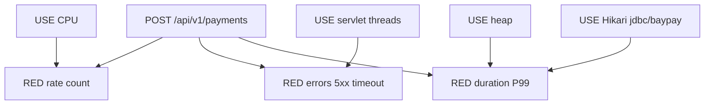

# L-13.2 — RED and USE concepts

**Module:** 13 — Production Engineering and Observability  
**Duration:** 30 minutes  
**Diagram:** AEJE-D-060  
**Case study:** BayPay Financial Services (fictional)

---

## Why this matters

Priya Nair cannot page on “the JVM feels hot.” Harbor Bike Co cares whether Avery Chen’s `POST /api/v1/payments` **completes**, **fails on the server**, or **sits in the tail**. That is **RED**: rate, errors, duration on the golden URI. Riley Okonkwo still needs **USE** on the resources that feed that URI: JVM heap, CPU, Hikari pool `jdbc/baypay`, Tomcat / servlet threads. If you mix them — treating thread busy as “rate,” or heap used as “errors” — the dashboard lies. AEJE-D-060 is that split. L-13.3 will turn RED into an SLI. This lesson is the vocabulary.

---

## Learning objectives

- Compute request **rate** from `http_server_requests_seconds_count{uri="/api/v1/payments",method="POST"}`.
- Classify **errors** as 5xx, timeout, or dependency-turned-5xx; keep ordinary 4xx off the SLO burn by default.
- Read **duration** as a histogram tail (P50 / P99), not as an average.
- Apply USE to heap, CPU, Hikari `jdbc/baypay`, and servlet threads: utilization, saturation, errors.

---

## Concept explanation

**RED is about the request.** For BayPay the request is the locked golden create: `POST /api/v1/payments` with `Idempotency-Key`. Happy path remains `RECEIVED → VALIDATING → AUTHORIZED → PROCESSING → COMPLETED`.

| Signal | Teaching name | Meaning |
|---|---|---|
| Rate | `http_server_requests_seconds_count{uri="/api/v1/payments",method="POST"}` | Completions per second (successful or not). **Not** “threads busy.” |
| Errors | 5xx + timeout on that URI | Server failure. 4xx except 429 are **client** by default. Frozen account `…222` is a correct 4xx, not burn. |
| Duration | Histogram → P50 / P99 | Teaching tail is **P99**. Average hides Avery’s 2 s authorize. |

Rate is a `rate()` of the **count**. If you plot raw counter, Monday looks like a ski jump. Errors are a ratio or a rate of the failing class, not “any WARN in logs.” Duration must come from a **histogram** (Micrometer `http.server.requests` / Prometheus `_bucket`). A Summary-only average is a different, weaker number.

**USE is about a resource.** Tom Hughes’s model: utilization (busy fraction), saturation (queue / extra work waiting), errors (failed operations on *that* resource). OBSERVABILITY.md locks four BayPay resources:

| Resource | Utilization | Saturation | Errors |
|---|---|---|---|
| JVM heap | used / max | old-gen near full; allocation rate | OOM / allocation failure |
| CPU | process CPU / limit | run-queue / throttling | — |
| Hikari `jdbc/baypay` | active / max | pending threads | connection timeout |
| Tomcat / servlet threads | busy / max | queue depth | reject / 503 |

A Hikari pending queue is **saturation**. It predicts RED duration and then RED errors. A heap that is 70% used after a young collection may be healthy (L-7.4). USE without GC literacy pages the wrong person.

**Do not cross the wires.**

| Wrong move | Why it fails |
|---|---|
| Rate = Tomcat busy | Busy threads can mean a downstream stall, not more successful creates |
| Errors = log lines with `ERROR` | Stack traces from a scanner are not SLO burn |
| Duration = CPU% | CPU can be fine while Hikari waits |
| Heap used = capacity done | Need max, GC, and allocation rate |
| Frozen-account 4xx = burn | Product worked; Avery’s `…222` is supposed to decline |

**Labels stay coarse.** Literacy from L-13.1: `uri`, `method`, `outcome`, `status`, `exception` (coarse). Do not put customer id, account id, `Idempotency-Key`, or PAN on meter labels. That rule is how you keep RED cheap. It is not a closed incident story.

**Where AWS fits.** ALB `TargetResponseTime` and `HTTPCode_Target_5XX_Count` in `us-west-2` are **front-door RED cousins**. They do not replace Micrometer on the JVM. ECS `CPUUtilization` is USE-ish capacity, not a Java RCA (L-11.6).

---

## Visual explanation



Alt text: AEJE-D-060. RED measures rate, errors, and P99 on the payment create; USE measures heap, CPU, Hikari jdbc/baypay, and servlet threads that feed those request signals.

---

## Architecture

Priya’s paper dashboard (BUILD-1300) puts **RED for the golden URI on the first row** and **USE for the four resources on the second**. Riley’s first five minutes: rate down or P99 up? then which USE gauge is saturated? Sam owns scrape labels so `uri` is the path template `/api/v1/payments`, not a string with a payment id in it.

Jordan’s canary (`pay-prod-east-2` in Module 8 language, or a new ECS task set) must appear as a **separate** RED slice if you have an instance or revision label — still coarse. Morgan Hale’s PMI thread pool on the cell is not `jdbc/baypay` on Boot.

Stabilization when RED is bad and USE is maxed: shed load or fail ready, do not bounce `dmgr-east`. Remediation is size or fix the resource (L-13.5), after evidence.

---

## Production example

Monday 10:00 Pacific. Rate on `POST /api/v1/payments` is 40 RPS, P99 is 180 ms, 5xx is ~0. Harbor Bike Co is fine. Hikari active/max is 8/20. Heap used/max is 400/1024 MiB after G1. Priya does not page.

Monday 10:12. Rate holds, P99 walks to 900 ms. USE: Hikari pending threads climb, `connection timeout` ticks. RED duration is the merchant symptom; Hikari saturation is the resource clue. Riley quotes both. He does **not** declare a Module 8 leak from P99 alone.

A frozen-account burst (`…222`) raises 4xx. RED errors (server) stay flat. Anyone paging that burst is spending human error budget on a correct decline.

---

## Code/configuration example

Teaching PromQL against the locked names — paper is enough; no live AMP required:

```promql
# RED rate — completions per second
sum(rate(http_server_requests_seconds_count{uri="/api/v1/payments",method="POST"}[5m]))

# RED server errors — 5xx class (timeouts must be labeled or counted separately)
sum(rate(http_server_requests_seconds_count{uri="/api/v1/payments",method="POST",status=~"5.."}[5m]))

# RED duration — P99 from histogram buckets
histogram_quantile(0.99,
  sum by (le) (rate(http_server_requests_seconds_bucket{uri="/api/v1/payments",method="POST"}[5m])))
```

```promql
# USE sketches (names vary by Micrometer binder; keep the *idea*)
jvm_memory_used_bytes{area="heap"} / jvm_memory_max_bytes{area="heap"}
hikaricp_connections_active{pool="jdbc/baypay"} / hikaricp_connections_max{pool="jdbc/baypay"}
hikaricp_connections_pending{pool="jdbc/baypay"}
tomcat_threads_busy_threads / tomcat_threads_config_max_threads
```

Write the four USE rows on paper even if your local Boot binder uses a slightly different series name. Do not invent a second golden URI.

---

## Trade-offs

| Choice | Gain | Cost |
|---|---|---|
| RED on one golden URI | Merchants see the truth | Other URLs can rot unseen |
| RED on every URI | Coverage | Dashboard noise; more labels |
| P99 | Tail that finance feels | Needs histograms and traffic |
| Average latency | Simple | Hides the 1% |
| USE + RED together | Cause clues | Two mental models to teach |
| CPU-only dashboard | Familiar | Misses Hikari and threads |

---

## Failure modes

- Plotting thread utilization and calling it request rate.
- Burning the SLO on 404 probes or frozen-account 4xx.
- Using `avg()` of a gauge as P99.
- Ignoring Hikari pending while staring at heap used.
- Setting `-Xmx` equal to the container so heap “utilization” looks low until the kernel kills the task.
- Recycling `dmgr-east` because Boot RED is red.

---

## Security/reliability implications

RED errors that include **client** 4xx will train Priya to ignore pages — or to page on Avery’s mistyped wallet. Reliability depends on the 5xx/timeout definition staying honest.

USE gauges can leak topology (pool sizes, thread caps). That is operationally useful and not PCI. Do not attach identity to those series. Do not expose raw Prometheus on the public ALB without a scrape ACL.

---

## Interview perspective

**Engineer.** RED is rate, errors, duration on `POST /api/v1/payments`. USE is heap, CPU, Hikari `jdbc/baypay`, servlet threads.

**Senior.** Rate is the request counter, not busy threads. I exclude ordinary 4xx from burn. I read P99 from a histogram. Pending Hikari is saturation.

**Staff.** I put RED on row one and USE on row two so on-call cannot confuse a resource with a merchant symptom. I will not max a diagnostic on “CPU.”

**Principal.** I fund one golden-request vocabulary for the company. 99.99% architecture comes later; this board still speaks RED/USE.

---

## Key takeaways

- RED = rate, errors, duration on the golden create. Rate ≠ threads busy.
- Server errors are 5xx, timeout, dependency-as-5xx. Frozen-account 4xx is not burn.
- P99 is the teaching tail. Averages lie.
- USE = utilization, saturation, errors on heap, CPU, Hikari `jdbc/baypay`, servlet threads.
- Saturation predicts RED. A lucky resource name is not an RCA.

---

## Knowledge check

1. Give the locked Prometheus **count** name and labels for payment-create rate.
2. Avery uses frozen account `…222` and gets a 4xx. Does that burn the teaching SLO? Why?
3. Hikari active/max is 20/20 and pending > 0, while CPU is 30%. Which model is saturated, and what RED signal do you expect first?

<details>
<summary>Spoiler — answers</summary>

1. `http_server_requests_seconds_count{uri="/api/v1/payments",method="POST"}`.
2. No. Ordinary 4xx (except 429 if the cohort counts 429 as capacity) are client, not server failure.
3. Hikari `jdbc/baypay` is saturated. Expect duration (P99) to rise, then timeouts / 5xx — not a CPU story.

</details>

---

## Related lab

[BUILD-1300](../../../../labs/BUILD-1300/README.md) — after L-13.4. Your first dashboard row should be this lesson’s RED; the second row this lesson’s USE. This lesson does not draw that JSON for you.

---

## Related PAKS

Optional: `docs/19-observability/overview.md` (RED/USE). The locked BayPay table in OBSERVABILITY.md is enough without a PAKS login.
