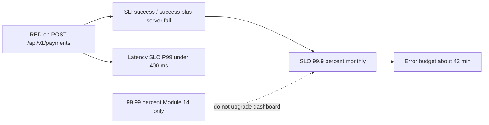

# L-13.3 — SLIs and SLOs

**Module:** 13 — Production Engineering and Observability  
**Duration:** 30 minutes  
**Diagram:** AEJE-D-060  
**Case study:** BayPay Financial Services (fictional)

---

## Why this matters

RED tells Priya Nair the create is slow or failing. An **SLI** says which of those events count as *good*. An **SLO** is the promise BayPay is willing to print: **99.9%** of counted `POST /api/v1/payments` succeed each month, and a COMPLETED happy-path create stays **P99 under 400 ms**. The leftover is the **error budget** — about **43 minutes** of equivalent downtime per 30-day month. If Jordan Voss ships without a budget, Riley Okonkwo pages on vibes. If someone paints **99.99%** on the Module 13 dashboard, they have silently changed the contract. 99.99% is Module 14’s architecture target, not this board.

---

## Learning objectives

- Write the payment-create **SLI**: successful creates / (successful + **server** failures).
- Hold the locked **SLO**: 99.9% monthly availability; latency SLO P99 `< 400 ms` on a COMPLETED happy path.
- Spend the **~43-minute** monthly error budget on purpose (release, incident, or refuse the release).
- Refuse to upgrade the dashboard to 99.99% in this module.

---

## Concept explanation

**SLI (service level indicator)** is a *measurement*. For BayPay payment create, OBSERVABILITY.md locks:

> Successful `POST /api/v1/payments` / (successful + **server** failures).

**Server failure** = 5xx, timeout, or a dependency failure that becomes 5xx. **Exclude** ordinary 4xx. Frozen account `22222222-2222-2222-2222-222222222222` declining Avery Chen is a correct product outcome, not a broken SLI. **429** may be treated as capacity (server-ish) if the cohort says so; default 4xx stay out.

Success means the HTTP create completed without that server-failure class. Finance also cares that the state machine reached `COMPLETED`. Teaching availability SLI is the HTTP/server definition above. The latency SLI is **P99 of a COMPLETED create on the happy path** (synthetic local / teaching prod), target **`< 400 ms`**.

**SLO (service level objective)** is a *target* on an SLI:

| Field | Locked value |
|---|---|
| Availability SLO | **99.9%** monthly on the payment-create SLI |
| Latency SLO | P99 **`< 400 ms`** for COMPLETED happy-path create |
| Window | 30 days rolling unless a lab says otherwise |
| Error budget | ~43 minutes of equivalent downtime / 30-day month at 99.9% |

Arithmetic you should be able to repeat: `30 days × 24 h × 60 min × (1 − 0.999) ≈ 43.2 minutes`. That is why the pack says **~43 min**. It is not 52 minutes/year (that is the 99.99% *annual* picture in Module 14).

**Error budget** is the SLO’s leftover. Priya and Jordan **spend** it. A canary that burns 10 minutes of equivalent unavailability is a decision, not a surprise. When the budget is gone, **stop** feature deploys until you are back inside the SLO or leadership explicitly accepts the overage. Riley still **stabilizes** an incident either way.

**SLI is not a page.** L-13.4 turns burn rate into alerts. This lesson stops at “what good means.”

**99.99% is not this module.** ARCHITECT-1401 will ask you to *design* toward 99.99% (multi-AZ story, failure domains). TRUST.md is explicit: **default SLO in Module 13 dashboards stays 99.9%**. Painting four nines on BUILD-1300 is a contract change, not ambition.

**What the SLI is not.** Actuator liveness UP is not the SLI. ALB healthy hosts are not the SLI. `./mvnw test` green is not the SLI. Avery Chen reaching `COMPLETED` without a 5xx is closer. A single synthetic probe is a *check*; it can support the SLI but is not the whole traffic mix.

AEJE-D-060 still applies: the SLI is a **function of RED**. USE tells you *why* you might miss. Capacity (L-13.5) is how you keep headroom so the SLO is plausible.

---

## Visual explanation



Alt text: AEJE-D-060. RED feeds the payment-create SLI; the Module 13 SLO stays 99.9 percent monthly with P99 under 400 ms and about 43 minutes of error budget; 99.99 percent remains a later architecture target.

---

## Architecture

Priya publishes the SLI formula in the same repo as the dashboard JSON. Product (teaching: Harbor Bike Co as the merchant we care about) agrees 99.9% is the **operating** promise. Sam Okada’s scrape must keep `uri` and `status` labels so the ratio is computable. Jordan’s launch checklist includes “budget remaining this window.”

Riley’s incident comms must say **SLI impact** (“server-failure ratio 2% for 12 minutes”) not “the site is down” if creates still complete. Morgan Hale’s cell SLA from 2014 is not this document.

Recording rules may pre-aggregate 5-minute and 1-hour burn. That is L-13.4. Here, write the **definition** so two engineers get the same numerator.

---

## Production example

Window: 30 days. Counted events: 10_000_000 creates. Server failures: 8_000. SLI = 99.92%. Budget remaining. Jordan may ship a Hikari timeout tweak.

Same window, a bad afternoon: 20 minutes of 50% success on the create URI. That is **10 minutes of equivalent 100% downtime** (20 × 0.50). Budget is not empty, but Priya calls a freeze on unrelated UI deploys. Riley stabilizes first.

Someone opens a PR: “dashboard SLO: 99.99% to look serious.” Sam rejects it. Module 14 can design four nines. This panel still says 99.9% and 400 ms.

Avery’s frozen account (`…222`) adds thousands of 4xx. Numerator and server-failure denominator ignore them. The latency SLO also ignores that decline path unless a lab says otherwise — teaching P99 is the **COMPLETED** happy path.

---

## Code/configuration example

Paper PromQL / recording shape — not a live rule host, not a second SLO:

```yaml
# prometheus-style recording (teaching names)
groups:
  - name: baypay-payment-sli
    rules:
      - record: baypay:payment_create:sli_success_ratio_5m
        expr: |
          sum(rate(http_server_requests_seconds_count{uri="/api/v1/payments",method="POST",status=~"2.."}[5m]))
          /
          clamp_min(
            sum(rate(http_server_requests_seconds_count{uri="/api/v1/payments",method="POST",status=~"2.."}[5m]))
            +
            sum(rate(http_server_requests_seconds_count{uri="/api/v1/payments",method="POST",status=~"5.."}[5m]))
          , 1e-9)
      - record: baypay:payment_create:p99_5m
        expr: |
          histogram_quantile(0.99,
            sum by (le) (rate(http_server_requests_seconds_bucket{uri="/api/v1/payments",method="POST"}[5m])))
```

```text
# Contract card (paste into PF-ops.md)
SLI: successful POST /api/v1/payments / (success + server fail)
SLO: 99.9% / 30d
Latency SLO: P99 < 400ms COMPLETED happy path
Error budget: ~43 min / 30d
Not this dashboard: 99.99% (Module 14)
```

Timeouts must be counted as server failure even if the HTTP status never arrives — your scrape may need a timeout `outcome` label (`outcome="TIMEOUT"`), still coarse.

---

## Trade-offs

| Choice | Gain | Cost |
|---|---|---|
| 99.9% / 30d | Honest ops target; ~43 min budget | Not a marketing four-nines |
| 99.99% now | Sounds stronger | ~4.3 min/month; this course is not staffed for it |
| Exclude 4xx | Frozen account is not an outage | Bad client UX can hide |
| Include 429 as fail | Capacity is visible | Tightens budget on overload |
| Traffic-weighted SLI | Real merchants | Needs production-like volume |
| Probe-only SLI | Cheap | Lies when probes miss the stall |

---

## Failure modes

- Upgrading BUILD-1300 to 99.99% “to match Module 14.”
- Counting frozen-account 4xx as burn.
- Using liveness UP as the availability SLI.
- Setting a 400 ms **average** and calling it the P99 SLO.
- Spending the whole budget on a Friday deploy with no freeze rule.
- Treating 43 minutes as “we can be down 43 minutes in a row and shrug.”

---

## Security/reliability implications

An SLO is a **reliability contract** with merchants and with on-call. A vanity four-nines without budget math produces either constant pages or ignored pages.

Do not put tenant ids into the SLI ratio’s labels. The company has **one** teaching SLI for this URI. Multi-tenant SLOs are a later product decision.

Communication: “we missed 99.9% this hour” is allowed. “we are a 99.99% service” is not allowed on this module’s dashboard.

---

## Interview perspective

**Engineer.** SLI is success over success-plus-server-fail on `POST /api/v1/payments`. SLO is 99.9% monthly. P99 `< 400 ms`. Budget ~43 minutes.

**Senior.** I exclude ordinary 4xx. I will not use liveness as the SLI. I spend budget on purpose and freeze when it is gone.

**Staff.** I keep 99.9% as the operating SLO and 99.99% as an architecture conversation. I score launches on budget remaining, not on hope.

**Principal.** I refuse a dashboard that quietly changes the promise. Error budgets are how product and SRE share risk.

---

## Key takeaways

- SLI = successful create / (success + server failure). Server = 5xx, timeout, dependency-as-5xx.
- SLO = **99.9%** / 30 days. Latency SLO = P99 **`< 400 ms`** COMPLETED happy path.
- Error budget ≈ **43 minutes** / month at 99.9%.
- 99.99% is Module 14. Do not upgrade this dashboard.
- A lucky “we missed SLO” sentence is not an RCA.

---

## Knowledge check

1. Write the payment-create SLI in one sentence, including what you exclude.
2. Why is ~43 minutes the monthly error budget at 99.9%, and what must you *not* swap in from Module 14?
3. Actuator readiness is UP and ALB hosts are healthy, but 5% of creates are 503. Are you inside the SLO story?

<details>
<summary>Spoiler — answers</summary>

1. Successful `POST /api/v1/payments` divided by success plus server failures (5xx, timeout, dependency-as-5xx); exclude ordinary 4xx (frozen account is not burn).
2. `30×24×60×0.001 ≈ 43` minutes. Do not replace it with 99.99% (~4.3 min/month or ~52 min/year) on this module’s board.
3. No. Front-door health is not the SLI. 503 is a server failure and burns the budget.

</details>

---

## Related lab

[BUILD-1300](../../../../labs/BUILD-1300/README.md) — after L-13.4. The SLO annotation on that dashboard must stay **99.9%** and **400 ms**. This lesson is the contract that lab must not rewrite.

---

## Related PAKS

Optional: `docs/19-observability/overview.md` (SLI/SLO). OBSERVABILITY.md plus this lesson stand alone without a PAKS login.
