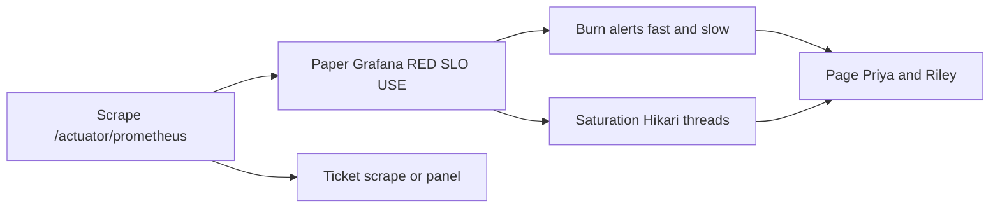

# L-13.4 — Alerting and dashboards

**Module:** 13 — Production Engineering and Observability  
**Duration:** 30 minutes  
**Diagram:** AEJE-D-061  
**Case study:** BayPay Financial Services (fictional)

---

## Why this matters

Priya Nair’s phone should ring when BayPay is **spending the 99.9% error budget too fast**, or when Hikari `jdbc/baypay` / servlet threads are **saturated** enough that the next minutes will burn it. It should not ring because CPU crossed 80%, or because a log line contained `ERROR`, or because a Grafana panel failed to render. Riley Okonkwo’s first screen is a **paper dashboard** that puts RED, USE, SLO, and scrape health in a fixed order. BUILD-1300 is that artifact. AEJE-D-061 is the path from scrape → board → burn or saturation page.

---

## Learning objectives

- Page on **SLO burn** (fast and slow windows) and on **saturation that predicts burn**.
- Ticket (not page) scrape failures and broken dashboard panels.
- Refuse CPU > 80% and “log contains ERROR” as the **primary** page.
- Describe a BUILD-1300 home board that keeps the SLO at **99.9%** / P99 **400 ms**.

---

## Concept explanation

**A page** is a human interrupting sleep or a meeting. It must be **actionable** and **tied to the merchant promise**. OBSERVABILITY.md locks the teaching pages:

1. **SLO burn** on the payment-create SLI (L-13.3) — fast window (minutes) and slow window (hours).
2. **Saturation that predicts burn** — Hikari pending / pool maxed; Tomcat / servlet threads maxed or rejecting.

**Burn rate** compares how fast you consume the ~43-minute monthly budget versus a sustainable pace. A 14× burn on a one-hour window means “at this rate the month’s budget dies in a few hours.” A 1× burn is “on pace.” Exact multipliers are a house style; the **idea** is multi-window so a five-minute blip does not page and a slow leak does not hide.

**Saturation pages** fire before RED is a smoking crater. If `hikaricp_connections_pending{pool="jdbc/baypay"}` stays high, P99 will miss 400 ms and then 5xx appear. Page that, with a link to the USE row.

**Do not page on:**

| Tempting rule | Why it is a ticket or a graph |
|---|---|
| CPU > 80% | GC storms, JIT, and healthy peaks all look like this (L-8.3, L-11.6) |
| `level=ERROR` in logs | Scanners, expected declines, one bad merchant |
| Single 5xx | Need rate × budget, not a lonely counter |
| Panel query error | Sam’s platform ticket |
| Scrape missing 1 interval | Flap; ticket unless SLI is already dark for the page window |

**Dashboards** are for **orientation**, not for 40 panels of vanity. Teaching home (BUILD-1300):

| Row | Panels |
|---|---|
| 1 RED | Rate, server-error ratio, P99 of `POST /api/v1/payments` |
| 2 SLO | 99.9% target line; budget remaining; P99 vs 400 ms |
| 3 USE | Heap used/max, CPU, Hikari `jdbc/baypay`, servlet threads |
| 4 Signal health | Scrape up; last scrape age — **ticket** if broken |

No live Grafana is required. A JSON file on disk that *would* import is the bar. Region when AWS is named: `us-west-2`. Do not add OpenSearch “so it looks real.”

**Alert text** must quote the URI, the window, and the next USE check. It must **not** name a root cause. “P99 spike / throughput drop after a metrics change” is a **symptom class** you may see later. This lesson does not diagnose it.

**Silence and inhibit.** Inhibit CPU alerts if you were foolish enough to create them. Prefer never creating them. After Jordan’s canary, do not silence **burn** for the weekend.

---

## Visual explanation



Alt text: AEJE-D-061. Prometheus scrape feeds a paper Grafana board; SLO burn and resource saturation page on-call; scrape or panel failures open tickets instead of pages.

---

## Architecture

Sam Okada runs scrape (ECS service discovery or a static laptop target). Priya owns alert YAML and the dashboard JSON in git — same review rules as Module 12 (no secrets). Riley’s runbook: page → board row 1 → row 3 → one `correlationId` from logs. Jordan attaches the dashboard screenshot (or JSON panel list) to the release notes when a change can move P99.

Morgan Hale’s WAS alerts on `PaymentCluster` must not fan into the Boot pager as the same service. Do not bounce `dmgr-east` because a Grafana variable defaulted to the cell.

Student apply of AMP + Grafana is **out of scope**. ACCOUNT.md already forbids OpenSearch. Paper plus optional local `/actuator/prometheus` is enough.

---

## Production example

Priya’s fast-burn page at 10:14: SLI success ratio 97% for 10 minutes on `POST /api/v1/payments`. Riley opens BUILD-1300 row 1: rate halved, P99 1.2 s. Row 3: servlet threads busy/max 200/200. He stabilizes (fail ready / shed — L-13.6), not “CPU 82%, scale × 10.”

A second night: Grafana panel “P99” shows No Data. Scrape is up. That is a **ticket** to Sam (wrong metric name). Nobody pages Avery Chen’s merchant.

A third PR adds `alert: CpuHigh; expr: cpu > 0.8`. Priya rejects it. USE CPU stays on the board. It does not own the pager.

Dashboard annotation still reads **SLO 99.9% / P99 400 ms**. A well-meaning intern changing the panel threshold to 99.99% fails review.

---

## Code/configuration example

Teaching PrometheusRule and a panel fragment — no live passwords, no PAN:

```yaml
groups:
  - name: baypay-payment-pages
    rules:
      - alert: PaymentCreateFastBurn
        expr: baypay:payment_create:sli_success_ratio_5m < 0.995
        for: 10m
        labels:
          severity: page
          service: payment-service
        annotations:
          summary: "SLO burn on POST /api/v1/payments (fast window)"
          description: "Check RED row then Hikari jdbc/baypay and servlet threads. SLO stays 99.9%."
      - alert: HikariBaypaySaturated
        expr: hikaricp_connections_pending{pool="jdbc/baypay"} > 0
        for: 5m
        labels:
          severity: page
          service: payment-service
        annotations:
          summary: "Hikari jdbc/baypay pending predicts P99 / 5xx"
      - alert: PrometheusScrapeDown
        expr: up{job="payment-service"} == 0
        for: 15m
        labels:
          severity: ticket
          service: payment-service
```

```json
{
  "title": "BayPay payment-service home",
  "tags": ["baypay", "module-13"],
  "templating": {"list": []},
  "panels": [
    {"title": "RED rate POST /api/v1/payments", "type": "timeseries"},
    {"title": "SLO 99.9% / budget ~43m — do not paint 99.99%", "type": "stat"}
  ]
}
```

CPU > 80% does not appear. `log{level="ERROR"}` does not appear.

---

## Trade-offs

| Choice | Gain | Cost |
|---|---|---|
| Multi-window burn | Catches fast and slow | More rules to explain |
| Saturation pages | Earlier than 5xx | Can flap if thresholds are tight |
| CPU primary page | Familiar to WAS shops | Noise; wrong action |
| Ticket on scrape down | Protects sleep | Blind until someone works the ticket |
| Huge dashboard | Feels complete | On-call freezes |
| Paper JSON only | Passes without a bill | You must imagine the pixels |

---

## Failure modes

- Paging on CPU > 80% or `ERROR` substring.
- Paging every scrape blip.
- Dashboard SLO threshold silently set to 99.99%.
- Alert annotation that names a root cause you have not proven.
- Silence on burn “until Monday.”
- Opening CloudWatch because Grafana JSON is paper, then applying OpenSearch.

---

## Security/reliability implications

Pager ownership is **release power for attention**. A stolen alert channel that pages “all clear” is a reliability incident. Keep webhook secrets out of git (Module 12 habit).

Reliability: flappy pages train Riley to mute the payment service. That is how Avery Chen’s next outage has no human. Prefer fewer pages with burn math.

Do not put customer identifiers into alert labels. Alert labels are metric labels.

---

## Interview perspective

**Engineer.** I page on SLO burn and on Hikari or thread saturation. I ticket scrape failures. I do not page on CPU > 80%.

**Senior.** Fast and slow burn windows. Dashboard row order is RED, SLO 99.9%, USE, signal health. I reject 99.99% on this board.

**Staff.** I measure pages per week and false-page rate. I will not accept log-line paging as “observability maturity.”

**Principal.** Attention is a budget like error budget. I fund burn + predictive saturation, and I forbid vanity thresholds.

---

## Key takeaways

- Primary pages: **SLO burn** (fast/slow) and **saturation that predicts burn**.
- Ticket scrape and panel errors. Do not page CPU > 80% or log `ERROR`.
- BUILD-1300 is paper Grafana JSON. SLO stays **99.9%** / **400 ms**.
- Alert text is a symptom and a next check, not an RCA.
- A lucky alert name does not max Diagnostic method.

---

## Knowledge check

1. Name the two teaching **page** classes from OBSERVABILITY.md, and one condition that must be a **ticket**.
2. Why is `CPU > 80%` a bad primary page for `payment-service`?
3. What SLO numbers must BUILD-1300 show, and which number must it refuse?

<details>
<summary>Spoiler — answers</summary>

1. Page: SLO burn (fast and slow) and saturation that predicts burn (Hikari pending / threads maxed). Ticket: scrape down or dashboard-panel errors.
2. CPU mixes GC, JIT, healthy peaks, and real saturation; it is not the SLI and drives the wrong scale-up.
3. Show 99.9% monthly and P99 400 ms. Refuse 99.99% (Module 14 architecture target only).

</details>

---

## Related lab

[BUILD-1300](../../../../labs/BUILD-1300/README.md) — BayPay operations dashboard. Time-box 60–90 minutes. Export panel JSON (or an equivalent panel list) that uses OBSERVABILITY.md names. This lesson does not complete the file for you.

---

## Related PAKS

Optional: `docs/19-observability/overview.md` (alerting). Burn-versus-CPU paging stands alone without a PAKS login.
