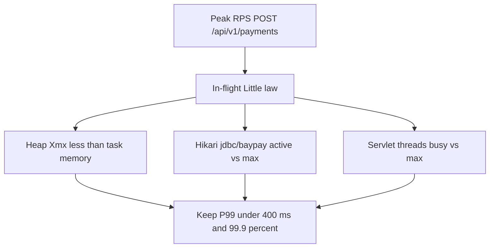

# L-13.5 — Capacity planning

**Module:** 13 — Production Engineering and Observability  
**Duration:** 30 minutes  
**Case study:** BayPay Financial Services (fictional)

---

## Why this matters

The 99.9% SLO and the 400 ms P99 are **capacity claims**. If Harbor Bike Co’s Monday peak is 80 RPS of `POST /api/v1/payments` and each create needs a Hikari checkout from `jdbc/baypay`, a 10-connection pool on one Fargate task will saturate, P99 will walk, and Riley Okonkwo will spend the ~43-minute budget on math you could have done on paper. This lesson is **ops capacity**: RPS, heap, Hikari, servlet thread pools, and SLO-driven headroom. It is **not** multi-region DR capacity (Module 14, DR-1403). It is not “run WebSphere ND in Docker to get more JVMs.”

---

## Learning objectives

- Estimate creates-per-second the current heap, Hikari `jdbc/baypay`, and Tomcat threads can hold with headroom.
- Size `-Xmx` **below** the container / task memory limit; never equal.
- Leave idle connections and idle threads so P99 stays under 400 ms at peak.
- Refuse ND-in-Docker, a second region, and bouncing `dmgr-east` as capacity answers.

---

## Concept explanation

**SLO-driven headroom** means you plan so that at expected peak, USE saturation stays off and RED duration stays inside 400 ms P99. A pool that runs 100% busy at peak has **zero** headroom. Teaching habit: peak utilization on Hikari and servlet threads stays well under max (a common paper target is ~70% busy at expected peak, not a religion). Heap after a typical G1 old collection should not sit on the max.

**RPS** is RED rate on the golden URI. Convert: `RPS × service time (seconds) ≈ concurrent in-flight creates` (Little’s law). If P99 is 0.2 s at 40 RPS, you have about 8 in-flight on that URI — plus VALIDATING/AUTHORIZED work that still holds a thread or a connection.

**Heap.** Java 21 / Spring Boot 3.5.5 on Fargate: the **task memory** is the cgroup limit (L-7.6, L-9.6). `-Xmx` is only the heap. Teaching picture from earlier modules: e.g. **2048 MiB task, `-Xmx1024m`**, never `-Xmx2048m` on a 2048 MiB task. Metaspace, stacks (Tomcat + Hikari + compiler + GC), code cache, and direct buffers live **outside** `-Xmx`. `MaxRAMPercentage` exists; explicit `-Xmx` with leftover native room is clearer for BayPay teaching.

**Hikari `jdbc/baypay`.** Utilization = active/max. Saturation = pending. Errors = connection timeout. Each ECS task has **its own** pool. Two tasks at `maximum-pool-size: 20` are 40 connections on Postgres (or the teaching H2 story) — budget the database. If checkout wait approaches your HTTP budget, P99 dies before CPU looks interesting.

**Tomcat / servlet threads.** Utilization = busy/max. Saturation = accept queue. Errors = reject / 503. Threads waiting on Hikari are **busy** but not producing COMPLETED. Scaling threads without connections moves the queue. Scaling connections without DB capacity moves the timeout.

**What you do not plan here.**

| Out of scope | Where it lives |
|---|---|
| Second region, RTO/RPO | Module 14 / DR-1403 |
| 99.99% failure domains | ARCHITECT-1401 |
| NAT Gateway, multi-AZ RDS apply | ACCOUNT.md forbids for student spend |
| ND cell in Docker | Never a BayPay recommendation |
| Recycle `dmgr-east` | Wrong estate |

**Headroom vs cost.** Another Fargate task is another heap, another JIT warmup, another Hikari pool (L-11.8). Scale on **SLO risk**, not on CPU 80%. Warmup after scale-out can itself miss P99 — canary and bake (L-13.7).

---

## Visual explanation



Alt text: Peak payment RPS converts to in-flight work that must fit in heap, Hikari jdbc/baypay, and servlet threads with headroom so P99 stays under 400 ms and the 99.9 percent SLO remains plausible.

---

## Architecture

Sam Okada publishes task CPU/memory (teaching: Fargate in `us-west-2`) and the JVM flags as **reviewed config**, not as Riley’s SSH. Priya overlays USE gauges at peak and asks for headroom before Jordan’s sale event. Riley’s stabilize when saturated: readiness fail / stop the cut, not “raise `-Xmx` to the container limit.”

Morgan Hale can quote cell PMI max threads. That number does not copy onto Boot. Do not start a Docker ND cell to “add capacity” beside ECS.

Database connection budget is a **platform + data** conversation. This lesson makes you **count** (tasks × pool size). It does not authorize an RDS apply.

---

## Production example

Peak teaching day: 40 RPS, P99 180 ms, ~8 in-flight. One task: `-Xmx1024m` on 2048 MiB, Hikari max 20 (active 8), Tomcat max 200 (busy 15). Headroom exists. Priya signs the sale.

Same sale, someone set Hikari max 4 “to be kind to the DB” on a single task. Pending climbs at 25 RPS. P99 crosses 400 ms. Error budget starts to move. The fix is **pool vs RPS math** (and maybe a second task), not a cell bounce.

A “quick win” PR sets `-Xmx` equal to task memory so “the heap can use everything.” Module 8 already showed the kernel OOM class. Reject it.

A slide titled “DR capacity: two regions × 3× RPS” is the **wrong meeting**. Park it for Module 14.

---

## Code/configuration example

Teaching task + JVM + pools — passwords stay in Secrets Manager, not here:

```yaml
# ECS task shape (us-west-2) — paper / terraform validate
cpu: 1024
memory: 2048
# JAVA_TOOL_OPTIONS — heap is not the container
# NEVER: -Xmx2048m on memory 2048
environment:
  - name: JAVA_TOOL_OPTIONS
    value: "-Xms512m -Xmx1024m -XX:+UseG1GC"
```

```yaml
# application.yml — teaching production
server:
  port: 8080
  tomcat:
    threads:
      max: 200
      min-spare: 20
spring:
  datasource:
    hikari:
      pool-name: jdbc/baypay
      maximum-pool-size: 20
      minimum-idle: 5
      connection-timeout: 2000
      max-lifetime: 1800000
```

```text
# Paper capacity card (PF-ops.md)
Peak RPS: ________
In-flight ≈ RPS × P99_s: ________
Tasks: ________
Hikari total = tasks × 20: ________
Heap per task: 1024m on 2048m cgroup
Headroom at peak busy: ________ % (target: not pinned at 100%)
Not in this card: second region, ND-in-Docker
```

`connection-timeout: 2000` is a **budget slice** of the 400 ms–to–few-seconds HTTP story. If checkout waits 2 s, you already missed P99.

---

## Trade-offs

| Choice | Gain | Cost |
|---|---|---|
| 70% peak pool busy | P99 headroom | More connections / tasks |
| 100% busy at peak | Cheap on paper | First spike burns SLO |
| Bigger `-Xmx` | Fewer old GCs | Must still leave native room |
| `-Xmx` = task memory | “No waste” | Container OOM |
| More servlet threads | Absorb waits | Memory + longer queues |
| Scale tasks | True concurrency | N × heap, N × Hikari, warmup |

---

## Failure modes

- Setting `-Xmx` equal to container / task memory.
- Sizing Hikari from a WAS cell rumor, not from RPS × hold time.
- Raising Tomcat max to 2000 on a 1 GiB heap.
- Applying a second region “for capacity” in a 90-minute lab.
- Running WebSphere ND in Docker as the scale plan.
- Bouncing `dmgr-east` when ECS USE is the constraint.

---

## Security/reliability implications

Oversubscribed pools fail **closed** (timeout, 503) or fail **dangerous** (queue until every create is late). Prefer honest 503 + readiness over unlimited queues that violate 400 ms for everyone.

Connection counts are a **data-store denial** if you scale tasks blindly. Reliability includes the database, even when you do not apply RDS.

Do not put `BAYPAY_DB_PASSWORD` in the capacity YAML. Do not log it when a checkout fails.

---

## Interview perspective

**Engineer.** I plan RPS against Hikari `jdbc/baypay` and servlet threads. `-Xmx` is less than task memory. I do not bounce `dmgr-east`.

**Senior.** Little’s law for in-flight. Peak busy is not 100%. I reject `-Xmx` equal to the cgroup and I reject ND-in-Docker.

**Staff.** Capacity is an SLO conversation: 400 ms and 99.9% first, cost second. Each task is a pool I must budget on the database.

**Principal.** I will not fund multi-region “capacity” as a substitute for pool math. DR is a different objective.

---

## Key takeaways

- Ops capacity = RPS, heap, Hikari `jdbc/baypay`, threads, SLO headroom.
- Never set `-Xmx` equal to container memory.
- Never recommend ND-in-Docker. Never bounce `dmgr-east` for Boot capacity.
- Multi-region DR capacity is Module 14, not this lesson.
- A lucky “need more pods” line is not an RCA.

---

## Knowledge check

1. Task memory is 2048 MiB. Which heap setting do you refuse, and why?
2. Peak 50 RPS, create hold 0.2 s, one task, Hikari max 8. Are you obviously fine? What do you compute?
3. Why is “stand up a second region” the wrong capacity answer in *this* module?

<details>
<summary>Spoiler — answers</summary>

1. Refuse `-Xmx2048m` (or 100% of the cgroup). Native, metaspace, and stacks need room or the kernel OOM-kills the task.
2. In-flight ≈ 10, pool max 8 — likely pending / P99 risk. Compute in-flight vs pool and thread busy, then add headroom.
3. This lesson is single-estate ops headroom for 99.9% / 400 ms. Second-region math is DR (Module 14), not a substitute for Hikari and heap.

</details>

---

## Related lab

[BUILD-1300](../../../../labs/BUILD-1300/README.md) — include USE headroom panels (heap used/max, Hikari, threads) so capacity is visible next to the SLO. INCIDENT-1301 (after L-13.6) may show a throughput / P99 symptom class; do not pre-write that RCA here.

---

## Related PAKS

Optional: `docs/19-observability/overview.md` and `docs/27-production-failures/overview.md`. Pool-versus-RPS arithmetic stands alone without a PAKS login.
