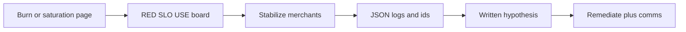

# L-13.6 — Incident response and RCA

**Module:** 13 — Production Engineering and Observability  
**Duration:** 30 minutes  
**Case study:** BayPay Financial Services (fictional)

---

## Why this matters

When `POST /api/v1/payments` misses P99 or throughput falls, Harbor Bike Co does not want a lecture on Micrometer. Avery Chen wants `RECEIVED → … → COMPLETED`. Riley Okonkwo needs a **method**: stabilize merchants, gather evidence, write hypotheses that can be wrong, remediate, then communicate. Priya Nair needs an RCA that quotes **this** timeline, not a lucky title. INCIDENT-1301 is a gated pack you will open after this lesson. It may present a **P99 spike / throughput drop after a metrics change** as a *symptom class*. This lesson does **not** name that pack’s cause. A guess that happens to match a later label does **not** max Diagnostic method.

---

## Learning objectives

- Run the locked loop: **dashboard → logs → deeper evidence**, with hypothesis written *before* the next gate.
- Stabilize first (shed, fail ready, roll back a change, keep the last good revision) without bouncing `dmgr-east`.
- Separate stabilize, remediate, and RCA narrative; quote ids (`correlationId`, `paymentId`) and RED/USE.
- Refuse to diagnose INCIDENT-1301 from this lesson or from the lab title alone.

---

## Concept explanation

**Incident** means the payment-create SLI or the 400 ms P99 is in danger *now*, or a burn/saturation page fired (L-13.4). **RCA** is the write-up after you have evidence. Mixing them produces fan-fiction.

**Order of operations** (same habit as Modules 8 and 12):

1. **Orient.** Time started (Pacific), URI, SLO impact, who is paged (Riley app, Priya SRE).
2. **Stabilize.** Stop the bleeding for Avery Chen: previous ECS revision / Terraform tag (L-12.6), fail readiness so the ALB stops sending new creates to a sick task, disable a bad canary, rate-limit a non-golden path if the pack says you may. **Do not** bounce `dmgr-east`, recycle `PaymentCluster`, or restart Postgres because a graph is red.
3. **Evidence.** BUILD-1300 rows: RED rate, server errors, P99; USE heap, CPU, Hikari `jdbc/baypay`, servlet threads; scrape health. Then JSON logs: `correlationId`, `paymentId` (example `c1300a11-0000-4000-8000-111111111300`), `outcome`. Then traces if `traceparent` exists. Then change list: what Jordan Voss merged, what image tag, whether a **metrics or dashboard change** landed.
4. **Hypothesis.** One sentence that could be *falsified* by the next gate. Not a root-cause brand name.
5. **Remediate.** The durable fix after stabilize. May be a revert, a config revert, a flag, a follow-up PR. Still a new commit on `main` — no force-push (L-12.1).
6. **Comms.** What merchants see, what is still unknown, next update time. Never PAN. Never `BAYPAY_DB_PASSWORD`.

**Symptom class vs cause.** “P99 spike” is a class. “Throughput drop” is a class. “After a metrics change” is a **timeline clue**, not a verdict. Many changes can sit on that timeline: a scrape storm, a bad alert loop, an unrelated release that happened to include a meter, a dependency stall that coincided with a dashboard PR. INCIDENT-1301 will reveal *its* gates. Quote those. Do not import Module 8 leak or Module 12 rollback RCAs.

**Worksheet fields** you must fill before you claim done:

| Field | Pass looks like |
|---|---|
| Hypothesis | Testable; not a one-word slogan |
| Evidence | Panel, log line, or revision — with time |
| Next investigation | The next gate, not “look around” |
| Stabilize | What you did for merchants *now* |
| Remediate | Durable change, or “still stabilizing” |
| Comms | Audience + unknown + next update |

**Who is not the fixer.** Morgan Hale’s cell is the leftover estate. Sam Okada helps if scrape or platform is in the evidence. Do not page the WAS rotation for a Boot Fargate symptom unless evidence says the cell is on the path.

**RCA quality.** A good RCA lists contributing factors, detection gap, and a change to burn rules or review — not a villain. “Human error” is not an RCA. “We missed 99.9% for 12 minutes; budget impact ~N minutes” is the SLO sentence.

---

## Visual explanation



Alt text: A burn or saturation page opens the RED and USE board; on-call stabilizes merchants first, then uses logs and a written hypothesis before remediating and communicating.

---

## Architecture

Priya owns the bridge clock and the SLO numbers. Riley owns the app evidence and the first stabilize. Jordan owns the change window and the rollback PR. Sam owns scrape/platform if signal health is the story. The teaching region remains `us-west-2` when AWS is named. Health contracts stay `/actuator/health/liveness` and `/actuator/health/readiness` on `8080`.

Do not dual-home the incident on `Pay2` and Fargate “to be safe.” Pick the estate the evidence names.

Student packs are **gated**. You do not download a 2 GB heap dump. You do not get instructor narrative until the worksheet is complete. Paper method is the grade.

---

## Production example

10:11 Pacific. Fast-burn page. RED: rate on `POST /api/v1/payments` down, P99 above 400 ms. USE: not yet read. Riley writes: “Hypothesis 1: saturated servlet threads or Hikari pending on the new revision.” He checks row 3, quotes busy/max and pending, and asks Jordan whether `3.8.2` or a metrics-only change shipped at 10:05. He does **not** announce a cause on the merchant Slack.

Stabilize: ECS circuit breaker already flipped, or Riley pins the prior task definition / prior tag `3.8.1`. Terraform `image_tag` still pointing forward is a **second** defect if left (L-12.6). Comms: “Creates degraded 10:11–10:18; rollback in progress; next update 10:25; no PAN in the channel.”

A bad afternoon: someone “fixes” the graph by bouncing `dmgr-east`. The Boot canary is unchanged. Avery Chen is still slow. That action is a finding in the RCA, not heroism.

If the title of INCIDENT-1301 suggests throughput and P99, write the **symptoms** on the worksheet and wait for gates. Do not complete the pack from this paragraph.

---

## Code/configuration example

Incident ticket and comms skeleton — not an answer key:

```yaml
# teaching incident record (fill from evidence, not from a guess)
incident:
  id: INCIDENT-1301
  uri: POST /api/v1/payments
  slo: "99.9% monthly; P99 < 400ms"
  started_pt: "2026-09-03T10:11:00-07:00"
  symptom_class:
    - "P99 spike"
    - "throughput drop"
    - "timeline mentions a metrics change — clue, not cause"
  evidence:
    red: ""
    use: ""
    log_ids:
      correlationId: ""
      paymentId: "c1300a11-0000-4000-8000-111111111300"
    change_window: ""
  hypothesis_1: ""
  stabilize: ""
  remediate: ""
  comms_next_update: ""
```

```text
# Merchant / bridge comms (no PAN, no passwords)
Impact: POST /api/v1/payments degraded (P99 / throughput).
SLO: 99.9% budget impact being calculated.
Stabilize: last good revision / readiness — not dmgr-east.
Unknown: cause. Next evidence: board row 3 and one correlationId.
Next update: 15 minutes.
```

Do not paste instructor narrative into `hypothesis_1`. Do not invent a live Grafana URL as proof.

---

## Trade-offs

| Choice | Gain | Cost |
|---|---|---|
| Stabilize before RCA | Merchants first | You may hide a transient |
| RCA before stabilize | Intellectual comfort | Avery waits |
| Rollback first | Fast restore | Loses a dirty crime scene — snapshot first when you can |
| Keep the bad revision “to debug” | More evidence | Budget burns |
| One commander | Clear comms | Bottleneck |
| Open bridge, no owner | Noise | Duplicate restarts |

---

## Failure modes

- Declaring INCIDENT-1301’s cause from the lesson or the title.
- Bouncing `dmgr-east` or the database because P99 is high.
- Skipping USE because RED already “looks like latency.”
- Force-pushing `main` to hide the bad commit.
- Putting PAN or account secrets in the incident channel.
- Copying a Module 8 or Module 12 RCA into this pack.

---

## Security/reliability implications

Incident channels are **retention-worthy**. Treat them like logs: no PAN, no secrets, no full account numbers. Avery’s customer id may be used in *internal* notes when the pack requires it; it is not a metric label and not a tweet.

Reliability: a rollback that is not followed by a Terraform/git revert will **re-break** on the next apply. Communication must say whether desired state still points at the bad revision.

Do not ND-in-Docker a “debug cell” during the page.

---

## Interview perspective

**Engineer.** I open the RED/USE board, quote a `correlationId`, stabilize with rollback or readiness, and write a falsifiable hypothesis.

**Senior.** I will not bounce `dmgr-east` for a Boot page. I treat “metrics change on the timeline” as a clue. I fill all six worksheet fields.

**Staff.** I score Diagnostic method on evidence order, not on a lucky word. I keep 99.9% impact in the comms.

**Principal.** I fund blameless RCA that changes review or burn rules. I forbid title-driven RCAs and cell bounces as culture.

---

## Key takeaways

- Dashboard → logs → deeper evidence. Hypothesis before the next gate.
- Stabilize merchants first. No `dmgr-east` bounce. No ND-in-Docker.
- Symptom class ≠ cause. P99 / throughput / “after a metrics change” is not an RCA.
- Quote *this* pack. Do not import other modules’ answers.
- A lucky label does not max Diagnostic method.

---

## Knowledge check

1. List the six worksheet fields you must complete before you open instructor materials.
2. RED shows a P99 spike and a throughput drop after a metrics change. What is that fact, and what is it not?
3. Why is bouncing `dmgr-east` the wrong stabilize for a `payment-service` Fargate page?

<details>
<summary>Spoiler — answers</summary>

1. Hypothesis, evidence, next investigation, stabilize, remediate, comms.
2. It is a **symptom class** and a timeline clue. It is not a root cause and not permission to skip gates.
3. The leftover WAS cell is a different estate. It does not restore ECS tasks, scrape, or Avery’s create path on port `8080`.

</details>

---

## Related lab

[INCIDENT-1301](../../../../labs/INCIDENT-1301/README.md) — Throughput collapse and P99 latency spike. After this lesson. Time-box 45–75 minutes. Student guide shows **symptoms only**. Work the gates. Do not pre-load a cause from this lesson.

---

## Related PAKS

Optional: `docs/27-production-failures/overview.md` (evidence order, stabilize vs remediate). The worksheet loop stands alone without a PAKS login.
