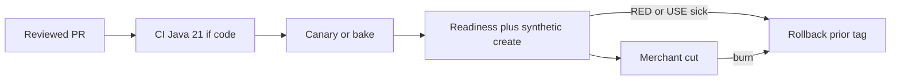

# L-13.7 — Change management

**Module:** 13 — Production Engineering and Observability  
**Duration:** 30 minutes  
**Case study:** BayPay Financial Services (fictional)

---

## Why this matters

Most BayPay pages begin as a **change**: Jordan Voss’s image tag, Priya Nair’s alert YAML, Sam Okada’s scrape config, a Hikari `maximum-pool-size` tweak that looked like capacity (L-13.5). If that change skips review, canary, and a named rollback, Riley Okonkwo inherits an un-auditable hole in the 99.9% budget. Change management is not a weekly CAB theater that rubber-stamps `dmgr-east`. It is the **right-hand side** of Module 12’s pipeline plus this module’s SLO: propose, review, bake, validate health, cut, or revert. A metrics-only PR is still a production change.

---

## Learning objectives

- Name the teaching change types: application revision, observability config, pool/JVM flags, pipeline/Terraform.
- Gate each type with review, canary or bake, RED/USE validate, and a written rollback.
- Use freeze when the error budget is gone, without blocking stabilize.
- Refuse force-push, ND-in-Docker, and `dmgr-east` bounce as change or rollback tools.

---

## Concept explanation

**A change** is anything that can move the payment-create SLI, the 400 ms P99, or your ability to *see* them. Teaching inventory:

| Type | Examples | Rollback |
|---|---|---|
| Application | `baypay/payment-service:3.8.2` on ECS | Prior immutable tag + Terraform revert |
| Observability | Alert YAML, dashboard JSON, scrape interval, new meters | Prior git SHA of the JSON/rules |
| Capacity flags | Hikari `jdbc/baypay`, Tomcat max, `-Xmx` | Prior values; never “set Xmx = task memory” as the fix |
| Platform | Task CPU/memory, ALB, Secrets Manager *reference* | Prior Terraform revision |

**Standard path** (weekday, budget remaining):

1. Short-lived PR into protected `main` (L-12.1). Conventional review names **SLO risk**, **rollback**, **secrets**, **label cardinality literacy** (coarse `uri` / `method` / `outcome` only).
2. CI `./mvnw test` on Java 21 if application code moved.
3. Canary or tiny bake: one extra task / one revision slice in `us-west-2`. Watch BUILD-1300 RED and USE for a written bake time (teaching: 15–30 minutes, not “looks fine”).
4. **Validate** `/actuator/health/readiness` and a synthetic idempotent create on a **non-prod** or canary listener (L-12.6).
5. Cut. Watch burn. If P99 or throughput degrades, **roll back** — symptom class, not an RCA.
6. Record the change on the dashboard annotation: SHA, tag, window.

**Freeze.** When the ~43-minute budget is exhausted (or Priya calls a freeze after a serious burn), **feature** changes wait. **Stabilize** changes (rollback, fail ready, restore scrape) still ship — as reviewed emergency PRs, not force-push. A freeze is not a punishment; it is how you stop digging.

**Emergency path.** Bridge, one approver who is not the author (Priya or Sam), still a PR, still no secrets in git. Afterward: blameless note in PF-ops.md — what bypassed bake and how you will avoid it.

**CAB-lite.** BayPay teaching does not require a two-hour change-advisory board. It requires a **ticket or PR description** with: purpose, SLO impact, bake plan, rollback, communicator. Morgan Hale’s leftover cell changes (if any VM still exists) use Ansible from git (L-12.5), not an SSH “quick xml.” They still do not justify ND-in-Docker.

**Metrics changes are changes.** A new dashboard, a new alert, or a new meter can move CPU, allocation, or scrape cost, and can hide or flood the pager. Treat them with the same rollback sentence as an image tag. INCIDENT-1301 may *mention* a metrics change on a timeline. That is a **symptom-class clue** for the lab, not a verdict you write here.

**What change management is not.** It is not a freeze so long that nobody ships. It is not approving your own Terraform at 17:50. It is not bouncing the cell “because change failed.”

---

## Visual explanation



Alt text: A reviewed pull request goes through CI when code moved, then canary bake, readiness and synthetic create validation, then merchant cut; any sick RED or USE signal rolls back to the prior tag.

---

## Architecture

Jordan owns the release calendar and the annotation. Priya owns freeze / unfreeze against the 99.9% budget. Sam owns platform PRs and forbids Secrets Manager values in the change ticket. Riley can **veto a cut** from the board without owning the git remote.

Desired state remains git + Terraform for ECS. Ansible remains leftover Liberty only. Health remains on port `8080`. Do not introduce a second region as a “safer change” in this module.

If bake shows scrape **ticket**-class failures only, fix scrape before you declare the app bad — but do not ignore a dark SLI.

---

## Production example

Jordan’s PR `#902`: image `3.8.2`, review notes rollback `3.8.1`, cost note N/A (image only), SLO risk “P99 on authorize path.” Canary task in `us-west-2` for 20 minutes. RED rate matches, P99 190 ms, Hikari pending 0. Cut. Annotation on the paper dashboard.

PR `#903`: dashboard JSON only. No `./mvnw test`. Still reviewed. Bake = import-on-paper + confirm panel queries still use `uri="/api/v1/payments"` and SLO **99.9%**. Rollback = revert the JSON commit.

A Friday 17:55 “hotfix” that force-pushes `main` and skips bake is two process defects even if the JAR is right. If someone then bounces `dmgr-east` “for luck,” that is a third.

Budget already gone from Tuesday’s incident: Priya freezes `#904` (new merchant field). She **allows** `#905` that reverts Tuesday’s tag. Riley’s stabilize is not the freeze.

---

## Code/configuration example

Change ticket and canary checklist — no live passwords:

```yaml
# teaching change record
change:
  id: CHG-13-0902
  owner: jordan.voss
  type: application  # application | observability | capacity | platform
  purpose: "payment-service 3.8.2"
  image: "baypay/payment-service:3.8.2"
  rollback_image: "baypay/payment-service:3.8.1"
  region: us-west-2
  slo: "99.9% / P99 < 400ms — do not retarget 99.99%"
  bake_minutes: 20
  validate:
    - "/actuator/health/readiness on 8080"
    - "synthetic POST /api/v1/payments with Idempotency-Key (non-prod)"
    - "RED rate, 5xx, P99; USE Hikari jdbc/baypay and threads"
  freeze_exception: false
  secrets_in_git: false
```

```text
# Conventional review add-on for Module 13
- [ ] Rollback named (prior tag / prior JSON SHA)
- [ ] Bake time written
- [ ] Dashboard SLO still 99.9% / 400ms
- [ ] Meter labels still coarse (uri, method, outcome, status)
- [ ] -Xmx not equal to task memory
- [ ] Not ND-in-Docker; not dmgr-east bounce
```

Emergency: same YAML with `freeze_exception: true` and a second name in `approver`. Still no `git push --force origin main`.

---

## Trade-offs

| Choice | Gain | Cost |
|---|---|---|
| Bake 20–30 min | Catches obvious P99 | Slower than YOLO |
| Bake 0 | Fast | Buys the incident |
| Full CAB weekly | Familiar to some banks | Theater; stale approvals |
| CAB-lite on the PR | Audit + speed | Needs review quality |
| Freeze at 0 budget | Protects merchants | Feature lag |
| Freeze including rollback | “Consistency” | Extends the outage |

---

## Failure modes

- Shipping a metrics or alert change with no rollback sentence.
- Canary that nobody watches, then a full cut.
- Force-push to “undo” a bad change.
- Setting `-Xmx` to the task size as an emergency capacity change.
- Rolling back Boot by bouncing `dmgr-east`.
- Unfreezing because a stakeholder is loud, while burn is still 10×.

---

## Security/reliability implications

Who may approve a change may spend merchant money and error budget. Dual control on production `main` is the same idea as L-10.4 apply rights.

A change ticket that pastes `BAYPAY_DB_PASSWORD` or a card number is a **security incident**. Describe the secret *reference*, not the value.

Reliability: desired state in git must match the revision you kept. Rollback in ECS only is incomplete (L-12.6).

---

## Interview perspective

**Engineer.** I open a PR with rollback, bake, and validate steps. I do not force-push `main`. I do not bounce `dmgr-east`.

**Senior.** Observability JSON is a production change. I watch RED/USE during bake. I freeze features when the 99.9% budget is gone.

**Staff.** I measure failed changes and time-to-rollback. I will not accept CAB theater or ND-in-Docker as modernization.

**Principal.** Change management is how we spend error budget on purpose. I fund reviewed, reversible cuts and I forbid silent SLO upgrades to 99.99%.

---

## Key takeaways

- If it can move the SLI, the P99, or the pager, it is a change — including dashboards.
- Review → bake → validate → cut or rollback. Health before merchants.
- Freeze features when budget is gone; never freeze rollback.
- No force-push, no ND-in-Docker, no `dmgr-east` bounce, no `-Xmx` equal to task memory.
- A metrics change on a timeline is a clue, not an RCA.

---

## Knowledge check

1. Name four teaching change types and one rollback for an image tag.
2. The monthly error budget is exhausted. Which change still ships, and which waits?
3. Why must a paper Grafana JSON PR still have a bake and a rollback?

<details>
<summary>Spoiler — answers</summary>

1. Application, observability, capacity flags, platform. Rollback: prior immutable tag (e.g. `3.8.1`) plus Terraform/git revert.
2. Stabilize / rollback still ships (reviewed emergency). Feature work waits on the freeze.
3. Bad queries or a silent 99.99% threshold can hide burn or page wrongly; revert the JSON SHA if the board lies.

</details>

---

## Related lab

[INCIDENT-1301](../../../../labs/INCIDENT-1301/README.md) — after L-13.6. Use this lesson’s change record when the pack asks what shipped. Do not invent a cause from “a change occurred.” Complete [BUILD-1300](../../../../labs/BUILD-1300/README.md) if the dashboard notes are still open, then export [PF-ops.md](../../../../student/worksheets/PF-ops.md).

---

## Related PAKS

Optional: `docs/19-observability/overview.md` and `docs/27-production-failures/overview.md`. CAB-lite plus SLO freeze stands alone without a PAKS login.
