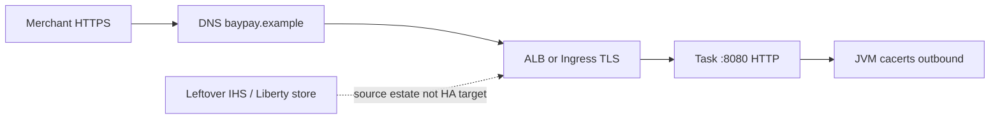

# L-14.1 — TLS and PKI

**Module:** 14 — Security, High Availability and Disaster Recovery  
**Duration:** 30 minutes  
**Diagram:** AEJE-D-063  
**Case study:** BayPay Financial Services (fictional)

---

## Why this matters

Harbor Bike Co never opens a TCP socket to a Fargate ENI. Merchants call **`https://payments.apps.baypay.example`**. If the leaf they receive is expired, names the wrong host, or is untrusted, Avery Chen’s `POST /api/v1/payments` never reaches `RECEIVED`. Riley Okonkwo can still curl `http://127.0.0.1:8080/actuator/health/readiness` from a jump box and see 200. That split — **merchants fail TLS while tasks stay healthy** — is a symptom *class*, not an RCA. Module 10’s INC-K8S-1005 was a **cluster Secret** hostname/expiry problem on `payment-tls`. This lesson is the **edge** plane: public CA or ACM in `us-west-2`, DNS in hosted zone `baypay.example`, JVM plus leftover Liberty / IHS trust stores. Diagram AEJE-D-063.

---

## Learning objectives

- Name the BayPay edge hostname, where TLS terminates, and why `:8080` on the task is not the merchant handshake.
- State the teaching leaf lifetime (90 days) and the expiry contract: **≤30 days is a ticket**, **≤7 days is a page**.
- Distinguish cluster-Secret TLS (INC-K8S-1005 class) from edge TLS / ACM / DNS literacy.
- Treat “merchants fail TLS, tasks healthy” as a class to investigate — not a finished INCIDENT-1402 answer.

---

## Concept explanation

**PKI** is a chain: a **leaf** for `payments.apps.baypay.example`, one or more **intermediates**, and a **root** the merchant already trusts. The merchant verifies name, time, and chain. BayPay’s teaching issuer story is a public CA or **ACM in `us-west-2`**. Students **describe** that path. Nobody applies ACM, a hosted zone, or a live certificate in this module.

**Where TLS lives.** The task listens on **`8080` HTTP**. TLS terminates at the load balancer (or Ingress / Route) unless a later sentence says mTLS. A jump-box GET to the task can succeed while the public name fails. Quote [TRUST.md](../../../../datasets/baypay-security/TRUST.md). Do not invent a second public DNS zone.

**Validation literacy (issuance, not an RCA).** A public CA will not mint a leaf until BayPay proves it controls the name. ACM’s teaching story is **DNS validation**: a CNAME in Route 53 hosted zone **`baypay.example`**. That is how issuance is *supposed* to work. You will operate expiry alerts and you will know that validation is part of the edge object, not a cluster Secret. This lesson does **not** close INCIDENT-1402.

**Lifetime and alerts.** Teaching leaf lifetime is **90 days** unless a lab’s evidence says otherwise. Priya Nair’s contract:

| Window | Action |
|---|---|
| Expiry **≤ 30 days** | Ticket — Jordan or Sam renew / replace before the weekend |
| Expiry **≤ 7 days** | **Page** — treat as an impending merchant outage |

Do not wait for browsers to reject the leaf. Do not page only when Riley sees 5xx on `:8080`.

**Two trust stores.** Merchants use the public chain. The JVM uses the default `cacerts` for outbound TLS (database, processors). Leftover Liberty / IHS plugin stores are a **second object**. A cell that still has `PaymentCluster` may present a different leaf than the ALB. Traditional WAS is the **source estate**. Do not “fix TLS” by copying a plugin keystore onto Fargate.

**INC-K8S-1005 vs this module.** Module 10: Secret `payment-tls` in `baypay-prod` — CN/SAN and expiry *inside the cluster*. Module 14: edge hostname, ACM-or-public-CA, DNS in `baypay.example`. Same *word* (certificate). Different plane. Write the plane on the ticket.

---

## Visual explanation



Alt text: AEJE-D-063. Merchants resolve payments.apps.baypay.example and complete TLS at the ALB or Ingress; the task speaks HTTP on 8080; the JVM trust store is for outbound TLS; leftover Liberty or IHS plugin stores are a second object, not the Fargate HA design.

---

## Architecture

Sam Okada’s AWS teaching path: ACM (paper) in **`us-west-2`** attaches to the ALB listener 443 for `payments.apps.baypay.example`. The student ALB example name `pay-alb-student.baypay.example` is the lab stand-in; production talk uses the payments hostname. Target group health is still `/actuator/health/readiness` on **`8080`** (L-11.4). Health 200 is not a handshake.

On Kubernetes / OpenShift (still valid homes), Ingress or Route `payment-route` presents Secret `payment-tls`. That is Module 10’s object. Do not treat a healthy Pod as proof the Route leaf is valid.

Stabilization when merchants fail TLS: keep tasks up if they are Ready; do not bounce `dmgr-east`; do not recycle `PaymentCluster`. Remediation is on the **edge** object and its DNS/CA path — after evidence, in the lab, not as a lecture RCA here.

---

## Production example

Friday 16:40 Pacific. Harbor Bike Co reports “your site’s certificate is not trusted” for Avery Chen id `11111111-1111-1111-1111-111111111111`. Priya’s ALB target group is healthy. Riley’s jump box: `curl -sS http://10.0.12.40:8080/actuator/health/liveness` returns 200. Payment id `c1402b22-0000-4000-8000-111111111402` never appears because the POST never entered the JVM.

Riley writes the class: **edge TLS / ACM / DNS**, not “Hikari” and not “INC-K8S-1005 again.” Next evidence is the leaf presented on 443 (name, `notAfter`, chain) and whether expiry alerts fired. A ≤30-day ticket that nobody owned is an operations finding even when the leaf is still valid. A ≤7-day page that never fired is a monitoring finding. Neither sentence is INCIDENT-1402’s closed cause.

Morgan Hale offers the cell’s IHS cert “which always worked.” That is the source estate. It is not the ALB listener.

---

## Code/configuration example

Illustrative — not a lab answer, not a live ACM apply, not a production private key:

```hcl
# Paper only. Do not apply ACM or Route 53 in this module.
# Teaching hostname: payments.apps.baypay.example
# Issuer story: ACM in us-west-2; DNS validation in zone baypay.example

variable "payments_hostname" {
  type    = string
  default = "payments.apps.baypay.example"
}
```

```bash
# Merchant-plane check (you need the public name, not :8080)
openssl s_client -connect payments.apps.baypay.example:443 \
  -servername payments.apps.baypay.example </dev/null 2>/dev/null \
  | openssl x509 -noout -subject -dates -ext subjectAltName

# Task-plane check — can succeed while merchants fail TLS
curl -sS -o /dev/null -w "%{http_code}\n" \
  http://127.0.0.1:8080/actuator/health/readiness
```

```java
// Outbound TLS uses the JVM trust store — not the ALB leaf.
// Do not load a leftover IHS plugin keystore into the Fargate task.
SSLContext defaultContext = SSLContext.getDefault();
```

Write three sentences: hostname, where TLS terminates, what you will page on at ≤7 days. Do not promote that to “the Module 14 certificate RCA.”

---

## Trade-offs

| Choice | Gain | Cost |
|---|---|---|
| TLS at ALB / Ingress | Tasks stay HTTP `:8080`; simple JVM | Edge is a single trust object |
| mTLS to the task | Stronger east-west | Certs on every task; not the default |
| 90-day leaves | Limits stolen-leaf window | Renewal must be boring |
| ACM (paper) | AWS-native attach to ALB | DNS validation is an extra object |
| Leftover IHS store | Familiar to WAS shops | Second leaf; not the HA target |

---

## Failure modes

- Declaring “app is up” because `:8080` liveness is 200 while merchants fail the handshake.
- Treating INC-K8S-1005 muscle memory as the edge diagnosis.
- No ticket at ≤30 days and no page at ≤7 days — expiry is a surprise.
- Copying a Liberty plugin keystore into the Fargate image “so TLS matches the cell.”
- Applying ACM or a hosted zone in a 90-minute lab.
- Bouncing `dmgr-east` because a browser showed a padlock warning.

---

## Security/reliability implications

The leaf private key is impersonation of `payments.apps.baypay.example`. It does not belong in git, in Slack, or in a ConfigMap. Anyone who can replace the ALB certificate can intercept Avery Chen’s POST. Reliability: expiry is a **scheduled** failure if alerts are absent. Communication must cite **hostname**, **`notAfter`**, and **which plane** (edge vs cluster Secret vs leftover IHS). Do not tell merchants “we restarted the tasks.”

---

## Interview perspective

**Engineer.** Merchants use `https://payments.apps.baypay.example`. The task is HTTP `:8080`. I page if the leaf is within 7 days of expiry. I never put a private key in git.

**Senior.** I split cluster-Secret TLS from edge ACM/DNS. Healthy targets are not a handshake. I ticket at 30 days and I will not apply ACM in a student lab.

**Staff.** AEJE-D-063 is the trust boundary. I score on-call on plane + evidence, not on the word “certificate.” I will not max a diagnostic score on the incident title.

**Principal.** Edge PKI is an availability dependency. I fund 90-day leaves and expiry pages. I will not accept `PaymentCluster` or ND-in-Docker as the TLS or HA design.

---

## Key takeaways

- Public name is `payments.apps.baypay.example`. TLS terminates at the edge; tasks stay `:8080` unless a lesson says mTLS.
- Leaf lifetime 90 days. **≤30 days ticket. ≤7 days page.**
- INC-K8S-1005 was cluster Secret CN/expiry. This module is edge TLS / ACM / DNS.
- “Merchants fail TLS, tasks healthy” is a symptom class, not an RCA.
- Leftover IHS / Liberty stores are a second object. Paper only — no ACM apply.

---

## Knowledge check

1. Avery’s browser rejects TLS. Riley’s jump-box curl to the task on `:8080` is 200. Which plane do you write first, and which Module 10 incident do you *not* treat as the same object?
2. What are the two expiry thresholds in TRUST.md, and which one pages?
3. Where does teaching TLS terminate for `payments.apps.baypay.example` on the ECS path, and what must you not apply in a 90-minute lab?

<details>
<summary>Spoiler — answers</summary>

1. Edge TLS / ACM / DNS first. Do not treat it as INC-K8S-1005’s cluster Secret `payment-tls` without evidence that you are still on that plane.
2. ≤30 days is a ticket; ≤7 days is a page.
3. At the ALB (or Ingress) in `us-west-2`, not on the task port. Do not apply ACM, Route 53, or a live certificate.

</details>

---

## Related lab

[INCIDENT-1402](../../../../labs/INCIDENT-1402/README.md) — Certificate expiration. Student guide shows **symptoms only**. Use this lesson’s hostname, 90-day leaf, expiry thresholds, and plane split. Work the gates. Do not open `solutions/INCIDENT-1402/` until the worksheet has hypothesis, evidence, next investigation, stabilize, remediate, and comms. This lesson does **not** name that pack’s cause.

---

## Related PAKS

Optional: `docs/20-security/overview.md` (trust boundaries). Edge TLS literacy stands alone without a PAKS login.
