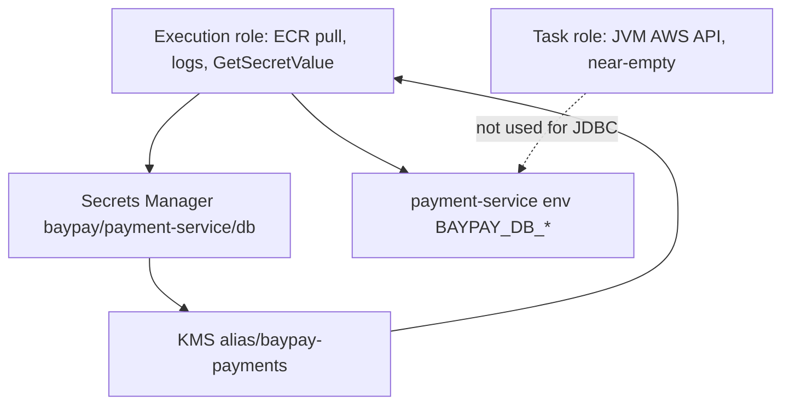

# L-14.2 — IAM and secrets

**Module:** 14 — Security, High Availability and Disaster Recovery  
**Duration:** 30 minutes  
**Case study:** BayPay Financial Services (fictional)

---

## Why this matters

Avery Chen’s authorize path reads `BAYPAY_DB_URL`, `BAYPAY_DB_USER`, and `BAYPAY_DB_PASSWORD`. Those values are **not** in `application-prod.yml` in git, not in the ECR layer, and not in a Slack paste from Riley Okonkwo. On the AWS teaching path they live in Secrets Manager in `us-west-2`, encrypted under [TRUST.md](../../../../datasets/baypay-security/TRUST.md)’s KMS story. Two IAM identities sit on the ECS task definition: the **execution role** (agent) and the **task role** (JVM). If they are the same role, or if Jordan Voss attaches `AdministratorAccess` “so the lab works,” the blast radius is the account. This lesson is least privilege and secret *injection*. L-11.5 introduced the split; here it is a **security control**, not only a platform habit.

---

## Learning objectives

- Separate the ECS **task role** from the **execution role** and name what each may do for `payment-service`.
- Inject `BAYPAY_DB_*` from Secrets Manager (or K8s Secret / leftover Liberty `server.env`) — never from git or task-def JSON literals.
- Refuse `AdministratorAccess`, long-lived access keys in the container, and `changeme` as a production password.
- Scope SECURITY-1404 to payments, refunds, `Idempotency-Key`, frozen account `…222`, IAM/secrets, and edge TLS — not a live PCI ROC.

---

## Concept explanation

**Execution role.** The ECS agent assumes this role **before** the JVM exists. Teaching needs:

- Pull `baypay/payment-service:<tag>` from ECR in `us-west-2`
- Write logs to the task log group
- `secretsmanager:GetSecretValue` on the BayPay DB secret **if** `valueFrom` injection is used
- `kms:Decrypt` on `alias/baypay-payments` when that key encrypts the secret

It does **not** need `iam:*`, `s3:*`, or `AdministratorAccess`.

**Task role.** The **container** assumes this role via the default credential chain. Teaching `payment-service` talks JDBC, so the task role may be **empty or near-empty**. Do not copy the execution role onto the task role. If a later receipt upload needs S3, add `s3:PutObject` on **one** prefix — not `s3:*`.

**Why the split is a security finding.** A stolen JVM (SSRF, vulnerable dependency, compromised image) inherits the **task** role only. If that role can `GetSecretValue` on every secret in the account, or `kms:Decrypt` on every key, Avery’s ledger password is already gone. The execution role is not in the application process. Keep it that way.

**Secret stores (same names, different homes).**

| Home | Object | Keys |
|---|---|---|
| ECS / AWS | Secrets Manager `baypay/payment-service/db` | `BAYPAY_DB_URL`, `BAYPAY_DB_USER`, `BAYPAY_DB_PASSWORD` |
| Kubernetes / OpenShift | Secret `baypay-db` in `baypay-prod` | same env names |
| Leftover Liberty | `server.env` on the VM — **source estate** | same names; not the HA target |

Do not invent `BAYPAY_DB_PASS`. Do not commit `.tfvars` passwords. Do not put the password in Ansible extra-vars in git (L-12.5).

**No `AdministratorAccess`.** Not on Sam’s laptop role for a student demo, not on the task, not on CI. A break-glass role with logging and time bound is an incident control, not a task-definition default.

**No long-lived keys in the task.** No `AWS_ACCESS_KEY_ID` in the container environment. Roles are enough.

**Threat-model scope (SECURITY-1404).** In: `POST/GET /api/v1/payments`, `POST/GET /api/v1/refunds`, `Idempotency-Key`, frozen account `22222222-2222-2222-2222-222222222222`, IAM/secrets, edge TLS, the modular monolith boundary. Out: real card-network certification, a real employer’s PCI ROC, attacking a live account.

---

## Visual explanation



Alt text: The ECS execution role fetches the database secret and decrypts it with alias/baypay-payments; payment-service receives BAYPAY_DB_* at start; the task role is the JVM identity and stays near-empty for JDBC-only work.

---

## Architecture

Sam’s production shape: task definition **references** the secret ARN. The password string never appears in the JSON that sits in git. KMS alias **`alias/baypay-payments`** is the teaching CMK name (L-14.3). CI (Jordan) publishes images; it does not need `AdministratorAccess` to do that.

Riley’s on-call clone is read-mostly on AWS. Emergency secret rotation is still a change: new secret version, new task revision or Secret roll, old password revoked. Do not paste the new password into the incident channel.

Leftover `server.env` on a Liberty VM is in-scope as **debt**. It is not a reason to recreate `PaymentCluster`. Rotate and decommission (Module 6). Do not fail the IAM design by pointing HA at ND-in-Docker.

EKS / OpenShift remain valid homes: IRSA or a ServiceAccount bound to a Role that cannot `get` every Secret (L-10.4). The JVM still should not need to read `baypay-db`; the platform injects env.

---

## Production example

Jordan’s PR `#902` adds an S3 receipt prefix. The first draft attaches the managed policy `AdministratorAccess` to the **task** role “because the SDK sample used it.” Sam’s review fails the PR: teaching `payment-service` does not need the account. The follow-up grants `s3:PutObject` on `arn:aws:s3:::baypay-receipts-uw2/payments/*` and nothing else. Execution role is unchanged.

A different afternoon: an intern commits `BAYPAY_DB_PASSWORD` in `task-definition.json` with a placeholder they used on a laptop. That is two defects — secret in git, and a password that is not a production secret. Rotate the real store if anything real was ever pasted. Revert on `main` (L-12.1). Do not force-push.

Frozen account `…222` is an **application** authorization decision. IAM does not replace it. SECURITY-1404 must keep both planes.

---

## Code/configuration example

Illustrative IAM and injection — paper, no live keys, not a lab dump:

```hcl
# Paper only. Do not apply KMS or widen IAM in a 90-minute lab.
data "aws_iam_policy_document" "payment_task" {
  # JDBC teaching path: no AWS API. Empty statement list is valid.
}

data "aws_iam_policy_document" "payment_execution" {
  statement {
    sid       = "ReadBayPayDbSecret"
    actions   = ["secretsmanager:GetSecretValue"]
    resources = [var.baypay_db_secret_arn]
  }
  statement {
    sid       = "DecryptBayPayPayments"
    actions   = ["kms:Decrypt"]
    resources = [var.kms_baypay_payments_arn]
    condition {
      test     = "StringEquals"
      variable = "kms:ViaService"
      values   = ["secretsmanager.us-west-2.amazonaws.com"]
    }
  }
}
```

```json
{
  "family": "payment-service",
  "taskRoleArn": "arn:aws:iam::111122223333:role/baypay-payment-task",
  "executionRoleArn": "arn:aws:iam::111122223333:role/baypay-payment-exec",
  "containerDefinitions": [{
    "name": "payment-service",
    "secrets": [
      { "name": "BAYPAY_DB_PASSWORD", "valueFrom": "arn:aws:secretsmanager:us-west-2:111122223333:secret:baypay/payment-service/db:BAYPAY_DB_PASSWORD::" }
    ]
  }]
}
```

Account `111122223333` is synthetic. Do not attach `AdministratorAccess`. Do not put a password string next to `"name": "BAYPAY_DB_PASSWORD"`.

---

## Trade-offs

| Choice | Gain | Cost |
|---|---|---|
| Split task vs execution | Stolen JVM ≠ pull/decrypt role | Two roles to review |
| Empty task role | Least privilege for JDBC | Must add statements when AWS APIs appear |
| Secrets Manager injection | Password not in git | Restart to rotate |
| `AdministratorAccess` | Lab “works” | Account-wide blast radius |
| One role for both | Fewer objects | Any RCE is the agent |

---

## Failure modes

- Attaching `AdministratorAccess` to either role so a workshop screenshot looks green.
- Copying the execution role ARN onto `taskRoleArn`.
- Committing `BAYPAY_DB_PASSWORD` or `changeme` in HCL, JSON, or YAML.
- Long-lived access keys in the task environment.
- Letting the task role `GetSecretValue` on `secret:*`.
- Treating leftover `server.env` as the production secret store for Fargate.

---

## Security/reliability implications

Who can assume the execution role can pull the payments image and decrypt `BAYPAY_DB_*`. Who can assume the task role can call whatever AWS APIs you granted — in production, that may include data planes. Rotation without a second version and a roll is an outage. Communication cites **role names**, **secret ARN**, and **what was not in git**. Do not paste secret values into the ticket.

---

## Interview perspective

**Engineer.** Task role ≠ execution role. `BAYPAY_DB_*` comes from Secrets Manager. I do not commit passwords. I do not use `AdministratorAccess`.

**Senior.** I review IAM by resource ARN and condition keys. An empty task role for JDBC is a feature. I reject `changeme` and keys in the container.

**Staff.** I treat role conflation as a security defect, not a shortcut. SECURITY-1404 stays inside payments, refunds, frozen `…222`, and the secret plane.

**Principal.** Least privilege on the task is an availability and fraud control. I will not accept ND-in-Docker or a cell admin ID as the IAM model.

---

## Key takeaways

- **Task role ≠ execution role.** Execution pulls, logs, and may fetch secrets. Task is the JVM — near-empty for JDBC.
- Never `AdministratorAccess`. Never long-lived keys in the container.
- `BAYPAY_DB_*` from a secret store; ARN in git, value not in git.
- KMS alias for those secrets is `alias/baypay-payments` (L-14.3).
- Leftover Liberty `server.env` is debt, not the HA secret plane.

---

## Knowledge check

1. The JVM is compromised. Which role did the attacker inherit, and why must it not be the execution role?
2. Name three places `BAYPAY_DB_PASSWORD` must not appear.
3. Why is `AdministratorAccess` on the task role a SECURITY-1404 finding even if the service “works”?

<details>
<summary>Spoiler — answers</summary>

1. The **task** role. The execution role can pull images and `GetSecretValue` / `kms:Decrypt` for injection — that must not sit in the application process.
2. Git (including task-def JSON and `.tfvars`), image layers, and Slack / ticket bodies. Also not a ConfigMap.
3. It grants account-wide power to any RCE or SSRF. Working authorize is not a privilege proof.

</details>

---

## Related lab

[SECURITY-1404](../../../../labs/SECURITY-1404/README.md) — Threat model BayPay. Use this lesson’s role split and secret names. Continue after L-14.3 (encryption). Do not invent a second KMS alias or attack a live account. This lesson does not complete the threat model for you.

---

## Related PAKS

Optional: `docs/20-security/overview.md` (identity and secret boundaries). The task/execution split stands alone without a PAKS login.
