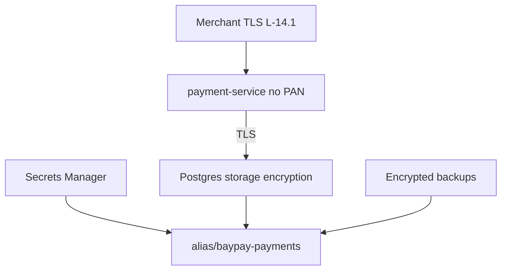

# L-14.3 — Encryption

**Module:** 14 — Security, High Availability and Disaster Recovery  
**Duration:** 30 minutes  
**Case study:** BayPay Financial Services (fictional)

---

## Why this matters

Avery Chen’s authorize row is a ledger intent, not a card-number archive. If Jordan Voss persists PAN in Postgres “for easier retries,” or if Sam Okada leaves backups unencrypted next to a password in git, Harbor Bike Co has a data incident even when `POST /api/v1/payments` returns 201. [TRUST.md](../../../../datasets/baypay-security/TRUST.md) locks the teaching key: **`alias/baypay-payments`**. Payment rows get storage encryption; the app does **not** store PAN; the database link is TLS; secret payloads are KMS-encrypted. This lesson is **what is encrypted, with which key, on which plane**. It is not a live KMS `apply`.

---

## Learning objectives

- Use KMS alias `alias/baypay-payments` as the teaching CMK for secrets, storage, and backups — do not invent a second alias.
- Separate **at rest** (volume / RDS / backup / secret payload) from **in transit** (TLS to merchants and to Postgres).
- State the PAN rule: tokenize or never persist. Idempotency keys and payment ids are not secrets but are **not** metric labels.
- Refuse student apply of KMS keys and refuse `changeme` as a production wrapping password.

---

## Concept explanation

**At rest vs in transit.**

| Data | At rest | In transit |
|---|---|---|
| Payment rows (teaching Postgres) | Storage encryption; app does **not** store PAN | TLS to the database |
| Secrets (`BAYPAY_DB_*`) | KMS-encrypted secret store | TLS to Secrets Manager / API |
| Backups | Encrypted; the key is **not** the app password in git | — |
| Merchant HTTP | — | TLS at the edge (L-14.1) |

**KMS alias.** Teaching name: **`alias/baypay-payments`** in `us-west-2`. Aliases are pointers. The underlying key id rotates; the alias stays in IAM policies and in conversation. Execution role `kms:Decrypt` (L-14.2) is how secret injection works. The same alias may wrap RDS storage encryption **on paper**. Students do **not** create the key, enable Multi-AZ RDS, or apply a replica.

**PAN.** Primary account numbers are out of the database. Tokenize with a vault you do not build in a 30-minute lesson, or never persist. Teaching `payment-service` stores payment ids, amounts, currency, account ids, and outcomes. It does not store raw card numbers or CVV. Frozen account `22222222-2222-2222-2222-222222222222` is an authorization flag, not an encryption topic — but a dump of that table is still PII.

**What is not a secret.** `Idempotency-Key` and `paymentId` (example `c1402b22-0000-4000-8000-111111111402`) are not passwords. They are still **not** Micrometer label keys ([OBSERVABILITY.md](../../../../datasets/baypay-ops/OBSERVABILITY.md)). Encryption does not excuse high-cardinality labels.

**Application-level encryption.** Optional extra wrap of a column is not the default. If you add it, you still need TLS and storage encryption; you now also need key access in the JVM — which widens the **task** role. Prefer platform encryption plus no-PAN.

**Leftover Liberty.** A cell that wrote `password=` into `server.xml` (L-6.4) is the source estate. Encrypting that XML file is not the Fargate design. Do not recreate `PaymentCluster` as an HSM story.

**No live apply.** Do not `aws kms create-key`. Do not enable RDS encryption on a student instance “for realism.” Paper the alias and the IAM condition.

---

## Visual explanation



Alt text: Merchants use edge TLS; payment-service never stores PAN and uses TLS to Postgres; Secrets Manager, storage, and backups are encrypted with KMS alias/baypay-payments.

---

## Architecture

Sam’s paper estate in `us-west-2`: CMK `alias/baypay-payments` encrypts the Secrets Manager payload `baypay/payment-service/db`, the teaching database storage, and backup snapshots. IAM grants `kms:Decrypt` to the **execution** role for secret fetch, and to the RDS/backup service principals for storage — **not** `kms:*` to the task role.

Priya’s DR sketch (L-14.6) must say whether `us-east-1` has a **replica key** or a multi-Region key *on paper*. That is a DR cost and RTO input. It is not a student `apply` in the second region.

Riley’s JVM trusts the database server cert via default `cacerts` or a pinned RDS CA. Do not import a leftover IHS plugin keystore as the Postgres trust material.

SECURITY-1404 in-scope data: payments and refunds bodies, `Idempotency-Key`, account ids including frozen `…222`. Out of scope: forging a real card-network cryptogram.

---

## Production example

A contractor proposes `byte[] pan = row.get("pan")` “only in memory” and a comment that the column is `bytea` encrypted with a password from `application.yml`. Sam rejects the PR: the password would be in git; the column would still be PAN; `alias/baypay-payments` is not a password file. The fix is tokenize-or-never-store, plus storage encryption you do not apply in the lab.

Jordan’s backup job writes `baypay-payments.dump` to an unsigned bucket with no SSE. That is an encryption miss even if the live volume is encrypted. Backups use the same alias story; the dump is not “safe because it is internal.”

Riley sees JDBC URL `jdbc:postgresql://…:5432/baypay?sslmode=disable` on a leftover Liberty host. That is in-transit debt on the source estate. The Fargate teaching URL uses TLS. Do not “fix” it by failing over to `dmgr-east`.

---

## Code/configuration example

Illustrative — paper HCL and Java, no live key material:

```hcl
# Paper only. Do not apply KMS or Multi-AZ RDS.
data "aws_kms_alias" "baypay_payments" {
  name = "alias/baypay-payments"
}

resource "aws_secretsmanager_secret" "baypay_db" {
  name       = "baypay/payment-service/db"
  kms_key_id = data.aws_kms_alias.baypay_payments.target_key_arn
}
```

```java
// Teaching payment row — no PAN field. Tokenize off-box or do not persist.
public record PaymentRecord(
    UUID paymentId,
    UUID accountId,
    long amountCents,
    String currency,
    String outcome
) {
    public static PaymentRecord fromAuthorize(UUID paymentId, UUID accountId, long amountCents) {
        return new PaymentRecord(paymentId, accountId, amountCents, "USD", "AUTHORIZED");
    }
}
```

```properties
# JDBC in transit — teaching shape, not a live password
spring.datasource.url=jdbc:postgresql://baypay-pg.cluster-internal:5432/baypay?sslmode=require
```

Do not put `BAYPAY_DB_PASSWORD` in that properties file in git. Do not use `changeme` as the wrapping passphrase for a column.

---

## Trade-offs

| Choice | Gain | Cost |
|---|---|---|
| Storage encryption + no PAN | Meets the teaching bar | Does not hide payment ids from a DBA |
| App-level column crypto | Extra wrap | Task role needs keys; recovery harder |
| One alias `alias/baypay-payments` | One conversation | Blast radius if IAM is sloppy |
| Per-environment keys | Isolation | More grants; still paper here |
| `sslmode=disable` | “Works on leftover VM” | Disk-equivalent on the wire |

---

## Failure modes

- Persisting PAN or CVV in Postgres, logs, or metrics.
- Using the app password as the backup encryption key in git.
- Inventing `alias/baypay-prod-2` instead of the locked alias.
- Applying a KMS key or Multi-AZ RDS in a 90-minute lab.
- Disabling TLS to the database because the leftover cell did.
- Putting `paymentId` on a Micrometer label and calling it “encrypted enough.”

---

## Security/reliability implications

A CMK delete or a missing grant is an **availability** incident: tasks cannot fetch secrets; restores cannot decrypt. Key policy is on the 99.99% diagram (L-14.5) as the identity/TLS/data-store cluster. Communication cites **alias**, **what is not stored**, and **sslmode**. Do not ship a backup to `us-east-1` on paper without saying how it decrypts.

---

## Interview perspective

**Engineer.** I do not store PAN. Secrets and backups use `alias/baypay-payments`. JDBC uses TLS. I do not apply KMS in a student lab.

**Senior.** I split at-rest from in-transit. I reject passwords in git as wrap keys. Payment ids are not metric labels.

**Staff.** Encryption is a failure domain: lose the grant, lose authorize. SECURITY-1404 stays inside the monolith boundary and frozen `…222`.

**Principal.** Tokenize-or-never is policy, not a library preference. I will not fund a second region that cannot decrypt, and I will not revive `PaymentCluster` as the crypto home.

---

## Key takeaways

- Teaching KMS alias is **`alias/baypay-payments`**. Do not invent another.
- At rest: storage + secret payload + backups. In transit: edge TLS + TLS to the database.
- **No PAN** in the app database. Tokenize or never persist.
- Do not apply KMS or Multi-AZ RDS. Paper only.
- Leftover cell XML passwords are debt, not the encryption design.

---

## Knowledge check

1. What is the locked KMS alias, and which two student actions are forbidden in a 90-minute lab?
2. Harbor Bike Co asks you to keep the raw card number “encrypted in a column.” What does TRUST.md require instead?
3. A backup file sits next to `BAYPAY_DB_PASSWORD` in a gist. How many encryption defects is that?

<details>
<summary>Spoiler — answers</summary>

1. `alias/baypay-payments`. Do not apply KMS; do not apply Multi-AZ RDS (or a second-region key stack).
2. Tokenize or never persist PAN. Storage encryption is not permission to store PAN.
3. At least two: secret in git, and a backup whose wrap key is the app password rather than the KMS/backup story. Rotate and treat as a leak.

</details>

---

## Related lab

[SECURITY-1404](../../../../labs/SECURITY-1404/README.md) — Threat model BayPay (after L-14.2 and this lesson). Include encryption planes and the no-PAN rule. Do not write a real employer’s PCI ROC. This lesson does not complete the model for you.

---

## Related PAKS

Optional: `docs/20-security/overview.md` (data protection). The alias and PAN rule stand alone without a PAKS login.
