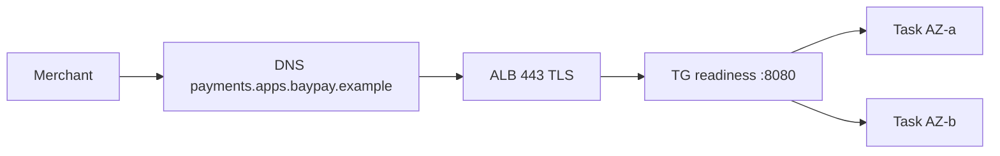

# L-14.4 — Networking, DNS and load balancing

**Module:** 14 — Security, High Availability and Disaster Recovery  
**Duration:** 30 minutes  
**Case study:** BayPay Financial Services (fictional)

---

## Why this matters

Avery Chen never types a task IP. Harbor Bike Co calls **`payments.apps.baypay.example`**. DNS, the load balancer, security groups, and Actuator health checks are how that name becomes a Ready JVM on `:8080` in `us-west-2`. If Priya Nair treats Route 53 as “just a CNAME,” or if Sam Okada probes `/` instead of `/actuator/health/readiness`, a networking miss looks like an application outage — or the inverse. L-11.4 taught ALB vs NLB vs Route 53 as **platform objects**. This lesson treats the front door as a **failure domain** on the 99.99% diagram: identity/TLS and ALB/node sit beside AZ and region. No student apply of Route 53 or ACM.

---

## Learning objectives

- Place DNS (`baypay.example`), the teaching hostname, and the student ALB name on one path without inventing a second zone.
- Keep TLS at the ALB / Ingress and HTTP `:8080` on the task; health checks stay Actuator readiness.
- Name the front door (DNS, listener, target group, security groups) as a failure domain, not a mystery.
- Prefer ALB for Avery’s JSON POST; do not add NLB “for extra HA”; do not apply hosted zones in this module.

---

## Concept explanation

**Names.** Locked public name: **`payments.apps.baypay.example`** (HTTPS). Student ALB example: **`pay-alb-student.baypay.example`**. Live apply in Module 11 used the AWS-generated `*.us-west-2.elb.amazonaws.com` name when you skipped a zone. This module does **not** create a hosted zone “for realism.”

**DNS.** Route 53 (or any authoritative DNS) maps the public name to the load balancer. DNS does not make an unhealthy target healthy. DNS **is** an availability dependency: a wrong A/alias, a stale TTL during failover (L-14.6), or an edge handshake miss (L-14.1 class) can drop merchants while Riley’s jump box still hits `:8080`. Write the plane: **resolution vs handshake vs target health**. ACM DNS validation records live in zone `baypay.example` as **issuance literacy** (L-14.1) — not as this lesson’s incident story.

**Load balancing.** **ALB** is layer 7 and the teaching default for `POST /api/v1/payments`. It terminates TLS (paper certificate from L-14.1), routes HTTP, and marks targets from an HTTP check. **NLB** is layer 4 — use it for non-HTTP or TLS passthrough, not as a second bill in front of the ALB. Cross-AZ is the HA move (L-14.5), not a second balancer product.

**Health.** Target group (or Ingress backend) probes **`/actuator/health/readiness`** on **`8080`**, success `200`. Liveness is for the **container** restart question, not for “may this target receive POST?” Do not probe `/` or `/health`. A 200 readiness is not a TLS handshake (L-14.1).

**Security groups / NetworkPolicies.** Tasks accept `8080` from the ALB (or mesh) only, not `0.0.0.0/0`. The ALB accepts 443 from the internet (student trade-off) or a tighter CIDR. Public-subnet Fargate remains the ACCOUNT.md trade-off — disclose it; do not “fix” it with NAT Gateway apply. On Kubernetes, NetworkPolicy is the analogue (L-10.4).

**Student VPC.** Public subnets + IGW. Do not add NAT, private subnets, or Transit Gateway in a 90-minute lab. EKS / OpenShift remain valid homes: Ingress or Route `payment-route` is the same *job*.

---

## Visual explanation



Alt text: Merchants resolve payments.apps.baypay.example to an ALB that terminates TLS on 443 and forwards to a target group of Fargate tasks in two AZs on HTTP 8080 using Actuator readiness.

---

## Architecture

Sam’s paper path: hosted zone `baypay.example` holds the payments name (and ACM DNS validation records as **issuance literacy**, L-14.1 — not as an incident RCA). ALB listeners 443 in **at least two AZs** in `us-west-2`. Target group: Fargate `awsvpc` IPs, protocol HTTP, port `8080`, path `/actuator/health/readiness`.

Jordan’s release still publishes an immutable image tag. A green target group after a deploy is necessary and not sufficient for merchant TLS (L-14.1) or for 99.99% (L-14.5).

Leftover IHS / plugin on `PaymentCluster` is a **different front door**. Do not dual-write merchants to the cell as “HA.” Traditional WAS is the source estate. Do not recommend ND-in-Docker as a balancer.

Paper secondary `us-east-1` (L-14.6) will need a **name** strategy (failover record, or a change window). That is DR. It is not a student apply, and it is not how you buy 99.99% in one afternoon.

---

## Production example

Priya: merchants report timeouts on `payments.apps.baypay.example`. Riley: all tasks Ready, P99 in-process is fine for the POSTs that arrive. First note: “front door or DNS, not Hikari yet.” Next evidence: resolve the name, connect 443, read the leaf, then read target health. If resolution fails, do not bounce the JVM. If handshake fails, stay on the L-14.1 *class*. If targets are unused/unhealthy, stay on L-11.4 / Actuator *class*. None of those sentences is a closed RCA.

Sam proposes an NLB in front of the ALB “for 99.99%.” Cost is another hourly bill; failure domains do not shrink. Reject for teaching estate.

Morgan Hale updates the cell’s plugin-cfg to point at Fargate. That is a leftover-estate experiment, not the load-balancing design.

---

## Code/configuration example

Illustrative — paper HCL, no Route 53 apply, no ACM apply:

```hcl
# Paper only. Do not apply ALB/ACM/Route 53 for Module 14 labs.
variable "payments_hostname" {
  type    = string
  default = "payments.apps.baypay.example"
}

# Listener shape — certificate ARN would be ACM in us-west-2 (describe, do not apply)
# health
# path = "/actuator/health/readiness"
# port = 8080
# matcher = "200"
```

```text
# Resolution vs task plane
# 1) dig +short payments.apps.baypay.example
# 2) openssl s_client -connect <edge>:443 -servername payments.apps.baypay.example
# 3) curl -sS http://<task-ip>:8080/actuator/health/readiness
# (3) can be 200 while (2) fails — symptom class, not an RCA
```

```json
{
  "Type": "application",
  "Scheme": "internet-facing",
  "SecurityGroups": ["sg-alb-443"],
  "Subnets": ["subnet-uw2a-public", "subnet-uw2b-public"]
}
```

Write the three checks on paper. Do not create a hosted zone to make the screenshot prettier.

---

## Trade-offs

| Choice | Gain | Cost |
|---|---|---|
| ALB L7 + TLS terminate | Simple tasks; path routing | Edge is a trust and HA object |
| NLB passthrough | Source IP / non-HTTP | Merchants still need a TLS story |
| Route 53 alias | Stable name | Zone + records; no student apply here |
| Public subnets + IGW | Cheap student VPC | Disclose the exposure |
| Probe `/` | Familiar | Wrong for Boot; false unhealthy |

---

## Failure modes

- Probing `/` or `/health` and paging “AWS is down.”
- Opening task `:8080` to `0.0.0.0/0`.
- Applying Route 53, ACM, or NAT Gateway in this module.
- Dual-homing merchants to `PaymentCluster` IHS as HA.
- Treating DNS as cosmetic — it is on the 99.99% budget.
- Using NLB+ALB stacked “for extra nines.”

---

## Security/reliability implications

Who can change the Route 53 record or the ALB listener certificate can redirect or intercept Avery Chen’s POST. Restrict those IAM actions the same way you restrict `AdministratorAccess` (L-14.2). Reliability: a single-AZ ALB is an AZ failure domain. Communication cites **resolved name**, **listener**, and **target health path**. Do not tell merchants “DNS is fine” without a lookup timestamp.

---

## Interview perspective

**Engineer.** Public name is `payments.apps.baypay.example`. ALB terminates TLS. I probe `/actuator/health/readiness` on `8080`. I do not apply Route 53 in this module.

**Senior.** I split resolution, handshake, and target health. I prefer ALB. I will not stack NLB for nines.

**Staff.** The front door is a failure domain on AEJE-D-064. I will not max a diagnostic score on “networking” without the plane.

**Principal.** DNS and the balancer are in the 99.99% design. Multi-region naming is DR (L-14.6), not a free upgrade. I will not fail over to `dmgr-east`.

---

## Key takeaways

- Hostname `payments.apps.baypay.example`; student ALB example `pay-alb-student.baypay.example`; zone `baypay.example`.
- ALB (or Ingress) terminates TLS; tasks stay HTTP `:8080`.
- Readiness on the target group; liveness on the container question.
- Front door is a failure domain. Paper only — no Route 53 / ACM apply.
- Do not use leftover IHS or ND-in-Docker as the balancer.

---

## Knowledge check

1. Name the three checks that separate DNS, TLS, and task health for `payments.apps.baypay.example`.
2. Which health path and port does the ALB target group use, and which path is wrong?
3. Why is applying a Route 53 hosted zone out of scope for Module 14 labs?

<details>
<summary>Spoiler — answers</summary>

1. Resolve the name; handshake 443 with SNI; curl readiness on the task `:8080`.
2. `/actuator/health/readiness` on `8080`, success 200. `/` and `/health` are wrong for this Boot app.
3. Labs are paper. TRUST.md forbids student apply of Route 53 (and ACM, KMS, Multi-AZ RDS, second region).

</details>

---

## Related lab

No lab sits immediately after this lesson. [ARCHITECT-1401](../../../../labs/ARCHITECT-1401/README.md) (after L-14.5) will reuse this front door on the 99.99% diagram. [INCIDENT-1402](../../../../labs/INCIDENT-1402/README.md) (after L-14.1) is the edge-TLS *symptom* pack — do not treat this networking lesson as that pack’s RCA.

---

## Related PAKS

Optional: `docs/16-cloud-architecture/multi-region-architecture.md` (naming across regions) and `docs/20-security/overview.md`. Front-door literacy stands alone without a PAKS login.
