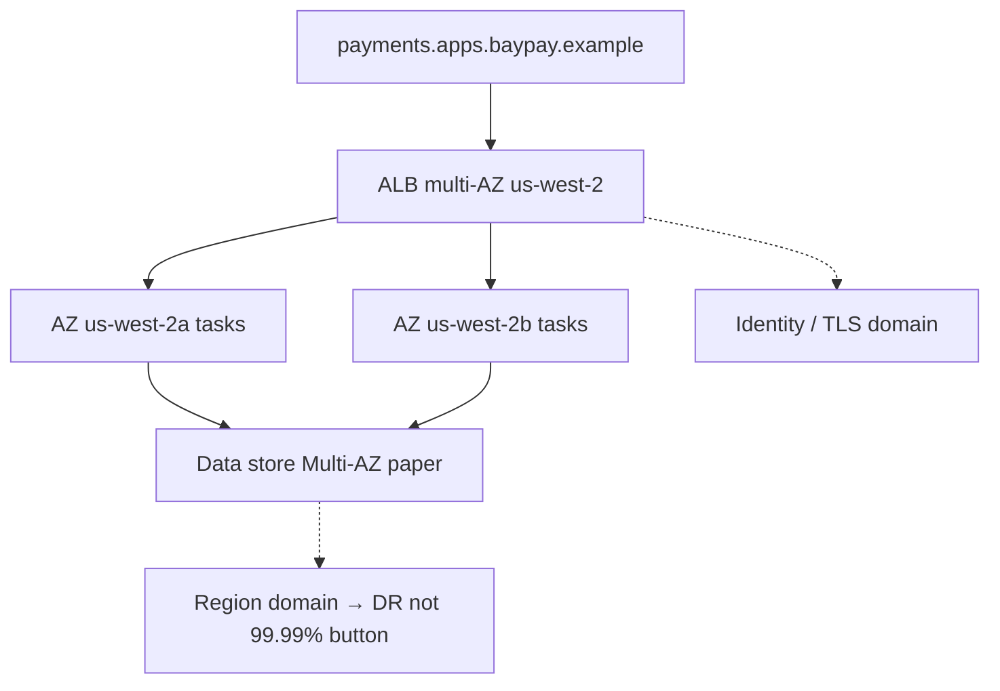

# L-14.5 — HA and failure domains

**Module:** 14 — Security, High Availability and Disaster Recovery  
**Duration:** 30 minutes  
**Diagram:** AEJE-D-064  
**Case study:** BayPay Financial Services (fictional)

---

## Why this matters

Module 13 still measures `POST /api/v1/payments` against a **99.9%** monthly SLO (~43 minutes of equivalent downtime per 30-day month) in [OBSERVABILITY.md](../../../../datasets/baypay-ops/OBSERVABILITY.md). This module’s **architecture** goal is **99.99%** — about **52 minutes per year**. Those are not the same contract. If Sam Okada “adds `us-east-1`” as the 99.99% answer, or if Morgan Hale offers `PaymentCluster` as the extra nine, Avery Chen inherits a story that does not survive an AZ loss. AEJE-D-064 is **single-region multi-AZ as a 99.99% *design***. Multi-region is DR (L-14.6, DR-1403), not a free 99.99% button.

---

## Learning objectives

- State 99.99% ≈ 52 minutes/year and keep 99.9% as the Module 13 ops SLO unless the cohort explicitly changes it.
- Name TRUST.md failure domains: **task, AZ, ALB/node, region, identity/TLS, data store**.
- Defend a paper multi-AZ design in `us-west-2` without applying Multi-AZ RDS or a second region.
- Refuse ND-in-Docker, leftover `BayPayCell` / `dmgr-east`, and `PaymentCluster` as the HA target.

---

## Concept explanation

**Availability vs SLO.** 99.99% here is a **design target** for ARCHITECT-1401. Dashboards in Module 13 stay 99.9% unless you change the written contract. Do not silently relabel a Grafana panel.

**The budget.** ~52 minutes/year is the *order of magnitude*, not a stopwatch you win by stacking products. A 30-minute ALB misconfig plus a 25-minute IAM outage **spends the year**. Identity/TLS is on the list because a handshake failure (L-14.1 class) burns the same budget as a dead AZ.

**Failure domains (locked).**

| Domain | Teaching example | HA move (paper) |
|---|---|---|
| Task | One Fargate task OOM / crash | `desired_count` ≥ 2; replace, do not `-Xmx` = cgroup limit |
| AZ | `us-west-2a` loss | Tasks + ALB subnets in ≥2 AZs |
| ALB / node | Balancer or Ingress controller | Multi-AZ ALB; do not dual-home IHS |
| Region | `us-west-2` impairment | DR, not the 99.99% button (L-14.6) |
| Identity / TLS | Edge cert, IAM, KMS grant | Expiry pages; least privilege (L-14.1–14.3) |
| Data store | Postgres / Hikari | Multi-AZ *on paper*; no student RDS apply |

**Single-region multi-AZ can be 99.99%.** Spread the ALB, tasks, and (on paper) the database across AZs in **`us-west-2`**. That is a *design*. It does not require a second region. It does not require EKS. ECS on Fargate is the AWS default; Kubernetes / OpenShift remain valid homes if you spread Pods and the Ingress across failure domains.

**What HA is not.** It is not two Liberty nodes in Docker Desktop. It is not `PaymentCluster` with a `nodeagent`. It is not “we have a cell in the east.” Traditional WAS is the **source estate**. Decommission path is Module 6. Failover to `dmgr-east` is a finding, not a strategy.

**N+1 preview.** L-14.7 sizes unused headroom. This lesson only requires: one task or one AZ must be able to fail without ending authorize. That implies **more than one** of each critical object.

---

## Visual explanation



Alt text: AEJE-D-064. Merchants hit a multi-AZ ALB in us-west-2 that fans out to payment-service tasks in two AZs and a paper Multi-AZ data store; identity/TLS is its own domain; region failure is DR, not a free 99.99 percent upgrade.

---

## Architecture

Sam’s paper 99.99% shape: ECS service `desired_count` ≥ 2, Fargate, public subnets in two AZs (ACCOUNT.md trade-off disclosed), ALB in those AZs, health `/actuator/health/readiness` on `8080`, secrets from Secrets Manager, KMS `alias/baypay-payments`, task role ≠ execution role. Database Multi-AZ is **described**, never applied in a 90-minute lab.

Priya’s error-budget conversation: if the cohort keeps the 99.9% SLO, a 99.99% design is **headroom** — you still page on 99.9% burn (L-13.4). ARCHITECT-1401 asks you to *design* 99.99%, not to rewrite the ops SLO by stealth.

Riley scales tasks, not cells. Never set `-Xmx` equal to the task memory limit (L-7.6 / L-9.6 / L-11.2). A single fat JVM is not an HA domain.

---

## Production example

An exec asks for “four nines by Friday” and a replica in `us-east-1`. Sam’s one-pager: four nines is ~52 minutes/year; the *design* is multi-AZ in `us-west-2` plus edge TLS and IAM that cannot spend the budget; `us-east-1` is a **60-minute RTO** conversation (L-14.6), with its own capacity (L-14.7). No apply this week.

A different review: Morgan Hale shows two WAS nodes in `BayPayCell` and calls it 99.99%. Priya writes: source estate, single-cell fate, not the Fargate target. Do not run ND in Docker to “simulate HA.”

Friday deploy: Jordan sets `desired_count = 1` “to save money.” One task death is 100% of authorize. That is not a 99.99% design even if the ALB is multi-AZ.

---

## Code/configuration example

Illustrative — paper HCL, no Multi-AZ RDS apply:

```hcl
# Paper only. Do not apply Multi-AZ RDS or a second region.
resource "aws_ecs_service" "payment" {
  name            = "payment-service"
  cluster         = var.cluster_id
  task_definition = var.task_definition_arn
  desired_count   = 2 # N+1 vs a single task; L-14.7 sizes this honestly
  launch_type     = "FARGATE"

  load_balancer {
    target_group_arn = var.tg_arn
    container_name   = "payment-service"
    container_port   = 8080
  }
}
```

```text
# AEJE-D-064 checklist (paper)
# [ ] Tasks in ≥2 AZs (us-west-2)
# [ ] ALB subnets in ≥2 AZs
# [ ] Data store Multi-AZ described — not applied
# [ ] Edge TLS + KMS alias/baypay-payments named as domains
# [ ] Region loss → DR-1403, not "we have 99.99%"
# [ ] Not PaymentCluster, not dmgr-east, not ND-in-Docker
```

```java
// Readiness is the HA signal to the balancer — not a cell heartbeat.
@GetMapping("/actuator/health/readiness")
public ResponseEntity<Void> readiness() {
    return ResponseEntity.ok().build();
}
```

Do not copy that mapping over Spring Boot Actuator in production code; it is the *job*, not a snippet to paste.

---

## Trade-offs

| Choice | Gain | Cost |
|---|---|---|
| Multi-AZ single region | 99.99% *design* possible | Still one region (DR separate) |
| Add a region now | Geography | RPO/RTO, split-brain, cost (L-14.6) |
| `desired_count = 1` | Cheap | One task = whole SLO |
| Leftover cell as HA | Familiar to WAS shops | Wrong target; Module 6 debt |
| Upgrade SLO to 99.99% | Honest if contracted | Pages more; not this lesson’s default |

---

## Failure modes

- Treating “add `us-east-1`” as the only 99.99% answer.
- Applying Multi-AZ RDS or a second region in a 90-minute lab.
- One task, one AZ, one ALB subnet — then claiming four nines.
- Recreating `PaymentCluster` or ND-in-Docker as HA.
- Setting `-Xmx` equal to the Fargate / cgroup limit so the first spike OOMs the only fat JVM.
- Relabeling Module 13 dashboards to 99.99% without a contract change.

---

## Security/reliability implications

Identity/TLS and KMS grants spend the same 52 minutes as compute. A wide task role (L-14.2) is an HA risk: a key revocation or a mistaken IAM deny is a regional authorize outage. Communication cites **which domain** failed and **whether the SLO or the architecture goal** is in play. Do not tell executives “we are 99.99%” because two tasks exist.

---

## Interview perspective

**Engineer.** 99.99% is about 52 minutes a year. I run at least two tasks in two AZs in `us-west-2`. I do not use `PaymentCluster` as HA.

**Senior.** I keep 99.9% as the ops SLO unless we change it. I name six failure domains. I will not apply Multi-AZ RDS in a student lab.

**Staff.** AEJE-D-064 is a single-region design. I send region loss to RTO/RPO. I will not max ARCHITECT-1401 on “add a region.”

**Principal.** Four nines is a budget, not a product SKU. I fund multi-AZ and edge trust. I forbid leftover cells and ND-in-Docker as the target architecture.

---

## Key takeaways

- **99.99% ≈ 52 min/year** (architecture). **99.9%** remains the Module 13 ops SLO.
- Single-region multi-AZ in `us-west-2` can be a 99.99% *design*.
- Multi-region is DR, not a free 99.99% button.
- Domains: task, AZ, ALB/node, region, identity/TLS, data store.
- Never HA-target `BayPayCell`, `dmgr-east`, `PaymentCluster`, or ND-in-Docker.

---

## Knowledge check

1. How many minutes per year is the 99.99% teaching budget, and what is the Module 13 SLO?
2. An exec says “add `us-east-1` to get 99.99%.” What do you answer in one sentence?
3. Why is two WAS nodes in `PaymentCluster` not the HA design?

<details>
<summary>Spoiler — answers</summary>

1. About 52 minutes/year. Module 13 SLO stays 99.9% unless the contract changes.
2. Multi-region is DR/RTO; single-region multi-AZ can be the 99.99% *design*. Adding a region is not a free upgrade.
3. Traditional WAS is the source estate. The teaching target is multi-AZ ECS/Fargate (or K8s/OpenShift), not a leftover cell or ND-in-Docker.

</details>

---

## Related lab

[ARCHITECT-1401](../../../../labs/ARCHITECT-1401/README.md) — Design BayPay for 99.99 percent. Use AEJE-D-064’s domains and the 52-minute budget. Paper only. Do not apply Multi-AZ RDS or a second region. This lesson does not complete the design for you.

---

## Related PAKS

Optional: `docs/18-reliability-and-resilience/overview.md` (failure domains). The 99.99% vs 99.9% split stands alone without a PAKS login.
