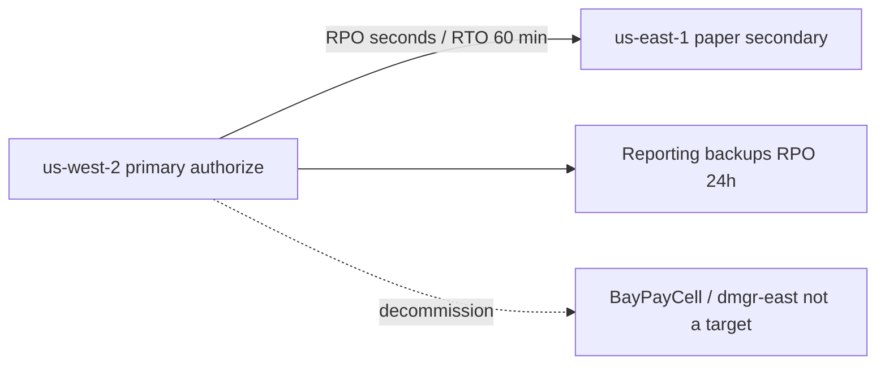

# L-14.6 — RTO, RPO and DR

**Module:** 14 — Security, High Availability and Disaster Recovery  
**Duration:** 30 minutes  
**Diagram:** AEJE-D-066  
**Case study:** BayPay Financial Services (fictional)

---

## Why this matters

An AZ loss in `us-west-2` is an HA problem (L-14.5). A **region** impairment is a **disaster**. If Jordan Voss treats “we will fail over to `dmgr-east`” as the plan, or if an exec treats `us-east-1` as a free 99.99% button, Avery Chen’s authorize path has neither a recovery time nor a recovery point anyone can defend. [TRUST.md](../../../../datasets/baypay-security/TRUST.md) locks starting numbers: payment authorize **RPO seconds**, **RTO 60 minutes** regional; merchant reporting **24 hours / 24 hours**. Primary is `us-west-2`. Paper secondary is **`us-east-1`**. AEJE-D-066. No student apply in the second region.

---

## Learning objectives

- Define **RPO** (how much ledger intent you may lose) and **RTO** (how long until authorize is back) and reuse TRUST.md starting points.
- Defend pilot light or warm standby in `us-east-1` **on paper** for payments; backup restore for merchant reporting.
- Refuse leftover `BayPayCell` / `dmgr-east` / `PaymentCluster` as a DR target.
- Keep multi-region in the DR conversation — not as a silent upgrade of the 99.99% design.

---

## Concept explanation

**RPO** is the maximum *data* gap you will admit. For authorize / complete, teaching RPO is **seconds**: idempotent retry plus a replicated ledger *intent*. Avery Chen’s `Idempotency-Key` is how a retry after failover must not double-charge Harbor Bike Co. For merchant reporting, RPO is **24 hours** — last night’s backup is an allowed conversation.

**RTO** is the maximum *time until the service meets its contract again*. Teaching RTO for payments is **60 minutes** regional. That is not “DNS flipped in 30 seconds” unless you already paid for warm capacity (L-14.7). Reporting RTO is **24 hours**.

**Patterns (paper).**

| Pattern | What is running in `us-east-1` | Fits |
|---|---|---|
| Backup / restore | Almost nothing; snapshots | Merchant reporting |
| Pilot light | Data replication + minimal control plane; scale out on declare | Payments if you can hit 60 minutes |
| Warm standby | Scaled-down but running stack | Payments if you can defend the idle bill |
| Active-active | Serving merchants in both regions | Not the teaching default; split-brain risk |

Students **defend** pilot light or warm standby for authorize. They do not apply either.

**What DR is not.** It is not HA. Multi-AZ in `us-west-2` can be 99.99% without a second region. DR is what you do when that region is the domain that failed. It is not ND-in-Docker. It is not “Morgan Hale will start the cell.” Leftover `BayPayCell` / `dmgr-east` has **no RPO/RTO** — the path is decommission (Module 6).

**Idempotency across a failover.** Payment id `c1402b22-0000-4000-8000-111111111402` and the merchant `Idempotency-Key` must mean the same intent in the secondary. If the replica is minutes behind, you have already missed the seconds RPO — say so, or change the pattern.

**DNS.** A failover record for `payments.apps.baypay.example` is part of the **paper** runbook. Do not apply Route 53 failover. TTL and human declare time sit inside the 60-minute RTO.

---

## Visual explanation



Alt text: AEJE-D-066. Payment authorize fails from primary us-west-2 to a paper secondary in us-east-1 with RPO in seconds and RTO of 60 minutes; merchant reporting uses 24-hour backup restore; leftover BayPayCell and dmgr-east are not DR targets.

---

## Architecture

Sam’s paper DR: replicate ledger intent to `us-east-1` (mechanism named, not applied). KMS: say whether `alias/baypay-payments` has a multi-Region key or a replica grant — restores that cannot decrypt miss RTO (L-14.3). Image `baypay/payment-service:<tag>` must exist in the secondary’s ECR *on paper*, or pull times eat the hour. Task role ≠ execution role in both regions. No `AdministratorAccess` “because DR is an emergency.”

Priya’s tabletop (DR-1403) is a **declare**: who says the region is gone, who changes DNS, who scales pilot light, who tells merchants that reporting is on the 24-hour clock. Riley does not bounce `dmgr-east` as step one.

Compute default remains ECS/Fargate; EKS/OpenShift are valid if that is the home you already run. Do not stand up a second platform as the DR story.

---

## Production example

09:10 Pacific: `us-west-2` control plane is impaired. Exec wants “fail over to the cell — Morgan still has `dmgr-east`.” Priya: leftover cell is **not** a DR target; RTO/RPO are undefined; ND is the estate you are leaving. The paper plan is `us-east-1` pilot light or warm standby, 60 minutes, seconds RPO for authorize.

A second exec: “we already designed 99.99%, so we do not need DR.” Sam: 99.99% can be single-region; region is still a domain; DR-1403 is the tabletop. Adding a region is not how you *buy* four nines.

Reporting: last good snapshot is 22:00 UTC yesterday. That meets the 24-hour RPO if you declared it. It does **not** meet payment RPO. Do not restore authorize from the reporting dump and call it seconds.

---

## Code/configuration example

Illustrative runbook and paper DNS — not a live failover, not an apply:

```text
# DR declare (paper) — payments.apps.baypay.example
# Primary: us-west-2    Secondary: us-east-1 (do not apply)
# Authorize: RPO seconds | RTO 60 minutes | pattern: pilot light or warm standby
# Reporting: RPO 24h    | RTO 24h        | pattern: backup restore
# Not a target: BayPayCell, dmgr-east, PaymentCluster, ND-in-Docker
```

```hcl
# Paper only. Do not apply Route 53 failover or a second-region stack.
variable "primary_region" { default = "us-west-2" }
variable "dr_region"      { default = "us-east-1" }
variable "payments_name"  { default = "payments.apps.baypay.example" }

# Failover record would alias primary ALB vs secondary ALB
# after a human declare — TTL is part of the 60-minute RTO
```

```java
// Same Idempotency-Key must address the same intent after failover.
public boolean alreadyCompleted(String idempotencyKey) {
    return ledger.existsByIdempotencyKey(idempotencyKey);
}
```

Write who declares, what name moves, and what you will **not** start (the cell). Do not apply it.

---

## Trade-offs

| Choice | Gain | Cost |
|---|---|---|
| Pilot light | Lower idle bill | Scale-out consumes RTO |
| Warm standby | Faster RTO | You pay for unused headroom (L-14.7) |
| Backup restore | Cheap | Hours — OK for reporting only |
| Active-active | Low RTO | Consistency, dual writes, cost |
| Fail over to ND | Familiar | Not a target; undefined RPO/RTO |

---

## Failure modes

- Calling leftover `dmgr-east` the DR site.
- Using the reporting backup as the authorize RPO.
- Applying a second-region stack or Route 53 failover in a 90-minute lab.
- Treating multi-region as a free 99.99% upgrade.
- Forgetting KMS decrypt in `us-east-1` so the hour is spent on keys.
- Double-charging because idempotency was regional-only.

---

## Security/reliability implications

DR IAM is still least privilege. A “DR admin” with `AdministratorAccess` is a standing incident. Secrets and backups that decrypt only in `us-west-2` miss RTO. Communication must cite **RPO, RTO, pattern, region pair**, and **what is not in service** (reporting vs authorize). Do not tell merchants “we failed over” if DNS still points at an empty ALB.

---

## Interview perspective

**Engineer.** Payments: RPO seconds, RTO 60 minutes, paper `us-east-1`. Reporting: 24 hours. I do not fail over to `dmgr-east`.

**Senior.** I defend pilot light or warm standby. I will not apply the second region. Idempotency must survive the cut.

**Staff.** AEJE-D-066 separates HA from DR. I will not sell a region as four nines. I tabletop the declare, not the cell.

**Principal.** DR is a funded pattern with capacity (L-14.7). I decommission leftover cells instead of writing them into the runbook.

---

## Key takeaways

- Authorize: **RPO seconds**, **RTO 60 minutes**, pilot light or warm standby in **`us-east-1` on paper**.
- Reporting: **24h / 24h**, backup restore.
- Primary `us-west-2`. No student apply in the secondary.
- Leftover `BayPayCell` / `dmgr-east` is **not** a DR target.
- Multi-region ≠ free 99.99%. That design can be single-region multi-AZ.

---

## Knowledge check

1. Give TRUST.md RPO and RTO for payment authorize and for merchant reporting.
2. Why is `dmgr-east` not an acceptable DR target?
3. An exec says a second region will “give us 99.99%.” What do you correct?

<details>
<summary>Spoiler — answers</summary>

1. Authorize: seconds RPO, 60 minutes RTO. Reporting: 24 hours RPO and 24 hours RTO.
2. Leftover WAS / `BayPayCell` is the source estate with no teaching RPO/RTO. Path is decommission, not failover. Do not use ND-in-Docker.
3. 99.99% can be a single-region multi-AZ *design*. Multi-region is DR/RTO, not a free availability button.

</details>

---

## Related lab

[DR-1403](../../../../labs/DR-1403/README.md) — Regional outage tabletop. Use AEJE-D-066 numbers and the `us-west-2` / `us-east-1` pair. Paper only. Do not apply a second-region stack. This lesson does not run the tabletop for you.

---

## Related PAKS

Optional: `docs/16-cloud-architecture/multi-region-architecture.md` and `docs/18-reliability-and-resilience/overview.md`. The RTO/RPO table stands alone without a PAKS login.
