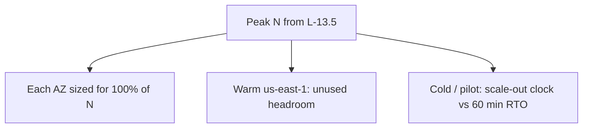

# L-14.7 — Capacity planning

**Module:** 14 — Security, High Availability and Disaster Recovery  
**Duration:** 30 minutes  
**Case study:** BayPay Financial Services (fictional)

---

## Why this matters

L-14.5 asked for two tasks in two AZs. L-14.6 asked for a 60-minute regional RTO. Neither sentence says whether **`us-east-1` can carry Harbor Bike Co’s authorize rate** after you declare, or whether `us-west-2a` can carry the estate when `us-west-2b` dies. If Sam Okada copies L-13.5’s RPS and Hikari math and stops there, Avery Chen still fails on failover because the warm standby was sized for *demo*, not for N+1. This lesson is **HA/DR capacity**: N+1, unused failover headroom, warm vs cold. It is **not** a repeat of [L-13.5](../../13-production-engineering-observability/lessons/L-13.5.md) (RPS, Hikari `jdbc/baypay`, JVM sizing). Cross-link that lesson; do not rewrite it.

---

## Learning objectives

- Size **N+1** so one task or one AZ can fail without ending `POST /api/v1/payments`.
- Account for **unused failover headroom** in the surviving AZ and in paper `us-east-1`.
- Contrast **warm** vs **cold / pilot-light** DR capacity against the 60-minute RTO.
- Refuse `-Xmx` equal to the cgroup / Fargate limit, and refuse leftover cells as spare capacity.

---

## Concept explanation

**Two capacity conversations.**

| Lesson | Question | Typical math |
|---|---|---|
| **L-13.5** (ops) | Can *this* region serve today’s RPS with P99 headroom? | RPS, Hikari pool, threads, heap |
| **L-14.7** (this) | Can we still serve after a *domain* fails? | N+1, idle DR, scale-out time vs RTO |

Use L-13.5 for “how many connections and how much heap in `us-west-2`.” Use this lesson for “how much of that you must **leave idle** so an AZ or region loss does not saturate the survivor.”

**N+1.** If authorize needs *N* Ready tasks at peak, run **N+1** (or more) so one task death is not 100% loss. If one AZ must absorb the other, each AZ needs enough CPU, connections, and ALB capacity for **100% of N**, not 50%. Two tasks in two AZs is N+1 only when *one* task can carry peak — otherwise you have N/2 + N/2 and an AZ outage is a capacity incident.

**Unused failover headroom.** The surviving AZ (HA) and the secondary region (DR) must have **room you are not using** on a normal Tuesday. That looks “wasteful” on a COST-1105 instinct. It is the 99.99% and 60-minute RTO bill. Write the unused percent on the ARCHITECT-1401 / DR-1403 paper.

**Warm vs cold DR capacity.**

| Mode | Capacity in `us-east-1` | RTO risk |
|---|---|---|
| Cold / backup | Snapshots, maybe an image in ECR | Hours — reporting OK; payments 60 min is hard |
| Pilot light | Data + tiny control plane; scale out on declare | Scale-out + DNS must fit **60 minutes** |
| Warm standby | Running stack at a fraction of N | Faster; you **pay** for unused tasks/ALB |
| Hot / active-active | Full N in both regions | Not the teaching default |

If pilot-light scale-out cannot provision Fargate tasks, pull `baypay/payment-service:<tag>`, attach secrets under `alias/baypay-payments`, and pass readiness inside the hour, you do **not** have a 60-minute RTO. Either pre-warm or change the number.

**What you do not resize here.** Do not re-derive Hikari `maximumPoolSize` or the P99 < 400 ms teaching latency — that is L-13.5 / OBSERVABILITY.md. Do not set **`-Xmx` equal to the cgroup or Fargate memory limit**; leave room for metaspace and the OS (L-7.6, L-9.6). A larger heap is not N+1.

**Not spare capacity.** `PaymentCluster`, `dmgr-east`, ND-in-Docker, a leftover Liberty VM. Those are source-estate objects. They do not count as failover headroom.

---

## Visual explanation



Alt text: Peak N comes from the Module 13 capacity lesson; this lesson sizes each AZ to carry all of N and contrasts warm unused headroom in us-east-1 with cold or pilot-light scale-out against the 60-minute RTO.

---

## Architecture

Sam’s paper numbers (illustrative, not a lab key): L-13.5 says peak 40 RPS authorize needs 4 tasks in `us-west-2` after Hikari/thread math. L-14.7 then says: place **at least 4 tasks of useful capacity in each AZ** if you want AZ loss to be HA, *or* accept that AZ loss becomes a degrade and say so. DR: warm standby of 4 tasks in `us-east-1` meets RTO with unused Tuesday spend; pilot light of 1 task must show it can reach 4 and Ready within 60 minutes including image pull and secret inject.

Priya’s 99.99% budget (~52 min/year) is spent if failover saturates the survivor and authorize 5xxs for an hour. Capacity is an HA domain, not only a cost domain.

Riley still uses `/actuator/health/readiness` on `8080`. Unready tasks do not count as N.

---

## Production example

Finance sees 50% idle CPU in `us-west-2b` and wants `desired_count` cut in half. Sam: that idle *is* AZ headroom. Cutting it converts L-14.5’s multi-AZ design into two half-sites. Quote N from L-13.5, then show N per AZ.

DR tabletop: Jordan assumes the secondary ECR is empty and will “copy the image when we declare.” Pull + pipeline time can consume the 60-minute RTO. Warm or pre-copy the immutable tag *on paper*.

Morgan Hale offers “the cell can absorb Harbor Bike Co.” That is not capacity. It is a leftover estate without a teaching RPO/RTO (L-14.6).

---

## Code/configuration example

Illustrative — paper arithmetic and HCL, not L-13.5’s pool math:

```text
# HA/DR capacity card (paper)
# Peak N (from L-13.5, do not re-derive Hikari here): 4 tasks
# AZ policy: each AZ can run N=4 (unused ~50% on a two-AZ Tuesday)
# DR us-east-1:
#   warm  = 4 tasks idle-ish  → fits RTO 60 min
#   pilot = 1 task + scale to 4; clock image pull, KMS, readiness
#   cold  = restore only      → reporting 24h, not authorize
# Forbidden spare: PaymentCluster, dmgr-east, ND-in-Docker
# Forbidden JVM: -Xmx == cgroup / Fargate memory limit
```

```hcl
# Paper only. Do not apply a second region or Multi-AZ RDS.
variable "peak_tasks" { default = 4 } # N from L-13.5
variable "az_count"   { default = 2 }

locals {
  tasks_per_az_for_full_n = var.peak_tasks
  tuesday_desired         = var.peak_tasks # plus platform replacement slack
}
```

```bash
# Never: JAVA_TOOL_OPTIONS="-Xmx2048m" with Fargate memory=2048
# Leave heap < cgroup limit (L-7.6 / L-9.6). Heap is not N+1.
```

Write N, unused percent, and warm-vs-pilot against 60 minutes. Do not paste a Hikari `maximumPoolSize` as the whole answer.

---

## Trade-offs

| Choice | Gain | Cost |
|---|---|---|
| N per AZ | AZ loss stays HA | Idle Tuesday capacity |
| N+1 tasks only | Cheap vs full AZ mirror | AZ loss may degrade |
| Warm DR at N | RTO likely | Idle `us-east-1` bill |
| Pilot light | Lower idle | Scale-out must fit 60 min |
| Count the cell as N | Familiar | Invalid target |

---

## Failure modes

- Repeating L-13.5 RPS/Hikari and calling HA done.
- `desired_count = N` split across two AZs with no unused headroom.
- Cold DR against a 60-minute payment RTO.
- Empty secondary ECR at declare time.
- `-Xmx` equal to the memory limit as “capacity.”
- Booking `dmgr-east` as spare tasks.

---

## Security/reliability implications

Idle DR tasks still have IAM and secrets. Do not grant `AdministratorAccess` “until we scale.” Unused headroom that cannot fetch `BAYPAY_DB_*` or decrypt `alias/baypay-payments` is not capacity. Communication cites **N, unused percent, pattern, and RTO clock**. Do not tell merchants “we have DR” if the secondary cannot reach N in 60 minutes.

---

## Interview perspective

**Engineer.** I take peak N from L-13.5. I add N+1 and unused AZ headroom. I never set `-Xmx` to the cgroup limit. I do not count the cell.

**Senior.** I compare warm unused spend to pilot-light scale-out against a 60-minute RTO. I will not apply the second region to “prove” capacity.

**Staff.** HA/DR capacity is a different worksheet from ops RPS. I will fail a design that splits N across AZs and hopes.

**Principal.** I fund unused failover headroom as the price of 99.99% and of DR. I will not accept leftover WAS as elastic N.

---

## Key takeaways

- **L-13.5** = RPS / Hikari / JVM. **This lesson** = N+1, unused headroom, warm vs cold.
- Each AZ that must survive alone needs **N**, not N/2.
- Warm DR buys RTO; cold/pilot must *fit* 60 minutes for authorize.
- Never `-Xmx` = cgroup / Fargate limit. Heap is not failover capacity.
- Leftover cells are not spare N. Paper only — no second-region apply.

---

## Knowledge check

1. L-13.5 says peak N = 4 tasks. You place 2 tasks in each of two AZs and call it HA. What did you miss?
2. How does this lesson differ from L-13.5?
3. Pilot light is 1 task in `us-east-1`. What must you prove to keep a 60-minute RTO?

<details>
<summary>Spoiler — answers</summary>

1. Unused failover headroom. If one AZ dies, only 2 tasks remain — N/2, not N. Size each AZ for N if AZ loss must stay HA.
2. L-13.5 sizes the happy-path pool (RPS, Hikari, heap). This lesson sizes spare capacity for task/AZ/region loss (N+1, idle DR, warm vs cold).
3. That you can reach N Ready tasks (image, secrets, KMS, readiness, DNS) inside 60 minutes — or you must pre-warm.

</details>

---

## Related lab

[ARCHITECT-1401](../../../../labs/ARCHITECT-1401/README.md) (after L-14.5) and [DR-1403](../../../../labs/DR-1403/README.md) (after L-14.6) both consume this card: N+1 on the 99.99% diagram, unused headroom on the regional tabletop. Do not redo L-13.5’s Hikari lesson in those write-ups.

---

## Related PAKS

Optional: `docs/18-reliability-and-resilience/overview.md` (capacity vs failure). Cross-link L-13.5; this lesson stands alone without a PAKS login.
