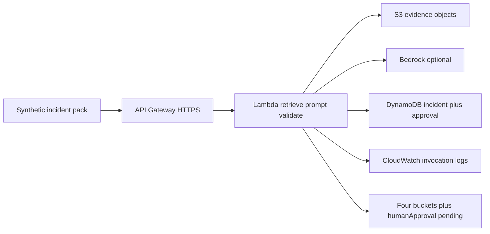

# L-15.1 — Incident summarization

**Module:** 15 — BayOps AI — AI-Assisted Operations  
**Duration:** 30 minutes  
**Diagram:** AEJE-D-069  
**Case study:** BayPay Financial Services (fictional)

---

## Why this matters

When Harbor Bike Co charges Avery Chen `$84.00` and `POST /api/v1/payments` misses P99, Riley Okonkwo already has a method from L-13.6: quote the board, write a hypothesis, stabilize merchants. A model that pastes Slack, CloudWatch, and a guess into one paragraph titled **“Root cause”** undoes that method in thirty seconds. Priya Nair cannot spend an error budget on a fluent mix. Sam Okada cannot retrieve a file the summary invented. This lesson is **incident summarization** for `payment-service` on port `8080`: compress a synthetic pack into four labeled buckets, never into a proven RCA. Architecture: **AEJE-D-069**.

---

## Learning objectives

- Name the four BayOps buckets and refuse a collapsed “Root cause: …” sentence.
- Treat a **mixed summary** as a class to rewrite — evidence, guess, and next step in one paragraph.
- Sketch AEJE-D-069 on paper (API Gateway, Lambda, S3, DynamoDB, optional Bedrock, CloudWatch) in `us-west-2`.
- Produce JSON that matches [output.schema.json](../../../../infrastructure/bayops-ai/schema/output.schema.json) without a live model.

---

## Concept explanation

**Summarization** answers “what does this pack actually contain?” It is not RCA. It is not a runbook. BayPay’s teaching shape is four sections locked in [BAYOPS.md](../../../../datasets/baypay-ai/BAYOPS.md):

| Bucket | Job | Fail if |
|---|---|---|
| **Evidence** | Quote files Riley or Priya opened | The path was never in the pack |
| **Hypotheses** | Rank *unproven* explanations | One is labeled proven / confirmed / RCA |
| **Recommended investigation** | Name the next omitted gate | It says “bounce now” |
| **Suggested remediation** | Stabilize, then durable steps | It auto-executes or skips approval |

A fifth field, `humanApproval`, stays `pending` on any mutating suggestion until Riley or Priya (or the student on-call) writes `approved` or `rejected` with a name and time. L-15.5 owns that gate. This lesson only requires you to emit the field.

**Mixed summary** is a *class*, not a lab spoiler. The fixture shape you will rewrite in AI-1501 looks like one paragraph that weaves a quoted `outcome`, a guess about Hikari or threads, and a next action with no labels. Your job is to split that class into the four buckets. This lesson does **not** complete AI-1501 for you and does not name that pack’s planted sentences.

**What a summary may cite.** JSON log fields from Module 13: `ts`, `level`, `logger`, `msg`, `correlationId`, `paymentId`, `outcome`. Example payment id: `c1501d33-0000-4000-8000-111111111501`. Avery’s customer id `11111111-1111-1111-1111-111111111111` and the active USD account `…221` may appear in **application logs** when the pack already has them. They must **not** be sent to a model as PAN, and `BAYPAY_DB_PASSWORD` never enters a prompt.

**What a summary is not.** A metric scrape is not a confession. A Slack thread is not a file. CloudWatch Logs Insights that finds `correlationId` is a **search**, not a trace (L-11.6). Do not summarize Morgan Hale’s leftover `dmgr-east` into the Boot incident because the word “payment” appears in both estates.

**Live Bedrock is not required.** Paper fixtures plus the schema are the pass path. If someone later sketches Bedrock in `us-west-2`, it is optional extra credit and still must validate the same JSON.

---

## Visual explanation



Alt text: AEJE-D-069. A paper BayOps path in us-west-2: API Gateway to Lambda, which reads S3 evidence, optionally calls Bedrock, records the incident and approval in DynamoDB, logs to CloudWatch, and emits four labeled buckets — never a proven RCA.

---

## Architecture

Sam Okada’s platform sketch stays in **`us-west-2`**: API Gateway as the HTTPS front door for “summarize this pack,” Lambda as retrieve → prompt → **schema validate**, S3 for synthetic evidence objects (never PAN), DynamoDB for `incidentId` plus the approval record, CloudWatch for invocation logs — not a substitute for traces. Amazon Bedrock is optional; fixtures replace it in class.

Do **not** apply NAT Gateway, EKS, OpenSearch, or provisioned Bedrock throughput “for realism.” If anyone applies the short-lived tagged stack, destroy the same day. Estimate before apply; idle API Gateway and DynamoDB still bill.

Priya owns the SLO sentence in the summary. Riley owns which files were actually opened. Jordan’s change list is evidence only when the pack includes it. Morgan’s cell is a different estate. Stabilization language in a summary is still a **suggestion** — L-15.4 and L-15.5.

---

## Production example

20:11 UTC. Avery Chen’s create for Harbor Bike Co shows `outcome=AUTHORIZED` then no `COMPLETED` inside the teaching P99 window. Riley opens the synthetic log object and the RED scrape for `uri="/api/v1/payments"`. A model replies: “Root cause is the pool; bounce the task and we are done.” That paragraph is a **mixed summary**: it hid the quote, promoted a guess, and skipped investigation and approval.

Priya asks for four labels. Evidence quotes the two log lines and the scrape timestamp. Hypotheses stay `unproven`. Recommended investigation names Hikari USE pending/active on that minute. Suggested remediation says fail readiness or pin the last good ECS revision — `approvalRequired=true`, `humanApproval.status=pending`. Nobody has proven RCA. Nobody has touched `dmgr-east`.

If Jordan says “we have AI because CloudWatch exists,” write the contradiction: invocation logs are not a summary contract.

---

## Code/configuration example

Illustrative four-bucket file — not an AI-1501 answer, not a live key:

```json
{
  "incidentId": "INC-TEACH-15-1",
  "service": "payment-service",
  "evidence": [
    {
      "source": "s3://baypay-synthetic-ops/packs/teach-15/payment-create.jsonl",
      "at": "2026-09-03T20:11:04.221Z",
      "quote": "create accepted correlationId=a15e0001-b3e1-4c55-9d01-aa11bb22cc33 paymentId=c1501d33-0000-4000-8000-111111111501 outcome=AUTHORIZED"
    }
  ],
  "hypotheses": [
    {
      "id": "H1",
      "statement": "PROCESSING to COMPLETED is delayed on the worker, not on the HTTP accept",
      "status": "unproven",
      "fitsEvidence": ["AUTHORIZED line present; COMPLETED not quoted in this window"]
    }
  ],
  "recommendedInvestigation": [
    "Open the same-minute Hikari jdbc/baypay USE row and one later log line for this paymentId"
  ],
  "suggestedRemediation": [
    {
      "action": "If USE confirms saturation, fail readiness on the sick task and pin the last good ECS revision",
      "mutatesProduction": true,
      "approvalRequired": true
    }
  ],
  "humanApproval": { "status": "pending" }
}
```

Do not put `BAYPAY_DB_PASSWORD` or a Bedrock key in this object. Do not add `provenRootCause`.

---

## Trade-offs

| Choice | Gain | Cost |
|---|---|---|
| Four labeled buckets | Reviewable; schema-checkable | Slower than a slogan |
| One “Root cause” paragraph | Fast Slack paste | Mixes quote, guess, and action |
| Paper fixtures | Pass without a model bill | No live-token drama |
| Optional Bedrock | Extra-credit realism | Prompt leakage; still must validate |
| Long dump of every line | Feels complete | Hides the next gate |

---

## Failure modes

- Collapsing the pack into “Root cause: …” (mixed-summary class).
- Citing a path nobody opened, then calling it evidence.
- Sending PAN, `BAYPAY_DB_PASSWORD`, or live keys to a model.
- Requiring Bedrock or `terraform apply` to “finish” the summary.
- Bouncing `dmgr-east` because the summary mentioned payments.
- Treating CloudWatch invocation logs as a distributed trace.

---

## Security/reliability implications

Prompts are a data store. Who can replay the S3 object can reconstruct Avery Chen’s session. Restrict objects, retain on purpose, and never persist PAN. Reliability: a wrong summary that auto-executes is an outage you authored. Keep mutating steps pending. Signal health (Lambda 200) is not payment health (`POST /api/v1/payments` still 500).

---

## Interview perspective

**Engineer.** I split a pack into Evidence, Hypotheses, Recommended investigation, and Suggested remediation. I do not write “proven RCA.”

**Senior.** I treat a mixed summary as a rewrite class. I keep `humanApproval` pending. I will not send secrets to a model.

**Staff.** I fund AEJE-D-069 as a validator, not as a commander. I score on-call on quoted paths, not on fluency.

**Principal.** Investigator, never authority. I will not accept ND-in-Docker, `-Xmx` equal to the cgroup, or auto-remediate as the BayOps plan.

---

## Key takeaways

- Summarization is four buckets, not a root-cause sentence.
- Mixed summary is a class: unlabel the paragraph, then rewrite.
- AEJE-D-069 is paper: API Gateway, Lambda, S3, DynamoDB, optional Bedrock, CloudWatch.
- Live Bedrock is not required. Schema match is the grade.
- Hypotheses stay `unproven`. Approval stays `pending`.

---

## Knowledge check

1. Name the four mandatory output buckets and the extra field on a mutating suggestion.
2. A paragraph quotes `outcome=AUTHORIZED`, guesses Hikari, and says “bounce the task.” What class is that, and what do you do?
3. Why is a live Bedrock call not required to pass this lesson or AI-1501?

<details>
<summary>Spoiler — answers</summary>

1. Evidence, Hypotheses, Recommended investigation, Suggested remediation; `humanApproval` (starts `pending`).
2. Mixed-summary class. Split into four labeled buckets; keep the guess `unproven`; do not execute the bounce.
3. Paper fixtures plus `output.schema.json` are the contract. Bedrock is optional extra credit and still must emit the same JSON.

</details>

---

## Related lab

[AI-1501](../../../../labs/AI-1501/README.md) — Incident summarization, after this lesson. Time-box 45–75 minutes. You will rewrite a **mixed summary** class into the four buckets. This lesson does not complete that lab and does not name its planted sentences.

---

## Related PAKS

Optional: `docs/23-agentic-ai-architecture/agent-governance-and-safety.md` (investigator vs authority). Four-bucket summarization stands alone without a PAKS login.
