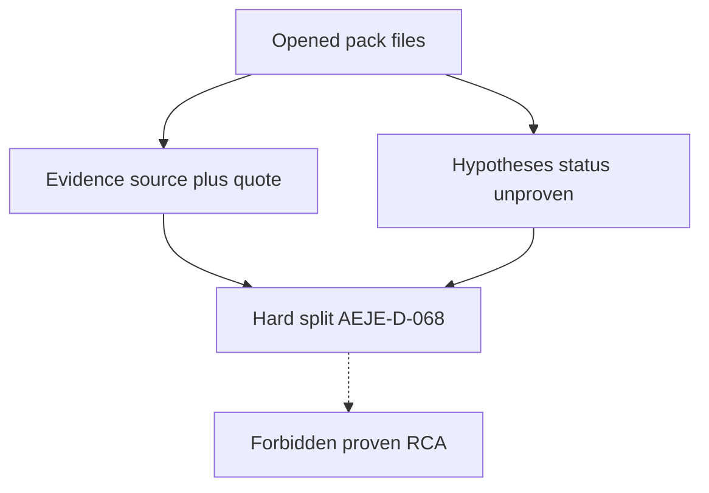

# L-15.2 — Evidence vs hypothesis

**Module:** 15 — BayOps AI — AI-Assisted Operations  
**Duration:** 30 minutes  
**Diagram:** AEJE-D-068  
**Case study:** BayPay Financial Services (fictional)

---

## Why this matters

Riley Okonkwo can paste a fluent sentence that *sounds* like a file: “thread dump shows servlet exhaustion.” If nobody opened a dump, that sentence is a **hypothesis wearing evidence clothes**. Priya Nair will spend the 99.9% budget on the wrong gate. Sam Okada cannot retrieve an invented S3 key. Harbor Bike Co still needs Avery Chen’s create to reach `COMPLETED`. This lesson is AEJE-D-068: **a quote is evidence; an explanation is a hypothesis; they never share a label.**

---

## Learning objectives

- Define evidence as a quote with `source`, optional `at`, and `quote` from a file the operator opened.
- Define a hypothesis as an *unproven* statement that may fit evidence — never as a second quote.
- Refuse an invented path, host, or metric series as “evidence.”
- Keep `provenRootCause` off the teaching object; the schema fails the response if it is used as a success field.

---

## Concept explanation

**Evidence** is what the pack already contains. BayPay’s teaching shape is an array of objects:

| Field | Role |
|---|---|
| `source` | Path or object key the operator opened (S3 key, log file, scrape export) |
| `at` | Event time when the pack has one (UTC) |
| `quote` | Text that actually appears there — not a paraphrase that adds a cause |

If Riley did not open it, it is not evidence. A CloudWatch search that *could* have found a string is still not a quote until the line is in the pack. Avery’s id `11111111-1111-1111-1111-111111111111` and payment `c1501d33-0000-4000-8000-111111111501` may appear **when the file already has them**. Inventing a later `outcome=COMPLETED` to make the story neat is fabrication.

**Hypothesis** is a ranked, falsifiable sentence. Status in the schema is only `unproven`, `weakened`, or `withdrawn`. There is no `proven` enum. L-15.3 ranks several. This lesson’s job is the **split**: do not put “Hikari is exhausted” in the evidence array. Put the pending-count quote in evidence (if you have it) and the exhaustion *story* in hypotheses.

**AEJE-D-068** is the concept diagram: one stream of opened files, a second stream of unproven explanations, a hard line between them. A model that writes “Evidence: the database failed over” without a quoted file has crossed the line. That crossing is the **unsupported-diagnosis** class you will evaluate in L-15.6 — still a class, not a lab spoiler.

**What may never become evidence.** PAN, CVV, `BAYPAY_DB_PASSWORD`, live access keys. A leftover `dmgr-east` FFDC from Morgan Hale’s cell, unless *this* pack includes that object and the Boot path is actually on the cell — it is not, for `payment-service` on Fargate port `8080`. A Grafana screenshot URL you typed from memory.

**How they join.** One create has one `correlationId`, one `paymentId`, and the files you opened. Priya’s next investigation names the *omitted* evidence kind. Jordan’s tag is evidence only as a quoted change line. The hypothesis may *use* those quotes in `fitsEvidence`; it does not replace them.

**What each side is not.** Evidence is not a vibe. A hypothesis is not a court finding. “Confirmed RCA” is a contract failure, not a senior tone.

---

## Visual explanation



Alt text: AEJE-D-068. Opened files feed quoted evidence; explanations stay unproven hypotheses; a hard split blocks a proven-RCA merge.

---

## Architecture

On AEJE-D-069, Lambda (or the student file) **validates** that every `evidence[].source` looks like a key from the retrieved pack. The teaching prototype does not need a live S3 `HeadObject` to pass the lesson; the method is the same: if the pack listing does not contain the key, the line is not evidence. DynamoDB stores the incident id, not a verdict. CloudWatch records the invocation, not the quote.

Region remains `us-west-2` when AWS is named. Do not apply OpenSearch “so we can prove the quote.” Do not dual-write WAS PMI from `PaymentCluster` into the Boot evidence array as if they were the same process.

---

## Production example

Riley opens `payment-create.jsonl` and quotes `outcome=AUTHORIZED` at `2026-09-03T20:11:04.221Z` for `paymentId=c1501d33-0000-4000-8000-111111111501`. He has not opened a thread dump. A model writes evidence: “dump shows all servlet threads blocked on jdbc/baypay.” That sentence is a **hypothesis**, and the dump path is **invented** unless the pack lists it.

Priya moves the sentence to `hypotheses` with `status=unproven` and adds recommended investigation: open the dump *or* the Hikari USE row — whichever the pack actually offers next. She does not mark RCA. She does not approve a bounce.

A different afternoon: someone pastes Avery’s full card number “so the model can be specific.” That is a **security incident**, not better evidence. Rotate, purge, and treat the prompt as leakage.

---

## Code/configuration example

Valid split versus a failing mix — literacy, not a lab key:

```json
{
  "incidentId": "INC-TEACH-15-2",
  "service": "payment-service",
  "evidence": [
    {
      "source": "s3://baypay-synthetic-ops/packs/teach-15/payment-create.jsonl",
      "at": "2026-09-03T20:11:04.221Z",
      "quote": "outcome=AUTHORIZED paymentId=c1501d33-0000-4000-8000-111111111501"
    }
  ],
  "hypotheses": [
    {
      "id": "H1",
      "statement": "Worker delay after AUTHORIZED; HTTP accept is not the stall",
      "status": "unproven",
      "fitsEvidence": ["AUTHORIZED quoted; COMPLETED not in opened file"]
    }
  ],
  "recommendedInvestigation": [
    "Open the next pack object that covers Hikari USE or a later outcome line"
  ],
  "suggestedRemediation": [
    {
      "action": "Hold mutating steps until the omitted evidence kind is opened",
      "mutatesProduction": false,
      "approvalRequired": true
    }
  ],
  "humanApproval": { "status": "pending" }
}
```

A contract failure looks like stuffing “confirmed: pool exhaustion” into `evidence.quote` or adding `provenRootCause`. The schema’s `hypotheses[].status` enum does not include `proven`.

---

## Trade-offs

| Choice | Gain | Cost |
|---|---|---|
| Quote-only evidence | Auditable | Feels sparse in Slack |
| Paraphrase “for clarity” | Readable | Easy to smuggle a cause |
| Many hypotheses | Honest uncertainty | Noisier ticket |
| One confident sentence | Calm bridge | Hidden invention |
| Require HeadObject on every source | Strong gate | Not needed to pass on paper |

---

## Failure modes

- Labeling a guess as evidence because the prose is confident.
- Inventing a file, host, or PromQL series the pack never listed.
- Promoting one hypothesis to proven RCA to “close the ticket.”
- Copying Morgan’s cell FFDC into a Fargate incident without a pack object.
- Putting PAN or `BAYPAY_DB_PASSWORD` in `quote` to sound complete.
- Skipping recommended investigation because the guess “fits.”

---

## Security/reliability implications

Invented evidence is a reliability bug: the next engineer will chase a host that does not exist. Quoted secrets are a security bug: the object store and the model vendor both retain them. Keep identity on logs when the pack has it; keep it off metric labels (L-13.1) and off prompts that leave BayPay.

Reliability: a split that holds `unproven` lets Priya spend budget on the next gate. A merge that claims RCA lets Jordan ship a fix for the wrong estate.

---

## Interview perspective

**Engineer.** Evidence is a quoted source. A hypothesis is unproven. I do not invent files.

**Senior.** I move confident cause-language out of `evidence` and into `hypotheses`. I name the omitted evidence kind.

**Staff.** I score Diagnostic method on the split, not on whether the guess later proved convenient.

**Principal.** AEJE-D-068 is a governance line. I will not fund a tool that emits proven RCA or auto-remediates from a paraphrase.

---

## Key takeaways

- Evidence quotes an opened file. Hypotheses explain, still `unproven`.
- AEJE-D-068 is the hard split — not a style preference.
- Invented paths are not evidence; they are the unsupported-diagnosis class.
- No `proven` status. No `provenRootCause` success field.
- Avery’s create is not helped by a fluent fiction.

---

## Knowledge check

1. What three properties does a teaching evidence item carry, and what must be true of `source`?
2. Why can a sentence that names Hikari exhaustion never live in the evidence array by itself?
3. The schema allows `unproven`, `weakened`, and `withdrawn`. What status is missing on purpose?

<details>
<summary>Spoiler — answers</summary>

1. `source`, `quote`, and optional `at`. `source` must be a file or object the operator opened — listed in the pack.
2. Exhaustion is an explanation. Evidence would be a quote from an opened USE export or log; the story goes in hypotheses.
3. `proven` / confirmed / RCA. Teaching outputs must not mark a root cause proven.

</details>

---

## Related lab

[AI-1501](../../../../labs/AI-1501/README.md) and [AI-1502](../../../../labs/AI-1502/README.md) both fail if you mix quote and guess. This lesson has no separate lab id. Practice the split here; do not import those packs’ planted answers.

---

## Related PAKS

Optional: `docs/23-agentic-ai-architecture/agent-governance-and-safety.md` (citation vs generation). The evidence/hypothesis split stands alone without a PAKS login.
