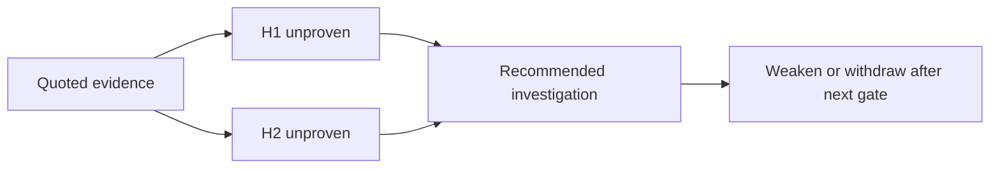

# L-15.3 — RCA hypothesis generation

**Module:** 15 — BayOps AI — AI-Assisted Operations  
**Duration:** 30 minutes  
**Case study:** BayPay Financial Services (fictional)

---

## Why this matters

A single slogan — “it’s the database,” “it’s the JVM,” “it’s the cell” — feels like RCA and is usually a coin flip. Priya Nair needs **ranked, unproven** explanations that fit the quotes Riley already opened, plus the next gate that could weaken one of them. Harbor Bike Co does not pause Avery Chen’s `$84.00` create while a model picks a villain. This lesson is hypothesis generation for `payment-service`: more than one `H*`, every `status` in `{unproven, weakened, withdrawn}`, never a proven RCA field.

---

## Learning objectives

- Generate at least two ranked hypotheses that cite `fitsEvidence` from opened quotes.
- Use only schema statuses: `unproven`, `weakened`, `withdrawn`.
- Name a recommended investigation that could falsify the top rank — not a bounce.
- Treat **ranked unproven hypotheses** as a class you will practice in AI-1502, without taking that lab’s planted list from this page.

---

## Concept explanation

**RCA hypothesis generation** is the middle of the Module 13 loop, now typed for BayOps. You already have evidence (L-15.2). You are not ready to remediate (L-15.4). You write explanations that could be *wrong*.

| Field | Role |
|---|---|
| `id` | Stable label (`H1`, `H2`) so the bridge can weaken one without rewriting prose |
| `statement` | One falsifiable sentence about `POST /api/v1/payments` |
| `status` | `unproven` at birth; later `weakened` or `withdrawn` |
| `fitsEvidence` | Which quotes the sentence uses — not new facts |

**Ranking** means order in the array or an explicit “top remains unproven.” It does **not** mean the first item is the RCA. A **ranked unproven hypotheses** class is a fixture that already lists several guesses — some plausible, some that ignore the quotes, some that smuggle “confirmed.” Your job in AI-1502 is to keep rank, drop or withdraw the ones that do not fit, and refuse a proven stamp. This lesson does not list that pack’s sentences.

**What a good H1 looks like.** It names the estate the evidence names: Java 21 / Spring Boot 3.5.5 on port `8080`, golden URI `POST /api/v1/payments`, ids `correlationId` / `paymentId=c1501d33-0000-4000-8000-111111111501`. It can mention Hikari `jdbc/baypay`, servlet threads, a Jordan Voss tag, or a missing `COMPLETED` line *if those quotes exist*. It cannot mention `dmgr-east` because a model likes cells.

**What recommended investigation is.** The omitted evidence kind: the USE row you did not open, the later log line, the change list, the readiness probe body. It is not “apply the fix.” It is not “ask Bedrock again.” Live Bedrock remains optional and still cannot promote `H1` to proven.

**Withdraw vs weaken.** Weaken when a new quote makes the story less likely but not impossible. Withdraw when the quote contradicts it. Do not delete history; status is the audit trail. Do not invent a `confirmed` status to look decisive.

**Who writes them.** Riley drafts from app evidence. Priya ranks against SLO impact. Sam adds a platform hypothesis only if scrape or task metadata is in the pack. Morgan does not get a hypothesis for a leftover cell unless the pack’s opened files are on that cell.

---

## Visual explanation



Alt text: Quoted evidence fans out into ranked unproven hypotheses; the next investigation can weaken or withdraw a rank — it cannot stamp a proven RCA.

---

## Architecture

AEJE-D-069’s Lambda (or your editor) must accept an array of hypotheses and reject `status` values outside the enum. DynamoDB may store the array next to `incidentId`; it must not store a `provenRootCause` column as a success path. Optional Bedrock can *propose* ranks; schema validation strips a proven field. CloudWatch shows the invoke; it does not rank.

Compute talk stays ECS/Fargate in `us-west-2` when AWS is named. Do not generate a multi-AZ RDS or EKS hypothesis “for completeness” when those objects are not in the pack. Do not apply them for the demo.

---

## Production example

Evidence: `AUTHORIZED` at 20:11:04Z for Avery’s payment `c1501d33-…1501`; scrape still increments POSTs; no thread dump opened. Riley writes H1: worker delay after accept. H2: client abandoned before `COMPLETED` was logged. H3: scrape interval hid a 5xx burst — weaker because the opened count still rises. All `unproven`. Recommended investigation: the next pack object that is either a later outcome line or Hikari USE.

A bad afternoon: the model returns one item, `status` implied proven, statement about a leftover cell. Priya withdraws nothing — she **rejects the object** as off-contract and asks for a ranked unproven list. Jordan does not roll a tag to satisfy a single slogan.

AI-1502 will hand you a **ranked unproven hypotheses** class. Work that fixture. Do not take a finished list from this paragraph.

---

## Code/configuration example

Teaching ranks — not the AI-1502 answer key:

```json
{
  "incidentId": "INC-TEACH-15-3",
  "service": "payment-service",
  "evidence": [
    {
      "source": "s3://baypay-synthetic-ops/packs/teach-15/payment-create.jsonl",
      "at": "2026-09-03T20:11:04.221Z",
      "quote": "outcome=AUTHORIZED paymentId=c1501d33-0000-4000-8000-111111111501"
    },
    {
      "source": "s3://baypay-synthetic-ops/packs/teach-15/red-scrape.txt",
      "at": "2026-09-03T20:11:10Z",
      "quote": "http_server_requests_seconds_count{uri=\"/api/v1/payments\",method=\"POST\"} still incrementing"
    }
  ],
  "hypotheses": [
    {
      "id": "H1",
      "statement": "Accept succeeded; the worker has not logged COMPLETED yet",
      "status": "unproven",
      "fitsEvidence": ["AUTHORIZED quote", "POST count still incrementing"]
    },
    {
      "id": "H2",
      "statement": "Merchant retry or abandon occurred after AUTHORIZED and before a COMPLETED line",
      "status": "unproven",
      "fitsEvidence": ["AUTHORIZED quote"]
    }
  ],
  "recommendedInvestigation": [
    "Open the next outcome line for this paymentId or the Hikari jdbc/baypay USE export for 20:11"
  ],
  "suggestedRemediation": [
    {
      "action": "Do not mutate until H1 or H2 is weakened by the next opened object",
      "mutatesProduction": false,
      "approvalRequired": true
    }
  ],
  "humanApproval": { "status": "pending" }
}
```

Do not add `provenRootCause`. Do not set `status` to `confirmed`.

---

## Trade-offs

| Choice | Gain | Cost |
|---|---|---|
| Two or more unproven ranks | Honest; rankable | Slower close |
| One slogan | Calm Slack | Coin-flip RCA |
| `fitsEvidence` links | Audit trail | Extra typing |
| Withdraw in place | History | Ticket looks “messy” |
| Ask the model to pick a winner | Fast | Hidden proven RCA |

---

## Failure modes

- Emitting a single confirmed cause (not the ranked-unproven class).
- Ranking a leftover-cell story with no cell file opened.
- Using recommended investigation as a disguise for bounce / apply.
- Inventing `fitsEvidence` quotes that are not in the evidence array.
- Copying a Module 8 leak or Module 12 rollback RCA into this pack.
- Requiring Bedrock to “generate better hypotheses.”

---

## Security/reliability implications

A ranked list that includes a secrets-bearing guess (“password rotated, dump the env”) is a security incident waiting for a prompt. Keep `BAYPAY_DB_*` out of statements. Reliability: acting on H1 before the next gate burns the ~43-minute monthly budget on a story. Acting on a cell hypothesis for a Fargate accept burns the estate you do not operate.

---

## Interview perspective

**Engineer.** I write at least two unproven hypotheses with `fitsEvidence` and a next gate.

**Senior.** I rank; I weaken or withdraw; I never emit proven RCA. I will not bounce `dmgr-east` to break a tie.

**Staff.** I score AI-1502-class work on whether rank follows quotes, not on a lucky first line.

**Principal.** Hypothesis generation is a control: uncertainty stays visible. I will not buy a tool that collapses rank into authority.

---

## Key takeaways

- RCA work here is ranked *unproven* hypotheses, not a verdict.
- Status enum: `unproven`, `weakened`, `withdrawn` — never proven.
- `fitsEvidence` must point at opened quotes.
- Next investigation falsifies; it does not remediate.
- AI-1502 is that class. This lesson is not its answer key.

---

## Knowledge check

1. Which hypothesis statuses does the teaching schema allow, and which common word is forbidden?
2. What must `fitsEvidence` refer to, and what happens if it introduces a new file name?
3. Why is “ranked unproven hypotheses” a *class* in AI-1502 rather than a finished RCA?

<details>
<summary>Spoiler — answers</summary>

1. `unproven`, `weakened`, `withdrawn`. Proven / confirmed / RCA is forbidden.
2. Quotes already in the evidence array. A new file name is invention — move it to recommended investigation or drop it.
3. The lab asks you to keep rank and refuse a proven stamp on a fixture list. The list is not closed RCA and this lesson does not name its items.

</details>

---

## Related lab

[AI-1502](../../../../labs/AI-1502/README.md) — RCA hypotheses, after this lesson. Time-box 45–75 minutes. You will work a **ranked unproven hypotheses** class. Do not open `solutions/AI-1502/` until statuses stay off `proven` and the next gate is written.

---

## Related PAKS

Optional: `docs/23-agentic-ai-architecture/agent-governance-and-safety.md` (uncertainty as a control). Ranking unproven hypotheses stands alone without a PAKS login.
