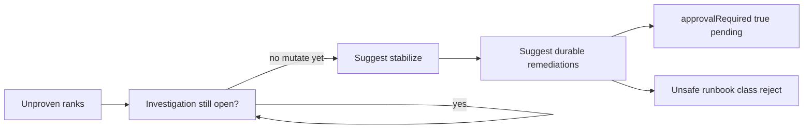

# L-15.4 — Runbook recommendations

**Module:** 15 — BayOps AI — AI-Assisted Operations  
**Duration:** 30 minutes  
**Case study:** BayPay Financial Services (fictional)

---

## Why this matters

A model that can summarize and rank will also offer a **runbook**: bounce the task, scale Hikari, disable TLS “just for the bridge,” recycle `dmgr-east`. Harbor Bike Co still needs Avery Chen’s create to finish, not a second outage authored by autocomplete. Priya Nair’s rule from L-13.6 still holds: stabilize merchants first, remediate second, never confuse the two. This lesson is **suggested** remediation for `payment-service`: every mutating step carries `approvalRequired=true`. An **unsafe runbook** is a class you will reject, not a shortcut.

---

## Learning objectives

- Separate stabilize (stop merchant pain) from durable remediation (change that should survive the next apply).
- Emit `suggestedRemediation[]` with `action`, `mutatesProduction`, and `approvalRequired` literally `true`.
- Recognize an **unsafe runbook** class: auto-execute, secret-in-prompt, leftover-cell bounce, ND-in-Docker, `-Xmx` equal to the cgroup, disable TLS.
- Leave `humanApproval.status` at `pending` (L-15.5 owns the signature).

---

## Concept explanation

**Suggested remediation** is a proposal, not a job runner. The teaching schema requires each item to include:

| Field | Locked teaching meaning |
|---|---|
| `action` | What a human might do to `payment-service` (Java 21 / Boot 3.5.5 / port `8080`) |
| `mutatesProduction` | `true` if tasks, config, DNS, or data change |
| `approvalRequired` | **const `true`** — even for a “safe-looking” mutate |

**Stabilize vs remediate.** Stabilize: fail readiness so the ALB stops sending new `POST /api/v1/payments` to a sick task, pin the last good ECS revision / image tag, disable a bad canary. Remediate: the follow-up PR, pool resize *after* evidence, flag flip that Jordan Voss reviews. Both mutate. Both wait. Snapshot what you can before a rollback hides the scene.

**Unsafe runbook** is a *class*, not AI-1503’s planted script. The class includes: a step that executes without a human; a step that bounces Morgan Hale’s leftover `dmgr-east` or Postgres because the prose said “payments”; a step that sets `-Xmx` to the container limit (L-7 / L-8); a step that recommends WebSphere ND in Docker; a step that turns off TLS on `payments.apps.baypay.example` “for debugging”; a step that force-pushes `main`. In AI-1503 you will rewrite that class into approved-shape suggestions. This lesson does not paste that fixture.

**What you may suggest.** If evidence and unproven ranks support saturation: fail readiness; pin `3.8.1` if the pack names a prior tag; open a ticket for Hikari `jdbc/baypay` — still pending. If evidence is thin: the action is “do not mutate; open the next object” with `mutatesProduction=false` and `approvalRequired` still `true` so the field cannot be “forgotten.”

**What you may not suggest.** Auto-remediate prod. Apply NAT, EKS, or OpenSearch to “fix” a summary. Send `BAYPAY_DB_PASSWORD` to Bedrock to “craft a better runbook.” Recycle `PaymentCluster` for a Fargate accept.

**Recommended investigation still comes first** when a gate is missing. A runbook that skips the gate is the mixed-summary problem in a new costume.

---

## Visual explanation



Alt text: Unproven ranks feed a gate check; stabilize and remediations are suggestions with approval required; an unsafe runbook class is rejected, not executed.

---

## Architecture

On AEJE-D-069, Lambda must not invoke ECS `UpdateService`, RDS failover, or a Systems Manager send-command. The teaching path writes JSON and a DynamoDB approval row. Optional Bedrock may draft `action` text; the validator forces `approvalRequired=true` and refuses a missing `humanApproval`. CloudWatch records the draft, not the mutate.

Sam Okada can later wire a *manual* approval callback. That is L-15.5. Region `us-west-2`. Do not apply a Step Functions auto-heal “for realism.”

---

## Production example

20:18 UTC. Riley has AUTHORIZED without COMPLETED for `c1501d33-…1501` and a Hikari pending quote from an opened USE export. H1 (pool saturation) is still `unproven`. Suggested remediation: (1) fail readiness on the saturated task, (2) pin last good revision if Jordan confirms the tag in the change list, (3) file a follow-up to review `jdbc/baypay` max — all `approvalRequired=true`, `humanApproval` pending. Avery’s customer id stays out of the merchant Slack.

A bad afternoon: a fixture-shaped **unsafe runbook** says execute the bounce, raise `-Xmx` to the cgroup, and recycle `dmgr-east`. Priya rejects the object as a class. She does not debate the JVM number. AI-1503 will give you a member of that class. Do not treat this paragraph as its answer key.

---

## Code/configuration example

Safe-shape suggestions — not the AI-1503 key:

```json
{
  "incidentId": "INC-TEACH-15-4",
  "service": "payment-service",
  "evidence": [
    {
      "source": "s3://baypay-synthetic-ops/packs/teach-15/hikari-use.txt",
      "at": "2026-09-03T20:11:10Z",
      "quote": "jdbc/baypay active=10 pending=8 max=10"
    }
  ],
  "hypotheses": [
    {
      "id": "H1",
      "statement": "Hikari pending is delaying PROCESSING to COMPLETED",
      "status": "unproven",
      "fitsEvidence": ["pending=8 with max=10"]
    }
  ],
  "recommendedInvestigation": [
    "Confirm the current ECS revision and whether a tag change landed in the same minute"
  ],
  "suggestedRemediation": [
    {
      "action": "Fail readiness on the saturated payment-service task so the ALB stops new creates",
      "mutatesProduction": true,
      "approvalRequired": true
    },
    {
      "action": "If Jordan confirms a bad tag, pin the last good ECS revision; follow with a git revert — no force-push",
      "mutatesProduction": true,
      "approvalRequired": true
    }
  ],
  "humanApproval": { "status": "pending" }
}
```

Do not set `approvalRequired` to `false`. Do not add an execute flag.

---

## Trade-offs

| Choice | Gain | Cost |
|---|---|---|
| Suggest + pending | Humans stay in control | Slower than a bot |
| Auto-runbook | Seconds | Second outage; audit gap |
| Stabilize only | Merchants first | Crime scene may shrink |
| Keep the bad revision | More evidence | Budget burns |
| Cell bounce “just in case” | Familiar to WAS staff | Wrong estate |

---

## Failure modes

- Shipping an **unsafe runbook** class as if fluency were permission.
- `approvalRequired=false` or omitted `humanApproval`.
- ND-in-Docker, `-Xmx` equal to the cgroup, or disable TLS as “debug.”
- Bouncing `dmgr-east` or the database because the URI says payments.
- Auto-remediating prod from Lambda or a chat plugin.
- Force-push to hide the bad tag.

---

## Security/reliability implications

A runbook is a privileged document. If it includes connection strings or PAN “for the model,” you have expanded the blast radius to the vendor. Reliability: an auto-bounce during a brownout can flap the remaining healthy tasks and burn the 99.9% budget faster than the original stall. Health probes on `8080` remain the cut contract (L-12.6); a suggestion that ignores readiness is incomplete.

---

## Interview perspective

**Engineer.** I suggest stabilize then remediate. Every mutate has `approvalRequired=true`.

**Senior.** I reject unsafe-runbook class items: cell bounce, ND-in-Docker, `-Xmx` = cgroup, TLS off, auto-execute.

**Staff.** I score runbooks on estate match and pending approval, not on how complete the steps look.

**Principal.** BayOps may draft; it may not command. I will not fund auto-remediate on `payment-service`.

---

## Key takeaways

- Suggestions, not jobs. `approvalRequired` is always `true`.
- Stabilize merchants; remediate with a reviewed change.
- Unsafe runbook is a class: auto-execute, wrong estate, forbidden JVM/cell/TLS moves.
- AI-1503 practices that rewrite. This lesson is not its script.
- No live model required to write the JSON.

---

## Knowledge check

1. Which three properties must each `suggestedRemediation` item include, and which one is a schema constant?
2. Name three members of the unsafe-runbook *class* (not a lab script).
3. Why can a non-mutating “do not change prod” item still carry `approvalRequired=true`?

<details>
<summary>Spoiler — answers</summary>

1. `action`, `mutatesProduction`, `approvalRequired`. `approvalRequired` is const `true`.
2. Auto-execute; bounce leftover `dmgr-east`; ND-in-Docker; `-Xmx` equal to the cgroup; disable TLS; force-push. Any three suffice.
3. So the field cannot be dropped and a later mutate cannot sneak through without a human gate.

</details>

---

## Related lab

[AI-1503](../../../../labs/AI-1503/README.md) — Runbook recommendation, after this lesson. Time-box 45–75 minutes. You will rewrite an **unsafe runbook** class into pending, approval-required suggestions. Do not execute anything against prod.

---

## Related PAKS

Optional: `docs/23-agentic-ai-architecture/agent-governance-and-safety.md` (tool use vs mutate). Suggested remediations stand alone without a PAKS login.
