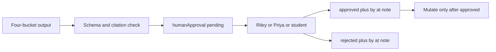

# L-15.5 — Human approval

**Module:** 15 — BayOps AI — AI-Assisted Operations  
**Duration:** 30 minutes  
**Diagram:** AEJE-D-070  
**Case study:** BayPay Financial Services (fictional)

---

## Why this matters

Four perfect buckets still must not restart `payment-service`. Priya Nair spends the 99.9% budget; Riley Okonkwo owns the app estate; Jordan Voss owns the tag. A Lambda that writes `approved` for itself is an **auto-remediate** — forbidden in this course. Harbor Bike Co’s Avery Chen create is not a sandbox for a chat plugin. This lesson is AEJE-D-070’s approval half: `humanApproval` stays `pending` until a **named human** writes `approved` or `rejected` with a time. The other half of that diagram — catching a hallucinated diagnosis — is L-15.6.

---

## Learning objectives

- Emit `humanApproval` with `status` in `{pending, approved, rejected}` and refuse a missing object.
- Require `by` and `at` (and a short `note`) before any mutate leaves `pending`.
- Name who may sign: Riley Okonkwo, Priya Nair, or the student playing on-call — not the model, not Lambda, not “system.”
- Sketch the AEJE-D-070 gate: evaluate output → human decision → only then a change.

---

## Concept explanation

**Human approval** is a first-class field, not a Slack emoji. [BAYOPS.md](../../../../datasets/baypay-ai/BAYOPS.md) and the schema lock it:

| Field | Teaching rule |
|---|---|
| `status` | `pending` on every fresh suggestion; `approved` or `rejected` only after a human |
| `by` | Display name — Riley, Priya, or the student on-call |
| `at` | Timestamp of the signature |
| `note` | Why this mutate, or why not — no PAN, no passwords |

Until `approved`, nobody fails readiness, pins a revision, or opens a change window from the BayOps object. `rejected` means the suggestion is recorded and **not** done. Leaving the field out fails the contract the same way `provenRootCause` does.

**Who is not a signer.** Amazon Bedrock. The Lambda role. API Gateway. A “BayOps bot” chatbot. Sam Okada may *witness* platform steps; he does not auto-sign because the invoke succeeded. Morgan Hale does not approve a leftover-cell action as a substitute for Boot approval. Jordan may be asked in the `note` (“tag 3.8.1 confirmed”) but the schema signer for this course is Riley, Priya, or the student.

**What approval is not.** It is not a substitute for evidence. Signing a mutate that still has invented files is a failed evaluation (L-15.6). It is not a substitute for change management (L-13.7 / L-12.6): an approved pin still needs the Terraform/git revert so the next apply does not re-break. It is not a PCI exception: you still do not paste card data into `note`.

**AEJE-D-070** draws two controls on one path: (1) schema and citation checks, (2) a human gate before mutate. This lesson is control (2). Paper DynamoDB holds `incidentId` + the approval record. Live apply is not required.

**Pending is success.** A lab that ends `pending` with a correct four-bucket file **passes method**. A lab that ends `approved` without a name and time fails. A lab that auto-flips to `approved` in code fails.

---

## Visual explanation



Alt text: AEJE-D-070 approval path. A four-bucket output is checked, stays pending, and only a named human may approve or reject before any production mutate.

---

## Architecture

DynamoDB in the `us-west-2` sketch stores one approval item per `incidentId` (or a versioned list). Lambda **reads** it; it does not write `approved` from a model token. API Gateway may expose `POST /approvals` to a human identity — paper is enough. CloudWatch logs the decision id, not Avery’s account number. S3 evidence objects stay read-only to the model role.

Do not apply a Step Functions catch-all that times out into execute. Do not grant the task role `ecs:UpdateService` because “approval is in the JSON.” Tags if anyone ever applies: `Course=AEJE`, `Module=15`, `Expiration`. Destroy the same day.

---

## Production example

Riley’s suggestions from L-15.4 sit on INC-TEACH-15-4: fail readiness, maybe pin a revision. `humanApproval.status` is `pending`. Priya reads the quotes, confirms the estate is Fargate `payment-service` on `8080`, and writes `approved`, `by=Priya Nair`, `at=2026-09-03T20:25:00Z`, `note=stabilize only; no cell action`. Jordan then pins the tag. The model did not click.

A rejected afternoon: the suggestion includes a leftover-cell recycle. Priya writes `rejected` with a note that the opened files are Boot logs. The record stays; nobody “fixes” Avery by touching `dmgr-east`.

If a demo script sets `status=approved` and `by=bedrock-us-west-2`, the object fails this lesson. AI-1503 and AI-1504 both require the field; they do not require you to auto-sign.

---

## Code/configuration example

Pending (pass) and a later human signature — not a bot:

```json
{
  "incidentId": "INC-TEACH-15-5",
  "service": "payment-service",
  "evidence": [
    {
      "source": "s3://baypay-synthetic-ops/packs/teach-15/hikari-use.txt",
      "at": "2026-09-03T20:11:10Z",
      "quote": "jdbc/baypay pending=8 max=10"
    }
  ],
  "hypotheses": [
    {
      "id": "H1",
      "statement": "Pool saturation is delaying COMPLETED",
      "status": "unproven",
      "fitsEvidence": ["pending=8 max=10"]
    }
  ],
  "recommendedInvestigation": [
    "Jordan confirms whether image tag changed in the same minute"
  ],
  "suggestedRemediation": [
    {
      "action": "Fail readiness on the saturated task after human approval",
      "mutatesProduction": true,
      "approvalRequired": true
    }
  ],
  "humanApproval": { "status": "pending" }
}
```

```json
{
  "humanApproval": {
    "status": "approved",
    "by": "Priya Nair",
    "at": "2026-09-03T20:25:00Z",
    "note": "Stabilize via readiness only; hypotheses remain unproven"
  }
}
```

Do not set `by` to a model id. Do not omit `at` on `approved` or `rejected`.

---

## Trade-offs

| Choice | Gain | Cost |
|---|---|---|
| Always pending first | Audit; no auto-heal | Minutes on the bridge |
| Chat-plugin auto-approve | Fast | Unowned mutates |
| Two-person rule (Riley + Priya) | Stronger | Slower SEV |
| Timeout-to-execute | “Something happens” | Forbidden here |
| Paper DynamoDB row | Pass without apply | No live IAM drill |

---

## Failure modes

- Lambda or Bedrock writing `approved` for itself.
- `approved` without `by` and `at`.
- Treating a 👍 emoji as the schema object.
- Approving a mutate that still fails citation or schema checks.
- Using approval to excuse ND-in-Docker, `-Xmx` = cgroup, or a cell bounce.
- Storing PAN or `BAYPAY_DB_PASSWORD` in `note`.

---

## Security/reliability implications

The signer is an identity event. Persist it. Restrict who can write the approval item. A shared “oncall” IAM user is not a name. Reliability: pending during a SEV is uncomfortable and correct; auto-approve during a SEV is how you flap the remaining healthy tasks. Merchants should hear “change pending approval,” not “the AI already rolled you.”

---

## Interview perspective

**Engineer.** I leave `humanApproval` pending until a named human signs.

**Senior.** I reject model or Lambda signatures. I will not approve a cell bounce or auto-remediate.

**Staff.** I treat AEJE-D-070 as two controls: evaluation then approval. Signing does not fix a bad citation.

**Principal.** Human approval is the difference between an investigator and an authority. I will not buy the authority.

---

## Key takeaways

- `pending` is the correct initial state for every mutating suggestion.
- Only Riley, Priya, or the student on-call may set `approved` or `rejected`, with `by` and `at`.
- AEJE-D-070: check first, sign second, mutate last.
- Auto-approve is auto-remediate. Forbidden.
- Paper DynamoDB is enough; no live apply required.

---

## Knowledge check

1. Which three `humanApproval.status` values exist, and which one must a fresh suggestion use?
2. Who may write `approved`, and which actors are forbidden signers?
3. Why does an approved pin still need a git / Terraform follow-up?

<details>
<summary>Spoiler — answers</summary>

1. `pending`, `approved`, `rejected`. Fresh output uses `pending`.
2. Riley Okonkwo, Priya Nair, or the student on-call. Forbidden: Bedrock, Lambda, API Gateway, an unnamed bot.
3. Desired state will re-apply the bad tag on the next pipeline. Approval is not change management.

</details>

---

## Related lab

[AI-1503](../../../../labs/AI-1503/README.md) requires pending approval on rewritten runbook steps. [AI-1504](../../../../labs/AI-1504/README.md) uses the same AEJE-D-070 path after you evaluate a diagnosis. Do not auto-sign either pack.

---

## Related PAKS

Optional: `docs/23-agentic-ai-architecture/agent-governance-and-safety.md` (human-in-the-loop). The pending-approval field stands alone without a PAKS login.
