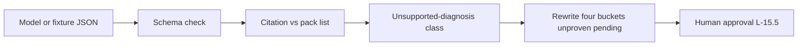

# L-15.6 — AI evaluation and hallucination detection

**Module:** 15 — BayOps AI — AI-Assisted Operations  
**Duration:** 30 minutes  
**Diagram:** AEJE-D-070  
**Case study:** BayPay Financial Services (fictional)

---

## Why this matters

A four-bucket file can still be fiction. The model invents an S3 key, quotes a host nobody runs, or stamps a hypothesis as proven RCA. Priya Nair who trusts that object will spend the 99.9% budget on a ghost. Riley Okonkwo who approves it will mutate the wrong estate. Harbor Bike Co still needs Avery Chen’s `POST /api/v1/payments` to complete. This lesson is AEJE-D-070’s **evaluation** half: check schema, check citations, catch the **unsupported-diagnosis** class. AI-1504 will give you a fixture in that class. Students catch a fixture that invents files or marks RCA proven. This page does **not** lecture that fixture’s planted claims.

---

## Learning objectives

- Evaluate a BayOps object against [output.schema.json](../../../../infrastructure/bayops-ai/schema/output.schema.json): required keys, hypothesis statuses, `approvalRequired=true`.
- Flag invented `source` values and quotes that do not appear in the opened pack.
- Reject any success-path `provenRootCause` or `status` that means confirmed RCA.
- Rewrite the object to four honest buckets, hypotheses `unproven`, `humanApproval` pending — without treating the model as the authority.

---

## Concept explanation

**Evaluation** is a review, not a second generation. You hold the pack listing in one hand and the model JSON in the other. AEJE-D-070 places this check **before** the human approval gate from L-15.5.

| Check | Pass | Fail |
|---|---|---|
| Schema | Required keys; `service` is `payment-service`; statuses in enum | Extra proven field; missing buckets |
| Citation | Every `evidence.source` is on the pack list; `quote` is a substring | Invented file, host, or metric |
| Hypothesis | `unproven` / `weakened` / `withdrawn`; `fitsEvidence` points at real quotes | Confirmed RCA language |
| Remediation | Suggestions only; `approvalRequired=true` | Auto-execute; unsigned mutate |
| Secrets | No PAN, no `BAYPAY_DB_PASSWORD`, no live keys | Prompt or quote leakage |

**Unsupported diagnosis** is a *class*: the output asserts a cause the pack cannot support. Two common members — the ones you should expect in AI-1504 — are **an invented file** and **a proven-RCA stamp**. There are other members (wrong estate, quote that adds facts). Work the fixture you are given. Do not import a cause from this lesson’s title or from a hallway summary.

**Hallucination** here means generated content presented as retrieval. It is not “the model used a synonym.” A paraphrase that inserts a failover, a dump, or a cell name the pack never listed is a hallucination even if the JSON validates. Schema-valid fiction still fails method.

**What you do when you catch one.** Do not approve. Do not “fix forward” by executing the suggested bounce. Withdraw or drop the unsupported hypothesis, delete invented evidence rows, write the next real investigation, leave approval `pending`. Record that the model failed evaluation — that sentence belongs in PF-ai.

**What you do not do.** You do not need Bedrock to evaluate. You do not apply OpenSearch to “verify” a fake key. You do not bounce leftover `dmgr-east` because a diagnosis mentioned payments. You do not lecture classmates a planted RCA you have not earned from the pack.

---

## Visual explanation



Alt text: AEJE-D-070 evaluation path. Fixture JSON is schema-checked and citation-checked; an unsupported diagnosis is rewritten to unproven pending buckets before any human approval.

---

## Architecture

AEJE-D-069 still stands: API Gateway → Lambda retrieve → optional Bedrock → **validate** → DynamoDB. The validator is the teaching product. It should reject `provenRootCause` when present as a non-null success field and should compare `evidence[].source` to the S3 pack manifest. CloudWatch logs the fail reason (`invented_source`, `proven_field`, `missing_approval`). It does not become the RCA.

Paper is enough. If someone sketches the check in `us-west-2`, keep it short-lived and tagged. Do not apply EKS or a GPU endpoint to detect hallucinations.

---

## Production example

Riley receives a JSON that names `payment-service` correctly, includes four keys, and cites `s3://baypay-never-opened/ghost-dump.txt` plus a sentence that the root cause is confirmed. Pack listing has only `payment-create.jsonl` and a RED export. Evaluation: citation fail (invented file) and contract fail (proven RCA). He rewrites from the two real objects. Hypotheses stay `unproven`. Approval stays `pending`. Avery’s payment id `c1501d33-0000-4000-8000-111111111501` appears only where the real log already had it.

AI-1504 is this class with a planted fixture. Catch invented files or a proven-RCA mark. Do not treat a fluent diagnosis as closed. Do not take a specific cause from this lesson — it does not name one.

---

## Code/configuration example

Schema fragment plus a failing shape (literacy). The fail is **invented source + proven field**, not a lab RCA lecture:

```json
{
  "provenRootCause": {
    "description": "Forbidden on teaching outputs. If present, the response fails the contract.",
    "type": "null"
  },
  "hypotheses": {
    "items": {
      "properties": {
        "status": { "enum": ["unproven", "weakened", "withdrawn"] }
      }
    }
  }
}
```

```json
{
  "incidentId": "INC-TEACH-15-6",
  "service": "payment-service",
  "evidence": [
    {
      "source": "s3://baypay-never-opened/ghost-dump.txt",
      "quote": "invented dump text that is not in the pack listing"
    }
  ],
  "hypotheses": [
    {
      "id": "H1",
      "statement": "A confirmed root cause with no opened file",
      "status": "unproven",
      "fitsEvidence": ["ghost-dump.txt"]
    }
  ],
  "recommendedInvestigation": ["Do not skip to mutate"],
  "suggestedRemediation": [
    {
      "action": "No mutate while sources are invented",
      "mutatesProduction": false,
      "approvalRequired": true
    }
  ],
  "humanApproval": { "status": "pending" },
  "provenRootCause": "this field makes the teaching object fail"
}
```

A passing rewrite **omits** `provenRootCause`, deletes the ghost source, and quotes only opened files. Do not use `provenRootCause` as a success example.

---

## Trade-offs

| Choice | Gain | Cost |
|---|---|---|
| Manifest vs `source` | Catches invented files | Must keep the listing honest |
| Schema-only check | Cheap | Misses valid JSON fiction |
| Human reread of quotes | Catches inserted facts | Time on the bridge |
| Trust fluency | Fast | Hallucination ships |
| Live judge model | Extra credit | Bill; still needs the pack |

---

## Failure modes

- Accepting schema-valid JSON that invents a file.
- Leaving a proven-RCA field because “the model was sure.”
- Approving a mutate before evaluation (wrong AEJE-D-070 order).
- Sending the fixture plus PAN to a live model “to get a second opinion.”
- Requiring Bedrock to fail the lab.
- Lecturing a planted cause instead of quoting the pack.

---

## Security/reliability implications

Hallucinated hosts waste the incident clock and can aim a mutate at the leftover cell or at a database you were never supposed to touch. That is a reliability incident. Prompting a vendor with the fixture plus secrets is a security incident. Keep synthetic data only. Evaluation notes in PF-ai must not include live keys.

Reliability: a caught hallucination that stays `pending` is a win. An executed hallucination is an outage with a transcript.

---

## Interview perspective

**Engineer.** I check schema and every `source` against the pack. I reject proven RCA.

**Senior.** I treat unsupported diagnosis as a class: invented files or a proven stamp. I rewrite; I do not approve.

**Staff.** I score AI-1504 on the catch and the rewrite, not on guessing a hallway RCA.

**Principal.** Evaluation is the product. Investigator, never authority — including after a fluent diagnosis.

---

## Key takeaways

- Evaluate before you approve (AEJE-D-070). Architecture remains AEJE-D-069.
- Unsupported diagnosis is a class: invented files, proven RCA, unsupported claims.
- AI-1504 plants a fixture in that class. Catch it. Do not lecture its claims here.
- Rewrite to four buckets, `unproven`, `pending`. Omit `provenRootCause`.
- No live model required. No auto-remediate.

---

## Knowledge check

1. Name three evaluation checks you run before `humanApproval` may leave `pending` for a mutate.
2. What two fixture behaviors does this lesson say students will catch in AI-1504, and what does this lesson refuse to name?
3. Why can a JSON document that validates against most required keys still fail method?

<details>
<summary>Spoiler — answers</summary>

1. Schema (buckets, statuses, `approvalRequired`); citation (`source` on the pack list, quote is real); no proven-RCA field or confirmed status. Secrets check is also expected.
2. Invented files, and marking RCA proven. This lesson refuses to name the pack’s planted diagnosis or remediation.
3. It can still invent a path, smuggle a cause into a quote, or present fluency as retrieval. Schema-valid fiction is a failed evaluation.

</details>

---

## Related lab

[AI-1504](../../../../labs/AI-1504/README.md) — Evaluate hallucinated diagnosis, after this lesson. Time-box 45–75 minutes. Catch the **unsupported-diagnosis** class (invented files or proven RCA). Export the catch on [PF-ai.md](../../../../student/worksheets/PF-ai.md). Do not open `solutions/AI-1504/` until the rewrite is honest.

---

## Related PAKS

Optional: `docs/23-agentic-ai-architecture/agent-governance-and-safety.md` (evaluation gates). Hallucination detection stands alone without a PAKS login.
