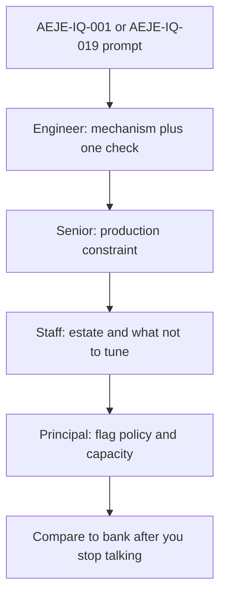

# L-16.1 — Java / JVM round

**Module:** 16 — Advanced Engineer Interview Simulator  
**Duration:** 30 minutes  
**Case study:** BayPay Financial Services (fictional)

---

## Why this matters

When a panel asks why Avery Chen’s `$84.00` create can race two workers, they are not grading a blog recitation of the Java Memory Model. They are grading whether Riley Okonkwo can *defend* `payment-service` on Java 21: visibility, pools, heap versus native, and which dump you take while Harbor Bike Co is still charging. One paragraph copied for Engineer and Principal fails. This lesson trains the **Java/JVM** voice. Practice handles: [AEJE-IQ-001](../../../../interview-bank/README.md) (JMM visibility between payment worker threads) and [AEJE-IQ-019](../../../../interview-bank/README.md) (JVM flags you will and will not set in Kubernetes). Do not paste bank answers. Phase A is paper plus `interview-bank/simulator.py`.

---

## Learning objectives

- Open a Java/JVM id with the Phase A simulator and write **Engineer and Senior** before `--reveal`.
- Name heap, metaspace, stacks, and native as separate stories when RSS looks “too big.”
- Refuse `-Xmx` equal to the cgroup as a container answer.
- Change scope across Engineer / Senior / Staff / Principal without lengthening the same sentence.

---

## Concept explanation

The Java/JVM slice is **20** of the locked **100** records (`AEJE-IQ-001`–`AEJE-IQ-020`). Topics include happens-before on duplicate creates, `synchronized` versus `ReentrantLock` versus virtual threads, G1 versus ZGC against a payment SLA, thread-dump states, heap-dump hygiene, and evidence for a JVM SEV-1. You already built those mechanisms earlier in the course. The interview job is to **speak them as decisions**.

**Four layers, one prompt.** Engineer names the mechanism and one check (`jcmd`, thread dump, NMT summary). Senior names the production constraint: do not freeze a canary to take a dump; do not set flags you cannot explain. Staff names the estate: Java 21, port `8080`, Hikari `jdbc/baypay`, ECS or a cluster cgroup — and what you will *not* tune live. Principal names the policy: which flags are a platform contract, which are a ticket, and when “just add heap” is a capacity failure.

**What you defend, not recite.** JMM visibility is about whether a worker that wrote `AUTHORIZED` is seen by the thread that must not charge twice. Heap versus native is about which pool grew when RSS is 1.4 GiB and `-Xmx` is `1g`. G1 versus ZGC is about P99 and footprint for *this* authorize path, not a conference default. Safepoints and TTSP are a latency class, not a slogan.

**What you do not do.** Do not treat `--reveal` as your spoken script. Do not import an INCIDENT lab’s instructor RCA as the only JVM story. Do not recommend WebSphere ND in Docker because a leftover cell still exists. Symptom classes (`OutOfMemoryError: Java heap space`, `Metaspace`, `OOMKilled` with heap left) stay classes until evidence names a pool. AEJE-IQ-012 (when to keep a modular monolith on the JVM) is a Staff/Principal cousin of the design round — answer it as a JVM *home*, not as a service-count contest.

Run:

```bash
python3 interview-bank/simulator.py --mode practice --domain Java/JVM
python3 interview-bank/simulator.py --mode practice --id AEJE-IQ-001
```

Answers stay hidden until you add `--reveal`. INTERVIEW-1601 after L-16.2 is the graded practice sitting.

---

## Visual explanation



Alt text: A Java/JVM interview prompt is answered in four maturity layers — mechanism, production constraint, estate policy, then a self-check against the bank after you stop talking.

---

## Architecture

The spoken estate stays the teaching monolith: `payment-service`, Java 21, Spring Boot 3.5.5, bind `8080`, Actuator liveness and readiness. When a container is named, the process RSS is larger than `-Xmx`. When AWS is named, the region is `us-west-2` and compute default is ECS on Fargate. Morgan Hale’s `dmgr-east` is a leftover cell, not the JVM you dump.

Priya owns the SLO sentence if the prompt is a SEV-1. Riley owns which dump is safe. Sam owns cgroup and flag contracts. Jordan owns whether a flag change is a new immutable tag. Do not apply a live cluster to “prove” a flag. Paper plus `jcmd` vocabulary is enough.

---

## Production example

21:04 Pacific. Harbor Bike Co retries Avery’s create. Two workers log `outcome=AUTHORIZED` for nearby ids. A panelist asks how visibility fails. Riley does **not** say “the JMM is complicated.” Engineer: a write without a happens-before can stay in a CPU buffer; I look for a shared flag or counter that is neither `volatile`, atomic, nor locked. Senior: I would rather have the idempotency row be the source of truth than a static `boolean`. Staff: I will not add `synchronized` on the whole service to look decisive; I will name the worker pool and the store. Principal: if the team keeps inventing thread-local caches for money, that is an architecture defect, not a missed `@Volatile` annotation.

A second panelist asks which flags you set in Kubernetes (AEJE-IQ-019). Engineer: container-aware heap, not a copied `-Xmx=4g`. Senior: I will not set `-Xmx` equal to the limit. Staff: I publish a short allow-list. Principal: flags are a platform contract reviewed like any other change.

---

## Code/configuration example

Spoken outline — write this *before* you open `--reveal`. It is not a bank answer and not an RCA:

```text
1. Restate BayPay: payment-service, Java 21, POST /api/v1/payments, port 8080.
2. Name the mechanism (visibility / pool / GC / dump) in one sentence.
3. Name one production check (jcmd, thread dump, NMT, GC log) and what would falsify you.
4. Name one thing you will not do (-Xmx equals cgroup, freeze prod for a dump, bounce dmgr-east).
5. Stop. Wait for the follow-up. Then raise scope one seniority.
```

Bank record *shape* so you know what you are practicing against — placeholders only:

```json
{
  "id": "AEJE-IQ-001",
  "domain": "Java/JVM",
  "difficulty": "advanced",
  "question": "<prompt the simulator prints — do not paste a reveal here>",
  "followUps": ["<panelist probe 1>", "<panelist probe 2>"],
  "expectedConcepts": ["happens-before", "worker visibility", "idempotency store"],
  "engineerAnswer": "<your draft>",
  "seniorAnswer": "<your draft>",
  "staffAnswer": "<your draft>",
  "principalAnswer": "<your draft>"
}
```

Do not put `BAYPAY_DB_PASSWORD` or PAN in a draft. Do not copy `seniorAnswer` from the file into your mouth.

---

## Trade-offs

| Choice | Gain | Cost |
|---|---|---|
| Four maturity layers | Reviewable; matches the bank | Slower than a slogan |
| One memorized paragraph | Fast | Fails Staff/Principal |
| `--reveal` after writing | Honest self-check | Tempting script |
| Dump in production | Evidence | Pause and privacy risk |
| Bigger `-Xmx` first | Feels decisive | Hides native and pool bugs |

---

## Failure modes

- One paragraph reused at every seniority.
- Treating `--reveal` as the spoken answer.
- Setting `-Xmx` equal to the container memory limit.
- Taking a full heap dump that freezes a merchant-facing JVM without a canary story.
- Bouncing `dmgr-east` because the prompt mentioned payments.
- Calling every high RSS a heap leak.

---

## Security/reliability implications

Heap dumps and thread dumps are data stores. Who can pull them can reconstruct Avery Chen’s session if the heap still holds payloads. Redact, restrict, and never persist PAN. Reliability: a wrong flag shipped as “just JVM tuning” is an outage you authored. Treat flag changes as reviewed, tagged, and reversible. Signal health (process up) is not payment health (`POST /api/v1/payments` still 500).

---

## Interview perspective

**Engineer.** I name the mechanism and one check. For AEJE-IQ-001 I talk happens-before, not “threads are hard.”

**Senior.** I add the production constraint: which dump, which canary, which flag I will not set.

**Staff.** I place the answer on `payment-service` in its cgroup or Fargate task and say what the platform owns.

**Principal.** I turn repeated JVM misses into a contract: allow-listed flags, capacity policy, and no ND-in-Docker.

---

## Key takeaways

- Java/JVM is 20 of 100. Practice with `--domain Java/JVM` or `--id AEJE-IQ-001`.
- Four layers, not one paragraph. Reveal is a self-check, not a script.
- Heap is not RSS. `-Xmx` is not the cgroup.
- Symptom classes stay classes until a pool is evidenced.
- INTERVIEW-1601 waits until after L-16.2.

---

## Knowledge check

1. How many Java/JVM records are in the bank, and may you add a 101st question in another domain to “make room”?
2. You set `-Xmx` equal to the container memory limit so “the JVM can use everything.” What is wrong, and which seniority should refuse it first?
3. Why is `--reveal` before you write a fail in practice mode?

<details>
<summary>Spoiler — answers</summary>

1. Twenty Java/JVM records; the bank is exactly 100 with locked counts. Do not add a 101st.
2. The process still needs stacks, metaspace, and native; the kernel will OOM-kill. Senior should refuse it; Staff/Principal make it a platform ban.
3. Reveal turns the sitting into recitation. Write Engineer + Senior (or Staff) first, then compare.

</details>

---

## Related lab

[INTERVIEW-1601](../../../../labs/INTERVIEW-1601/README.md) — Practice mode, **after L-16.2**. Time-box 45–75 minutes. Use this lesson’s JVM outline on one Java/JVM id, then add a Spring/Jakarta id from the next lesson. This lesson does not complete that lab and does not print bank answers.

---

## Related PAKS

Optional: `docs/30-mock-interviews/overview.md` (hosted at [paks.bayareala8s.com](https://paks.bayareala8s.com) when your cohort has a login). It deepens timed practice discipline. This lesson stands alone without a PAKS login.
